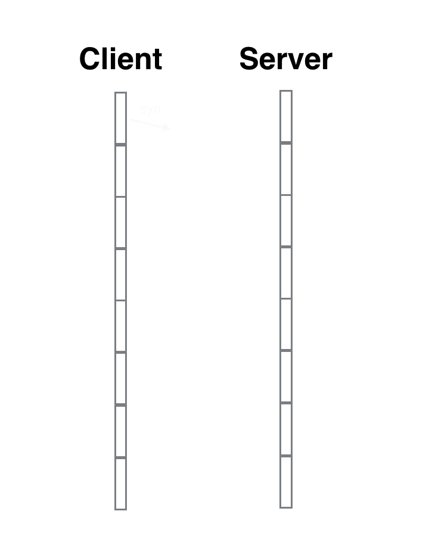

## 客户端和服务端

> 客户端：可以向服务器发请求，并对接收返回的内容进行处理；<br/>
> 服务器端：能够接收请求，并把相关资源信息返回给客户端;


面试题：当用户在地址栏中输入网址，到最后看到页面，中间都经历了什么？

* URL地址解析: 浏览器解析地址 ==> 通过哪个地址进行访问
* DNS域名解析: 浏览器向DNS服务器发送请求  ==> request请求阶段
* 和服务器建立TCP连接： DNS服务器域名解析后向服务器发送请求
* 把客户端信息传递给服务器（发送HTTP请求）
* 服务器得到并处理请求（HTTP响应内容） ==> response响应阶段
* 客户端渲染服务器返回的内容
* 和服务器端断开 TCP 连接


### 1. TCP/IP的三次握手和四次挥手

三次握手:

* 第一次握手：客户端向服务端发送SYN码数据包，表示客户端要求和服务端建立连接；
* 第二次握手：服务端收到客户端的连接请求后，会发送ACK数据包给客户端，表示你的连接请求已经收到，询问客户端是否真的需要建立连接；
* 第三次握手：客户端收到ACK码以后会检验是否正确，如果正确，客户端会再次发送ACK码给服务端，表示确认建立连接； (三次握手都成功以后才会建立连接，然后才会发送数据；)

四次挥手：

* 第一次挥手：当客户端发送数据结束后，会发送FIN码数据包给服务端，表示告知服务端客户端的数据已经传递完了。
* 第二次挥手：当服务端收到FIN后，会发送ACK给客户端，表示服务端已经知道客户端传完了。客户端收到ACK以后就会把传递数据给服务端的通道关闭；
* 第三次挥手：当服务端把响应的数据发送完毕后，会发送一个FIN给客户端，告知客户端响应的数据已经发送完毕；
* 第四次挥手：当客户端收到FIN后，会发送一个ACK码数据包给服务端，告知服务端客户端已经知道数据发送完毕；服务端收到ACK码后，可以安心的把数据传递通道关闭掉。

### 2. 步骤详细化

#### 2.1 URL地址解析


##### URI/URL/URN 概念


* URL（Uniform Resource Locator ）： 统一资源定位符，根据这个地址能找到对应的资源 
* URN（Uniform Resource Name ）：统一资源名称，一般指国际上通用的(标准的)一些名字（例如:国际发版的编号）;
* URI（Uniform Resource Identifier ）：统一资源标志符，URL和URN的子集；


##### 一个完整的URL所包含的内容

`http://www.slide.news.sina.com.cn:80/slide/index.html?from=wx&lx=1#p=1`


* 协议: http://

    传输协议：就是能够把客户端和服务器端通信的信息，进行传输的工具（类似于快递小哥）

    * http 超文本传输协议，除了传递文本，还可以传递媒体资源文件(或者流文件)及XML格式数据
    * https 更加安全的http , 一般涉及支付的网站都要采用https协议（s:ssl 加密传输）
    * ftp 文件传输协议（一般应用于把本地大资源上传到服务器）
      * ftp上传工具： FileZilla 通过这个工具，通过ftp传输协议，我们可以把本地的文件上传到服务器上
      
* 域名: www.slide.news.sina.com.cn

    一个让用户方便记忆的名字(不通过域名，直接用服务器的外网IP也能访问到服务器，但是外网IP很难记,例如`125.39.174.202`)

    * 顶级域名 qq.com
    * 一级域名 www.qq.com
    * 二级域名 sport.qq.com
    * 三级域名  kbs.sport.qq.com
    * .com 国际域名
    * .cn 中文域名
    * .com.cn
    * .edu 教育
    * .gov  政府
    * .io 博客
    * .org  官方组织
    * .net  系统类

    给服务器通网后，会有两个IP地址

    * 内网IP :局域网内访问
    * 外网IP :外部用户可以基于外网IP访问到服务器, 例如: 125.39.174.202

* 端口号  80

    端口号的取值范围： 0~65535，用端口号来区分同一台服务器上不同项目；

    * http 默认端口号：80
    * https默认端口号：443
    * ftp 默认端口号：21

    如果项目采用的就是默认端口号，我们在书写地址的时候，不用加端口号，浏览器在发送请求的时候会帮我们默认加上.

    服务器接收到请求后  
    1. 根据端口号找到对应的项目;
    2. 根据请求资源的路径名称找到资源文件;
    3. 3.读取资源文件中的内容;
    4. 把内容返回;

* 请求资源路径名称  /slide/index.html

    * 默认的路径或者名称（xxx.com/slide/  不指定资源名，服务器会找默认的资源，一般默认资源名是default.html、index.html... 当然这些可以在服务器端自己配置）
    * 注意伪URL地址的处理（URL重写技术是为了增加SEO搜索引擎优化的，动态的网址一般不能被搜索引擎收录，所以我们要把动态网址静态化，此时需要的是重写URL）

    举例 [item.jd.hk/2688449.htm…]():https://link.juejin.cn/?target=https%3A%2F%2Fitem.jd.hk%2F2688449.html   =>  [item.js.hk/index.php?i…](https://link.juejin.cn/?target=https%3A%2F%2Fitem.js.hk%2Findex.php%3Fid%3D2688449)


* 问号传参信息（?from=wx&lx=1)

  * 客户端想把信息传递给服务器，有很多种方式

    * URL地址问号传参
    * 请求报文传输（请求头和请求主体）
  * 也可以不同页面之间的信息交互，例如：从列表到详情

* HASH值 #p=1

  * 也能充当信息传输的方式
  * 锚点定位
  * 基于HASH实现路由管控（不同的HASH值，展示不同的组件和模板）


#### 2.2 DNS服务器域名解析

##### A：什么是DNS域名解析

DNS服务器：域名解析服务器，在服务器上存储着  域名<=> 服务器外网IP的相关记录
而我们发送请求时，所谓的DNS解析，其实就是根据域名在DNS服务器上查找到对应服务器的外网IP

##### B：DNS优化
DNS Prefetch 即 DNS 预获取

* DNS缓存（一般浏览器会在第一次解析后，默认建立缓存，时间很短，只有一分钟左右）
* 减少DNS解析次数（一个网站中我们需要发送请求的域名和服务器尽可能少即可）
* DNS预获取（dns-prefetch）：在页面加载开始的时候，就把当前页面中需要访问其他域名（服务器）的信息进行提前DNS解析，以后加载到具体内容部分可以不用解析了;

```
<meta http-equiv="x-dns-prefetch-control" content="on">
<link rel="dns-prefetch" href="//static.360buyimg.com">
<link rel="dns-prefetch" href="//misc.360buyimg.com">
<link rel="dns-prefetch" href="//img10.360buyimg.com">
<link rel="dns-prefetch" href="//img11.360buyimg.com">
<link rel="dns-prefetch" href="//img12.360buyimg.com">
```

#### 2.3 和服务器建立TCP连接（三次握手）


发生在信息传输之前

* 第一次握手：由浏览器发起，告诉服务器我要发送请求了
* 第二次握手：由服务器发起，告诉浏览器我准备接收了，你赶紧发送吧
* 第三次握手：由浏览器发送，告诉服务器，我马上就发了，准备接收吧


##### TCP 三次握手

TCP 三次握手就好比两个人在街上隔着50米看见了对方，但是因为雾霾等原因不能100%确认，所以要通过招手的方式相互确定对方是否认识自己。



张三首先向李四招手(syn)，李四看到张三向自己招手后，向对方点了点头挤出了一个微笑(ack)。张三看到李四微笑后确认了李四成功辨认出了自己(进入estalished状态)。

但是李四还有点狐疑，向四周看了一看，有没有可能张三是在看别人呢，他也需要确认一下。

所以李四也向张三招了招手(syn)，张三看到李四向自己招手后知道对方是在寻求自己的确认，于是也点了点头挤出了微笑(ack)，李四看到对方的微笑后确认了张三就是在向自己打招呼(进入established状态)。

于是两人加快步伐，走到了一起，相互拥抱。


我们看到这个过程中一共是四个动作，

张三招手--李四点头微笑--李四招手--张三点头微笑。

其中李四连续进行了2个动作，先是点头微笑(回复对方)，然后再次招手(寻求确认)，实际上可以将这两个动作合一，招手的同时点头和微笑(syn+ack)。

于是四个动作就简化成了三个动作，张三招手--李四点头微笑并招手--张三点头微笑。这就是三次握手的本质，中间的一次动作是两个动作的合并。
我们看到有两个中间状态，syn_sent和syn_rcvd，这两个状态叫着「半打开」状态，就是向对方招手了，但是还没来得及看到对方的点头微笑。

syn_sent是主动打开方的「半打开」状态，syn_rcvd是被动打开方的「半打开」状态。客户端是主动打开方，服务器是被动打开方。

syn_sent: syn package has been sent

syn_rcvd: syn package has been received

#### 2.4 发送HTTP请求

TCP 数据传输就是两个人隔空对话，差了一点距离，所以需要对方反复确认听见了自己的话。


张三喊了一句话(data)，李四听见了之后要向张三回复自己听见了(ack)。

如果张三喊了一句，半天没听到李四回复，张三就认为自己的话被大风吹走了，李四没听见，所以需要重新喊话，这就是tcp重传。

也有可能是李四听到了张三的话，但是李四向张三的回复被大风吹走了，以至于张三没听见李四的回复。张三并不能判断究竟是自己的话被大风吹走了还是李四的回复被大风吹走了，张三也不用管，重传一下就是。

既然会重传，李四就有可能同一句话听见了两次，这就是「去重」。「重传」和「去重」工作操作系统的网络内核模块都已经帮我们处理好了，用户层是不用关心的。


张三可以向李四喊话，同样李四也可以向张三喊话，因为tcp链接是「双工的」，双方都可以主动发起数据传输。不过无论是哪方喊话，都需要收到对方的确认才能认为对方收到了自己的喊话。

张三可能是个高射炮，一说连说了八句话，这时候李四可以不用一句一句回复，而是连续听了这八句话之后，一起向对方回复说前面你说的八句话我都听见了，这就是批量ack。但是张三也不能一次性说了太多话，李四的脑子短时间可能无法消化太多，两人之间需要有协商好的合适的发送和接受速率，这个就是「TCP窗口大小」。

网络环境的数据交互同人类之间的对话还要复杂一些，它存在数据包乱序的现象。同一个来源发出来的不同数据包在「网际路由」上可能会走过不同的路径，最终达到同一个地方时，顺序就不一样了。操作系统的网络内核模块会负责对数据包进行排序，到用户层时顺序就已经完全一致了。
[juejin.cn/post/684490…](https://juejin.cn/post/6844903625513238541)

**HTTP报文**

* 请求报文，所有经过传输协议，客户端传递给服务器的内容，都被成为请求报文

  * 起始行
  * 请求头（请求首部）
  * 请求主体


* HTTP报文：请求报文+响应报文

谷歌浏览器F12 =>Network ( 所有客户端和服务器端的交互信息在这里都可以看到 )  => 点击某一个条信息，在右侧可以看到所有的HTTP报文信息

**HTTP状态码**

HTTP响应报文

响应报文：所有经过传输协议，服务器返回给客户端的内容，都被成为响应报文

* HTTP状态码
* 响应头
* 响应主体

> 1~5开头，三位数字 <br/>
> 2xx : 成功      
> 3xx: 重定向    
> 4xx : 客户端

```
200  OK ： 成功
201   Created：一般应用于告诉服务器创建一个新文件，最后服务器创建成功后返回的状态码；
204   No Content : 对于某些请求（PUT、DELETE），服务器不想处理，可以返回空内容，并且用204状态码告知；
301  Moved Permanently  : 永久重定向（永久转移）   www.630buy.com   出现301 ，转到jd.com
302   Move Temporarity : 临时转译，很早以前基本上用302来做，但是现在主要用307来处理这个事情，307  Temporary Redirect  的意思就是临时重定向 => 主要用于：服务器的负载均衡
304 Not Modified  : 设置HTTP的协商缓存
400  Bad Reques ： 传递给服务器的参数错误
401 Unauthorized  无权限访问
404  Payment Required   请求地址错误
500 Internal  Server Error  ： 未知服务器错误
503   Service Unavailable   ：    服务器超负荷
```

#### 2.5 服务器得到并处理请求

**A：WEB（图片）服务器和数据服务器**

Tomcat/Nginx/Apache/IIS...

**客户端渲染页面**


* 解析HTML，生成DOM树，解析CSS，生成CSSOM树
* 将DOM树和CSSOM树结合，生成渲染树(Render Tree)
* Layout(回流): 根据生成的渲染树，计算它们在设备视口(viewport)内的确切位置和大小，这个阶段是回流
* Painting(重绘): 根据渲染树以及回流得到的几何信息，得到节点的绝对像素
* Display:将像素发送给GPU，展示在页面上

> 注意
> 1. 遇到link/img/audio/video 等 是异步去加载资源信息（浏览器分配一个新的线程去加载，主线程继续向下渲染页面）；
> 2. 如果遇到的是 script 或者@import，则让主线程去加载资源信息（同步），加载完成信息后，再去继续渲染页面；

**B：DOM的重绘和回流**

* 重绘：元素样式的改变（但宽高、大小、位置等不变）
* 回流：元素的大小或者位置发生了变化（当页面布局和几何信息发生变化的时候），触发了重新布局，导致渲染树重新计算布局和渲染

> 注意：回流一定会触发重绘，而重绘不一定会回流

**C：前端性能优化之：避免DOM的回流**

* 放弃传统操作dom的时代，基于vue/react开始数据影响视图模式
* 分离读写操作 （现代的浏览器都有渲染队列的机制）
* 样式集中改变
* 缓存布局信息
* 元素批量修改
* 动画效果应用到position属性为absolute或fixed的元素上（脱离文档流）
* CSS3硬件加速（GPU加速）
* 牺牲平滑度换取速度
* 避免table布局和使用css的javascript表达式

现代版浏览器都有“渲染队列”机制，发现某一行要修改元素的样式，不立即渲染，而是看看下一行，如果下一列也会改变样式，则把修改样式的操作放到“渲染队列中”... 一直到不再是修改样式的操作，整体渲染一次，引发一次回流；

> offsetTop、offsetLeft、offsetWidth、offsetHeight、clientTop、clientLeft、clientWidth、clientHeightscrollTop、scrollLeft、scrollWidth、scrollHeight、getComputedStyle、currentStyle....会刷新渲染队列

```
// 减少回流：DOM操作的读写分离
box.style.width = '100px';
box.style.height = '100px';
box.style.background = 'red';
box.style.margin = '20px auto';

// 改变1次样式(重绘)   回流3次
// 但是根据渲染队列机制，只回流一次

box.style.width = '100px';    	// 放到渲染队列
console.log(box.offsetWidth); 	// 非回流，上一行就渲染
box.style.height = '100px';     // 再次放到渲染队列
console.log(box.offsetWidth);	// 非回流，再次渲染上一行
box.style.background = 'red';
box.style.margin = '20px auto';

console.log(box.offsetHeight);

// 如果像这种情况，发现下一列不会放到渲染队列中，就会引发一次回流

//减少DOM回流
for (let i = 0; i < 10; i++) {
  let span = document.createElement('span');
  span.innerHTML = i;
  box.appendChild(span);
}

let str = ``;
for (let i = 0; i < 10; i++) {
  str += `<span>${i}</span>`;
}
box.innerHTML = str;

//=>文档碎片：存储文档的容器
let frg = document.createDocumentFragment();
for (let i = 0; i < 10; i++) {
  let span = document.createElement('span');
  span.innerHTML = i;
  frg.appendChild(span);
}
box.appendChild(frg);
frg = null;
```

#### 2.6 服务器端断开 TCP 连接


* 第一次挥手：由浏览器发起，发送给服务器，我请求报文发送完了，你准备关闭吧
* 第二次挥手：由服务器发起，告诉浏览器，我接收完请求报文，我准备关闭，你也准备吧；
* 第三次挥手：由服务器发起，告诉浏览器，我响应报文发送完毕，你准备关闭吧；
* 第四次挥手：由浏览器发起，告诉服务器，我响应报文接收完毕，我准备关闭，你也准备吧；


**TCP 四次挥手**

TCP断开链接的过程和建立链接的过程比较类似，只不过中间的两部并不总是会合成一步走，所以它分成了4个动作，张三挥手(fin)——李四伤感地微笑(ack)——李四挥手(fin)——张三伤感地微笑(ack)。


之所以中间的两个动作没有合并，是因为tcp存在「半关闭」状态，也就是单向关闭。张三已经挥了手，可是人还没有走，只是不再说话，但是耳朵还是可以继续听，李四呢继续喊话。等待李四累了，也不再说话了，朝张三挥了挥手，张三伤感地微笑了一下，才彻底结束了。


上面有一个非常特殊的状态`time_wait`，它是主动关闭的一方在回复完对方的挥手后进入的一个长期状态，这个状态标准的持续时间是4分钟，4分钟后才会进入到closed状态，释放套接字资源。不过在具体实现上这个时间是可以调整的。

它就好比主动分手方要承担的责任，是你提出的要分手，你得付出代价。这个后果就是持续4分钟的time_wait状态，不能释放套接字资源(端口)，就好比守寡期，这段时间内套接字资源(端口)不得回收利用。

它的作用是重传最后一个ack报文，确保对方可以收到。因为如果对方没有收到ack的话，会重传fin报文，处于time_wait状态的套接字会立即向对方重发ack报文。

同时在这段时间内，该链接在对话期间于网际路由上产生的残留报文(因为路径过于崎岖，数据报文走的时间太长，重传的报文都收到了，原始报文还在路上)传过来时，都会被立即丢弃掉。4分钟的时间足以使得这些残留报文彻底消逝。不然当新的端口被重复利用时，这些残留报文可能会干扰新的链接。

4分钟就是2个MSL，每个MSL是2分钟。MSL就是maximium segment lifetime——最长报文寿命。这个时间是由官方RFC协议规定的。至于为什么是2个MSL而不是1个MSL，我还没有看到一个非常满意的解释。

四次挥手也并不总是四次挥手，中间的两个动作有时候是可以合并一起进行的，这个时候就成了三次挥手，主动关闭方就会从fin_wait_1状态直接进入到time_wait状态，跳过了fin_wait_2状态。

**Connection: Keep-Alive 保持TCP不中断**

**C：特殊字符加密和解密**

**请求的地址中如果出现非有效的UNICODE编码内容，现代版浏览器会默认进行编码**

* 1.基于encodeURL编码，我们可以基于decodeURI 解码；我们一般用encodeURI编码的是整个URL，这样整个URL中的特殊字符都会自动编译
* 2. encodeURIComponent/decodeURIComponent它相对于encodeURL来说，不用于给整个URL编码，而是给URL部分信息进行编码（一般都是问号传参的值编码）；
* 3. 客户端还存在一种方式，针对于中文的编码方式escape/unescape，这种方式一般只应用于客户端页面之间自己处理，例如：从列表调整到详情，我们可以把传递的中文信息基于这个编码，详情页获取编码后的信息再解码，再比如我们再客户端中的cookie信息，如果将信息时中文，我们也基于这种办法解码...

客户端和服务器端进行信息传输的时候，如果需要把请求的地址和信息编码，我们则基于以上两种方式处理，服务器也存在这些方法，这样就可以统一编码了;

```
<button id="link">我是按钮</button>

link.onclick = function(){
  // 获取当前页面的URL地址               
  let url = window.location.href;
  window.location.href = "https://www.baidu.com/"
  // 跳转页面的时候如果有2个url地址时，需要把其中一个转换为encodeURL编码; 一般浏览器默认会处理;
  window.location.href = "https://www.baidu.com/?from"= +encodeURIComponent(url);
}
```

##### 面试题

**Http 状态码 301 和 302 的应用场景分别是什么**

* 301重定向是永久的重定向，搜索引擎在抓取新的内容的同时也将旧的网址替换为了重定向之后的网址。
* 302重定向只是暂时的重定向，搜索引擎会抓取新的内容而保留旧的地址，因为服务器返回302，所以，搜索搜索引擎认为新的网址是暂时的。

