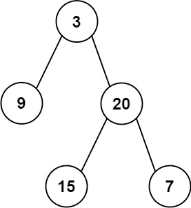

## 从中序与后序遍历序列构造二叉树

给定两个整数数组inorder和postorder，其中inorder是二叉树的中序遍历，postorder是同一棵树的后序遍历，请你构造并返回这颗二叉树。


示例 1:


```
输入：inorder = [9,3,15,20,7], postorder = [9,15,7,20,3]
输出：[3,9,20,null,null,15,7]
```
示例 2:

```
输入：inorder = [-1], postorder = [-1]
输出：[-1]
```

提示:

* 1 <= `inorder.length` <= 3000
* `postorder.length == inorder.length`
* -3000 <= `inorder[i]`, `postorder[i]` <= 3000
* `inorder`和`postorder`都由不同的值组成
* `postorder`中每一个值都在`inorder`中
* `inorder`保证是树的中序遍历
* `postorder`保证是树的后序遍历