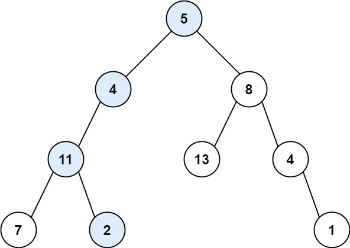
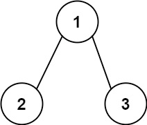

## 路径总和

给你二叉树的根节点root 和一个表示目标和的整数targetSum 。判断该树中是否存在根节点到叶子节点的路径，这条路径上所有节点值相加等于目标和targetSum 。如果存在，返回true；否则，返回false。

叶子节点 是指没有子节点的节点。

示例 1：



```
输入：root = [5,4,8,11,null,13,4,7,2,null,null,null,1], targetSum = 22
输出：true
解释：等于目标和的根节点到叶节点路径如上图所示。
```

示例 2：

```
输入：root = [1,2,3], targetSum = 5
输出：false
解释：树中存在两条根节点到叶子节点的路径：
(1 --> 2): 和为 3
(1 --> 3): 和为 4
不存在 sum = 5 的根节点到叶子节点的路径。
```
示例 3：

```
输入：root = [], targetSum = 0
输出：false
解释：由于树是空的，所以不存在根节点到叶子节点的路径。
```

提示：

* 树中节点的数目在范围`[0, 5000]`内
* -1000 <= `Node.val` <= 1000
* -1000 <= `targetSum` <= 1000