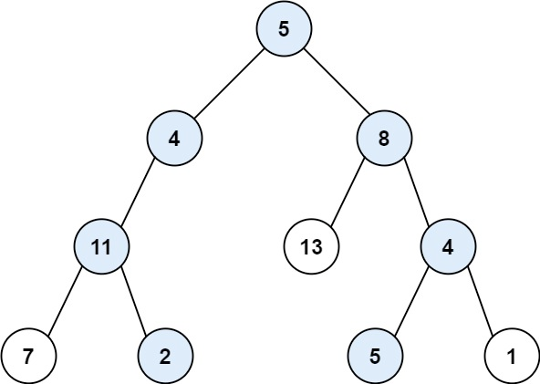
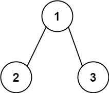

## 路径总和II

给你二叉树的根节点root和一个整数目标和targetSum，找出所有从根节点到叶子节点路径总和等于给定目标和的路径。

叶子节点是指没有子节点的节点。

示例 1：




```
输入：root = [5,4,8,11,null,13,4,7,2,null,null,5,1], targetSum = 22
输出：[[5,4,11,2],[5,8,4,5]]
```

示例 2：


```
输入：root = [1,2,3], targetSum = 5
输出：[]
```
示例 3：

```
输入：root = [1,2], targetSum = 0
输出：[]
```

提示：

* 树中节点总数在范围`[0, 5000]`内
* -1000 <= `Node.val` <= 1000
* -1000 <= `targetSum` <= 1000

来源：力扣（LeetCode）
链接：https://leetcode.cn/problems/
著作权归领扣网络所有。商业转载请联系官方授权，非商业转载请注明出处。