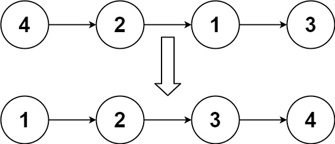
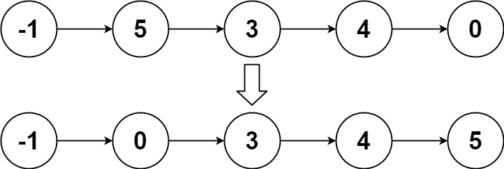

## 排序链表

给你链表的头结点head，请将其按升序排列并返回排序后的链表 。


示例 1：


```
输入：head = [4,2,1,3]
输出：[1,2,3,4]
```

示例 2：


```
输入：head = [-1,5,3,4,0]
输出：[-1,0,3,4,5]
```

示例 3：

```
输入：head = []
输出：[]
```

提示：

* 链表中节点的数目在范围`[0, 5 * 10^4]`内
* -10^5<= Node.val <= 10^5


进阶：你可以在`O(nlogn)`时间复杂度和常数级空间复杂度下，对链表进行排序吗？