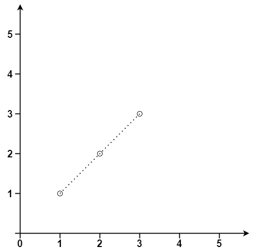
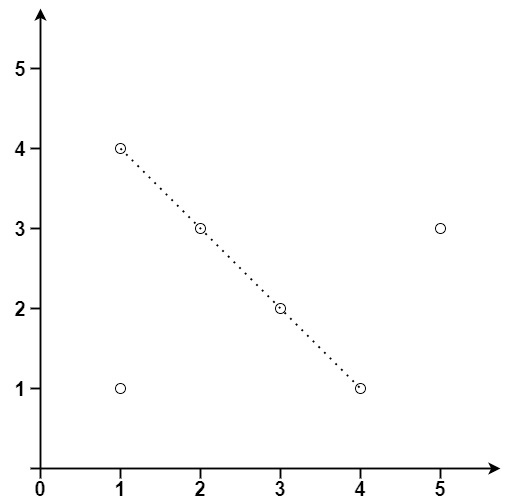

## 直线上最多的点数

给你一个数组 points ，其中 `points[i] = [xi, yi]` 表示 X-Y 平面上的一个点。求最多有多少个点在同一条直线上。


示例 1：


```
输入：points = [[1,1],[2,2],[3,3]]
输出：3
```

示例 2：


```
输入：points = [[1,1],[3,2],[5,3],[4,1],[2,3],[1,4]]
输出：4
```

提示：

* 1 <= `points.length` <= 300
* `points[i].length` == 2
* -10^4 <= `xi`, `yi` <= 10^4
* points 中的所有点 互不相同

来源：力扣（LeetCode）
链接：https://leetcode.cn/problems/
著作权归领扣网络所有。商业转载请联系官方授权，非商业转载请注明出处。