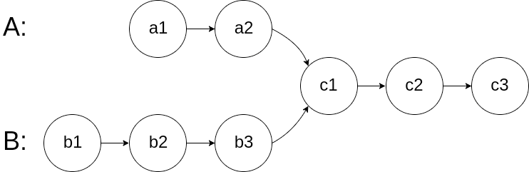
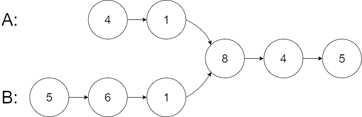
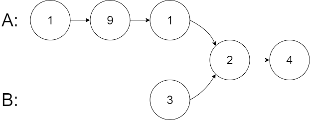
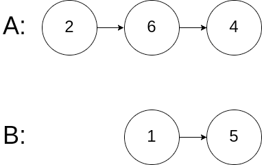

## 相交链表

给你两个单链表的头节点headA和headB，请你找出并返回两个单链表相交的起始节点。如果两个链表不存在相交节点，返回null。

图示两个链表在节点c1开始相交：



题目数据保证整个链式结构中不存在环。

注意，函数返回结果后，链表必须保持其原始结构。

自定义评测：

评测系统的输入如下（你设计的程序不适用此输入）：

* intersectVal-相交的起始节点的值。如果不存在相交节点，这一值为0
* listA-第一个链表
* listB-第二个链表
* skipA-在listA中（从头节点开始）跳到交叉节点的节点数
* skipB-在listB中（从头节点开始）跳到交叉节点的节点数

评测系统将根据这些输入创建链式数据结构，并将两个头节点headA和headB传递给你的程序。如果程序能够正确返回相交节点，那么你的解决方案将被视作正确答案。


示例1：


```
输入：intersectVal = 8, listA = [4,1,8,4,5], listB = [5,6,1,8,4,5], skipA = 2, skipB = 3
输出：Intersected at '8'
解释：相交节点的值为8（注意，如果两个链表相交则不能为0）。
从各自的表头开始算起，链表A为[4,1,8,4,5]，链表B为[5,6,1,8,4,5]。
在A中，相交节点前有2个节点；在B中，相交节点前有3个节点。
—请注意相交节点的值不为1，因为在链表A和链表B之中值为1的节点(A中第二个节点和B中第三个节点)是不同的节点。换句话说，它们在内存中指向两个不同的位置，而链表A和链表B中值为8的节点(A中第三个节点，B中第四个节点)在内存中指向相同的位置。
```

示例2：


```
输入：intersectVal=2,listA=[1,9,1,2,4],listB=[3,2,4],skipA=3,skipB=1
输出：Intersected at '2'
解释：相交节点的值为2（注意，如果两个链表相交则不能为0）。
从各自的表头开始算起，链表A为[1,9,1,2,4]，链表B为[3,2,4]。
在A中，相交节点前有3个节点；在B中，相交节点前有1个节点。
```

示例3：


```
输入：intersectVal=0,listA=[2,6,4],listB=[1,5],skipA=3,skipB=2
输出：null
解释：从各自的表头开始算起，链表A为[2,6,4]，链表B为[1,5]。
由于这两个链表不相交，所以intersectVal必须为0，而skip A和skip B可以是任意值。
这两个链表不相交，因此返回null。
```

提示：

* listA中节点数目为m
* listB中节点数目为n
* 1<=m,n<=3*104
* 1<=Node.val<=105
* 0<=skipA<=m
* 0<=skipB<=n
* 如果listA和listB没有交点，intersectVal为0
* 如果listA和listB有交点，intersectVal==listA[skipA]==listB[skipB]


进阶：你能否设计一个时间复杂度O(m+n)、仅用O(1)内存的解决方案？
