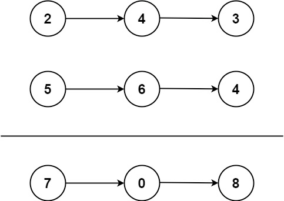
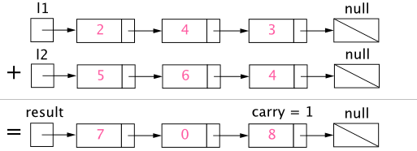

## 两数相加

给你两个非空的链表，表示两个非负的整数。它们每位数字都是按照逆序的方式存储的，并且每个节点只能存储一位数字。

请你将两个数相加，并以相同形式返回一个表示和的链表。

你可以假设除了数字0之外，这两个数都不会以0开头。

示例 1：



```
输入：l1 = [2,4,3], l2 = [5,6,4]
输出：[7,0,8]
解释：342 + 465 = 807.
```
示例 2：
```
输入：l1 = [0], l2 = [0]
输出：[0]
```
示例 3：
```
输入：l1 = [9,9,9,9,9,9,9], l2 = [9,9,9,9]
输出：[8,9,9,9,0,0,0,1]
```

> 提示：
> * 每个链表中的节点数在范围 [1, 100] 内
> * 0 <= Node.val <= 9
> * 题目数据保证列表表示的数字不含前导零

## 题解

### 标记法



对两数相加方法的可视化，每个节点都包含一个数字，并且数字按位逆序存储。

首先从最低有效位也就是列表`l1`和`l2`的表头开始相加。由于每位数字都应当处于`0...9`的范围内，我们计算两个数字的和时可能会出现“溢出”。例如`5+7=12`。在这种情况下，我们会将当前位的数值设置为`2`， 并将进位`carry`带入下一次迭代。进位`carry`必定是 `0`或`1`，这是因为两个数字相加（考虑到进位）可能出现的最大和为`9+9+1=19`。


伪代码如下：
```
1. 将当前节点初始化为返回列表的哑节点。
2. 将进位carry初始化为0。
3. 将p和q分别初始化为列表l1和l2的头部。
4. 遍历列表l1和l2直至到达它们的尾端。
5. 将x设为节点p的值。如果p已经到达l1的末尾，则将其值设置为0。
6. 将y设为节点q的值。如果q已经到达l2的末尾，则将其值设置为0。
7. 设定sum=x+y+carry。
8. 更新进位的值，carry = sum /10。
9. 创建一个数值为 (sum mod 10 ) 的新节点，并将其设置为当前节点的下一个节点，然后将当前节点前进到下一个节点。
10. 同时，将p和q前进到下一个节点。
11. 检查carry=1是否成立，如果成立，则向返回列表追加一个含有数字1的新节点。
12. 返回哑节点的下一个节点。
```

```
public ListNode addTwoNumbers(ListNode l1, ListNode l2) {
  ListNode dummyHead = new ListNode(0);
  ListNode p = l1, q = l2, curr = dummyHead;
  int carry = 0;
  while (p != null || q != null) {
    int x = (p != null) ? p.val : 0;
    int y = (q != null) ? q.val : 0;
    int sum = carry + x + y;
    carry = sum / 10;
    curr.next = new ListNode(sum % 10);
    curr = curr.next;
    if (p != null) p = p.next;
      if (q != null) q = q.next;
  }
  if (carry > 0) {
    curr.next = new ListNode(carry);
  }
  return dummyHead.next;
}
```

#### 复杂度分析

* 时间复杂度： `O(max(m,n))`，假设`m`和`n`分别表示`l1`和'l2'的长度，上面的算法最多重复`max(m,n)次。
* 空间复杂度：  `O(max(m,n))`， 新列表的长度最多为 `max(m,n) + 1` 。

### 
