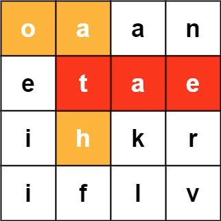
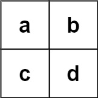

## 单词搜索II

给定一个`m x n`二维字符网格board和一个单词（字符串）列表 words，返回所有二维网格上的单词。

单词必须按照字母顺序，通过 相邻的单元格 内的字母构成，其中“相邻”单元格是那些水平相邻或垂直相邻的单元格。同一个单元格内的字母在一个单词中不允许被重复使用。


示例 1：



```
输入：board = [["o","a","a","n"],["e","t","a","e"],["i","h","k","r"],["i","f","l","v"]], words = ["oath","pea","eat","rain"]
输出：["eat","oath"]
```

示例 2：


```
输入：board = [["a","b"],["c","d"]], words = ["abcb"]
输出：[]
```

提示：

* `m == board.length`
* `n == board[i].length`
* 1 <= `m`, `n` <= 12
* `board[i][j]` 是一个小写英文字母
* 1 <= `words.length` <= 3 * 10^4
* 1 <= `words[i].length` <= 10
* `words[i]` 由小写英文字母组成
* `words` 中的所有字符串互不相同