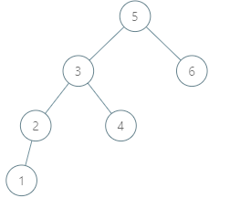

## 二叉搜索树中的顺序后继

给你一个二叉搜索树和其中的某一个结点，请你找出该结点在树中顺序后继的节点。

结点 p 的后继是值比 `p.val` 大的结点中键值最小的结点。

示例 1:


```
输入: root = [2,1,3], p = 1
输出: 2
解析: 这里 1 的顺序后继是 2。
请注意 p 和返回值都应是 TreeNode 类型。
```

示例 2:


```
输入: root = [5,3,6,2,4,null,null,1], p = 6
输出: null
解析: 因为给出的结点没有顺序后继，所以答案就返回 null 了。
```

注意:

* 假如给出的结点在该树中没有顺序后继的话，请返回 null
* 我们保证树中每个结点的值是唯一的