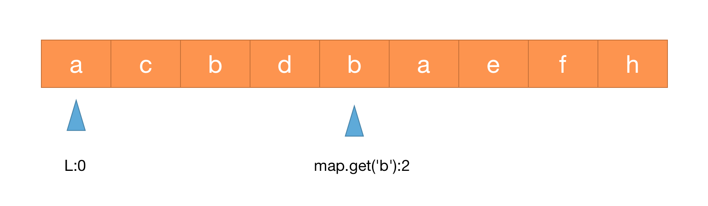
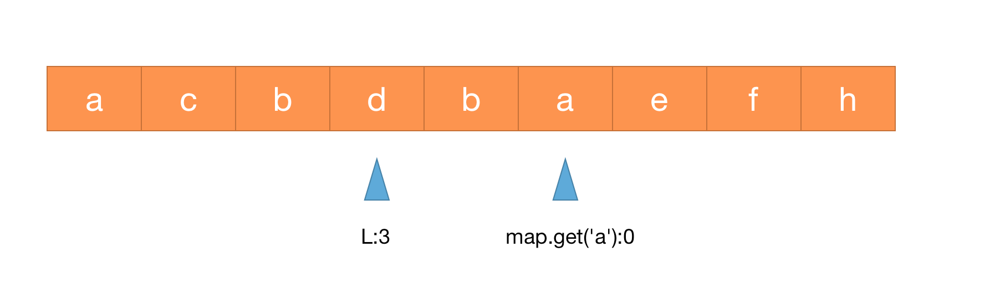

## 无重复字符的最长子串

给定一个字符串`s`，请你找出其中不含有重复字符的最长子串的长度。

示例1:
```
输入: s = "abcabcbb"
输出: 3
解释: 因为无重复字符的最长子串是 "abc"，所以其长度为 3。
```
示例 2:
```
输入: s = "bbbbb"
输出: 1
解释: 因为无重复字符的最长子串是 "b"，所以其长度为 1。
```
示例 3:
```
输入: s = "pwwkew"
输出: 3
解释: 因为无重复字符的最长子串是 "wke"，所以其长度为 3。
```
请注意，你的答案必须是子串的长度，"pwke"是一个子序列，不是子串。


提示：

* 0 <= s.length <= 5 * 10^4
* s由英文字母、数字、符号和空格组成

### 滑动窗口 len[l,r]

这道题就是窗口大小不固定的滑动窗口题目，然后让我们求满足条件的窗口大小的最大值，这是一种非常常见的滑动窗口题目。

用一个 hashmap 来建立字符和其出现位置之间的映射。同时维护一个滑动窗口，窗口内的都是没有重复的字符，去尽可能的扩大窗口的大小，窗口不停的向右滑动。


1. 设置一个`map`标识每个字符最新出现的位置
2. 循环判断每个位置的字符是否已记录在`map`中，若存在，则更新当前记录最长子串开始位置`l`，如下图循环第二次出现的`b`时,取当前`l`值与字符`b`标识值下一个位置的最大值，`l`变为3

    

    如下图循环第二次出现的`a`值时，由于当前`l`值比已标识`a`值下一个位置索引大，`l`保持不变
   
    

3. `r-l`获取目前不重复子串长度，更新`size`值
4. 重复第2、3步

```
class Solution {
    public int lengthOfLongestSubstring(String s) {
        int ans = 0, start = 0;
        int n = s.length();
        //
        Map<Character, Integer> map = new HashMap<>();

        for(int i=0;i<n;i++) {
            char alpha = s.charAt(i);
            if(map.containsKey(alpha)) {
                start = Math.max(start, map.get(alpha)+1);
            }
            ans = Math.max(ans, i-start+1);
            // 字符位置
            map.put(alpha, i);
        }

        return ans;
    }
}
```
