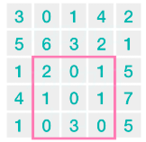

## 二维区域和检索 - 可变

给你一个 2D 矩阵 matrix，请计算出从左上角 `(row1, col1)` 到右下角 `(row2, col2)` 组成的矩形中所有元素的和。



上述粉色矩形框内的，该矩形由左上角 `(row1, col1) = (2, 1)` 和右下角 `(row2, col2) = (4, 3)` 确定。其中，所包括的元素总和 `sum = 8`。

示例：

```
给定 matrix = [
[3, 0, 1, 4, 2],
[5, 6, 3, 2, 1],
[1, 2, 0, 1, 5],
[4, 1, 0, 1, 7],
[1, 0, 3, 0, 5]
]
sumRegion(2, 1, 4, 3) -> 8
update(3, 2, 2)
sumRegion(2, 1, 4, 3) -> 10
```

注意:

* 矩阵 `matrix` 的值只能通过 `update` 函数来进行修改
* 你可以默认 `update` 函数和 `sumRegion` 函数的调用次数是均匀分布的
* 你可以默认 `row1 ≤ row2`，`col1 ≤ col2`