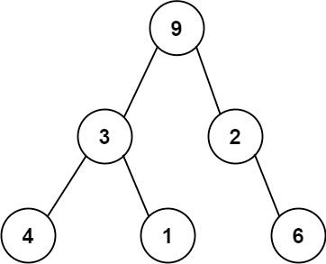

## 验证二叉树的前序序列化

序列化二叉树的一种方法是使用 前序遍历 。当我们遇到一个非空节点时，我们可以记录下这个节点的值。如果它是一个空节点，我们可以使用一个标记值记录，例如 #。



例如，上面的二叉树可以被序列化为字符串 `9,3,4,#,#,1,#,#,2,#,6,#,#`，其中 `#` 代表一个空节点。

给定一串以逗号分隔的序列，验证它是否是正确的二叉树的前序序列化。编写一个在不重构树的条件下的可行算法。

保证 每个以逗号分隔的字符或为一个整数或为一个表示 `null` 指针的 `#` 。

你可以认为输入格式总是有效的

* 例如它永远不会包含两个连续的逗号，比如`1,,3` 。

注意：不允许重建树。

示例 1:

```
输入: preorder = "9,3,4,#,#,1,#,#,2,#,6,#,#"
输出: true
```

示例2:

```
输入: preorder = "1,#"
输出: false
```

示例 3:

```
输入: preorder = "9,#,#,1"
输出: false
```

提示:

* 1 <= `preorder.length` <= 10^4
* preorder由以逗号“，” 分隔的 `[0,100]` 范围内的整数和 “#” 组成