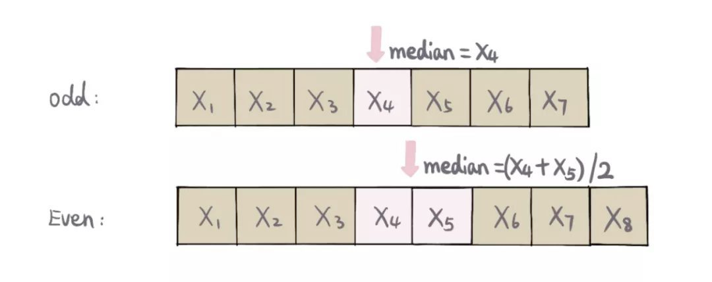
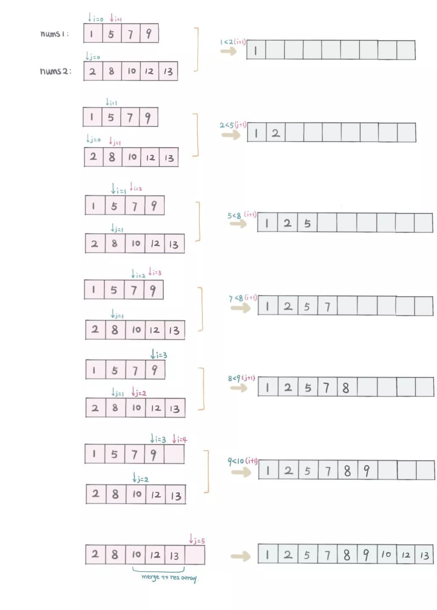
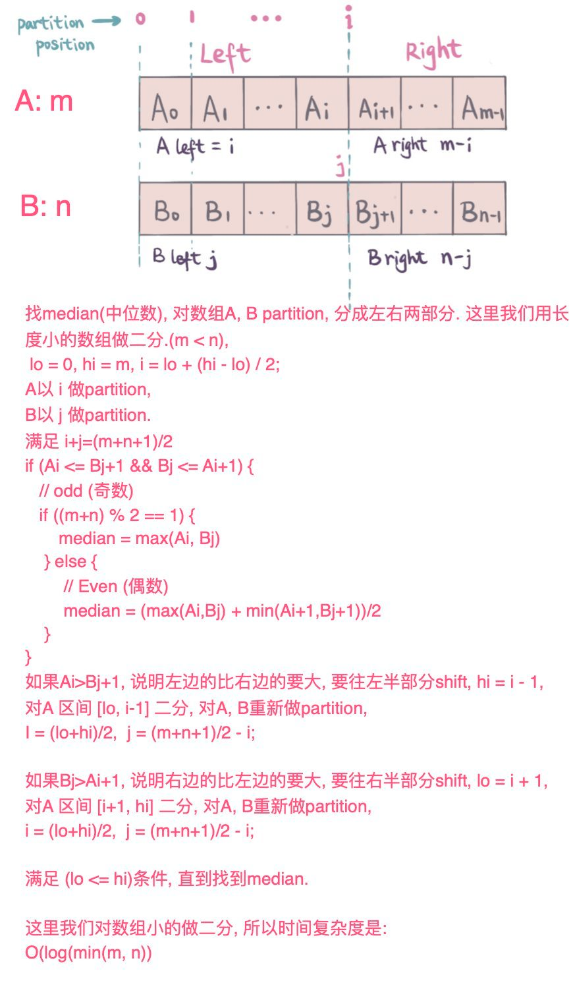
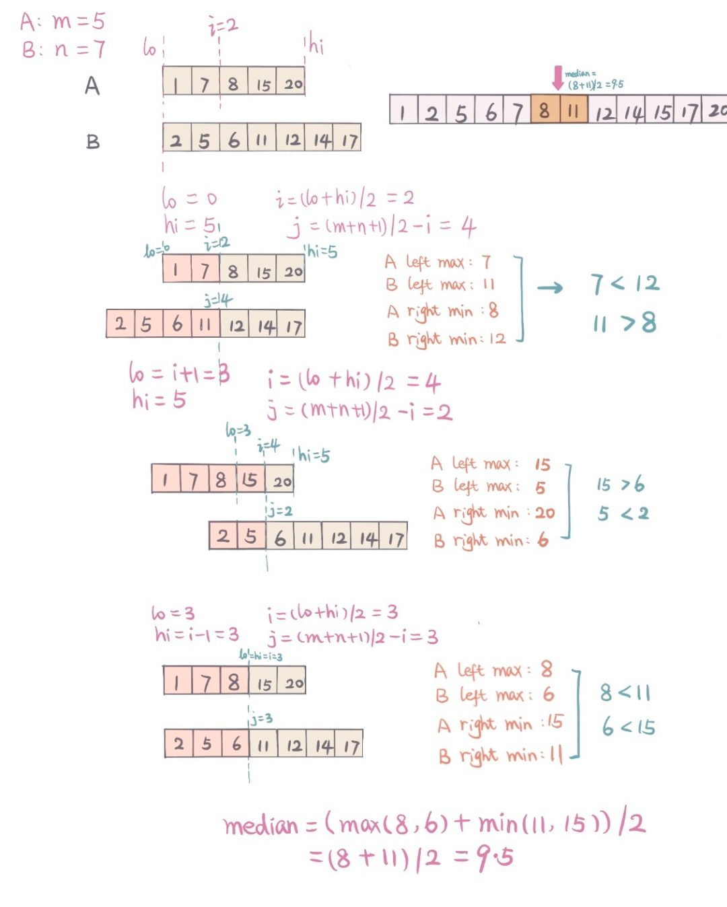
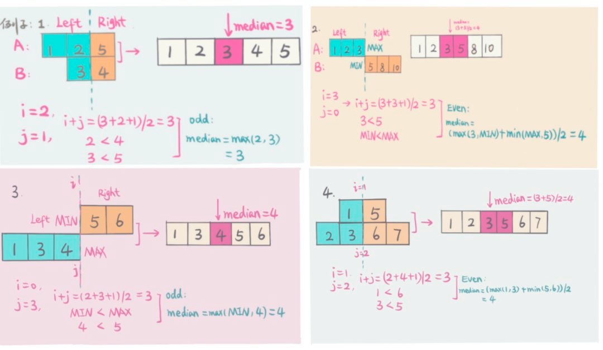

## 寻找两个正序数组的中位数

给定两个大小分别为`m`和`n`的正序（从小到大）数组`nums1`和`nums2`。请你找出并返回这两个正序数组的中位数 。

算法的时间复杂度应该为`O(log (m+n))`。

示例 1：
```
输入：nums1 = [1,3], nums2 = [2]
输出：2.00000
解释：合并数组 = [1,2,3] ，中位数 2
```
示例 2：
```
输入：nums1 = [1,2], nums2 = [3,4]
输出：2.50000
解释：合并数组 = [1,2,3,4] ，中位数 (2 + 3) / 2 = 2.5
```

提示：

* nums1.length == m
* nums2.length == n
* 0 <= m <= 1000
* 0 <= n <= 1000
* 1 <= m + n <= 2000
* -106 <= nums1[i], nums2[i] <= 106

## 题解

一个数组中median就是把数组分成左右等分的中位数。



### 暴力 （Brute Force）

暴力解主要是要merge两个排序的数组 （A，B）成一个排序的数组。

用两个`pointer（i，j）`， `i`从数组`A`起始位置开始，即`i=0`开始， `j`从数组`B`起始位置， 即 j=0开始. 一一比较 A[i]和B[j],

* 如果 `A[i]<=B[j]`, 则把`A[i]`放入新的数组中，`i`往后移一位，即`i+1`.
* 如果`A[i]`>`B[j]`, 则把`B[j]`放入新的数组中，`j`往后移一位，即`j+1`.
* 重复步骤1和2，直到`i`移到`A`最后，或者`j`移到`B`最后。
* 如果`j`移动到`B`数组最后，那么直接把剩下的所有`A`依次放入新的数组中.
如果`i`移动到`A`数组最后，那么直接把剩下的所有`B`依次放入新的数组中.

Merge的过程如下图。


```
class MedianTwoSortedArrayBruteForce {
    public double findMedianSortedArrays(int[] nums1, int[] nums2) {
      int[] newArr = mergeTwoSortedArray(nums1, nums2);
      int n = newArr.length;
      if (n % 2 == 0) {
        // even
        return (double) (newArr[n / 2] + newArr[n / 2 - 1]) / 2;
      } else {
        // odd
        return (double) newArr[n / 2];
      }
    }
    private int[] mergeTwoSortedArray(int[] nums1, int[] nums2) {
      int m = nums1.length;
      int n = nums2.length;
      int[] res = new int[m + n];
      int i = 0;
      int j = 0;
      int idx = 0;
      while (i < m && j < n) {
        if (nums1[i] <= nums2[j]) {
          res[idx++] = nums1[i++];
        } else {
          res[idx++] = nums2[j++];
        }
      }
      while (i < m) {
        res[idx++] = nums1[i++];
      }
      while (j < n) {
        res[idx++] = nums2[j++];
      }
      return res;
    }
}
```

#### 复杂度分析

* 时间复杂度：`O(m+n)-mislength of A,nislength of B`
* 空间复杂度：`O(m+n)`

### 二分查找 （Binary Search）

由于题中给出的数组都是排好序的，在排好序的数组中查找很容易想到可以用二分查找（Binary Search), 这里对数组长度小的做二分， 保证数组`A`和数组`B`做partition之后
`len(Aleft)+len(Bleft)=(m+n+1)/2-m`是数组A的长度，`n`是数组B的长度

对数组A的做partition的位置是区间`[0,m]`



下图给出几种不同情况的例子（注意但左边或者右边没有元素的时候，左边用`INF_MIN`，右边用`INF_MAX`表示左右的元素：




```
class MedianSortedTwoArrayBinarySearch {
  public static double findMedianSortedArraysBinarySearch(int[] nums1, int[] nums2) {
     // do binary search for shorter length array, make sure time complexity log(min(m,n)).
     if (nums1.length > nums2.length) {
        return findMedianSortedArraysBinarySearch(nums2, nums1);
      }
      int m = nums1.length;
      int n = nums2.length;
      int lo = 0;
      int hi = m;
      while (lo <= hi) {
        // partition A position i
        int i = lo + (hi - lo) / 2;
        // partition B position j
        int j = (m + n + 1) / 2 - i;

        int maxLeftA = i == 0 ? Integer.MIN_VALUE : nums1[i - 1];
        int minRightA = i == m ? Integer.MAX_VALUE : nums1[i];

        int maxLeftB = j == 0 ? Integer.MIN_VALUE : nums2[j - 1];
        int minRightB = j == n ? Integer.MAX_VALUE : nums2[j];

        if (maxLeftA <= minRightB && maxLeftB <= minRightA) {
          // total length is even
          if ((m + n) % 2 == 0) {
            return (double) (Math.max(maxLeftA, maxLeftB) + Math.min(minRightA, minRightB)) / 2;
          } else {
            // total length is odd
            return (double) Math.max(maxLeftA, maxLeftB);
          }
        } else if (maxLeftA > minRightB) {
          // binary search left half
          hi = i - 1;
        } else {
          // binary search right half
          lo = i + 1;
        }
      }
      return 0.0;
    }
}
```

二分查找关键点在于

* 要`partition`两个排好序的数组成左右两等份，`partition`需要满足`len(Aleft)+len(Bleft)=(m+n+1)/2` - `m`是数组A的长度， `n`是数组B的长度
* 并且`partition`后 A左边最大( `maxLeftA`), A右边最小（ `minRightA`), B左边最大（ `maxLeftB`), B右边最小（ `minRightB`) 满足 `(maxLeftA <= minRightB && maxLeftB <= minRightA)`


#### 复杂度分析

* 时间复杂度：`O(log(min(m,n))-mislength of A,nislength of B`
* 空间复杂度：`O(1)` - 这里没有用额外的空间