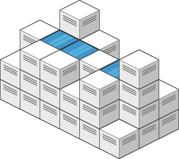

## 接雨水II

给你一个`m x n`的矩阵，其中的值均为非负整数，代表二维高度图每个单元的高度，请计算图中形状最多能接多少体积的雨水。


示例 1:


```
输入: heightMap = [[1,4,3,1,3,2],[3,2,1,3,2,4],[2,3,3,2,3,1]]
输出: 4
解释: 下雨后，雨水将会被上图蓝色的方块中。总的接雨水量为1+2+1=4。
```

示例2:


```
输入: heightMap = [[3,3,3,3,3],[3,2,2,2,3],[3,2,1,2,3],[3,2,2,2,3],[3,3,3,3,3]]
输出: 10
```

提示:

* `m == heightMap.length`
* `n == heightMap[i].length`
* 1 <= m, n <= 200
* 0 <= `heightMap[i][j]` <= 2 * 10^4
