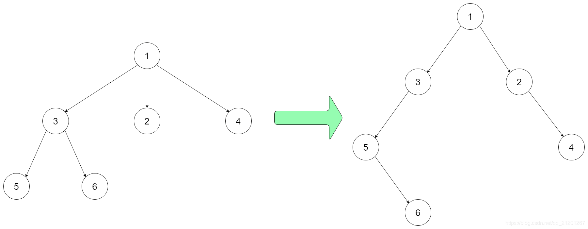

## 将N叉树编码为二叉树

设计一个算法，可以将N叉树编码为二叉树，并能将该二叉树解码为原N叉树。

* 一个N叉树是指每个节点都有不超过 N 个孩子节点的有根树。
* 类似地，一个二叉树是指每个节点都有不超过2个孩子节点的有根树。
* 你的编码/解码的算法的实现没有限制，你只需要保证一个N叉树可以编码为二叉树且该二叉树可以解码回原始N叉树即可。

例如，你可以将下面的3-叉树以该种方式编码：

* 注意，上面的方法仅仅是一个例子，可能可行也可能不可行。
* 你没有必要遵循这种形式转化，你可以自己创造和实现不同的方法。

注意：

* N 的范围在 `[1, 1000]`
* 不要使用类成员 / 全局变量 / 静态变量来存储状态。
* 你的编码和解码算法应是无状态的。
