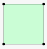
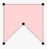

## 凸多边形

给定一个按顺序连接的多边形的顶点，判断该多边形是否为凸多边形。

注：

* 顶点个数至少为 3 个且不超过 10,000。
* 坐标范围为 -10,000 到 10,000。
* 你可以假定给定的点形成的多边形均为简单多边形。
* 换句话说，保证每个顶点处恰好是两条边的汇合点，并且这些边 互不相交 。

示例 1：

```
[[0,0],[0,1],[1,1],[1,0]]
输出： True
解释：
```


示例 2：

```
[[0,0],[0,10],[10,10],[10,0],[5,5]]
输出： False
解释：
```



