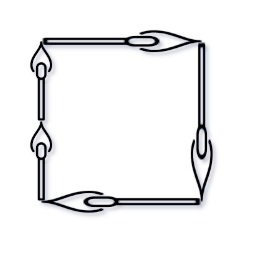

## 火柴拼正方形

你将得到一个整数数组 `matchsticks` ，其中 `matchsticks[i]` 是第 i个火柴棒的长度。你要用 所有的火柴棍拼成一个正方形。你 不能折断 任何一根火柴棒，但你可以把它们连在一起，而且每根火柴棒必须 使用一次 。

如果你能使这个正方形，则返回 true ，否则返回 false 。

示例1:



```
输入: matchsticks = [1,1,2,2,2]
输出: true
解释: 能拼成一个边长为2的正方形，每边两根火柴。
```

示例2:

```
输入: matchsticks = [3,3,3,3,4]
输出: false
解释: 不能用所有火柴拼成一个正方形。
```

提示:

* 1 <= `matchsticks.length` <= 15
* 1 <= `matchsticks[i]` <= 10^8
