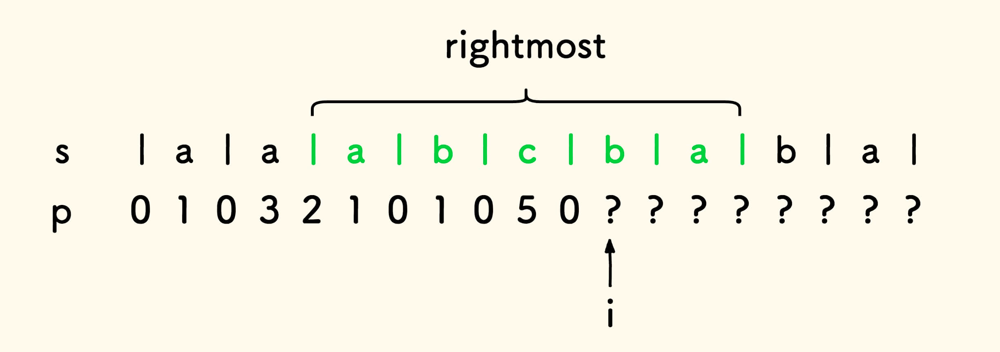
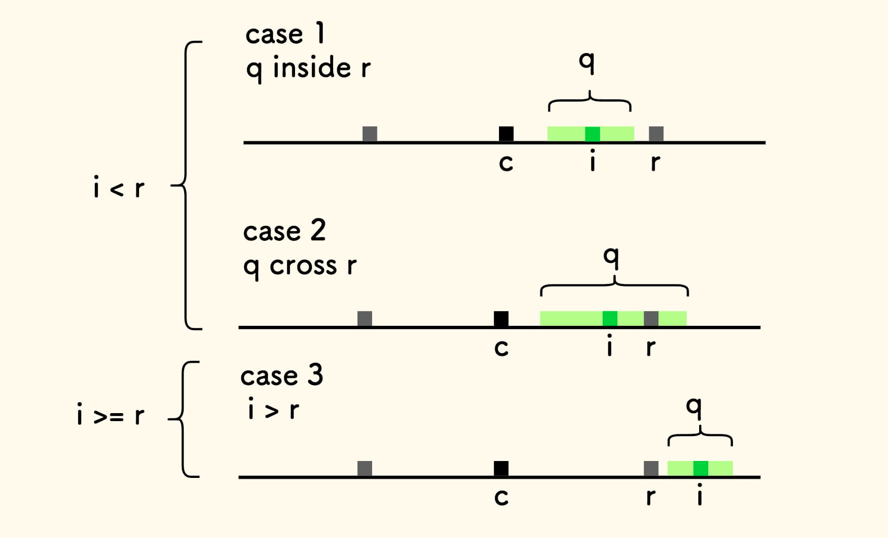

## 最长回文子串

给你一个字符串`s`，找到`s`中最长的回文子串。

示例 1：
```
输入：s = "babad"
输出："bab"
解释："aba" 同样是符合题意的答案。
```
示例 2：
```
输入：s = "cbbd"
输出："bb"
```

提示：

* 1 <= s.length <= 1000
* s仅由数字和英文字母组成

### 回文串的判断

首先，回文串的判断方法是简单的：从两边向中间，不断比较头尾字符是否相同即可。


```
// 判断给定字符串是否是回文串
bool IsPalindromicString(char *s) {
    int n = strlen(s);
    int left = 0;
    int right = n - 1;

    while (left < right) {
        if (s[left] == s[right]) {
            left++;
            right--;
        } else {
            return false;
        }
    }
    return true;
}
```

时间复杂度是`O(n)`

### 题解

#### 中心扩展方法

遍历每一个字符，向两边扩展找到以其为中心的最长回文子串， 所有找到的回文子串的最大长度即所求 。


```
// 辅助函数：从长度为 n 的字符串 s 的给定位置左右扩展寻找回文串。
// 输入的 left 和 right 是扩展的左右起始位置。
// 返回扩展经过的字符数 k .
int ExpandPalindrome(char *s, int n, int left, int right) {
    int k = 0;
    while (left >= 0 && right < n) {
        if (s[left] == s[right]) {
            left--;
            right++;
            k++;
        } else {
            break;
        }
    }
    return k;
}

// 返回给定字符串 s 的最长回文子串的长度
int LongestPalindromicSubstring(char *s) {
    int n = strlen(s);

    if (n <= 0) return 0;

    // 记录最大回文子串的长度
    // 一旦 s 非空，必然最大回文子串长度至少为 1
    int max_length = 1;

    for (int i = 0; i < n; i++) {
        // 考察回文串长度是奇数的情况
        int k1 = ExpandPalindrome(s, n, i - 1, i + 1);
        // 考察回文串长度是偶数的情况
        int k2 = ExpandPalindrome(s, n, i, i + 1);

        // 计算两个情况下的长度
        int length1 = k1 * 2 + 1;
        int length2 = k2 * 2;

        // 更新最大值
        if (length1 > max_length) max_length = length1;
        if (length2 > max_length) max_length = length2;
    }

    return max_length;
}
```
 
##### 复杂度分析

时间复杂度是: `O(n^2)`

#### 一维动态规划方法

采用动态规划的方法，使用一个一维数组`dp`。

`dp[j]`表示以位置`j`结束的最长的回文子串的起始位置`i`。

当前项的回文串最多比上一项的回文串长一对字符 。


设`p(j)`是以位置`j`结尾的最长回文子串。


把`p(j)`的左右字符剔除，形成的子串`p'`显然也是一个回文串。


因为`p(j-1)`是以位置`j-1`结尾的最长回文串，所以回文串`p'`不可比`p(j-1)`长。

进而说明了`p(j)`至多比`p(j-1)`长一对字符。

```
// 返回给定字符串 s 的最长回文子串的长度
int LongestPalindromicSubstring(char *s) {
    int n = strlen(s);

    if (n <= 0) return 0;

    // dp[j] 表示以位置 j 结尾的最长回文子串的起始位置
    // 其长度就是 j - dp[j] + 1
    int dp[n];
    dp[0] = 0;

    // 记录最大回文子串的长度
    // 0 - 0 + 1
    int max_length = 1;

    for (int j = 1; j < n; j++) {
        if (dp[j - 1] > 0 && s[j] == s[dp[j - 1] - 1]) {
            // 当前位置的字符和上一次回文串的左邻字符相同
            // 回文串得到扩展
            dp[j] = dp[j - 1] - 1;
        } else {
            // 从左向右找
            int left = dp[j - 1];
            int right = j;
            int start = left;  // 最近一次的回文查找起始位置

            while (left < right) {
                if (s[left] != s[right]) {
                    // 遭遇失配字符，重置 right
                    right = j;
                    start = left + 1;
                } else {
                    // 否则，两边继续收拢
                    right--;
                }
                left++;
            }

            dp[j] = start;
        }

        // 更新最大值
        int length = j - dp[j] + 1;
        if (length > max_length) max_length = length;
    }

    return max_length;
}
```

##### 复杂度分析

时间复杂度是: `O(n^2)`


#### 二维动态规划方法
相比一维动态规划方法而言， 二维数组上的动态规划方法的思路更直白。
回文串两边加上两个相同字符，会形成一个新的回文串。


方法是，建立二维数组`dp`，找出所有的回文子串, `dp[i][j]`记录子串`i..j`是否为回文串 。


首先，单个字符就形成一个回文串，所以，所有`dp[i][i] = true`。

然后，容易得到递推关系：
如果字符`s[i]`和`s[j]`相等，并且子串`i+1..j-1`是回文串的话，子串`i..j`也是回文串。
也就是，如果`s[i] == s[j]`且`dp[i+1][j-1]=true`时，`dp[i][j] = true`。


这是本方法中主要的递推关系。

不过仍要注意边界情况，即子串`i+1..j-1`的有效性 ，当`i+1 <= j-1`时，它才有效。

反之，如果不满足，此时`j <= i+1`，也就是子串`i..j`最多有两个字符， 如果两个字符`s[i]`和`s[j]`相等，那么是回文串。

至此，递推关系已经分析完。

最后，考虑到主要的递推关系是由已知子串`i+1..j-` 的情况， 递推到`i..j`的情况， 因此，迭代过程需要反序迭代变量`i`，正序迭代`j`。

此外，可以通过一个表格，来理解整个`dp`数组的规划过程。


上面的表格填表过程：

* 初始化所有方格写`false`。
* 填写对角线写`true`。
* 自对角线右下角开始，自下而上、自左而右，按箭头方向根据递推关系填表。
* 最后，找到所有回文子串后，即可找到最长回文子串和其长度。

```
// 返回给定字符串 s 的最长回文子串的长度
int LongestPalindromicSubstring(char *s) {
    int n = strlen(s);
    if (n <= 0) return 0;
    // dp[i][j] 表示 s[i..j] 是否回文，j >= i
    bool dp[n][n];
    // 初始化
    for (int i = 0; i < n; i++)
        for (int j = i; j < n; j++) dp[i][j] = false;

    // 易知，单个字符 s[i..i] 构成回文
    for (int i = 0; i < n; i++) dp[i][i] = true;

    // 记录最大回文子串的长度，至少为 1
    int max_length = 1;

    // 考虑递推
    // 主要的递推关系是 dp[i][j] = dp[i+1][j-1]
    // 所以倒序遍历 i ，才可以形成递推
    for (int i = n - 1; i >= 0; i--) {
        for (int j = i; j < n; j++) {
            if (s[i] == s[j]) {
                if (j - 1 >= i + 1) {  // 子串 s[i+1..j-1] 有效性
                    if (dp[i + 1][j - 1]) dp[i][j] = true;
                } else {
                    // 此时 j < i + 2 即 j <= i+1
                    // 再之 s[i] == s[j]，必回文
                    dp[i][j] = true;
                }
            }

            if (dp[i][j]) {
                // 更新最大长度
                int length = j - i + 1;
                if (length > max_length) max_length = length;
            }
        }
    }
    return max_length;
}
```

##### 复杂度分析

时间复杂度是`O(n^2)`。
空间复杂度是`O(n^2)`。

#### Manacher 方法
Manacher算法是一种线性时间内求解最长回文子串的算法，俗称「马拉车算法」。

Manacher算法本身是面比较窄的算法，但背后其实也是基于动态规划思想的。

本部分内容较长、算法较复杂，需要精心阅读 。

算法分为两个过程：

* 预处理过程：通过插入分隔符的办法，把潜在的回文子串统一转为奇数长度。
* 算法主过程：构造回文半径数组，利用回文的对称性，递推回文半径。

##### 预处理过程

预处理过程比较简单。

在原始字符串每个字符中间和整个字符串两边插入分隔符：


如果，原始字符串的长度是`n`，那么预处理后的长度为 `2n+ 1`。
预处理后，任意一个回文串都是奇数长度。

容易给出预处理部分的代码实现，其复杂度是`O(n)`。

```
// 预处理过程，n 是原字符串 s 的长度
// 预期结果 s1 的长度是 2n + 1
// 例如 "aba" => "|a|b|a|"
void ManacherPreprocess(char *s, int n, char *s1) {
    int i = 0;
    int j = 0;
    while (i < n) {
        s1[j++] = '|';
        s1[j++] = s[i++];
    }
    // 末尾补 '|'
    s1[j++] = '|';
}
```

回文半径是回文串的中心字符到左边界的距离。
严格来说，是中心字符和左边界字符下标的差值。
简单来说，是 中心字符左边的字符个数 。

下图中的例子，绿色的回文串的半径是`p=2`。


可以发现，预处理后，回文半径就是原字符串中回文串的长度：

于是，接下来只需要考虑预处理后的字符串即可。

现在，建立一个回文半径的数组，`p[i]`表示以位置`i`为中心的最长回文串的半径 。

找到数组 p 的最大值，就是原字符串的最长回文串的长度。

算法的主过程则是求解预处理后字符串的半径数组`p`，采用动态规划的方式。

* 首先，字符串第一位是分隔符，因此首位`p[0] = 0`。

下面考虑递推关系。

在求解半径数组`p`的过程中， 维护向右延伸最远的回文串的信息 。

假设我们处于求解`p[i]`的过程中， 下图中绿色的字符串就是要维护的 向右延伸最远的回文串 ， 它的右边界是已知的回文串中最大的。

对于这种字符串，不妨叫做 最右延伸回文串 ，维护它的信息：

* 它的中心字符的位置`c`
* 它的右边界位置`r`
  


在求解`p[i]`的迭代过程中，一旦遇到右边界比`r`还要大的回文串，就更新`r`和`c`的值。

现在尝试寻找以`i`为中心的最长回文串`q`，它的长度是未知的，有如下几种可能：


下面对以上的情况逐个分析：

* 当`i < r`且`q`被最右延伸回文串完全包住。

    找出`i`关于中心`c`的对称位置`j`，两边是完全镜像的，半径相等`p[i] = p[j]`。
  
* 当`i < r`，但是同时`q`没有被完全包住。

    此时容易知道回文串`q`的半径不小于`r-i`。
  

    综合第一种情况，可知， 当`i < r`时, `p[i]`至少为`min(p[j], r-i)`。
    不过，右边跨过`r`的部分仍然是未知的，需要采用中心扩展方法求出。
  
  
    已经知道，此时`p[i]`至少是`r-i`，因此只需要从`r+1`处开始扩展就行。

* 当`i >= r`，此时，只能从位置`i`处向两边中心扩展探测回文串。
  

    具体来说，先初始化半径`p[i] = 0`，然后不断尝试增加半径，判断左右字符是否相等。
    此时的中心扩展起点是`i+1`。

综合上面三种情况：

* 如果`i < r`，那么`p[i]`至少为`min(p[j], r-i)`。
    不妨让`p[i]`先取这个值，即先吸收已知信息。
* 然后向右中心扩展，探测回文串的边界。
    无论`i`和`r`的大小关系如何，左右扩展的起点可以统一表示 ，都可以表达为：
    * `left = i - p[i] - 1`
    * `right = i + p[i] + 1`

最终的递推关系，虽然分为三种情况，但是可以总结为：**先吸收已知的镜像半径长度，然后再中心扩展探测剩余长度**。

利用此递推关系，求解半径数组`p`，找出其中半径最大值，就是原字符串的最长回文串长度。

```
#define min(x, y) (x) < (y) ? (x) : (y)

// Manacher 算法主过程
// 输入长度为奇数的已预处理过的字符串 s 和其长度 n
// 返回最长回文串的半径
int Manacher(char *s, int n) {
    // 最长回文串半径的数组
    int p[n];
    // 显然 第一位的半径是 0
    p[0] = 0;
    // 追踪数组 p 的最大值
    int max_p = 0;

    // 维护向右延伸最远的回文串的信息
    // 其最右的位置 r
    int r = 0;
    // 其中心位置 c
    int c = 0;

    // 求解数组 p
    for (int i = 1; i < n; i++) {
        // 找出 i 为中心的回文串半径 p[i]
        if (i < r) {
            // 目标回文串的中心在 r 左边时
            // 最大化吸收已有信息

            // j 是 i 关于 c 对称的位置
            int j = c - (i - c);

            // p[i] 至少为下面二者最小值
            p[i] = min(p[j], r - i);
        } else {
            // 否则，初始化 p[i]
            p[i] = 0;
        }

        // 左右进行扩展，探测剩余长度
        int left = i - p[i] - 1;
        int right = i + p[i] + 1;

        while (s[left] == s[right] && left >= 0 && right < n) {
            left--;
            right++;
            p[i]++;
        }
        // 真实的 right
        // 因上面的循环跳出后的 right 可能稍大
        right = i + p[i];

        // 维护 c 和 r
        if (right > r) {
            r = right;
            c = i;
        }

        // 维护最大值
        if (max_p < p[i]) max_p = p[i];
    }
    return max_p;
}

// 返回给定字符串 s 的最长回文子串的长度
int LongestPalindromicSubstring(char *s) {
    int n = strlen(s);
    if (n <= 0) return 0;

    // 预处理
    int n1 = 2 * n + 1;
    char s1[n1];
    ManacherPreprocess(s, n, s1);

    // s1 的回文半径 就是 s 的回文长度
    return Manacher(s1, n1);
}
```

##### 复杂度分析

预处理过程时间复杂度是`O(n)`。

为方便分析算法主流程的时间复杂度，把其代码精简为伪代码如下：

```
function Manacher
    for i < n  // 外层循环
        if i < r
            p[i] = min(p[j], r - r)
        else
            p[i] = 0

        left = i - p[i] - 1
        right = i + p[i] + 1

        while (s[left] == s[right])  // 内层循环
            left--
            right++
            p[i]++

        if right > r
            r = right
```

算法主过程虽然有两层循环，但是内层循环只有在后两种情况发生时进入， 也就是只有当以`i`为中心的回文串`q`跨越最右边界`r`的时候才进入，这种情况下最右边界会增大。 导致后面的迭代过程中，第一种情况 就更容易发生。

内层循环的right起点是：

* 第二种情况下，是 `r+1`
* 第三种情况 下，是`i+1`，此时`i >= r`

这两种情况下，内层循环起点至少 `> r`。

内层循环结束后，都会更新`r`变大到新的右边界`right`。

就是说， 本次内层循环的终点和下一次内层循环的起点无缝衔接 。

所以内层循环总的步数是线性的`n`次。

两层循环加起来的总步数就是`2n`次，时间复杂度即 `O(n)`。

可以说，Manacher 算法最大化地利用了已知最右回文串的信息，才达到了线性时间复杂度。

解决最长回文子串问题的四种方法中， 最容易理解的思路是中心扩展法。 时间表现最好的是Manacher方法。


