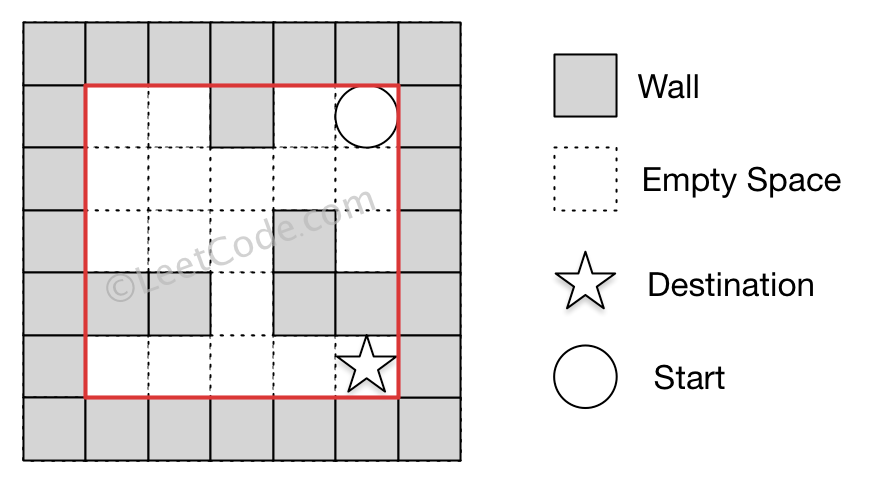
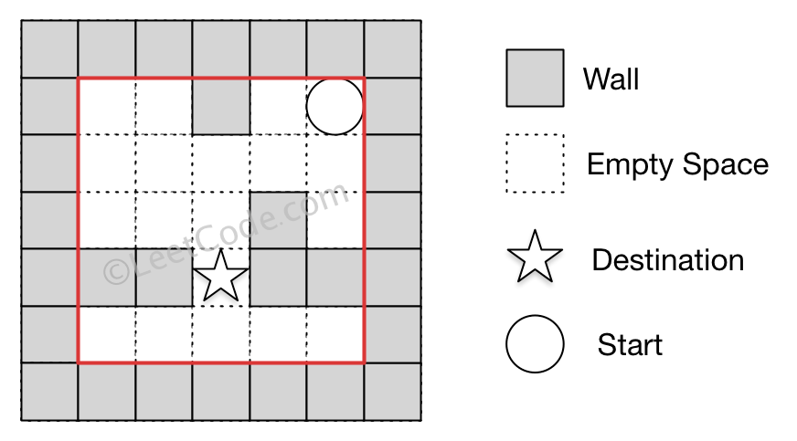

## 迷宫 II

由空地和墙组成的迷宫中有一个球。 球可以向上下左右四个方向滚动，但在遇到墙壁前不会停止滚动。 当球停下时，可以选择下一个方向。

给定球的起始位置，目的地和迷宫，找出让球停在目的地的最短距离。 距离的定义是球从起始位置（不包括）到目的地（包括）经过的空地个数。
如果球无法停在目的地，返回 -1。

迷宫由一个0和1的二维数组表示。 1表示墙壁，0表示空地。 你可以假定迷宫的边缘都是墙壁。 起始位置和目的地的坐标通过行号和列号给出。

示例 1:


```
输入 1: 迷宫由以下二维数组表示

0 0 1 0 0
0 0 0 0 0
0 0 0 1 0
1 1 0 1 1
0 0 0 0 0

输入 2: 起始位置坐标 (rowStart, colStart) = (0, 4)
输入 3: 目的地坐标 (rowDest, colDest) = (4, 4)

输出: 12

解析: 一条最短路径 : left -> down -> left -> down -> right -> down -> right。
总距离为 1 + 1 + 3 + 1 + 2 + 2 + 2 = 12。
```

示例 2:


```
输入 1: 迷宫由以下二维数组表示

0 0 1 0 0
0 0 0 0 0
0 0 0 1 0
1 1 0 1 1
0 0 0 0 0

输入 2: 起始位置坐标 (rowStart, colStart) = (0, 4)
输入 3: 目的地坐标 (rowDest, colDest) = (3, 2)

输出: -1
解析: 没有能够使球停在目的地的路径。
```

注意:

* 迷宫中只有一个球和一个目的地。
* 球和目的地都在空地上，且初始时它们不在同一位置。
* 给定的迷宫不包括边界 (如图中的红色矩形), 但你可以假设迷宫的边缘都是墙壁。
* 迷宫至少包括2块空地，行数和列数均不超过100。


