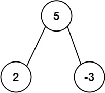

## 出现次数最多的子树元素和

给你一个二叉树的根结点root，请返回出现次数最多的子树元素和。如果有多个元素出现的次数相同，返回所有出现次数最多的子树元素和（不限顺序）。

一个结点的「子树元素和」定义为以该结点为根的二叉树上所有结点的元素之和（包括结点本身）。

示例 1：


```
输入: root = [5,2,-3]
输出: [2,-3,4]
```

示例2：


```
输入: root = [5,2,-5]
输出: [2]
```

提示:

* 节点数在`[1, 10^4]`范围内
* -10^5<= `Node.val` <= 10^5