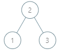
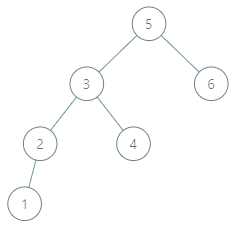
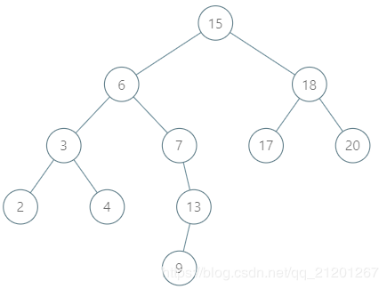
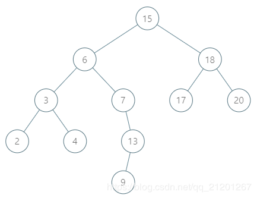

## 二叉搜索树中的中序后继II

给定一棵二叉搜索树和其中的一个节点 `node` ，找到该节点在树中的中序后继。

如果节点没有中序后继，请返回 `null` 。

一个结点 `node` 的中序后继是键值比`node.val`大所有的结点中键值最小的那个。

你可以直接访问结点，但无法直接访问树。
每个节点都会有其父节点的引用。节点定义如下：
```
class Node {
  public int val;
  public Node left;
  public Node right;
  public Node parent;
}
```

进阶：

* 你能否在不访问任何结点的值的情况下解决问题?

示例 1:


```
输入: tree = [2,1,3], node = 1
输出: 2
解析: 1 的中序后继结点是 2 。
注意节点和返回值都是 Node 类型的。
```

示例 2:


```
输入: tree = [5,3,6,2,4,null,null,1],
node = 6
输出: null
解析: 该结点没有中序后继，因此返回 null 。
```

示例 3:


```
输入: tree = [15,6,18,3,7,17,20,2,4,null,13,null,null,null,null,null,null,null,null,9],
node = 15
输出: 17
```

示例 4:


```
输入: tree = [15,6,18,3,7,17,20,2,4,null,13,null,null,null,null,null,null,null,null,9],
node = 13
输出: 15
```

提示：

* -10^5 <= `Node.val` <= 10^5
* 1 <= `Number of Nodes` <= 10^4
* 树中各结点的值均保证唯一。
