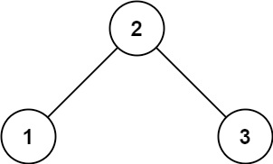
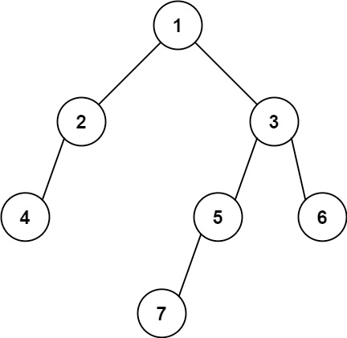

## 找树左下角的值

给定一个二叉树的 根节点 root，请找出该二叉树的最底层最左边节点的值。

假设二叉树中至少有一个节点。

示例 1:


```
输入: root = [2,1,3]
输出: 1
```

示例 2:


```
输入: [1,2,3,4,null,5,6,null,null,7]
输出: 7
```

提示:

* 二叉树的节点个数的范围是 `[1,10^4]`
* -2^31<= `Node.val` <= 2^31- 1