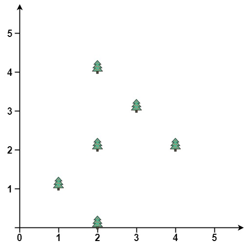
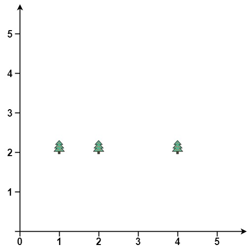

## 安装栅栏

给定一个数组 trees，其中 `trees[i] = [xi, yi]` 表示树在花园中的位置。

你被要求用最短长度的绳子把整个花园围起来，因为绳子很贵。只有把 所有的树都围起来，花园才围得很好。

返回恰好位于围栏周边的树木的坐标。

示例 1:


```
输入: points = [[1,1],[2,2],[2,0],[2,4],[3,3],[4,2]]
输出: [[1,1],[2,0],[3,3],[2,4],[4,2]]
```

示例 2:


```
输入: points = [[1,2],[2,2],[4,2]]
输出: [[4,2],[2,2],[1,2]]
```

注意:

* 1 <= `points.length` <= 3000
* `points[i].length` == 2
* 0 <= xi, yi <= 100
* 所有给定的点都是 唯一 的。