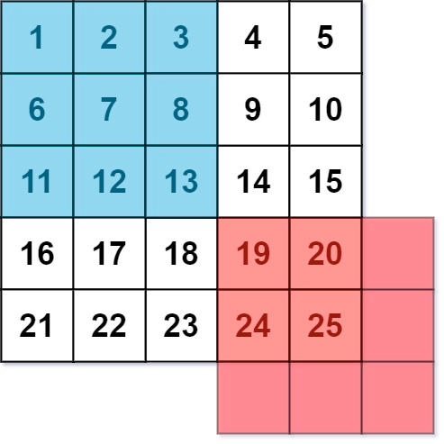

## 图片平滑器

图像平滑器 是大小为 3 x 3 的过滤器，用于对图像的每个单元格平滑处理，平滑处理后单元格的值为该单元格的平均灰度。

每个单元格的  平均灰度 定义为：该单元格自身及其周围的 8 个单元格的平均值，结果需向下取整。（即，需要计算蓝色平滑器中 9 个单元格的平均值）。

如果一个单元格周围存在单元格缺失的情况，则计算平均灰度时不考虑缺失的单元格（即，需要计算红色平滑器中 4 个单元格的平均值）。



给你一个表示图像灰度的 m x n 整数矩阵 img ，返回对图像的每个单元格平滑处理后的图像 。

示例 1:


```
输入:img = [[1,1,1],[1,0,1],[1,1,1]]
输出:[[0, 0, 0],[0, 0, 0], [0, 0, 0]]
解释:
对于点 (0,0), (0,2), (2,0), (2,2): 平均(3/4) = 平均(0.75) = 0
对于点 (0,1), (1,0), (1,2), (2,1): 平均(5/6) = 平均(0.83333333) = 0
对于点 (1,1): 平均(8/9) = 平均(0.88888889) = 0
```

示例 2:


```
输入: img = [[100,200,100],[200,50,200],[100,200,100]]
输出: [[137,141,137],[141,138,141],[137,141,137]]
解释:
对于点 (0,0), (0,2), (2,0), (2,2): floor((100+200+200+50)/4) = floor(137.5) = 137
对于点 (0,1), (1,0), (1,2), (2,1): floor((200+200+50+200+100+100)/6) = floor(141.666667) = 141
对于点 (1,1): floor((50+200+200+200+200+100+100+100+100)/9) = floor(138.888889) = 138
```

提示:

* `m == img.length`
* `n == img[i].length`
* 1 <= m, n <= 200
* 0 <= `img[i][j]` <= 255