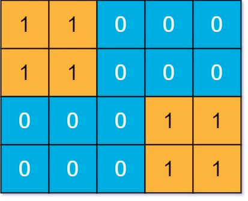

## 不同岛屿的数量 II

给定一个 m x n 二进制数组表示的网格 grid ，一个岛屿由 四连通 （上、下、左、右四个方向）的 1 组成（代表陆地）。你可以认为网格的四周被海水包围。

如果两个岛屿的形状相同，或者通过旋转（顺时针旋转 90°，180°，270°）、翻转（左右翻转、上下翻转）后形状相同，那么就认为这两个岛屿是相同的。

返回 这个网格中形状 不同 的岛屿的数量 。

示例 1:


```
输入: grid = [[1,1,0,0,0],[1,0,0,0,0],[0,0,0,0,1],[0,0,0,1,1]]
输出: 1
解释: 这两个是相同的岛屿。因为我们通过 180° 旋转第一个岛屿，两个岛屿的形状相同。
```
示例 2:


```
输入: grid = [[1,1,0,0,0],[1,1,0,0,0],[0,0,0,1,1],[0,0,0,1,1]]
输出: 1
```

提示:

* `m == grid.length`
* `n == grid[i].length`
* 1 <= m, n <= 50
* `grid[i][j]` 不是 0 就是 1.

