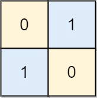
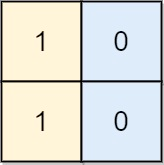

## 变为棋盘

一个 `n x n` 的二维网络 `board` 仅由 0 和 1 组成 。每次移动，你能任意交换两列或是两行的位置。

返回 将这个矩阵变为  “棋盘”  所需的最小移动次数 。如果不存在可行的变换，输出 -1。

“棋盘” 是指任意一格的上下左右四个方向的值均与本身不同的矩阵。

示例 1:


```
输入: board = [[0,1,1,0],[0,1,1,0],[1,0,0,1],[1,0,0,1]]
输出: 2
解释:一种可行的变换方式如下，从左到右：
第一次移动交换了第一列和第二列。
第二次移动交换了第二行和第三行。
```

示例 2:


```
输入: board = [[0, 1], [1, 0]]
输出: 0
解释: 注意左上角的格值为0时也是合法的棋盘，也是合法的棋盘.
```

示例 3:


```
输入: board = [[1, 0], [1, 0]]
输出: -1
解释: 任意的变换都不能使这个输入变为合法的棋盘。
```

提示：

* `n == board.length`
* `n == board[i].length`
* 2 <= n <= 30
* `board[i][j]` 将只包含 0或 1

来源：力扣（LeetCode）
链接：https://leetcode.cn/problems/
著作权归领扣网络所有。商业转载请联系官方授权，非商业转载请注明出处。