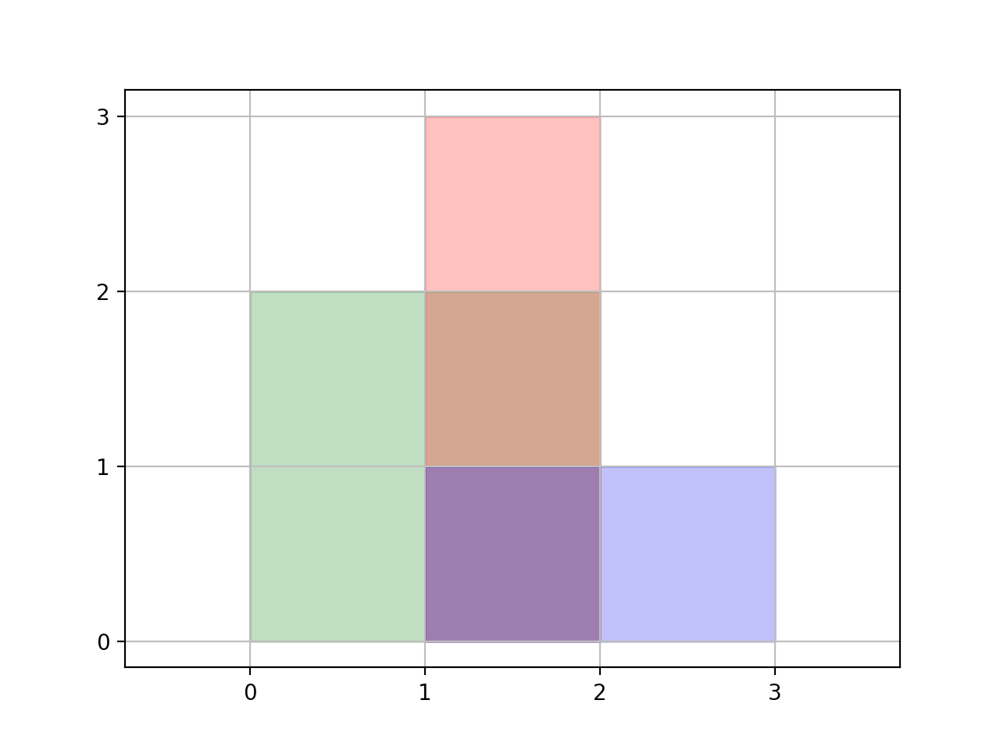

## 矩形面积 II

给你一个轴对齐的二维数组 `rectangles` 。 对于 `rectangle[i] = [x1, y1, x2, y2]`，其中（x1，y1）是矩形 i 左下角的坐标， (xi1, yi1) 是该矩形 左下角 的坐标， (xi2, yi2) 是该矩形 右上角 的坐标。

计算平面中所有 `rectangles` 所覆盖的 总面积 。任何被两个或多个矩形覆盖的区域应只计算 一次 。

返回 总面积 。因为答案可能太大，返回 `10^9 + 7` 的 模 。

 

示例 1：


```
输入：rectangles = [[0,0,2,2],[1,0,2,3],[1,0,3,1]]
输出：6
解释：如图所示，三个矩形覆盖了总面积为 6 的区域。
从(1,1)到(2,2)，绿色矩形和红色矩形重叠。
从(1,0)到(2,3)，三个矩形都重叠。
```

示例 2：

```
输入：rectangles = [[0,0,1000000000,1000000000]]
输出：49
解释：答案是 1018 对 (109 + 7) 取模的结果， 即 49 。
```

提示：

* 1 <= `rectangles.length` <= 200
* `rectanges[i].length` = 4
* 0 <= `xi1`, `yi1`, `xi2`, `yi2` <= 10^9