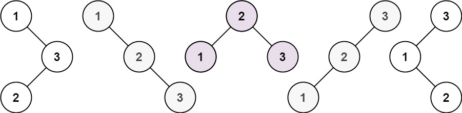

## 不同的二叉搜索树II

给你一个整数n，请你生成并返回所有由n个节点组成且节点值从1到n互不相同的不同二叉搜索树 。可以按任意顺序返回答案。

示例 1：

```
输入：n = 3
输出：[[1,null,2,null,3],[1,null,3,2],[2,1,3],[3,1,null,null,2],[3,2,null,1]]
```
示例 2：
```
输入：n = 1
输出：[[1]]
```

提示：

* 1 <= n <= 8