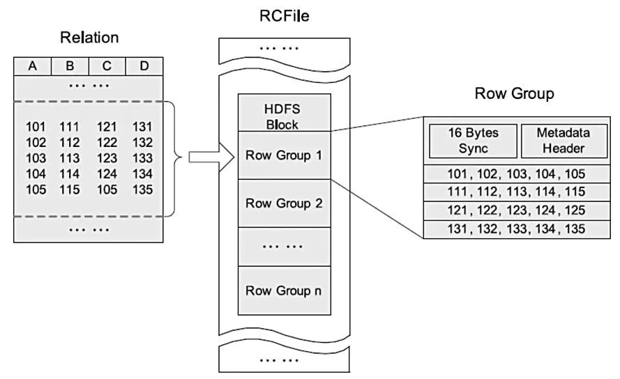
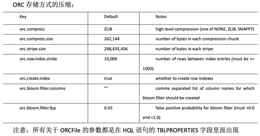

## 压缩和存储

### Hadoop压缩配置

#### MR支持的压缩编码


压缩时间从小到大：
**lz4 < lzo < gz < snappy < deflate < bz2;**
压缩大小从小到大：
**defalte < gz < lz4 < bz2 < lzo < snappy;**
解压时间从小到大：
**zo < lz4 < deflate < gz < snappy < bz2;**


##### 常用调优参数
1、资源相关参数

以下参数是在用户自己的MR应用程序中配置就可以生效（mapred-default.xml）

在YARN启动之前就配置在服务器的配置文件中才能生效（yarn-default.xml）

Shuffle性能优化的关键参数，应在YARN启动之前就配置好（mapred-default.xml）


2. 容错相关参数（MapReduce性能优化）


#### 开启Map输出阶段压缩（MR引擎）

开启 map 输出阶段压缩可以减少 job 中 map 和 Reduce task 间数据传输量。

```shell
# 开启 hive 中间传输数据压缩功能
set hive.exec.compress.intermediate=true;
# 开启 mapreduce 中 map 输出压缩功能
set mapreduce.map.output.compress=true;
# 设置 mapreduce 中 map 输出数据的压缩方式
set mapreduce.map.output.compress.codec=org.apache.hadoop.io.compress.SnappyCodec;
```
#### 开启Reduce输出阶段压缩

当Hive将输出写入到表中时， 输出内容同样可以进行压缩。 属性`hive.exec.compress.output`控制着这个功能。用户可能需要保持默认设置文件中的默认值`false`， 这样默认的输出就是非压缩的纯文本文件了。用户可以通过在查询语句或执行脚本中设置这个值为`true`，来开启输出结果压缩功能。

```shell
# 开启 hive 最终输出数据压缩功能
set hive.exec.compress.output=true;
# 开启 mapreduce 最终输出数据压缩
set mapreduce.output.fileoutputformat.compress=true;
# 设置 mapreduce 最终数据输出压缩方式
set mapreduce.output.fileoutputformat.compress.codec=org.apache.hadoop.io.compress.SnappyCodec;
# 设置 mapreduce 最终数据输出压缩为块压缩
set mapreduce.output.fileoutputformat.compress.type=BLOCK;
```

## 文件存储格式

Hive中常用的存储格式有TEXTFILE 、SEQUENCEFILE、AVRO、RCFILE、ORCFILE、PARQUET等，其中TEXTFILE 、SEQUENCEFILE和AVRO是行式存储，RCFILE、ORCFILE、PARQUET是列式存储。存储格式即是指表的数据是如何在HDFS上组织排列的。


**行存储的特点**

查询满足条件的一整行数据的时候，列存储则需要去每个聚集的字段找到对应的每个列的值，行存储只需要找到其中一个值，其余的值都在相邻地方，所以此时行存储查询的速度更快。

**列存储的特点**

因为每个字段的数据聚集存储，在查询只需要少数几个字段的时候，能大大减少读取的数据量；每个字段的数据类型一定是相同的，列式存储可以针对性的设计更好的设计压缩算法。

行式存储的适用场景包括：

* 适合随机的增删改查操作;
* 需要在行中选取所有属性的查询操作;
* 需要频繁插入或更新的操作。

列式存储引擎的适用场景包括：

* 查询过程中，可针对各列的运算并发执行(SMP)，最后在内存中聚合完整记录集，最大可能降低查询响应时间;
* 可在数据列中高效查找数据，无需维护索引(任何列都能作为索引)，查询过程中能够尽量减少无关IO，避免全表扫描;
* 各列独立存储，且数据类型已知，可以针对该列的数据类型、数据量大小等因素动态选择压缩算法，以提高物理存储利用率。

#### TEXTFILE

TEXTFILE即正常的文本格式，是Hive默认文件存储格式，因为大多数情况下源数据文件都是以text文件格式保存（便于查看验数和防止乱码）。此种格式的表文件在HDFS上是明文，可用`hadoop fs -cat`命令查看，从HDFS上get下来后也可以直接读取。

TEXTFILE存储文件默认每一行就是一条记录，可以指定任意的分隔符进行字段间的分割。但这个格式无压缩，需要的存储空间很大。虽然可结合Gzip、Bzip2、Snappy等使用，使用这种方式，Hive不会对数据进行切分，从而无法对数据进行并行操作。

一般只有与其他系统由数据交互的接口表采用TEXTFILE格式，其他事实表和维度表都不建议使用。

#### SEQUENCEFILE
SequenceFile是Hadoop API 提供的一种二进制文件，它将数据以`<key,value>`的形式序列化到文件中。这种二进制文件内部使用Hadoop的标准的Writable接口实现序列化和反序列化。它与Hadoop API中的MapFile是互相兼容的。Hive中的SequenceFile继承自Hadoop API 的SequenceFile，不过它的key为空，使用value存放实际的值， 这样是为了避免MR在运行map阶段的排序过程。

SequenceFile支持三种压缩选择：`NONE`, `RECORD`, `BLOCK`。 Record压缩率低，一般建议使用BLOCK压缩。 SequenceFile最重要的优点就是Hadoop原生支持较好，有API，但除此之外平平无奇，实际生产中不会使用。

####  AVRO
Avro是一种用于支持数据密集型的二进制文件格式。它的文件格式更为紧凑，若要读取大量数据时，Avro能够提供更好的序列化和反序列化性能。并且Avro数据文件天生是带Schema定义的，所以它不需要开发者在API 级别实现自己的Writable对象。动态语言友好，Avro提供的机制使动态语言可以方便地处理Avro数据。最近多个Hadoop子项目都支持Avro数据格式，如Pig 、Hive、Flume、Sqoop和Hcatalog。

Avro据说设计出来的最大目的是为了满足模式演进，也是早年间诞生的一种数据格式，使用的也不多。

#### RCFILE
RCFile（Record Columnar File）存储结构遵循的是“先水平划分，再垂直划分”的设计理念。

RCFile结合了行存储和列存储的优点：

* 首先，RCFile保证同一行的数据位于同一节点，因此元组重构的开销很低；
* 其次，像列存储一样，RCFile能够利用列维度的数据压缩，并且能跳过不必要的列读取。



如上图是HDFS内RCFile的存储结构。每个HDFS块中，RCFile以行组为基本单位来组织记录。对于一张表，所有行组大小都相同。一个HDFS块会有一个或多个行组。一个行组包括三个部分。第一部分是行组头部的同步标识，主要用于分隔HDFS块中的两个连续行组；第二部分是行组的元数据头部，用于存储行组单元的信息，包括行组中的记录数、每个列的字节数、列中每个域的字节数；第三部分是表格数据段，即实际的列存储数据。

某些列式存储同一列可能存在不同的block上，在查询的时候，Hive重组列的过程会浪费很多IO开销。而RCFile由于相同的列都是在一个HDFS块上，所以相对列存储而言会节省很多资源。

RCFile采用游程编码，相同的数据不会重复存储，很大程度上节约了存储空间，尤其是字段中包含大量重复数据的时候。RCFile不支持任意方式的数据写操作，仅提供一种追加接口，这是因为底层的HDFS当前仅仅支持数据追加写文件尾部。

当处理一个行组时，RCFile无需全部读取行组的全部内容到内存。相反，它仅仅读元数据头部和给定查询需要的列。因此，它可以跳过不必要的列以获得列存储的I/O优势。例如：

```shell
select c from table where a>1
```

针对行组来说，会对一个行组的a列进行解压缩，如果当前列中有`a>1`的值，然后才去解压缩c。若当前行组中不存在`a>1`的列，那就不用解压缩c，从而跳过整个行组。

RCFile更多细节可查看官网[RCfile](https://cwiki.apache.org/confluence/display/Hive/RCFile)

#### ORCFILE
Hive从0.11版本开始提供了ORC的文件格式，ORC文件不仅仅是一种列式文件存储格式，最重要的是有着很高的压缩比，并且对于MapReduce来说是可切分（Split）的。因此，在Hive中使用ORC作为表的文件存储格式，不仅可以很大程度的节省HDFS存储资源，而且对数据的查询和处理性能有着非常大的提升，因为ORC较其他文件格式压缩比高，查询任务的输入数据量减少，使用的Task也就减少了。ORC能很大程序的节省存储和计算资源，但它在读写时候需要消耗额外的CPU资源来压缩和解压缩，当然这部分的CPU消耗是非常少的。

ORC看名字就知道是对RCFile的优化。ORC文件是以二进制方式存储的，所以是不可以直接读取，ORC文件也是自解析的，它包含许多的元数据，这些元数据都是同构ProtoBuffer进行序列化的。ORC的文件结构如下图，其中涉及到如下的概念：

> * ORC文件：保存在文件系统上的普通二进制文件，一个ORC文件中可以包含多个stripe，每一个stripe包含多条记录，这些记录按照列进行独立存储。
> * 文件级元数据：包括文件的描述信息PostScript、文件meta信息（包括整个文件的统计信息）、所有stripe的信息和文件schema信息。
> * stripe：一组行形成一个stripe，每次读取文件是以行组为单位的，一般为HDFS的块大小，保存了每一列的索引和数据。
> * stripe元数据：保存stripe的位置、每一个列的在该stripe的统计信息以及所有的stream类型和位置。
> * row group：索引的最小单位，一个stripe中包含多个row group，默认为10000个值组成。
> * stream：一个stream表示文件中一段有效的数据，包括索引和数据两类。


每个ORC文件首先会被横向切分成多个Stripe，而每个Stripe内部以列存储，所有的列存储在一个文件中，而且每个stripe默认的大小是250MB，相对于RCFile默认的行组大小是4MB，所以比RCFile更高效。Hive读取数据的时候，根据FileFooter读出Stripe的信息，根据IndexData读出数据的偏移量从而读取出数据。

每个文件有一个File Footer，这里面存的是每个Stripe的行数，每个Column的数据类型信息等；每个文件的尾部是一个PostScript， 这里面记录了整个文件的压缩类型以及FileFooter的长度信息等。在读取文件时，会seek到文件尾部读PostScript，从里面解析到File Footer长度，再读FileFooter，从里面解析到各个Stripe信息，再读各个Stripe，即从后往前读。


#### PARQUET
通常我们使用关系数据库存储结构化数据，而关系数据库中使用数据模型都是扁平式的，遇到诸如List、Map和自定义Struct的时候就需要用户在应用层解析。但是在大数据环境下，通常数据的来源是服务端的埋点数据，很可能需要把程序中的某些对象内容作为输出的一部分，而每一个对象都可能是嵌套的，所以如果能够原生的支持这种数据，这样在查询的时候就不需要额外的解析便能获得想要的结果。

Parquet的灵感来自于2010年Google发表的[Dremel论文](https://links.jianshu.com/go?to=http%3A%2F%2Fstatic.googleusercontent.com%2Fmedia%2Fresearch.google.com%2Fzh-CN%2F%2Fpubs%2Farchive%2F36632.pdf)，文中介绍了一种支持嵌套结构的存储格式，并且使用了列式存储的方式提升查询性能。Parquet仅仅是一种存储格式，它是语言、平台无关的，并且不需要和任何一种数据处理框架绑定。这也是parquet相较于orc的仅有优势：支持嵌套结构。Parquet 没有太多其他可圈可点的地方,比如他不支持update操作(数据写成后不可修改),不支持ACID等.

Parquet文件是以二进制方式存储的，所以是不可以直接读取的，文件中包括该文件的数据和元数据，因此**Parquet格式文件是自解析的**。

* 行组(Row Group)：每一个行组包含一定的行数，在一个HDFS文件中至少存储一个行组，类似于orc的stripe的概念。
* 列块(Column Chunk)：在一个行组中每一列保存在一个列块中，行组中的所有列连续的存储在这个行组文件中。一个列块中的值都是相同类型的，不同的列块可能使用不同的算法进行压缩。
* 页(Page)：每一个列块划分为多个页，一个页是最小的编码的单位，在同一个列块的不同页可能使用不同的编码方式。

通常情况下，在存储Parquet数据的时候会按照Block大小设置行组的大小，由于一般情况下每一个Mapper任务处理数据的最小单位是一个Block，这样可以把每一个行组由一 个Mapper任务处理，增大任务执行并行度。


一个Parquet文件的内容，一个文件中可以存储多个行组，文件的首位都是该文件的Magic Code，用于校验它是否是一个Parquet文件，Footer length记录了文件元数据的大小，通过该值和文件长度可以计算出元数据的偏移量，文件的元数据中包括每一个行组的元数据信息和该文件存储数据的Schema信息。除了文件中每一个行组的元数据，每一页的开始都会存储该页的元数据，在Parquet中，有三种类型的页：数据页、字典页和索引页。数据页用于存储当前行组中该列的值，字典页存储该列值的编码字典，每一个列块中最多包含一个字典页，索引页用来存储当前行组下该列的索引，目前Parquet中还不支持索引页。


#### 主流文件存储性能对比

存储文件的压缩比: `ORC > Parquet > textFile`

> TEXTFILE 3.5 G
> SEQUENCEFILE 3.7 G
> AVRO 3.6 G
> RCFILE 2.9 G
> ORC 5.8 M
> PARQUETFILE 196.9 M

存储文件的查询速度: 

> SEQUENCEFILE 44.785 s
> AVRO 46.086 s
> RCFILE 20.766 s
> ORC 22.5 s
> PARQUETFILE 263.182 s



ZLIB比Snappy压缩的还小。原因是ZLIB采用的是deflate压缩算法。比snappy压缩的压缩率高。

hive表的数据存储格式一般选择：orc或parquet。压缩方式一般选择snappy，lzo。

#### ORC与Parquet表的压缩


ORC表支持None、Zlib、Snappy压缩，默认为ZLIB压缩。但这3种压缩格式不支持切分，所以适合单个文件不是特别大的场景。使用Zlib压缩率高，但效率差一些；使用Snappy效率高，但压缩率低。

Parquet表支持Uncompress、Snappy、Gzip、Lzo压缩，默认不压缩Uncompressed。其中Lzo压缩是支持切分的，所以在表的单个文件较大的场景会选择Lzo格式。Gzip方式压缩率高，效率低；而Snappy、Lzo效率高，压缩率低。

##### ORC表压缩
ORC表的压缩，需要通过表属性`orc.compress`来指定。`orc.compress`的值可以为`NONE`、`ZLIB`、`SNAPPY`，默认为`ZLIB`。

首先创建一个非压缩的ORC表：

```hiveql
create table compress_orc_none
ROW FORMAT DELIMITED FIELDS TERMINATED BY '\t'
STORED AS orc
tblproperties ("orc.compress"="NONE")
as select * from compress_2;
```
然后再创建一个使用SNAPPY压缩的ORC表：
```hiveql
create table compress_orc_snappy
ROW FORMAT DELIMITED FIELDS TERMINATED BY '\t'
STORED AS orc
tblproperties ("orc.compress"="SNAPPY")
as select * from compress_2;
```

最后，使用默认压缩格式ZLIB的ORC表

```hiveql
create table compress_orc_zlib
ROW FORMAT DELIMITED FIELDS TERMINATED BY '\t'
STORED AS orc
as select * from compress_2;
```

Zlib格式虽然压缩效率低，但压缩率很高，可以看到相对于None、Snappy格式，文件大小都有很明显的减少。

##### Parquet表压缩

Parquet表的压缩，通过表属性`parquet.compression`指定。值可以是`Uncompressed`、`Snappy`、`Gzip`、`Lzo`。默认是不进行压缩的`Uncompressed`。

首先创建一张普通Parquet表，默认为Uncompressed压缩格式：

```hiveql
create table compress_parquet_none
ROW FORMAT DELIMITED FIELDS TERMINATED BY '\t'
STORED AS parquet
as select * from compress_2;
```

然后创建压缩率较低，但效率较高的Snappy格式的Parquet表：

```hiveql
create table compress_parquet_snappy
ROW FORMAT DELIMITED FIELDS TERMINATED BY '\t'
STORED AS parquet
tblproperties ("parquet.compression"="SNAPPY")
as select * from compress_2;
```

最后创建压缩率较高，但效率较低的Gzip格式的Parquet表：

```hiveql
create table compress_parquet_gzip
ROW FORMAT DELIMITED FIELDS TERMINATED BY '\t'
STORED AS parquet
tblproperties ("parquet.compression"="GZIP")
as select * from compress_2;
```

Parquet各压缩方式之间还是比较稳定的，而且整体要比ORC的压缩率要低。

##### 全局压缩配置

```shell
--设置parquet表的压缩格式为SNAPPY
set parquet.compression=SNAPPY;
--设置orc表的压缩格式为SNAPPY
set orc.compress=SNAPPY
```

```xml
<!-- hive-site.xml -->
<property>
    <name>parquet.compression</name>
    <value>SNAPPY</value>
</property>
```