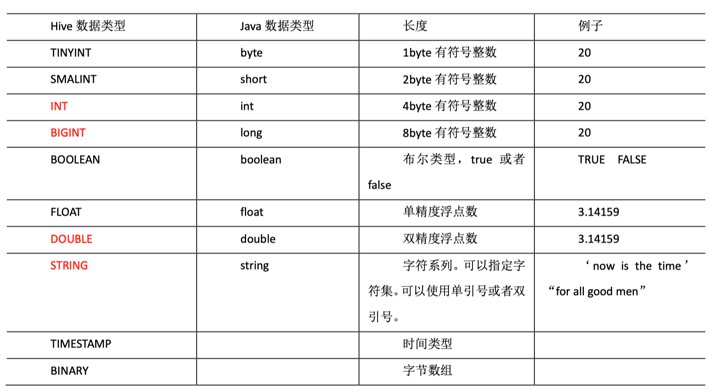
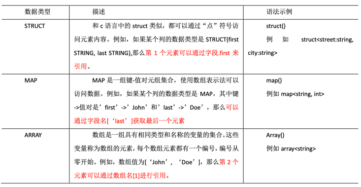

## 基本数据类型



NOTE: Hive的String类型理论上它可以存储2GB的字符数
## 集合数据类型



```shell
create table test(
  name string,
  friends array<string>,
  children map<string, int>,
  address struct<street:string, city:string>
)
row format delimited fields terminated by ','
collection items terminated by '_'
map keys terminated by ':'
lines terminated by '\n';

# 导入数据 load data local inpath 'test.txt' into table test;
```

## 类型转化

Hive的原子数据类型是可以进行隐式转换的，类似于Java的类型转换，例如某表达式使用INT类型，TINYINT会自动转换为INT类型，但是Hive不会进行反向转化，例如，某表达式使用TINYINT类型，INT不会自动转换为TINYINT类型，它会返回错误，除非使用`CAST`操作。 

* 隐式类型转换规则如下
    * 任何整数类型都可以隐式地转换为一个范围更广的类型，如TINYINT可以转换成INT，INT可以转换成BIGINT。
    * 所有整数类型、FLOAT和STRING类型都可以隐式地转换成DOUBLE。
    * TINYINT、SMALLINT、INT都可以转换为FLOAT。
    * BOOLEAN类型不可以转换为任何其它的类型。 
* 可以使用CAST操作显示进行数据类型转换
    例如`CAST('1' AS INT)`将把字符串'1'转换成整数1；如果强制类型转换失败，如执行`CAST('X' AS INT)`，表达式返回空值NULL。