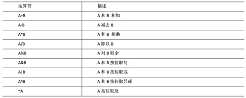
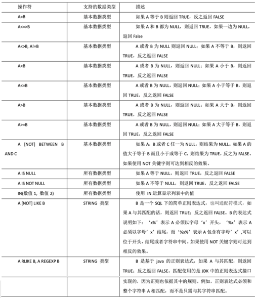
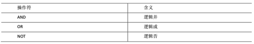

## 查询

查询语句语法

```shell
SELECT [ALL | DISTINCT] select_expr, select_expr, ...
FROM table_reference
[WHERE where_condition]
[GROUP BY col_list]
[ORDER BY col_list]
[CLUSTER BY col_list
  | [DISTRIBUTE BY col_list] [SORT BY col_list]
]
[LIMIT number]
```

注意： 
* SQL语言大小写不敏感。 
* SQL可以写在一行或者多行
* 关键字不能被缩写也不能分行
* 各子句一般要分行写。
* 使用缩进提高语句的可读性。

```shell
create table if not exists dept(
  deptno int,
  dname string,
  loc int
)
row format delimited fields terminated by '\t';
create table if not exists emp(
  empno int,
  ename string,
  job string,
  mgr int,
  hiredate string,
  sal double,
  comm double,
  deptno int
)
row format delimited fields terminated by '\t';
load data local inpath '/opt/module/datas/dept.txt' into table dept;
load data local inpath '/opt/module/datas/emp.txt' into table emp;
# 全表查询
select * from emp;
select empno,ename,job,mgr,hiredate,sal,comm,deptno from emp ;
# 选择特定列查询
select empno, ename from emp;
# 列别名
select ename AS name, deptno dn from emp;
# 算术运算符
select sal +1 from emp;
# 常用函数
select count(*) cnt from emp;
select max(sal) max_sal from emp;
select min(sal) min_sal from emp;
select sum(sal) sum_sal from emp;
select avg(sal) avg_sal from emp;
# Limit 语句
select * from emp limit 5;
# Where 语句
select * from emp where sal >1000;
# 算术运算符
select sal +1 from emp;
# 比较运算符
select * from emp where sal =5000;
select * from emp where sal between 500 and 1000;
select * from emp where comm is null;
select * from emp where sal IN (1500, 5000);
# Like 和 RLike
select * from emp where ename LIKE 'A%';
select * from emp where ename LIKE '_A%';
select * from emp where ename RLIKE '[A]';
# 逻辑运算符
select * from emp where sal>1000 and deptno=30;
select * from emp where sal>1000 or deptno=30;
select * from emp where deptno not IN(30, 20);
# Group By 语句
select t.deptno, avg(t.sal) avg_sal from emp t group by t.deptno;
select t.deptno, t.job, max(t.sal) max_sal from emp t group by t.deptno, t.job;
# Having 语句
select deptno, avg(sal) avg_sal from emp group by deptno having avg_sal > 2000;
```

## 列别名

* 重命名一个列
* 便于计算
* 紧跟列名，也可以在列名和别名之间加入关键字`AS`

## 算术运算符



## 比较运算符（Between/In/Is Null）

这些操作符同样可以用于 JOIN…ON 和 HAVING 语句中。



## Like 和 RLike

* 使用`LIKE`运算选择类似的值
* 选择条件可以包含字符或数字:
    * `%`代表零个或多个字符(任意个字符)。 
    * `_`代表一个字符。 
* `RLIKE`子句
    * `RLIKE`子句是Hive中这个功能的一个扩展，其可以通过Java的正则表达式这个更强大的语言来指定匹配条件。

## 逻辑运算符（And/Or/Not）



注意：`between and`是包头包尾的。

## 分组
### Group By 语句

`GROUP BY`语句通常会和聚合函数一起使用，按照一个或者多个列队结果进行分组，然后对每个组执行聚合操作。

### Having 语句

`having`与`where`不同点
* `where`后面不能写分组函数，而`having`后面可以使用分组函数。 
* `having`只用于`group by`分组统计语句。

## Join 语句

### 等值 Join

Hive 支持通常的 SQL JOIN 语句

**表别名**

* 使用别名可以简化查询。 
* 使用表名前缀可以提高执行效率。

* 内连接：只有进行连接的两个表中都存在与连接条件相匹配的数据才会被保留下来。
* 左外连接：JOIN 操作符左边表中符合 WHERE 子句的所有记录将会被返回。
* 右外连接：JOIN 操作符右边表中符合 WHERE 子句的所有记录将会被返回。
* 满外连接：将会返回所有表中符合 WHERE 语句条件的所有记录。如果任一表的指定字 段没有符合条件的值的话，那么就使用 NULL 值替代。
* 多表连接：连接n个表，至少需要 n-1 个连接条件。例如：连接三个表，至少需要两个连接 条件。

```shell
# 内连接
select e.empno, e.ename, d.deptno, d.dname from emp e join dept d on e.deptno = d.deptno;
# 左外连接
select e.empno, e.ename, d.deptno from emp e left join dept d on e.deptno = d.deptno;
# 右外连接
select e.empno, e.ename, d.deptno from emp e right join dept d on e.deptno = d.deptno;
# 满外连接
select e.empno, e.ename, d.deptno from emp e full join dept d on e.deptno = d.deptno;
# 多表连接
create table if not exists location(
  loc int,
  loc_name string
)
row format delimited fields terminated by '\t';
load data local inpath '/opt/module/datas/location.txt' into table location;
SELECT e.ename, d.dname, l.loc_name FROM emp e JOIN dept d ON d.deptno = e.deptno JOIN location l ON d.loc = l.loc;
# 笛卡尔积
select empno, dname from emp, dept;
```

**多表连接**

大多数情况下，Hive会对每对`JOIN`连接对象启动一个`MapReduce`任务。本例中会首先启动一个MapReduce job对表e和表d进行连接操作，然后会再启动一个MapReduce job将第一个MapReduce job的输出和表l进行连接操作。

注意：为什么不是表d和表l先进行连接操作呢？这是因为Hive总是按照从左到右的顺序执行的。

优化：当对3个或者更多表进行`join`连接时，如果每个`on`子句都使用相同的连接键的话，那么只会产生一个MapReduce job。

**笛卡尔积**

* 省略连接条件
* 连接条件无效
* 所有表中的所有行互相连接

## 排序

* `Order By`：全局排序，只有一个Reducer 
    * `ASC`（ascend）: 升序（默认） 
    * `DESC`（descend）: 降序
* `Sort By`：对于大规模的数据集`order by`的效率非常低。在很多情况下，并不需要全局排序，此时可以使用`sort by`。`Sort by`为每个reducer产生一个排序文件。每个Reducer内部进行排序，对全局结果集来说不是排序。
* `Distribute By`： 在有些情况下，我们需要控制某个特定行应该到哪个reducer，通常是为了进行后续的聚集操作。`distribute by`子句可以做这件事。`distribute by`类似MR中`partition`（自定义分区），进行分区，结合`sort by`使用。
    * `distribute by`的分区规则是根据分区字段的hash码与reducer的个数进行模除后,余数相同的分到一个区。 
    * Hive要求`DISTRIBUTE BY`语句要写在`SORT BY`语句之前。
* `Cluster By`: 当`distribute by`和`sorts by`字段相同时，可以使用`cluster by`方式。
    * `cluster by`除了具有`distribute by`的功能外还兼具`sort by`的功能。但是排序只能是升序排序，不能指定排序规则为`ASC`或者`DESC`。


```shell
# 全局排序（Order By）
select * from emp order by sal;
select * from emp order by sal desc;
select ename, sal*2 twosal from emp order by twosal; # 按照别名排序
select ename, deptno, sal from emp order by deptno, sal;
# 每个Reduce内部排序（Sort By）
set mapreduce.job.reduces=3;
set mapreduce.job.reduces;
select * from emp sort by deptno desc;
insert overwrite local directory '/opt/module/data/sortby-result' select * from emp sort by deptno desc;
# 分区（Distribute By）
set mapreduce.job.reduces=3;
insert overwrite local directory '/opt/module/data/distribute-result' select * from emp distribute by deptno sort by empno desc;
# Cluster By
select * from emp cluster by deptno;
select * from emp distribute by deptno sort by deptno;
```

## 分区表和分桶表

分区表实际上就是对应一个HDFS文件系统上的独立的文件夹，该文件夹下是该分区所有的数据文件。Hive中的分区就是分目录，把一个大的数据集根据业务需要分割成小的数据集。在查询时通过`WHERE`子句中的表达式选择查询所需要的指定的分区，这样的查询效率会提高很多。

把数据直接上传到分区目录上，让分区表和数据产生关联的三种方式:

* 上传数据后修复
* 上传数据后添加分区
* 创建文件夹后load数据到分区

```shell
# 创建分区表
create table dept_partition(
  deptno int, dname string, loc string
)
partitioned by (day string)
row format delimited fields terminated by '\t';
# 加载数据到分区表中
load data local inpath '/opt/module/hive/datas/dept_20200401.log' into table dept_partition partition(day='20200401');
load data local inpath '/opt/module/hive/datas/dept_20200402.log' into table dept_partition partition(day='20200402');
load data local inpath '/opt/module/hive/datas/dept_20200403.log' into table dept_partition partition(day='20200403');
# 查询分区表中数据
select * from dept_partition where day='20200401';
select * from dept_partition where day='20200401'
union
select * from dept_partition where day='20200402'
union
select * from dept_partition where day='20200403';
select * from dept_partition where day='20200401' or day='20200402' or day='20200403';
# 增加分区
alter table dept_partition add partition(day='20200404');
alter table dept_partition add partition(day='20200405') partition(day='20200406');
# 删除分区
alter table dept_partition drop partition(day='20200406');
alter table dept_partition drop partition(day='20200404'), partition(day='20200405');
# 查看分区表有多少分区
show partitions dept_partition;
# 查看分区表结构
desc formatted dept_partition;
# 二级分区表
create table dept_partition2(
  deptno int, dname string, loc string
)
partitioned by (day string, hour string)
row format delimited fields terminated by '\t';
load data local inpath '/opt/module/hive/datas/dept_20200401.log' into table dept_partition2 partition(day='20200401', hour='12');
select * from dept_partition2 where day='20200401' and hour='12';
# 上传数据后修复
msck repair table dept_partition2;
# 上传数据后添加分区
alter table dept_partition2 add partition(day='201709',hour='14');
# 创建文件夹后load数据到分区
load data local inpath '/opt/module/hive/datas/dept_20200401.log' into table dept_partition2 partition(day='20200401',hour='15');
```

### 动态分区调整

关系型数据库中，对分区表`Insert`数据时候，数据库自动会根据分区字段的值，将数据插入到相应的分区中，Hive中也提供了类似的机制，即动态分区(Dynamic Partition)，只不过使用Hive的动态分区，需要进行相应的配置。

```shell
# 开启动态分区功能（默认 true，开启）
set hive.exec.dynamic.partition=true;
# 设置为非严格模式（动态分区的模式，默认`strict`，表示必须指定至少一个分区为静态分区，`nonstrict`模式表示允许所有的分区字段都可以使用动态分区。）
set hive.exec.dynamic.partition.mode=nonstrict
# 在所有执行MR的节点上，最大一共可以创建多少个动态分区。默认1000
set hive.exec.max.dynamic.partitions=1000
# 在每个执行MR的节点上，最大可以创建多少个动态分区。
set hive.exec.max.dynamic.partitions.pernode=100
# 整个MR Job中，最大可以创建多少个HDFS文件。默认100000
set hive.exec.max.created.files=100000
# 当有空分区生成时，是否抛出异常。一般不需要设置。默认false
set hive.error.on.empty.partition=false

create table dept_partition_dy(id int, name string) partitioned by (loc int) 
row format delimited fields terminated by '\t';
insert into table dept_partition_dy partition(loc) select deptno, dname, loc from dept;
show partitions dept_partition;
```

### 分桶表

分区提供一个隔离数据和优化查询的便利方式。不过，并非所有的数据集都可形成合理的分区。对于一张表或者分区，Hive可以进一步组织成桶，也就是更为细粒度的数据范围划分。 

* 分桶是将数据集分解成更容易管理的若干部分的另一个技术。 
* 分区针对的是数据的存储路径；分桶针对的是数据文件。

Hive的分桶采用对分桶字段的值进行哈希，然后除以桶的个数求余的方式决定该条记录存放在哪个桶当中.

注意：

* reduce的个数设置为-1,让Job自行决定需要用多少个reduce或者将reduce的个数设置为大于等于分桶表的桶数
* 从hdfs中load数据到分桶表中，避免本地文件找不到问题
* 不要使用本地模式

```shell
# 创建分桶表
create table stu_buck(id int, name string)
clustered by(id) into 4 buckets
row format delimited fields terminated by '\t';
desc formatted stu_buck;
# 导入数据到分桶表中，load 的方式
load data inpath '/student.txt' into table stu_buck;
# insert 方式将数据导入分桶表
insert into table stu_buck select * from student_insert;
```

### 抽样查询

对于非常大的数据集，有时用户需要使用的是一个具有代表性的查询结果而不是全部结果。
Hive可以通过对表进行抽样来满足这个需求。

语法: `TABLESAMPLE(BUCKET x OUT OF y)`
注意：`x`的值必须小于等于`y`的值

```shell
select * from stu_buck tablesample(bucket 1 out of 4 on id);
```

## 函数

### 系统内置函数

```shell
# 查看系统自带的函数
 show functions
# 显示自带的函数的用法
desc function upper;
# 详细显示自带的函数的用法
desc function extend upper;
# 常用内置函数
# nvl
select comm,nvl(comm, -1) from emp;
# CASE WHEN THEN ELSE END
select
  dept_id,
  sum(case sex when '男' then 1 else 0 end) male_count,
  sum(case sex when '女' then 1 else 0 end) female_count
from emp_sex group by dept_id;
# 行转列
# CONCAT(string A/col, string B/col…)
# CONCAT_WS(separator, str1, str2,...)
# COLLECT_SET(col)
SELECT
  t1.c_b,
  CONCAT_WS("|",collect_set(t1.name))
FROM (
  SELECT
    NAME,
    CONCAT_WS(',',constellation,blood_type) c_b
  FROM person_info
)t1 GROUP BY t1.c_b;
# 列转行
# EXPLODE(col)
# LATERAL VIEW
SELECT movie,category_name FROM movie_info
lateral VIEW explode(split(category,",")) movie_info_tmp AS category_name;
# 窗口函数（开窗函数）
# OVER()
# CURRENT ROW：当前行
# n PRECEDING：往前n行数据 
# n FOLLOWING：往后n行数据 
# UNBOUNDED：起点， 
#   UNBOUNDED PRECEDING表示从前面的起点， UNBOUNDED FOLLOWING表示到后面的终点 
# LAG(col,n,default_val)：往前第n行数据 
# LEAD(col,n, default_val)：往后第n行数据
# NTILE(n)：把有序窗口的行分发到指定数据的组中，各个组有编号，编号从1开始，对于每一行，NTILE返回此行所属的组的编号。注意：n 必须为 int 类型。
# 查询在 2017 年 4 月份购买过的顾客及总人数
select name,count(*) over () from business
where substring(orderdate,1,7) = '2017-04'
group by name;
# 查询顾客的购买明细及月购买总额
select name,orderdate,cost,sum(cost) over(partition by month(orderdate)) from business;
# 将每个顾客的 cost 按照日期进行累加
select name,orderdate,cost,
  sum(cost) over() as sample1,--所有行相加
  sum(cost) over(partition by name) as sample2,--按name分组，组内数据相加
  sum(cost) over(partition by name order by orderdate) as sample3,--按name分组，组内数据累加
  sum(cost) over(partition by name order by orderdate rows between UNBOUNDED PRECEDING and current row ) as sample4 ,--和sample3一样,由起点到当前行的聚合
  sum(cost) over(partition by name order by orderdate rows between 1 RECEDING and current row) as sample5, --当前行和前面一行做聚合
  sum(cost) over(partition by name order by orderdate rows between 1 PRECEDING AND 1 FOLLOWING ) as sample6,--当前行和前边一行及后面一行
  sum(cost) over(partition by name order by orderdate rows between current row and UNBOUNDED FOLLOWING ) as sample7 --当前行及后面所有行
from business;
# 查看顾客上次的购买时间
select name,orderdate,cost,
  lag(orderdate,1,'1900-01-01') over(partition by name order by orderdate ) as time1, 
  lag(orderdate,2) over (partition by name order by orderdate) as time2
from business;
# 查询前 20%时间的订单信息
select * from (
  select name,orderdate,cost, ntile(5) over(order by orderdate) sorted from business
) t where sorted = 1;
# Rank
# RANK() 排序相同时会重复，总数不会变
# DENSE_RANK() 排序相同时会重复，总数会减少
# ROW_NUMBER() 会根据顺序计算
select name, subject, score,
  rank() over(partition by subject order by score desc) rp,
  dense_rank() over(partition by subject order by score desc) drp,
  row_number() over(partition by subject order by score desc) rmp
from score;
```

## 自定义函数

* UDF（User-Defined-Function）: 一进一出 
* UDAF（User-Defined Aggregation Function）: 聚集函数，多进一出, 类似于：`count`/`max`/`min`
* UDTF（User-Defined Table-Generating Functions）: 一进多出 如`lateral view explode()`

```shell
# org.apache.hadoop.hive.ql.udf.generic.GenericUDF
# org.apache.hadoop.hive.ql.udf.generic.GenericUDTF
add jar linux_jar_path
create [temporary] function [dbname.]function_name AS class_name;
drop [temporary] function [if exists] [dbname.]function_name;
```

### 自定义UDF函数

```xml
<dependencies>
    <dependency>
        <groupId>org.apache.hive</groupId>
        <artifactId>hive-exec</artifactId>
        <version>3.1.2</version>
    </dependency>
</dependencies>
```

```java
package com.hive;

import org.apache.hadoop.hive.ql.exec.UDFArgumentException;
import org.apache.hadoop.hive.ql.exec.UDFArgumentLengthException;
import org.apache.hadoop.hive.ql.exec.UDFArgumentTypeException;
import org.apache.hadoop.hive.ql.metadata.HiveException;
import org.apache.hadoop.hive.ql.udf.generic.GenericUDF;
import org.apache.hadoop.hive.serde2.objectinspector.ObjectInspector;
import org.apache.hadoop.hive.serde2.objectinspector.primitive.PrimitiveObjectInspectorFactory;

/**
* 自定义 UDF 函数，需要继承 GenericUDF 类
* 需求: 计算指定字符串的长度
*/
public class MyStringLength extends GenericUDF {

    /**
    * @param arguments 输入参数类型的鉴别器对象
    * @return 返回值类型的鉴别器对象
    * @throws UDFArgumentException
    */
    @Override
    public ObjectInspector initialize(ObjectInspector[] arguments) throws UDFArgumentException {
        // 判断输入参数的个数
        if(arguments.length !=1){
            throw new UDFArgumentLengthException("Input Args Length Error!!!");
        }
        // 判断输入参数的类型
        if(!arguments[0].getCategory().equals(ObjectInspector.Category.PRIMITIVE)){
            throw new UDFArgumentTypeException(0,"Input Args Type Error!!!");
        }
    
        //函数本身返回值为 int，需要返回 int 类型的鉴别器对象
        return PrimitiveObjectInspectorFactory.javaIntObjectInspector;
    }

    /**
     * 函数的逻辑处理
     * @param arguments 输入的参数
     * @return 返回值
     * @throws HiveException
     */
    @Override
    public Object evaluate(DeferredObject[] arguments) throws HiveException {
        if(arguments[0].get() == null){
            return 0;
        }
        return arguments[0].get().toString().length();
    }

    @Override
    public String getDisplayString(String[] children) {
        return "";
    }
}
```

```shell
# 将jar包添加到hive的classpath
add jar /opt/module/data/myudf.jar;
# 创建临时函数与开发好的java class关联
create temporary function my_len as "com.atguigu.hive.MyStringLength";
# 可在 hql 中使用自定义的函数
select ename,my_len(ename) ename_len from emp;
```

### 自定义UDTF函数

```java
package com.udtf;

import org.apache.hadoop.hive.ql.exec.UDFArgumentException;
import org.apache.hadoop.hive.ql.metadata.HiveException;
import org.apache.hadoop.hive.ql.udf.generic.GenericUDTF;
import org.apache.hadoop.hive.serde2.objectinspector.ObjectInspector;
import org.apache.hadoop.hive.serde2.objectinspector.ObjectInspectorFactory;
import org.apache.hadoop.hive.serde2.objectinspector.StructObjectInspector;
import org.apache.hadoop.hive.serde2.objectinspector.primitive.PrimitiveObjectInspectorFactory;

import java.util.ArrayList;
import java.util.List;

public class MyUDTF extends GenericUDTF {
    
    private ArrayList<String> outList = new ArrayList<>();
    
    @Override
    public StructObjectInspector initialize(StructObjectInspector argOIs) throws UDFArgumentException {
        
        //1.定义输出数据的列名和类型
        List<String> fieldNames = new ArrayList<>();
        List<ObjectInspector> fieldOIs = new ArrayList<>();
        //2.添加输出数据的列名和类型
        fieldNames.add("lineToWord");
        fieldOIs.add(PrimitiveObjectInspectorFactory.javaStringObjectInspector);
        return ObjectInspectorFactory.getStandardStructObjectInspector(fieldNames, fieldOIs);
    }
    
    @Override
    public void process(Object[] args) throws HiveException {
        //1.获取原始数据
        String arg = args[0].toString();
        //2.获取数据传入的第二个参数，此处为分隔符
        String splitKey = args[1].toString();
        //3.将原始数据按照传入的分隔符进行切分
        String[] fields = arg.split(splitKey);
        //4.遍历切分后的结果，并写出
        for (String field : fields) {
            //集合为复用的，首先清空集合
            outList.clear();
            //将每一个单词添加至集合
            outList.add(field);
            //将集合内容写出
            forward(outList);
        }
    }

    @Override
    public void close() throws HiveException { }
}
```

```shell
# 将 jar 包添加到 hive 的 classpath 下
add jar /opt/module/hive/data/myudtf.jar;
# 创建临时函数与开发好的 java class 关联
create temporary function myudtf as "com.atguigu.hive.MyUDTF";
# 使用自定义的函数
select myudtf("hello,world,hadoop,hive",",");
```


