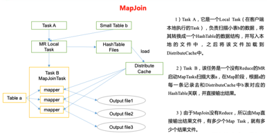

## 调优

### 执行计划（Explain）

```shell
EXPLAIN [EXTENDED | DEPENDENCY | AUTHORIZATION] query
```

```shell
# 没有生成MR任务的
explain select * from emp;
Explain
STAGE DEPENDENCIES:
  Stage-0 is a root stage
STAGE PLANS:
  Stage: Stage-0
    Fetch Operator
      limit: -1
      Processor Tree:
        TableScan
          alias: emp
          Statistics: Num rows: 1 Data size: 7020 Basic stats: COMPLETE Column stats: NONE
          Select Operator
            expressions: empno (type: int), ename (type: string), job (type: string), mgr (type: int), hiredate (type: string), sal (type: double), comm (type: double), deptno (type: int)
            outputColumnNames: _col0, _col1, _col2, _col3, _col4, _col5, _col6, _col7
            Statistics: Num rows: 1 Data size: 7020 Basic stats: COMPLETE Column stats: NONE
            ListSink
# 有生成 MR 任务的
explain select deptno, avg(sal) avg_sal from emp group by deptno;
Explain
STAGE DEPENDENCIES:
  Stage-1 is a root stage
  Stage-0 depends on stages: Stage-1
STAGE PLANS:
  Stage: Stage-1
    Map Reduce
      Map Operator Tree:
        TableScan
          alias: emp
          Statistics: Num rows: 1 Data size: 7020 Basic stats: COMPLETE Column stats: NONE
          Select Operator
            expressions: sal (type: double), deptno (type: int)
            outputColumnNames: sal, deptno
            Statistics: Num rows: 1 Data size: 7020 Basic stats: COMPLETE Column stats: NONE
            Group By Operator
              aggregations: sum(sal), count(sal)
              keys: deptno (type: int)
              mode: hash
              outputColumnNames: _col0, _col1, _col2
              Statistics: Num rows: 1 Data size: 7020 Basic stats: COMPLETE Column stats: NONE
        Reduce Output Operator
            key expressions: _col0 (type: int)
            sort order: +
            Map-reduce partition columns: _col0 (type: int)
            Statistics: Num rows: 1 Data size: 7020 Basic stats: COMPLETE Column stats: NONE
            value expressions: _col1 (type: double), _col2 (type: bigint)
      Execution mode: vectorized
      Reduce Operator Tree:
          Group By Operator
              aggregations: sum(VALUE._col0), count(VALUE._col1)
              keys: KEY._col0 (type: int)
              mode: mergepartial
              outputColumnNames: _col0, _col1, _col2
              Statistics: Num rows: 1 Data size: 7020 Basic stats: COMPLETE Column stats: NONE
              Select Operator
                  expressions: _col0 (type: int), (_col1 / _col2) (type: double)
                  outputColumnNames: _col0, _col1
                  Statistics: Num rows: 1 Data size: 7020 Basic stats: COMPLETE Column stats: NONE
                  File Output Operator
                      compressed: false
                      Statistics: Num rows: 1 Data size: 7020 Basic stats: COMPLETE Column stats: NONE
                      table:
                          input format:org.apache.hadoop.mapred.SequenceFileInputFormat
                          output format:org.apache.hadoop.hive.ql.io.HiveSequenceFileOutputFormat
                          serde: org.apache.hadoop.hive.serde2.lazy.LazySimpleSerDe
    Stage: Stage-0
        Fetch Operator
            limit: -1
            Processor Tree:
              ListSin
# 查看详细执行计划
explain extended select * from emp;
explain extended select deptno, avg(sal) avg_sal from emp group by deptno;
```

### Fetch 抓取

Fetch抓取是指Hive中对某些情况的查询可以不必使用MapReduce计算。例如：`SELECT * FROM employees;`在这种情况下，Hive可以简单地读取employee对应的存储目录下的文件， 然后输出查询结果到控制台。

在`hive-default.xml.template`文件中`hive.fetch.task.conversion`默认是`more`，老版本`hive`默认是`minimal`，该属性修改为`more`以后，在全局查找、字段查找、limit查找等都不走mapreduce。

```xml
<property>
    <name>hive.fetch.task.conversion</name>
    <value>more</value>
    <description>
        Expects one of [none, minimal, more].
        Some select queries can be converted to single FETCH task minimizing latency.
        Currently the query should be single sourced not having any subquery and should not have any aggregations or distincts (which incurs RS),
        lateral views and joins.
        0. none : disable hive.fetch.task.conversion
        1. minimal : SELECT STAR, FILTER on partition columns, LIMIT only
        2. more : SELECT, FILTER, LIMIT only (support TABLESAMPLE and virtual columns)
    </description>
</property>
```

```shell
# 把hive.fetch.task.conversion设置成none，然后执行查询语句，都会执行mapreduce程序。
set hive.fetch.task.conversion=none;
select * from emp;
select ename from emp;
select ename from emp limit 3;
# 把hive.fetch.task.conversion设置成more，然后执行查询语句，如下查询方式都不会执行mapreduce程序。
set hive.fetch.task.conversion=more;
select * from emp;
select ename from emp;
select ename from emp limit 3;
```

### 本地模式

大多数的Hadoop Job是需要Hadoop提供的完整的可扩展性来处理大数据集的。不过， 有时Hive的输入数据量是非常小的。在这种情况下，为查询触发执行任务消耗的时间可能会比实际job的执行时间要多的多。对于大多数这种情况，Hive可以通过本地模式在单台机器上处理所有的任务。对于小数据集，执行时间可以明显被缩短。

用户可以通过设置`hive.exec.mode.local.auto`的值为`true`，来让Hive在适当的时候自动启动这个优化。

```shell
# 开启本地mr
set hive.exec.mode.local.auto=true;
# 设置local mr的最大输入数据量，当输入数据量小于这个值时采用local mr的方式，默认为134217728，即128M
set hive.exec.mode.local.auto.inputbytes.max=50000000;
# 设置local mr的最大输入文件个数，当输入文件个数小于这个值时采用local mr的方式，默认为 4
set hive.exec.mode.local.auto.input.files.max=10;
```

### 表的优化

#### 小表大表 Join（MapJOIN）

将key相对分散，并且数据量小的表放在join的左边，可以使用`map join`让小的维度表先进内存。在map端完成join。 

实际测试发现：新版的hive已经对小表JOIN大表和大表JOIN小表进行了优化。小表放在左边和右边已经没有区别。

```shell
# 设置自动选择 Mapjoin
set hive.auto.convert.join = true; # 默认为 true
# 大表小表的阈值设置（默认 25M 以下认为是小表）
set hive.mapjoin.smalltable.filesize = 25000000;
```



#### 大表 Join 大表

* 空KEY过滤  
  有时join超时是因为某些key对应的数据太多，而相同key对应的数据都会发送到相同的reducer上，从而导致内存不够。此时我们应该仔细分析这些异常的key，很多情况下， 这些key对应的数据是异常数据，我们需要在SQL语句中进行过滤。例如key对应的字段为空
  
* 空key转换  
  有时虽然某个key为空对应的数据很多，但是相应的数据不是异常数据，必须要包含在join的结果中，此时我们可以表a中key为空的字段赋一个随机的值，使得数据随机均匀地分布到不同的reducer上。

* SMB(Sort Merge Bucket join)
    ```shell
    set hive.optimize.bucketmapjoin = true;
    set hive.optimize.bucketmapjoin.sortedmerge = true;
    set hive.input.format=org.apache.hadoop.hive.ql.io.BucketizedHiveInputFormat;
    ```

#### Group By

默认情况下，Map阶段同一Key数据分发给一个reduce，当一个key数据过大时就倾斜了。

并不是所有的聚合操作都需要在Reduce端完成，很多聚合操作都可以先在Map端进行部分聚合，最后在Reduce端得出最终结果。

```shell
# 开启Map端聚合参数设置
# 是否在Map端进行聚合，默认为True
set hive.map.aggr = true
# 在Map端进行聚合操作的条目数目
set hive.groupby.mapaggr.checkinterval = 100000
# 有数据倾斜的时候进行负载均衡（默认是 false）
set hive.groupby.skewindata = true
```

当选项设定为true，生成的查询计划会有两个MRJob。第一个MR Job中，Map的输出结果会随机分布到Reduce中，每个Reduce做部分聚合操作，并输出结果，这样处理的结果是相同的Group By Key有可能被分发到不同的Reduce中，从而达到负载均衡的目的；第二个MR Job再根据预处理的数据结果按照Group By Key分布到Reduce中（这个过程可以保证相同的Group By Key被分布到同一个Reduce中），最后完成最终的聚合操作。

#### Count(Distinct)去重统计

数据量小的时候无所谓，数据量大的情况下 ，由于`COUNT DISTINCT`操作需要用一个Reduce Task来完成，这一个Reduce需要处理的数据量太大，就会导致整个Job很难完成， 一般`COUNT DISTINCT`使用先`GROUP BY`再`COUNT`的方式替换,但是需要注意`group by`造成的数据倾斜问题.

#### 笛卡尔积

尽量避免笛卡尔积，join的时候不加on条件，或者无效的on条件，Hive只能使用1个reducer来完成笛卡尔积。

#### 行列过滤

列处理：在`SELECT`中，只拿需要的列，如果有分区，尽量使用分区过滤，少用`SELECT *`。
行处理：在分区剪裁中，当使用外关联时，如果将副表的过滤条件写在`Where`后面， 那么就会先全表关联，之后再过滤，

#### 分区
#### 分桶

### 合理设置Map及Reduce数

* 通常情况下，作业会通过input的目录产生一个或者多个map任务。  
  主要的决定因素有: input的文件总个数，input的文件大小，集群设置的文件块大小。
* 是不是map数越多越好？  
  答案是否定的。如果一个任务有很多小文件（远远小于块大小128m），则每个小文件也会被当做一个块，用一个map任务来完成，而一个map任务启动和初始化的时间远远大于逻辑处理的时间，就会造成很大的资源浪费。而且，同时可执行的map数是受限的。 
* 是不是保证每个map处理接近128m的文件块，就高枕无忧了？  
  答案也是不一定。比如有一个127m的文件，正常会用一个map去完成，但这个文件只有一个或者两个小字段，却有几千万的记录，如果map处理的逻辑比较复杂，用一个map任务去做，肯定也比较耗时。

针对上面的问题，我们需要采取两种方式来解决：即减少map数和增加map数；

#### 复杂文件增加Map数

当input的文件都很大，任务逻辑复杂，map执行非常慢的时候，可以考虑增加Map数，来使得每个map处理的数据量减少，从而提高任务的执行效率。 

增加map的方法为：根据`computeSliteSize(Math.max(minSize,Math.min(maxSize,blocksize)))=blocksize=128M`公式， 调整`maxSize`最大值。让`maxSize`最大值低于`blocksize`就可以增加`map`的个数。

```shell
set mapreduce.input.fileinputformat.split.maxsize=100;
```

#### 小文件进行合并

在map执行前合并小文件，减少map数：CombineHiveInputFormat具有对小文件进行合并的功能（系统默认的格式）`HiveInputFormat` 没有对小文件合并功能。

```shell
set hive.input.format=org.apache.hadoop.hive.ql.io.CombineHiveInputFormat;
# 在 Map-Reduce 的任务结束时合并小文件的设置
# 在 map-only 任务结束时合并小文件，默认 true
SET hive.merge.mapfiles = true;
# 在 map-reduce 任务结束时合并小文件，默认 false
SET hive.merge.mapredfiles = true;
# 合并文件的大小，默认 256M
SET hive.merge.size.per.task = 268435456;
# 当输出文件的平均大小小于该值时，启动一个独立的 map-reduce 任务进行文件 merge
SET hive.merge.smallfiles.avgsize = 16777216;
```

#### 合理设置Reduce数

```shell
# 调整 reduce 个数方法一
# 每个 Reduce 处理的数据量默认是 256MB
set hive.exec.reducers.bytes.per.reducer=256000000
# 每个任务最大的 reduce 数，默认为 1009
set hive.exec.reducers.max=1009
# 计算 reducer 数的公式
N=min(hive.exec.reducers.max, 总输入数据量/hive.exec.reducers.bytes.per.reducer)
# 调整 reduce 个数方法二
# 在hadoop的mapred-default.xml文件中修改,设置每个job的Reduce个数
set mapreduce.job.reduces = 15;
```

reduce 个数并不是越多越好
* 过多的启动和初始化reduce也会消耗时间和资源； 
* 另外，有多少个reduce，就会有多少个输出文件，如果生成了很多个小文件，那么如果这些小文件作为下一个任务的输入，则也会出现小文件过多的问题； 
  
在设置reduce个数的时候也需要考虑这两个原则：

* 处理大数据量利用合适的reduce数； 
* 使单个reduce任务处理数据量大小要合适；


### 并行执行

Hive会将一个查询转化成一个或者多个阶段。这样的阶段可以是MapReduce阶段、抽样阶段、合并阶段、limit阶段。或者Hive执行过程中可能需要的其他阶段。默认情况下，Hive一次只会执行一个阶段。不过，某个特定的job可能包含众多的阶段，而这些阶段可能并非完全互相依赖的，也就是说有些阶段是可以并行执行的，这样可能使得整个job的执行时间缩短。不过，如果有更多的阶段可以并行执行，那么job可能就越快完成。

通过设置参数`hive.exec.parallel`值为`true`，就可以开启并发执行。不过，在共享集群中， 需要注意下，如果job中并行阶段增多，那么集群利用率就会增加。

```shell
# 打开任务并行执行
set hive.exec.parallel=true;
# 同一个 sql 允许最大并行度，默认为8。
set hive.exec.parallel.thread.number=16;
```

当然，得是在系统资源比较空闲的时候才有优势，否则，没资源，并行也起不来。

### 严格模式

Hive可以通过设置防止一些危险操作：

* 分区表不使用分区过滤  
  将`hive.strict.checks.no.partition.filter`设置为`true`时，对于分区表，除非`where`语句中含有分区字段过滤条件来限制范围，否则不允许执行。换句话说，就是用户不允许扫描所有分区。进行这个限制的原因是，通常分区表都拥有非常大的数据集，而且数据增加迅速。没有进行分区限制的查询可能会消耗令人不可接受的巨大资源来处理这个表。
  
* 使用`order by`没有`limit`过滤  
  将`hive.strict.checks.orderby.no.limit`设置为`true`时，对于使用了`order by`语句的查询，要求必须使用`limit`语句。因为`order by`为了执行排序过程会将所有的结果数据分发到同一个`Reducer`中进行处理，强制要求用户增加这个`LIMIT`语句可以防止`Reducer`额外执行很长一段时间。
  
* 笛卡尔  
  将`hive.strict.checks.cartesian.product`设置为`true`时，会限制笛卡尔积的查询。对关系型数据库非常了解的用户可能期望在执行`JOIN`查询的时候不使用`ON`语句而是使用`where`语句，这样关系数据库的执行优化器就可以高效地将`WHERE`语句转化成那个`ON`语句。不幸的是，Hive并不会执行这种优化，因此，如果表足够大，那么这个查询就会出现不可控的情况。

### JVM 重用


### 压缩


