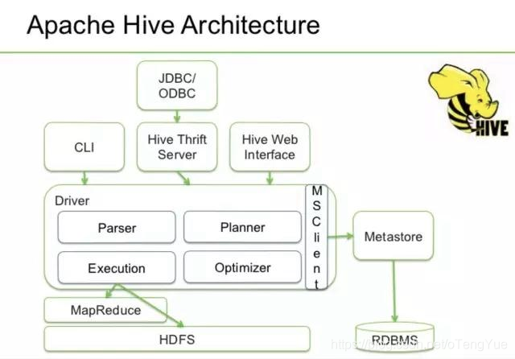
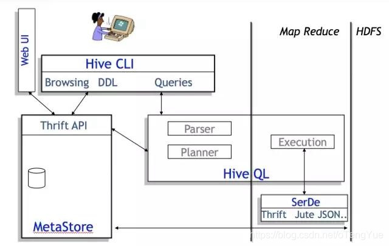
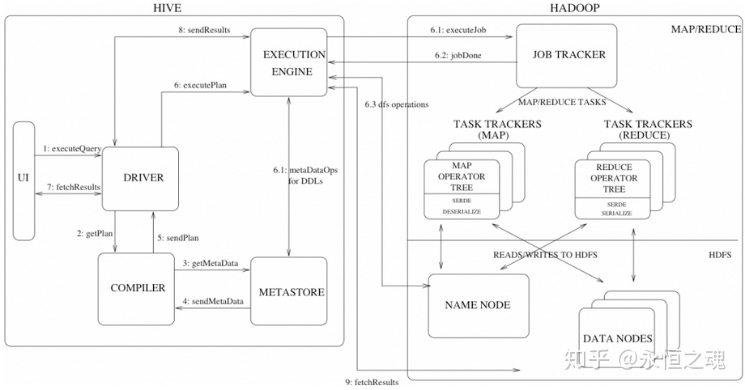
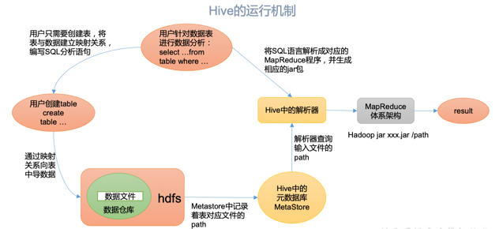
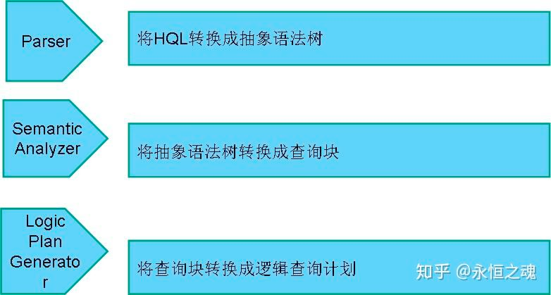
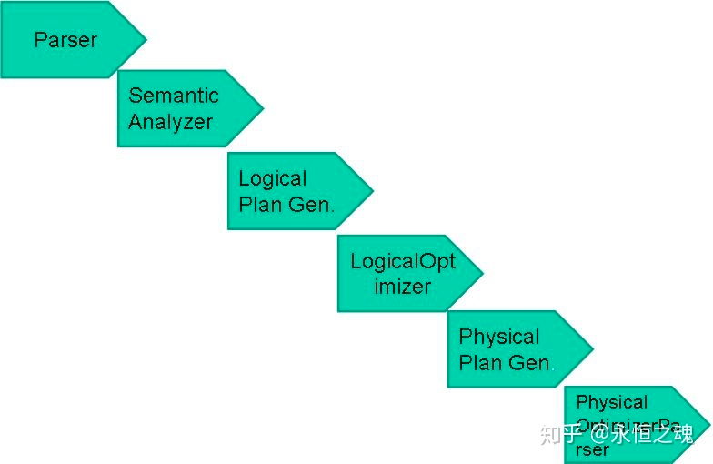
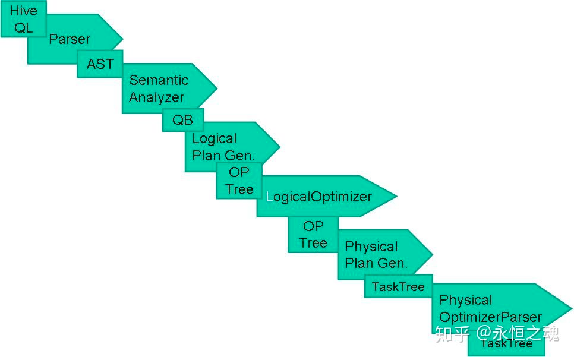
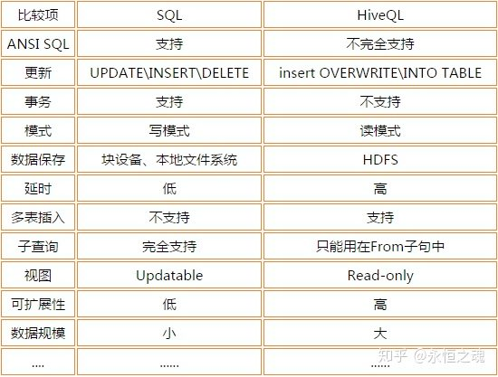

## Hive

由Facebook开源用于解决海量结构化日志的数据统计工具。
Hive是基于Hadoop的一个数据仓库工具，可以将结构化的数据文件映射为一张表，并提供类SQL(HQL)查询功能。

*Hive本质*：将HQL转化成MapReduce程序，当我们在控制台输入一个HQL(类似sql),接下来hive处理转换成MAPREDUCE,然后提交到HADOOP运行计算，最后将结果返回到控制台。

Hadoop和Hive都是用UTF-8编码的

从Facebook的图上可以看出，Hive主要有QL、MetaStore和Serde三大核心组件构成。

* QL就是编译器，也是Hive中最核心的部分。 
* Serde就是Serializer和Deserializer的缩写，用于序列化和反序列化数据，即读写数据。
* MetaStore对外暴露Thrift API，用于元数据的修改。比如表的增删改查，分区的增删改查，表的属性的修改，分区的属性的修改等。

## Hive常见的应用场景

* 日志分析：大部分互联网公司使用hive进行日志分析，包括百度、淘宝等。
    * 统计网站一个时间段内的pv、uv
    * 多维度数据分析
* 海量结构化数据离线分析

## Hive的特点（优缺点）

* hive的优点
    * 简单容易上手：提供了类SQL查询语言HQL
    * 可扩展：为超大数据集设计了计算/扩展能力（MR作为计算引擎，HDFS作为存储系统），一般情况下不需要重启服务Hive可以自由的扩展集群的规模。
    * 提供统一的元数据管理
    * 延展性：Hive支持用户自定义函数，用户可以根据自己的需求来实现自己的函数
    * 容错：良好的容错性，节点出现问题SQL仍可完成执行

* hive的缺点（局限性）
    * hive的HQL表达能力有限
        * 迭代式算法无法表达，比如pagerank
        * 数据挖掘方面，比如kmeans，由于MapReduce数据处理流程的限制，效率更高的算法却无法实现。
    * hive的效率比较低
        * hive自动生成的mapreduce作业，通常情况下不够智能化
        * hive调优比较困难，粒度较粗
        * hive可控性差
    

* 用户接口
  
  Client CLI（command-line interface）、JDBC/ODBC( jdbc 访问 hive)、WEBUI（浏览器访问 hive）
* 元数据
  
  Metastore 元数据包括：表名、表所属的数据库（默认是default）、表的拥有者、列/分区字段、 表的类型（是否是外部表）、表的数据所在目录等； 
  默认存储在自带的derby数据库中，推荐使用MySQL存储Metastore

* Hadoop
  
  使用HDFS进行存储，使用MapReduce进行计算。 
  
* 驱动器(Driver)
    * 解析器（SQL Parser）: 将SQL字符串转换成抽象语法树AST，这一步一般都用第三方工具库完成，比如antlr； 对AST进行语法分析，比如表是否存在、字段是否存在、SQL语义是否有误。 
    * 编译器（Physical Plan）: 将AST编译生成逻辑执行计划。
    * 优化器（Query Optimizer）: 对逻辑执行计划进行优化。
    * 执行器（Execution）: 把逻辑执行计划转换成可以运行的物理计划。对于Hive来说，就是MR/Spark。
    

## Hive编译器的组成

## Hive和数据库的异同

由于Hive采用了SQL的查询语言HQL，因此很容易将Hive理解为数据库。其实从结构上来看，Hive和数据库除了拥有类似的查询语言，再无类似之处。数据库可以用在Online的应用中，但是Hive是为数据仓库而设计的，清楚这一点，有助于从应用角度理解Hive的特性。

### 查询语言

由于SQL被广泛的应用在数据仓库中，因此，专门针对Hive的特性设计了类SQL的查询语言HQL。
熟悉SQL开发的开发者可以很方便的使用Hive进行开发。

### 数据更新

由于Hive是针对数据仓库应用设计的，而**数据仓库的内容是读多写少的**。因此，**Hive中不建议对数据的改写，所有的数据都是在加载的时候确定好的**。而数据库中的数据通常是需要经常进行修改的，因此可以使用`INSERT INTO … VALUES`添加数据，使用`UPDATE … SET`修改数据。

### 执行延迟

Hive在查询数据的时候，由于没有索引，需要扫描整个表，因此延迟较高。另外一个导致Hive执行延迟高的因素是MapReduce框架。由于MapReduce本身具有较高的延迟，因此在利用MapReduce执行Hive查询时，也会有较高的延迟。相对的，数据库的执行延迟较低。 当然，这个低是有条件的，即数据规模较小，当数据规模大到超过数据库的处理能力的时候，Hive的并行计算显然能体现出优势。

### 数据规模

由于Hive建立在集群上并可以利用MapReduce进行并行计算，因此可以支持很大规模的数据；对应的，数据库可以支持的数据规模较小。

