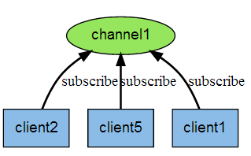
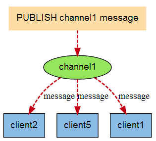
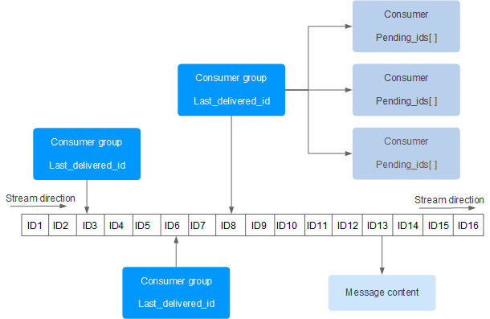

## 客户端连接Redis

```
# 本地redis
redis-cli
# 避免中文乱码
redis-cli --raw
# 远程redis
redis-cli -h host -p port -a password
```

## Redis 键（Key）

Redis 键命令用于管理 redis 的键。

Redis 键命令的基本语法如下：
```
redis 127.0.0.1:6379> COMMAND KEY_NAME
```

* `DEL key`: 该命令用于在 key 存在时删除 key。
* `DUMP key`: 序列化给定 key ，并返回被序列化的值。
* `EXISTS key`: 检查给定 key 是否存在。
* `EXPIRE key seconds`: 为给定 key 设置过期时间，以秒计。
* `EXPIREAT key timestamp`: EXPIREAT 的作用和 EXPIRE 类似，都用于为 key 设置过期时间。 不同在于 EXPIREAT 命令接受的时间参数是 UNIX 时间戳(unix timestamp)。
* `PEXPIRE key milliseconds`: 设置 key 的过期时间以毫秒计。
* `PEXPIREAT key milliseconds-timestamp`: 设置 key 过期时间的时间戳(unix timestamp) 以毫秒计
* `KEYS pattern`: 查找所有符合给定模式( pattern)的 key 。
* `MOVE key db`: 将当前数据库的 key 移动到给定的数据库 db 当中。
* `PERSIST key`: 移除key的过期时间，key 将持久保持。
* `PTTL key`: 以毫秒为单位返回 key 的剩余的过期时间。
* `TTL key`: 以秒为单位，返回给定 key 的剩余生存时间(TTL, time to live)。
* `RANDOMKEY`: 从当前数据库中随机返回一个 key 。
* `RENAME key newkey`: 修改 key 的名称
* `RENAMENX key newkey`: 仅当 newkey 不存在时，将 key 改名为 newkey 。
* `SCAN cursor [MATCH pattern] [COUNT count]`: 迭代数据库中的数据库键。
* `TYPE key`: 返回 key 所储存的值的类型。

## Redis 字符串(String)

Redis 字符串数据类型的相关命令用于管理 redis 字符串值

Redis 字符串数据类型的相关命令的基本语法如下：

```
redis 127.0.0.1:6379> COMMAND KEY_NAME
```

* `SET key value`: 设置指定 key 的值。
* `GET key`: 获取指定 key 的值。
* `GETRANGE key start end`: 返回 key 中字符串值的子字符
* `GETSET key value`: 将给定 key 的值设为 value ，并返回 key 的旧值(old value)。
* `GETBIT key offset`: 对 key 所储存的字符串值，获取指定偏移量上的位(bit)。
* `MGET key1 [key2..]`: 获取所有(一个或多个)给定 key 的值。
* `SETBIT key offset value`: 对 key 所储存的字符串值，设置或清除指定偏移量上的位(bit)。
* `SETEX key seconds value`: 将值 value 关联到 key ，并将 key 的过期时间设为 seconds (以秒为单位)。
* `SETNX key value`: 只有在 key 不存在时设置 key 的值。
* `SETRANGE key offset value`: 用 value 参数覆写给定 key 所储存的字符串值，从偏移量 offset 开始。
* `STRLEN key`: 返回 key 所储存的字符串值的长度。
* `MSET key value [key value ...]`: 同时设置一个或多个 key-value 对。
* `MSETNX key value [key value ...]`: 同时设置一个或多个 key-value 对，当且仅当所有给定 key 都不存在。
* `PSETEX key milliseconds value`: 这个命令和 SETEX 命令相似，但它以毫秒为单位设置 key 的生存时间，而不是像 SETEX 命令那样，以秒为单位。
* `INCR key`: 将 key 中储存的数字值增一。
* `INCRBY key increment`: 将 key 所储存的值加上给定的增量值（increment） 。
* `INCRBYFLOAT key increment`: 将 key 所储存的值加上给定的浮点增量值（increment） 。
* `DECR key`: 将 key 中储存的数字值减一。
* `DECRBY key decrement`: key 所储存的值减去给定的减量值（decrement） 。
* `APPEND key value`: 如果 key 已经存在并且是一个字符串， APPEND 命令将指定的 value 追加到该 key 原来值（value）的末尾

## Redis 哈希(Hash)

Redis hash 是一个 string 类型的 field（字段） 和 value（值） 的映射表，hash 特别适合用于存储对象。

Redis 中每个 hash 可以存储 2^32 - 1 键值对（40多亿）。

* `HDEL key field1 [field2]`: 删除一个或多个哈希表字段
* `HEXISTS key field`: 查看哈希表 key 中，指定的字段是否存在。
* `HGET key field`: 获取存储在哈希表中指定字段的值。
* `HGETALL key`: 获取在哈希表中指定 key 的所有字段和值
* `HINCRBY key field increment`: 为哈希表 key 中的指定字段的整数值加上增量 increment 。
* `HINCRBYFLOAT key field increment`: 为哈希表 key 中的指定字段的浮点数值加上增量 increment 。
* `HKEYS key`: 获取所有哈希表中的字段
* `HLEN key`: 获取哈希表中字段的数量
* `HMGET key field1 [field2]`: 获取所有给定字段的值
* `HMSET key field1 value1 [field2 value2 ]`: 同时将多个 field-value (域-值)对设置到哈希表 key 中。
* `HSET key field value`: 将哈希表 key 中的字段 field 的值设为 value 。
* `HSETNX key field value`: 只有在字段 field 不存在时，设置哈希表字段的值。
* `HVALS key`: 获取哈希表中所有值。
* `HSCAN key cursor [MATCH pattern] [COUNT count]`: 迭代哈希表中的键值对。

## Redis 列表(List)

Redis列表是简单的字符串列表，按照插入顺序排序。你可以添加一个元素到列表的头部（左边）或者尾部（右边）

一个列表最多可以包含 2^32 - 1 个元素 (4294967295, 每个列表超过40亿个元素)。

* `BLPOP key1 [key2 ] timeout`: 移出并获取列表的第一个元素， 如果列表没有元素会阻塞列表直到等待超时或发现可弹出元素为止。
* `BRPOP key1 [key2 ] timeout`: 移出并获取列表的最后一个元素， 如果列表没有元素会阻塞列表直到等待超时或发现可弹出元素为止。
* `BRPOPLPUSH source destination timeout`: 从列表中弹出一个值，将弹出的元素插入到另外一个列表中并返回它； 如果列表没有元素会阻塞列表直到等待超时或发现可弹出元素为止。
* `LINDEX key index`: 通过索引获取列表中的元素
* `LINSERT key BEFORE|AFTER pivot value`: 在列表的元素前或者后插入元素
* `LLEN key`: 获取列表长度
* `LPOP key`: 移出并获取列表的第一个元素
* `LPUSH key value1 [value2]`: 将一个或多个值插入到列表头部
* `LPUSHX key value`: 将一个值插入到已存在的列表头部
* `LRANGE key start stop`: 获取列表指定范围内的元素
* `LREM key count value`: 移除列表元素
* `LSET key index value`: 通过索引设置列表元素的值
* `LTRIM key start stop`: 对一个列表进行修剪(trim)，就是说，让列表只保留指定区间内的元素，不在指定区间之内的元素都将被删除。
* `RPOP key`: 移除列表的最后一个元素，返回值为移除的元素。
* `RPOPLPUSH source destination`: 移除列表的最后一个元素，并将该元素添加到另一个列表并返回
* `RPUSH key value1 [value2]`: 在列表中添加一个或多个值
* `RPUSHX key value`: 为已存在的列表添加值

## Redis 集合(Set)

Redis 的 Set 是 String 类型的无序集合。集合成员是唯一的，这就意味着集合中不能出现重复的数据。

集合对象的编码可以是 `intset` 或者 `hashtable`。

Redis 中集合是通过哈希表实现的，所以添加，删除，查找的复杂度都是 O(1)。

集合中最大的成员数为 2^32 - 1 (4294967295, 每个集合可存储40多亿个成员)。


* `SADD key member1 [member2]`: 向集合添加一个或多个成员
* `SCARD key`: 获取集合的成员数
* `SDIFF key1 [key2]`: 返回第一个集合与其他集合之间的差异。
* `SDIFFSTORE destination key1 [key2]`: 返回给定所有集合的差集并存储在 destination 中
* `SINTER key1 [key2]`: 返回给定所有集合的交集
* `SINTERSTORE destination key1 [key2]`: 返回给定所有集合的交集并存储在 destination 中
* `SISMEMBER key member`: 判断 member 元素是否是集合 key 的成员
* `SMEMBERS key`: 返回集合中的所有成员
* `SMOVE source destination member`: 将 member 元素从 source 集合移动到 destination 集合
* `SPOP key`: 移除并返回集合中的一个随机元素
* `SRANDMEMBER key [count]`: 返回集合中一个或多个随机数
* `SREM key member1 [member2]`: 移除集合中一个或多个成员
* `SUNION key1 [key2]`: 返回所有给定集合的并集
* `SUNIONSTORE destination key1 [key2]`: 所有给定集合的并集存储在 destination 集合中
* `SSCAN key cursor [MATCH pattern] [COUNT count]`: 迭代集合中的元素

## Redis 有序集合(sorted set)

Redis 有序集合和集合一样也是 string 类型元素的集合,且不允许重复的成员。

不同的是每个元素都会关联一个 double 类型的分数。redis 正是通过分数来为集合中的成员进行从小到大的排序。

有序集合的成员是唯一的,但分数(score)却可以重复。

集合是通过哈希表实现的，所以添加，删除，查找的复杂度都是 O(1)。 集合中最大的成员数为 2^32 - 1 (4294967295, 每个集合可存储40多亿个成员)。

当items内容大于64的时候同时使用了hash和skiplist两种设计实现。这也会为了排序和查找性能做的优化。所以如上可知：

* 添加和删除都需要修改skiplist，所以复杂度为O(log(n))。
* 但是如果仅仅是查找元素的话可以直接使用hash，其复杂度为O(1)
* 其他的range操作复杂度一般为O(log(n))

如果是小于64的时候，因为是采用了ziplist的设计，其时间复杂度为O(n)


* `ZADD key score1 member1 [score2 member2]`: 向有序集合添加一个或多个成员，或者更新已存在成员的分数
* `ZCARD key`: 获取有序集合的成员数
* `ZCOUNT key min max`: 计算在有序集合中指定区间分数的成员数
* `ZINCRBY key increment member`: 有序集合中对指定成员的分数加上增量 increment
* `ZINTERSTORE destination numkeys key [key ...]`: 计算给定的一个或多个有序集的交集并将结果集存储在新的有序集合 destination 中
* `ZLEXCOUNT key min max`: 在有序集合中计算指定字典区间内成员数量
* `ZRANGE key start stop [WITHSCORES]`: 通过索引区间返回有序集合指定区间内的成员
* `ZRANGEBYLEX key min max [LIMIT offset count]`: 通过字典区间返回有序集合的成员
* `ZRANGEBYSCORE key min max [WITHSCORES] [LIMIT]`: 通过分数返回有序集合指定区间内的成员
* `ZRANK key member`: 返回有序集合中指定成员的索引
* `ZREM key member [member ...]`: 移除有序集合中的一个或多个成员
* `ZREMRANGEBYLEX key min max`: 移除有序集合中给定的字典区间的所有成员
* `ZREMRANGEBYRANK key start stop`: 移除有序集合中给定的排名区间的所有成员
* `ZREMRANGEBYSCORE key min max`: 移除有序集合中给定的分数区间的所有成员
* `ZREVRANGE key start stop [WITHSCORES]`: 返回有序集中指定区间内的成员，通过索引，分数从高到低
* `ZREVRANGEBYSCORE key max min [WITHSCORES]`: 返回有序集中指定分数区间内的成员，分数从高到低排序
* `ZREVRANK key member`: 返回有序集合中指定成员的排名，有序集成员按分数值递减(从大到小)排序
* `ZSCORE key member`: 返回有序集中，成员的分数值
* `ZUNIONSTORE destination numkeys key [key ...]`: 计算给定的一个或多个有序集的并集，并存储在新的 key 中
* `ZSCAN key cursor [MATCH pattern] [COUNT count]`: 迭代有序集合中的元素（包括元素成员和元素分值）

## Redis HyperLogLog
Redis 在 2.8.9 版本添加了 HyperLogLog 结构。

Redis HyperLogLog 是用来做基数统计的算法，HyperLogLog 的优点是，在输入元素的数量或者体积非常非常大时，计算基数所需的空间总是固定 的、并且是很小的。

在 Redis 里面，每个HyperLogLog键只需要花费12KB内存，就可以计算接近 2^64 个不同元素的基数。这和计算基数时，元素越多耗费内存就越多的集合形成鲜明对比。

但是，因为HyperLogLog只会根据输入元素来计算基数，而不会储存输入元素本身，所以 HyperLogLog 不能像集合那样，返回输入的各个元素。

* `PFADD key element [element ...]`: 添加指定元素到 HyperLogLog 中。
* `PFCOUNT key [key ...]`: 返回给定 HyperLogLog 的基数估算值。
* `PFMERGE destkey sourcekey [sourcekey ...]`: 将多个 HyperLogLog 合并为一个 HyperLogLog

## Redis 发布订阅
Redis 发布订阅 (pub/sub) 是一种消息通信模式：发送者 (pub) 发送消息，订阅者 (sub) 接收消息。

Redis 客户端可以订阅任意数量的频道。

下图展示了频道 channel1 ， 以及订阅这个频道的三个客户端 —— client2 、 client5 和 client1 之间的关系：


当有新消息通过 PUBLISH 命令发送给频道 channel1 时， 这个消息就会被发送给订阅它的三个客户端：


* `PSUBSCRIBE pattern [pattern ...]`: 订阅一个或多个符合给定模式的频道。
* `PUBSUB subcommand [argument [argument ...]]`: 查看订阅与发布系统状态。
* `PUBLISH channel message`: 将信息发送到指定的频道。
* `PUNSUBSCRIBE [pattern [pattern ...]]`: 退订所有给定模式的频道。
* `SUBSCRIBE channel [channel ...]`: 订阅给定的一个或多个频道的信息。
* `UNSUBSCRIBE [channel [channel ...]]* `指退订给定的频道。

## Redis 事务

Redis 事务可以一次执行多个命令， 并且带有以下三个重要的保证：

* 批量操作在发送`EXEC`命令前被放入队列缓存。
* 收到`EXEC`命令后进入事务执行，事务中任意命令执行失败，其余的命令依然被执行。
* 在事务执行过程，其他客户端提交的命令请求不会插入到事务执行命令序列中。

一个事务从开始到执行会经历以下三个阶段：

* 开始事务。
* 命令入队。
* 执行事务。

单个 Redis 命令的执行是原子性的，但 Redis 没有在事务上增加任何维持原子性的机制，所以 Redis 事务的执行并不是原子性的。

事务可以理解为一个打包的批量执行脚本，但批量指令并非原子化的操作，中间某条指令的失败不会导致前面已做指令的回滚，也不会造成后续的指令不做。


* `DISCARD`: 取消事务，放弃执行事务块内的所有命令。
* `EXEC`: 执行所有事务块内的命令。
* `MULTI`: 标记一个事务块的开始。
* `UNWATCH`: 取消 WATCH 命令对所有 key 的监视。
* `WATCH key [key ...]`: 监视一个(或多个) key ，如果在事务执行之前这个(或这些) key 被其他命令所改动，那么事务将被打断。

## Redis 脚本

Redis 脚本使用 Lua 解释器来执行脚本。 Redis 2.6 版本通过内嵌支持 Lua 环境。执行脚本的常用命令为 `EVAL`。

命令的基本语法如下：

```
EVAL script numkeys key [key ...] arg [arg ...]
```

* `EVAL script numkeys key [key ...] arg [arg ...]`: 执行 Lua 脚本。
* `EVALSHA sha1 numkeys key [key ...] arg [arg ...]`: 执行 Lua 脚本。
* `SCRIPT EXISTS script [script ...]`: 查看指定的脚本是否已经被保存在缓存当中。
* `SCRIPT FLUSH`: 从脚本缓存中移除所有脚本。
* `SCRIPT KILL`: 杀死当前正在运行的 Lua 脚本。
* `SCRIPT LOAD script`: 将脚本 script 添加到脚本缓存中，但并不立即执行这个脚本。

## Redis 连接
Redis 连接命令主要是用于连接 redis 服务。

* `AUTH password`: 验证密码是否正确
* `ECHO message`: 打印字符串
* `PING`: 查看服务是否运行
* `QUIT`: 关闭当前连接
* `SELECT index`: 切换到指定的数据库


## Redis 服务器

Redis 服务器命令主要是用于管理 redis 服务。

* `BGREWRITEAOF`: 异步执行一个 AOF（AppendOnly File） 文件重写操作
* `BGSAVE`: 在后台异步保存当前数据库的数据到磁盘
* `CLIENT KILL [ip:port] [ID client-id]`: 关闭客户端连接
* `CLIENT LIST`: 获取连接到服务器的客户端连接列表
* `CLIENT GETNAME`: 获取连接的名称
* `CLIENT PAUSE timeout`: 在指定时间内终止运行来自客户端的命令
* `CLIENT SETNAME connection-name`: 设置当前连接的名称
* `CLUSTER SLOTS`: 获取集群节点的映射数组
* `COMMAND`: 获取 Redis 命令详情数组
* `COMMAND COUNT`: 获取 Redis 命令总数
* `COMMAND GETKEYS`: 获取给定命令的所有键
* `TIME`: 返回当前服务器时间
* `COMMAND INFO command-name [command-name ...]`: 获取指定 Redis 命令描述的数组
* `CONFIG GET parameter`: 获取指定配置参数的值
* `CONFIG REWRITE`: 对启动 Redis 服务器时所指定的 redis.conf 配置文件进行改写
* `CONFIG SET parameter value`: 修改 redis 配置参数，无需重启
* `CONFIG RESETSTAT`: 重置 INFO 命令中的某些统计数据
* `DBSIZE`: 返回当前数据库的 key 的数量
* `DEBUG OBJECT key`: 获取 key 的调试信息
* `DEBUG SEGFAULT`: 让 Redis 服务崩溃
* `FLUSHALL`: 删除所有数据库的所有key
* `FLUSHDB`: 删除当前数据库的所有key
* `INFO [section]`: 获取 Redis 服务器的各种信息和统计数值
* `LASTSAVE`: 返回最近一次 Redis 成功将数据保存到磁盘上的时间，以 UNIX 时间戳格式表示
* `MONITOR`: 实时打印出 Redis 服务器接收到的命令，调试用
* `ROLE`: 返回主从实例所属的角色
* `SAVE`: 同步保存数据到硬盘
* `SHUTDOWN [NOSAVE] [SAVE]`: 异步保存数据到硬盘，并关闭服务器
* `SLAVEOF host port`: 将当前服务器转变为指定服务器的从属服务器(slave server)
* `SLOWLOG subcommand [argument]`: 管理 redis 的慢日志
* `SYNC`: 用于复制功能(replication)的内部命令


## Redis GEO

Redis GEO 主要用于存储地理位置信息，并对存储的信息进行操作，该功能在 Redis 3.2 版本新增。

Redis GEO 操作方法有：

* `geoadd`：添加地理位置的坐标。
* `geopos`：获取地理位置的坐标。
* `geodist`：计算两个位置之间的距离。
* `georadius`：根据用户给定的经纬度坐标来获取指定范围内的地理位置集合。
* `georadiusbymember`：根据储存在位置集合里面的某个地点获取指定范围内的地理位置集合。
* `geohash`：返回一个或多个位置对象的 geohash 值。

### 实例

```
redis> GEOADD Sicily 13.361389 38.115556 "Palermo" 15.087269 37.502669 "Catania" 13.583333 37.316667 "Agrigento"
(integer) 2
redis> GEODIST Sicily Palermo Catania
"166274.1516"
redis> GEORADIUS Sicily 15 37 100 km
1) "Catania"
redis> GEORADIUS Sicily 15 37 200 km
1) "Palermo"
2) "Catania"
redis> GEOPOS Sicily Palermo Catania NonExisting
1) 1) "13.36138933897018433"
   2) "38.11555639549629859"
2) 1) "15.08726745843887329"
   2) "37.50266842333162032"
3) (nil)
redis> GEODIST Sicily Palermo Catania km
"166.2742"
redis> GEODIST Sicily Palermo Catania mi
"103.3182"
redis> GEORADIUS Sicily 15 37 200 km WITHDIST
1) 1) "Palermo"
   2) "190.4424"
2) 1) "Catania"
   2) "56.4413"
redis> GEORADIUS Sicily 15 37 200 km WITHCOORD
1) 1) "Palermo"
   2) 1) "13.36138933897018433"
      2) "38.11555639549629859"
2) 1) "Catania"
   2) 1) "15.08726745843887329"
      2) "37.50266842333162032"
redis> GEORADIUS Sicily 15 37 200 km WITHDIST WITHCOORD
1) 1) "Palermo"
   2) "190.4424"
   3) 1) "13.36138933897018433"
      2) "38.11555639549629859"
2) 1) "Catania"
   2) "56.4413"
   3) 1) "15.08726745843887329"
      2) "37.50266842333162032"
redis> GEORADIUSBYMEMBER Sicily Agrigento 100 km
1) "Agrigento"
2) "Palermo"
redis> GEOHASH Sicily Palermo Catania
1) "sqc8b49rny0"
2) "sqdtr74hyu0"
```

## Redis Stream

Redis Stream 是 Redis 5.0 版本新增加的数据结构。

Redis Stream 主要用于消息队列（MQ，Message Queue），Redis 本身是有一个 Redis 发布订阅 (pub/sub) 来实现消息队列的功能，但它有个缺点就是消息无法持久化，如果出现网络断开、Redis 宕机等，消息就会被丢弃。

简单来说发布订阅 (pub/sub) 可以分发消息，但无法记录历史消息。

而 Redis Stream 提供了消息的持久化和主备复制功能，可以让任何客户端访问任何时刻的数据，并且能记住每一个客户端的访问位置，还能保证消息不丢失。

Redis Stream 的结构如下所示，它有一个消息链表，将所有加入的消息都串起来，每个消息都有一个唯一的 ID 和对应的内容：



每个 Stream 都有唯一的名称，它就是 Redis 的 key，在我们首次使用 xadd 指令追加消息时自动创建。

上图解析：

* **Consumer Group**：消费组，使用`XGROUP CREATE`命令创建，一个消费组有多个消费者(Consumer)。
* **last_delivered_id**：游标，每个消费组会有个游标last_delivered_id，任意一个消费者读取了消息都会使游标last_delivered_id往前移动。
* **pending_ids**：消费者(Consumer)的状态变量，作用是维护消费者的未确认的id。 pending_ids 记录了当前已经被客户端读取的消息，但是还没有 ack (Acknowledge character：确认字符）。

消息队列相关命令：

* `XADD` - 添加消息到末尾
* `XTRIM` - 对流进行修剪，限制长度
* `XDEL` - 删除消息
* `XLEN` - 获取流包含的元素数量，即消息长度
* `XRANGE` - 获取消息列表，会自动过滤已经删除的消息
* `XREVRANGE` - 反向获取消息列表，ID 从大到小
* `XREAD` - 以阻塞或非阻塞方式获取消息列表

消费者组相关命令：

* `XGROUP CREATE` - 创建消费者组
* `XREADGROUP GROUP `- 读取消费者组中的消息
* `XACK` - 将消息标记为"已处理"
* `XGROUP SETID` - 为消费者组设置新的最后递送消息ID
* `XGROUP DELCONSUMER` - 删除消费者
* `XGROUP DESTROY` - 删除消费者组
* `XPENDING` - 显示待处理消息的相关信息
* `XCLAIM` - 转移消息的归属权
* `XINFO` - 查看流和消费者组的相关信息；
* `XINFO GROUPS` - 打印消费者组的信息；
* `XINFO STREAM` - 打印流信息

### 命令格式

#### XADD

使用 `XADD` 向队列添加消息，如果指定的队列不存在，则创建一个队列，语法格式：

```
XADD key ID field value [field value ...]
```

* key ：队列名称，如果不存在就创建
* ID ：消息 id，我们使用 * 表示由 redis 生成, 消息ID的形式是timestampInMillis-sequenceit，可以自定义，但是要自己保证递增性。
* field value ： 记录。


#### XTRIM

使用 `XTRIM` 对流进行修剪，限制长度， 语法格式：

```
XTRIM key MAXLEN [~] count
```

* key ：队列名称
* MAXLEN ：长度
* count ：数量

#### XDEL

使用 `XDEL` 删除消息，语法格式：

```
XDEL key ID [ID ...]
```

* key：队列名称
* ID ：消息 ID


#### XLEN

使用 `XLEN` 获取流包含的元素数量，即消息长度，语法格式：

```
XLEN key
```

* key：队列名称

#### XRANGE

使用 `XRANGE` 获取消息列表，会自动过滤已经删除的消息 ，语法格式：

```
XRANGE key start end [COUNT count]
```

* key ：队列名
* start ：开始值， - 表示最小值
* end ：结束值， + 表示最大值
* count ：数量

#### XREVRANGE

使用 `XREVRANGE` 获取消息列表，会自动过滤已经删除的消息 ，语法格式：

```
XREVRANGE key end start [COUNT count]
```

* key ：队列名
* end ：结束值， + 表示最大值
* start ：开始值， - 表示最小值
* count ：数量

#### XREAD

使用 `XREAD` 以阻塞或非阻塞方式获取消息列表 ，语法格式：

```
XREAD [COUNT count] [BLOCK milliseconds] STREAMS key [key ...] id [id ...]
```

* count ：数量
* milliseconds ：可选，阻塞毫秒数，没有设置就是非阻塞模式
* key ：队列名
* id ：消息 ID


#### XGROUP CREATE
使用 `XGROUP CREATE` 创建消费者组，语法格式：

```
XGROUP [CREATE key groupname id-or-$] [SETID key groupname id-or-$] [DESTROY key groupname] [DELCONSUMER key groupname consumername]
```

* key ：队列名称，如果不存在就创建
* groupname ：组名。
* $ ： 表示从尾部开始消费，只接受新消息，当前 Stream 消息会全部忽略。

#### XREADGROUP GROUP

使用 `XREADGROUP GROUP` 读取消费组中的消息，语法格式：

```
XREADGROUP GROUP group consumer [COUNT count] [BLOCK milliseconds] [NOACK] STREAMS key [key ...] ID [ID ...]
```

* group ：消费组名
* consumer ：消费者名。
* count ： 读取数量。
* milliseconds ： 阻塞毫秒数。
* key ： 队列名。
* ID ： 消息 ID。


### 实例

```
127.0.0.1:6379> XADD mystream * name Sara surname OConnor
"1601372323627-0"
127.0.0.1:6379> XADD mystream * field1 value1 field2 value2 field3 value3
"1601372323627-1"
127.0.0.1:6379> XLEN mystream
(integer) 2
127.0.0.1:6379> XRANGE mystream - +
1) 1) "1601372323627-0"
   2) 1) "name"
      2) "Sara"
      3) "surname"
      4) "OConnor"
2) 1) "1601372323627-1"
   2) 1) "field1"
      2) "value1"
      3) "field2"
      4) "value2"
      5) "field3"
      6) "value3"
127.0.0.1:6379> XTRIM mystream MAXLEN 2
(integer) 0
127.0.0.1:6379> XRANGE mystream - +
1) 1) "1601372434568-0"
   2) 1) "field1"
      2) "A"
      3) "field2"
      4) "B"
      5) "field3"
      6) "C"
      7) "field4"
      8) "D"
      
127.0.0.1:6379> XDEL mystream 1538561700640-0
(integer) 1
127.0.0.1:6379> XLEN mystream
(integer) 3
127.0.0.1:6379> XADD writers * name Virginia surname Woolf
"1601372577811-0"
127.0.0.1:6379> XADD writers * name Jane surname Austen
"1601372577811-1"
127.0.0.1:6379> XADD writers * name Toni surname Morrison
"1601372577811-2"
127.0.0.1:6379> XADD writers * name Agatha surname Christie
"1601372577812-0"
127.0.0.1:6379> XADD writers * name Ngozi surname Adichie
"1601372577812-1"
127.0.0.1:6379> XLEN writers
(integer) 5
127.0.0.1:6379> XRANGE writers - + COUNT 2
1) 1) "1601372577811-0"
   2) 1) "name"
      2) "Virginia"
      3) "surname"
      4) "Woolf"
2) 1) "1601372577811-1"
   2) 1) "name"
      2) "Jane"
      3) "surname"
      4) "Austen"
127.0.0.1:6379> XREVRANGE writers + - COUNT 1
1) 1) "1601372731459-3"
   2) 1) "name"
      2) "Ngozi"
      3) "surname"
      4) "Adichie"
127.0.0.1:6379> XREAD COUNT 2 STREAMS mystream writers 0-0 0-0
1) 1) "mystream"
   2) 1) 1) 1526984818136-0
         2) 1) "duration"
            2) "1532"
            3) "event-id"
            4) "5"
            5) "user-id"
            6) "7782813"
      2) 1) 1526999352406-0
         2) 1) "duration"
            2) "812"
            3) "event-id"
            4) "9"
            5) "user-id"
            6) "388234"
2) 1) "writers"
   2) 1) 1) 1526985676425-0
         2) 1) "name"
            2) "Virginia"
            3) "surname"
            4) "Woolf"
      2) 1) 1526985685298-0
         2) 1) "name"
            2) "Jane"
            3) "surname"
            4) "Austen"

127.0.0.1:6379> XGROUP CREATE mystream consumer-group-name 0-0 # 从头开始消费
127.0.0.1:6379> XGROUP CREATE mystream consumer-group-name $  # 从尾部开始消费

127.0.0.1:6379> XREADGROUP GROUP consumer-group-name consumer-name COUNT 1 STREAMS mystream >
```

## Redis 数据备份与恢复


### 备份数据

Redis `SAVE` 命令用于创建当前数据库的备份。

```
redis 127.0.0.1:6379> SAVE
OK
```
该命令将在 redis 安装目录中创建dump.rdb文件。

### 恢复数据

如果需要恢复数据，只需将备份文件 (dump.rdb) 移动到 redis 安装目录并启动服务即可。获取 redis 目录可以使用 `CONFIG` 命令，如下所示：

```
redis 127.0.0.1:6379> CONFIG GET dir
1) "dir"
2) "/usr/local/redis/bin"
```
以上命令 `CONFIG GET dir` 输出的 redis 安装目录为 `/usr/local/redis/bin`。

### Bgsave

创建 redis 备份文件也可以使用命令 `BGSAVE`，该命令在后台执行。

```
127.0.0.1:6379> BGSAVE
Background saving started
```

## Redis 安全

我们可以通过 redis 的配置文件设置密码参数，这样客户端连接到 redis 服务就需要密码验证，这样可以让你的 redis 服务更安全。

我们可以通过以下命令查看是否设置了密码验证：

```
127.0.0.1:6379> CONFIG get requirepass
1) "requirepass"
2) ""
```

默认情况下 `requirepass` 参数是空的，这就意味着你无需通过密码验证就可以连接到 redis 服务。

你可以通过以下命令来修改该参数：

```
127.0.0.1:6379> CONFIG set requirepass "password"
OK
127.0.0.1:6379> CONFIG get requirepass
1) "requirepass"
2) "password"
```

设置密码后，客户端连接 redis 服务就需要密码验证，否则无法执行命令。

### AUTH

`AUTH` 命令基本语法格式如下：

```
127.0.0.1:6379> AUTH "password"
OK
127.0.0.1:6379> SET mykey "Test value"
OK
127.0.0.1:6379> GET mykey
"Test value"
```

## Redis 性能测试
Redis 性能测试是通过同时执行多个命令实现的。

语法
redis 性能测试的基本命令如下：

```
redis-benchmark [option] [option value]
```

|  选项  | 描述          |   默认值  |
|-----|-------------|-----|
|  -h  | 指定服务器主机名    |  127.0.0.1   |
|  -p  | 指定服务器端口     |  6379   |
|  -s  | 指定服务器socket |     |
|  -c  | 指定并发连接数     |  50   |
|  -n  |    指定请求数         |  10000   |
|  -d  |    以字节的形式指定 SET/GET 值的数据大小         |   2  |
|  -k  |   1=keep alive 0=reconnect          |  1   |
|  -r  |    SET/GET/INCR 使用随机 key, SADD 使用随机值         |     |
|  -P   |   通过管道传输 <numreq> 请求                                           |   1  |
|   -q   |    强制退出 redis。仅显示 query/sec 值                                          |     |
|   --csv   |      以 CSV 格式输出                                        |     |
|   -l        |     （L 的小写字母）	生成循环，永久执行测试                                                   |     |
|   -t        |      仅运行以逗号分隔的测试命令列表。                                                  |     |
|    -I       |      （i 的大写字母）	Idle 模式。仅打开 N 个 idle 连接并等待。                                                  |     |

注意：该命令是在 redis 的目录下执行的，而不是 redis 客户端的内部指令。

```
redis-benchmark -h 127.0.0.1 -p 6379 -t set,lpush -n 10000 -q
```

## Redis 客户端连接
Redis 通过监听一个 TCP 端口或者 Unix socket 的方式来接收来自客户端的连接，当一个连接建立后，Redis 内部会进行以下一些操作：

* 首先，客户端 socket 会被设置为非阻塞模式，因为 Redis 在网络事件处理上采用的是非阻塞多路复用模型。
* 然后为这个 socket 设置 TCP_NODELAY 属性，禁用 Nagle 算法
* 然后创建一个可读的文件事件用于监听这个客户端 socket 的数据发送

### 最大连接数
在 Redis2.4 中，最大连接数是被直接硬编码在代码里面的，而在2.6版本中这个值变成可配置的。

maxclients 的默认值是 10000，你也可以在 redis.conf 中对这个值进行修改。

```
config get maxclients

1) "maxclients"
2) "10000"
```

* `CLIENT LIST`:	返回连接到 redis 服务的客户端列表
* `CLIENT SETNAME`:	设置当前连接的名称
* `CLIENT GETNAME`:	获取通过 CLIENT SETNAME 命令设置的服务名称
* `CLIENT PAUSE`:	挂起客户端连接，指定挂起的时间以毫秒计
* `CLIENT KILL`:	关闭客户端连接

## Redis 管道技术
Redis是一种基于客户端-服务端模型以及请求/响应协议的TCP服务。这意味着通常情况下一个请求会遵循以下步骤：

* 客户端向服务端发送一个查询请求，并监听Socket返回，通常是以阻塞模式，等待服务端响应。
* 服务端处理命令，并将结果返回给客户端。

### Redis 管道技术

Redis 管道技术可以在服务端未响应时，客户端可以继续向服务端发送请求，并最终一次性读取所有服务端的响应。

```
$(echo -en "PING\r\n SET testkey redis\r\nGET testkey\r\nINCR visitor\r\nINCR visitor\r\nINCR visitor\r\n"; sleep 10) | nc localhost 6379

+PONG
+OK
redis
:1
:2
:3
```

以上实例中我们通过使用 `PING` 命令查看redis服务是否可用， 之后我们设置了 `testkey` 的值为 `redis`，然后我们获取 `testkey` 的值并使得 visitor 自增 3 次。

在返回的结果中我们可以看到这些命令一次性向 redis 服务提交，并最终一次性读取所有服务端的响应

### 管道技术的优势

管道技术最显著的优势是提高了 redis 服务的性能。

## Redis 分区
分区是分割数据到多个Redis实例的处理过程，因此每个实例只保存key的一个子集。

### 分区的优势

* 通过利用多台计算机内存的和值，允许我们构造更大的数据库。
* 通过多核和多台计算机，允许我们扩展计算能力；通过多台计算机和网络适配器，允许我们扩展网络带宽。

### 分区的不足

redis的一些特性在分区方面表现的不是很好：

* 涉及多个key的操作通常是不被支持的。举例来说，当两个set映射到不同的redis实例上时，你就不能对这两个set执行交集操作。
* 涉及多个key的redis事务不能使用。
* 当使用分区时，数据处理较为复杂，比如你需要处理多个rdb/aof文件，并且从多个实例和主机备份持久化文件。
* 增加或删除容量也比较复杂。redis集群大多数支持在运行时增加、删除节点的透明数据平衡的能力，但是类似于客户端分区、代理等其他系统则不支持这项特性。然而，一种叫做presharding的技术对此是有帮助的。

### 分区类型

Redis 有两种类型分区。 假设有4个Redis实例 R0，R1，R2，R3，和类似user:1，user:2这样的表示用户的多个key，对既定的key有多种不同方式来选择这个key存放在哪个实例中。也就是说，有不同的系统来映射某个key到某个Redis服务。

#### 范围分区

最简单的分区方式是按范围分区，就是映射一定范围的对象到特定的Redis实例。

比如，ID从0到10000的用户会保存到实例R0，ID从10001到 20000的用户会保存到R1，以此类推。

这种方式是可行的，并且在实际中使用，不足就是要有一个区间范围到实例的映射表。这个表要被管理，同时还需要各 种对象的映射表，通常对Redis来说并非是好的方法。

哈希分区
另外一种分区方法是hash分区。这对任何key都适用，也无需是object_name:这种形式，像下面描述的一样简单：

用一个hash函数将key转换为一个数字，比如使用crc32 hash函数。对key foobar执行crc32(foobar)会输出类似93024922的整数。
对这个整数取模，将其转化为0-3之间的数字，就可以将这个整数映射到4个Redis实例中的一个了。93024922 % 4 = 2，就是说key foobar应该被存到R2实例中。注意：取模操作是取除的余数，通常在多种编程语言中用%操作符实现。


