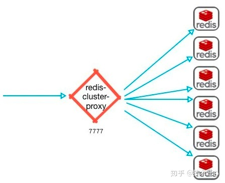

* 多线程处理网络 IO；
  * Redis 6引入多线程IO，但多线程部分只是用来处理网络数据的读写和协议解析，执行命令仍然是单线程。之所以这么设计是不想因为多线程而变得复杂，需要去控制 key、lua、事务，LPUSH/LPOP 等等的并发问题。
* 客户端缓存；
  * 实现了Client-side-caching（客户端缓存）功能。放弃了caching slot，而只使用key names。
  * https://redis.io/docs/manual/client-side-caching/
* 细粒度权限控制（ACL）；
  * 支持对客户端的权限控制，实现对不同的key授予不同的操作权限。
  * 有一个新的ACL日志命令，允许查看所有违反ACL的客户机、访问不应该访问的命令、访问不应该访问的密钥，或者验证尝试失败。这对于调试ACL问题非常有用。
  * Redis 6开始支持ACL，该功能通过限制对命令和key的访问来提高安全性。ACL的工作方式是在连接之后，要求客户端进行身份验证（用户名和有效密码）；如果身份验证阶段成功，则连接与指定用户关联，并且该用户具有限制。
  * 在默认配置中，Redis 6的工作方式与Redis的旧版本完全相同，每个新连接都能够调用每个可能的命令并访问每个键，因此ACL功能与旧版本向后兼容。客户和应用程序。依旧使用requirepass配置密码的，但现在只是为默认用户设置密码。
* 支持SSL
  * 连接支持SSL，更加安全。
* RESP3 协议的使用；
  * RESP（Redis Serialization Protocol）是 Redis 服务端与客户端之间通信的协议。Redis 5 使用的是 RESP2，而 Redis 6 开始在兼容 RESP2 的基础上，开始支持 RESP3。
  * 推出RESP3的目的：一是因为希望能为客户端提供更多的语义化响应，以开发使用旧协议难以实现的功能；另一个原因是实现 Client-side-caching（客户端缓存）功能。
* 用于复制的 RDB 文件不在有用，将立刻被删除；
* RDB 文件加载速度更快；
  * 根据文件的实际组成（较大或较小的值），可以预期20/30%的改进。当有很多客户机连接时，信息也更快了，这是一个老问题，现在终于解决了。
* 发布官方的Redis集群代理模块 Redis Cluster proxy
  * 在 Redis 集群中，客户端会非常分散，现在为此引入了一个集群代理，可以为客户端抽象 Redis 群集，使其像正在与单个实例进行对话一样。同时在简单且客户端仅使用简单命令和功能时执行多路复用。
    

* 提供了众多的新模块（modules）API
  * Redis 6中模块API开发进展非常大，因为Redis Labs为了开发复杂的功能，从一开始就用上Redis模块。Redis可以变成一个框架，利用Modules来构建不同系统，而不需要从头开始写然后还要BSD许可。Redis一开始就是一个向编写各种系统开放的平台。如：Disque作为一个Redis Module使用足以展示Redis的模块系统的强大。集群消息总线API、屏蔽和回复客户端、计时器、模块数据的AOF和RDB等。
* 更好的过期循环（expire cycle）
  * Redis 6重新编写了Redis活动到期周期，以更快地回收已到期的key。


## ACLs权限控制

```
 1) ACL <subcommand> arg arg ... arg. Subcommands are:
 2) LOAD                             -- Reload users from the ACL file.
 3) SAVE                             -- Save the current config to the ACL file.
 4) LIST                             -- Show user details in config file format.
 5) USERS                            -- List all the registered usernames.
 6) SETUSER <username> [attribs ...] -- Create or modify a user.
 7) GETUSER <username>               -- Get the user details.
 8) DELUSER <username> [...]         -- Delete a list of users.
 9) CAT                              -- List available categories.
10) CAT <category>                   -- List commands inside category.
11) GENPASS [<bits>]                 -- Generate a secure user password.
12) WHOAMI                           -- Return the current connection username.
13) LOG [<count> | RESET]            -- Show the ACL log entries.
```

Redis6中auth命令在Redis 6中进行了扩展，因此现在可以在两个参数的形式中使用它：

```
#before Redis 6
AUTH <password>
#Redis 6
AUTH <username> <password>
```

默认情况下，有一个用户定义，称为default。可以使用ACL LIST命令来查看，默认配置的Redis实例的配置是：

```
#无密码
127.0.0.1:6379> ACL LIST
1) "user default on nopass ~* +@all"
#有密码
127.0.0.1:6379> ACL LIST
1) "user default on #ce306e0ee195cc817620c86d7b74126d0d66c077b66f66c10f1728cf34a214d3
   127.0.0.1:6379> ACL WHOAMI
   "default"
   127.0.0.1:6379> ACL USERS
1) "default"
```

每行的开头都是“user”，后面跟用户名，`on`表示用户是启用的，否则是禁用的。`nopass`表示无密码，否则表示有密码认证。`~*`表示能够访问所有的key，`+@all`表示能够调用所有可能的命令。


