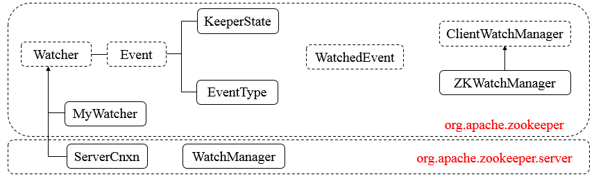

## Watcher机制

### 1. 总体框图

* Watcher => org.apache.zookeeper
* WatchedEvent => org.apache.zookeeper
* ClientWatchManager => org.apache.zookeeper
* ZKWatchManager => org.apache.zookeeper
* WatchManager => org.apache.zookeeper.server.watch
* ServerCnxn => org.apache.zookeeper.server



说明：

* `Watcher`，接口类型，其定义了`process`方法，需子类实现。
* `Event`，接口类型，`Watcher`的内部类，无任何方法。
* `KeeperState`，枚举类型，`Event`的内部类，表示Zookeeper所处的状态。
* `EventType`，枚举类型，`Event`的内部类，表示Zookeeper中发生的事件类型。
* `WatchedEvent`，表示对ZooKeeper上发生变化后的反馈，包含了`KeeperState`和`EventType`。
* `ClientWatchManager`，接口类型，表示客户端的`Watcher`管理者，其定义了`materialized`方法，需子类实现。
* `ZKWatchManager`，`Zookeeper`的内部类，继承`ClientWatchManager`。
* `MyWatcher`，`ZooKeeperMain`的内部类，继承`Watcher`。
* `ServerCnxn`，接口类型，继承`Watcher`，表示客户端与服务端的一个连接。
* `WatchManager`，管理`Watcher`。

### 2. Watcher

#### 2.1 内部类

`Event`，接口类型，表示事件代表的状态，除去其内部类，其源码结构如下
```
public interface Event {}
```
说明：可以看到，Event接口并没有定义任何属性和方法，但是其包含了KeeperState和EventType两个内部枚举类。

#### 2.2 接口方法

```
abstract public void process(WatchedEvent event);
```
说明：其代表了实现`Watcher`接口时必须实现的的方法，即定义进行处理，`WatchedEvent`表示观察的事件。

### 3. Event

#### 3.1 KeeperState

```
public enum KeeperState { // 事件发生时Zookeeper的状态
    /** Unused, this state is never generated by the server */
    @Deprecated
    // 未知状态，不再使用，服务器不会产生此状态
    Unknown (-1),
    
    /** The client is in the disconnected state - it is not connected
     * to any server in the ensemble. */
    // 断开
    Disconnected (0),
    
    /** Unused, this state is never generated by the server */
    @Deprecated
    // 未同步连接，不再使用，服务器不会产生此状态
    NoSyncConnected (1),
    
    /** The client is in the connected state - it is connected
     * to a server in the ensemble (one of the servers specified
     * in the host connection parameter during ZooKeeper client
     * creation). */
    // 同步连接状态
    SyncConnected (3),
    
    /**
     * Auth failed state
     */
    // 认证失败状态
    AuthFailed (4),
    
    /**
     * The client is connected to a read-only server, that is the
     * server which is not currently connected to the majority.
     * The only operations allowed after receiving this state is
     * read operations.
     * This state is generated for read-only clients only since
     * read/write clients aren't allowed to connect to r/o servers.
     */
    // 只读连接状态
    ConnectedReadOnly (5),
    
    /**
      * SaslAuthenticated: used to notify clients that they are SASL-authenticated,
      * so that they can perform Zookeeper actions with their SASL-authorized permissions.
      */
    // SASL认证通过状态
    SaslAuthenticated(6),
    
    /** The serving cluster has expired this session. The ZooKeeper
     * client connection (the session) is no longer valid. You must
     * create a new client connection (instantiate a new ZooKeeper
     * instance) if you with to access the ensemble. */
    // 过期状态
    Expired (-112);
    
    // 代表状态的整形值
    private final int intValue;     // Integer representation of value
                                    // for sending over wire
    
                                    
    // 构造函数
    KeeperState(int intValue) {
        this.intValue = intValue;
    }
    
    // 返回整形值
    public int getIntValue() {
        return intValue;
    }
    
    // 从整形值构造相应的状态
    public static KeeperState fromInt(int intValue) {
        switch(intValue) {
            case   -1: return KeeperState.Unknown;
            case    0: return KeeperState.Disconnected;
            case    1: return KeeperState.NoSyncConnected;
            case    3: return KeeperState.SyncConnected;
            case    4: return KeeperState.AuthFailed;
            case    5: return KeeperState.ConnectedReadOnly;
            case    6: return KeeperState.SaslAuthenticated;
            case -112: return KeeperState.Expired;
    
            default:
                throw new RuntimeException("Invalid integer value for conversion to KeeperState");
        }
    }
}
```

说明：`KeeperState`是一个枚举类，其定义了在事件发生时Zookeeper所处的各种状态，其还定义了一个从整形值返回对应状态的方法fromInt。

#### 3.2 EventType

```
public enum EventType { // 事件类型
    // 无
    None (-1),
    // 结点创建
    NodeCreated (1),
    // 结点删除
    NodeDeleted (2),
    // 结点数据变化
    NodeDataChanged (3),
    // 结点数据变化
    NodeChildrenChanged (4);

        // 代表事件类型的整形 
        private final int intValue;     // Integer representation of value
                                        // for sending over wire

        // 构造函数
        EventType(int intValue) {
            this.intValue = intValue;
        }

        // 返回整形
        public int getIntValue() {
            return intValue;
        }

        // 从整形构造相应的事件
        public static EventType fromInt(int intValue) {
            switch(intValue) {
                case -1: return EventType.None;
                case  1: return EventType.NodeCreated;
                case  2: return EventType.NodeDeleted;
                case  3: return EventType.NodeDataChanged;
                case  4: return EventType.NodeChildrenChanged;

                default:
                    throw new RuntimeException("Invalid integer value for conversion to EventType");
            }
        }           
    }
}
```

说明：`EventType`是一个枚举类，其定义了事件的类型（如创建节点、删除节点等事件），同时，其还定义了一个从整形值返回对应事件类型的方法`fromInt`。

### 4. WatchedEvent

#### 4.1 类的属性

```
public class WatchedEvent {
    // Zookeeper的状态
    final private KeeperState keeperState;
    // 事件类型
    final private EventType eventType;
    // 事件所涉及节点的路径
    private String path;
}
```

说明：`WatchedEvent`类包含了三个属性，分别代表事件发生时Zookeeper的状态、事件类型和发生事件所涉及的节点路径。

#### 4.2 构造函数

##### 4.2.1 `public WatchedEvent(EventType eventType, KeeperState keeperState, String path)`型构造函数

```
public WatchedEvent(EventType eventType, KeeperState keeperState, String path) {
    // 初始化属性
    this.keeperState = keeperState;
    this.eventType = eventType;
    this.path = path;
}
```

说明：构造函数传入了三个参数，然后分别对属性进行赋值操作。

##### 4.2.2 `public WatchedEvent(WatcherEvent eventMessage)`型构造函数

```
public WatchedEvent(WatcherEvent eventMessage) {
    // 从eventMessage中取出相应属性进行赋值
    keeperState = KeeperState.fromInt(eventMessage.getState());
    eventType = EventType.fromInt(eventMessage.getType());
    path = eventMessage.getPath();
}
```
说明：构造函数传入了`WatcherEvent`参数，之后直接从该参数中取出相应属性进行赋值操作。

对于`WatchedEvent`类的方法而言，相对简单，包含了几个getXXX方法，用于获取相应的属性值。

### 5. ClientWatchManager

#### 5.1 接口方法

```
public Set<Watcher> materialize(Watcher.Event.KeeperState state, Watcher.Event.EventType type, String path);
```
说明：该方法表示事件发生时，返回需要被通知的Watcher集合，可能为空集合。

### 6. ZKWatchManager

#### 6.1 类的属性

```
private static class ZKWatchManager implements ClientWatchManager {
    // 数据变化的Watchers
    private final Map<String, Set<Watcher>> dataWatches = new HashMap<String, Set<Watcher>>();
    // 节点存在与否的Watchers
    private final Map<String, Set<Watcher>> existWatches = new HashMap<String, Set<Watcher>>();
    // 子节点变化的Watchers
    private final Map<String, Set<Watcher>> childWatches = new HashMap<String, Set<Watcher>>();
}
```
说明：`ZKWatchManager`实现了`ClientWatchManager`，并定义了三个Map键值对(最新版本中是五个)，键为节点路径，值为Watcher。分别对应数据变化的Watcher、节点是否存在的Watcher、子节点变化的Watcher。

#### 6.2 核心方法分析

##### 6.2.1 materialize方法

```
public Set<Watcher> materialize(Watcher.Event.KeeperState state, Watcher.Event.EventType type, String clientPath) {
    // 新生成结果Watcher集合
    Set<Watcher> result = new HashSet<Watcher>();

        switch (type) { // 确定事件类型
        case None: // 无类型
            // 添加默认Watcher
            result.add(defaultWatcher);
            // 是否需要清空(提取对zookeeper.disableAutoWatchReset字段进行配置的值、Zookeeper的状态是否为同步连接)
            boolean clear = ClientCnxn.getDisableAutoResetWatch() &&
                    state != Watcher.Event.KeeperState.SyncConnected;

            synchronized(dataWatches) { // 同步块
                for(Set<Watcher> ws: dataWatches.values()) {
                    // 添加至结果集合
                    result.addAll(ws);
                }
                if (clear) { // 是否需要清空
                    dataWatches.clear();
                }
            }

            synchronized(existWatches) { // 同步块 
                for(Set<Watcher> ws: existWatches.values()) {
                    // 添加至结果集合
                    result.addAll(ws);
                }
                if (clear) { // 是否需要清空
                    existWatches.clear();
                }
            }

            synchronized(childWatches) { // 同步块
                for(Set<Watcher> ws: childWatches.values()) {
                    // 添加至结果集合
                    result.addAll(ws);
                }
                if (clear) { // 是否需要清空
                    childWatches.clear();
                }
            }
            // 返回结果
            return result;
        case NodeDataChanged: // 节点数据变化
        case NodeCreated: // 创建节点
            synchronized (dataWatches) { // 同步块
                // 移除clientPath对应的Watcher后全部添加至结果集合
                addTo(dataWatches.remove(clientPath), result);
            }
            synchronized (existWatches) { 
                // 移除clientPath对应的Watcher后全部添加至结果集合
                addTo(existWatches.remove(clientPath), result);
            }
            break;
        case NodeChildrenChanged: // 节点子节点变化
            synchronized (childWatches) {
                // 移除clientPath对应的Watcher后全部添加至结果集合
                addTo(childWatches.remove(clientPath), result);
            }
            break;
        case NodeDeleted: // 删除节点
            synchronized (dataWatches) { 
                // 移除clientPath对应的Watcher后全部添加至结果集合
                addTo(dataWatches.remove(clientPath), result);
            }
            // XXX This shouldn't be needed, but just in case
            synchronized (existWatches) {
                // 移除clientPath对应的Watcher
                Set<Watcher> list = existWatches.remove(clientPath);
                if (list != null) {
                    // 移除clientPath对应的Watcher后全部添加至结果集合
                    addTo(existWatches.remove(clientPath), result);
                    LOG.warn("We are triggering an exists watch for delete! Shouldn't happen!");
                }
            }
            synchronized (childWatches) {
                // 移除clientPath对应的Watcher后全部添加至结果集合
                addTo(childWatches.remove(clientPath), result);
            }
            break;
        default: // 缺省处理
            String msg = "Unhandled watch event type " + type
                + " with state " + state + " on path " + clientPath;
            LOG.error(msg);
            throw new RuntimeException(msg);
        }

        // 返回结果集合
        return result;
    }
}
```

说明：该方法在事件发生后，返回需要被通知的`Watcher`集合。在该方法中，首先会根据`EventType`类型确定相应的事件类型，然后根据事件类型的不同做出相应的操作，如针对**None类型**，即无任何事件，则首先会从三个键值对中删除`clientPath`对应的`Watcher`，然后将剩余的`Watcher`集合添加至结果集合；针对`NodeDataChanged`和`NodeCreated`事件而言，其会从`dataWatches`和`existWatches`中删除`clientPath`对应的`Watcher`，然后将剩余的`Watcher`集合添加至结果集合。

### 7. WatchManager源码分析

#### 7.1 类的属性

```
public class WatchManager {
    // Logger
    private static final Logger LOG = LoggerFactory.getLogger(WatchManager.class);
    // watcher表
    private final HashMap<String, HashSet<Watcher>> watchTable = new HashMap<String, HashSet<Watcher>>();
    // watcher到节点路径的映射
    private final HashMap<Watcher, HashSet<String>> watch2Paths = new HashMap<Watcher, HashSet<String>>();
}
```

说明：`WatcherManager`类用于管理`watchers`和相应的触发器。`watchTable`表示从节点路径到watcher集合的映射，而`watch2Paths`则表示从watcher到所有节点路径集合的映射。

#### 7.2 核心方法分析

##### 7.2.1 size方法

```
public synchronized int size(){
    int result = 0;
    for(Set<Watcher> watches : watchTable.values()) { // 遍历watchTable所有的值集合(HashSet<Watcher>集合)
        // 每个集合大小累加
        result += watches.size();
    }
    // 返回结果
    return result;
}
```
说明：可以看到`size`方法是同步的，因此在多线程环境下是安全的，其主要作用是获取`watchTable`的大小，即遍历`watchTable`的值集合。

##### 7.2.2 addWatch方法

```
public synchronized void addWatch(String path, Watcher watcher) {
    // 根据路径获取对应的所有watcher
    HashSet<Watcher> list = watchTable.get(path);
    if (list == null) { // 列表为空
        // don't waste memory if there are few watches on a node
        // rehash when the 4th entry is added, doubling size thereafter
        // seems like a good compromise
        // 新生成watcher集合
        list = new HashSet<Watcher>(4);
        // 存入watcher表
        watchTable.put(path, list);
    }
    // 将watcher直接添加至watcher集合
    list.add(watcher);

    // 通过watcher获取对应的所有路径
    HashSet<String> paths = watch2Paths.get(watcher);
    if (paths == null) { // 路径为空
        // cnxns typically have many watches, so use default cap here
        // 新生成hash集合
        paths = new HashSet<String>();
        // 将watcher和对应的paths添加至映射中
        watch2Paths.put(watcher, paths);
    }
    // 将路径添加至paths集合
    paths.add(path);
}
```
说明：`addWatch`方法同样是同步的，其大致流程如下

* 1.通过传入的path（节点路径）从`watchTable`获取相应的watcher集合，进入**2**
* 2.判断**1**中的`watcher`是否为空，若为空，则进入**3**，否则，进入**4**
* 3.新生成`watcher`集合，并将路径`path`和此集合添加至`watchTable`中，进入**4**
* 4.将传入的`watcher`添加至`watcher`集合，即完成了`path`和`watcher`添加至`watchTable`的步骤，进入**5**
* 5.通过传入的`watcher`从`watch2Paths`中获取相应的`path`集合，进入**6**
* 6.判断`path`集合是否为空，若为空，则进入**7**，否则，进入**8**
* 7.新生成`path`集合，并将`watcher`和`paths`添加至`watch2Paths`中，进入**8**
* 8.将传入的`path`（节点路径）添加至`path`集合，即完成了`path`和`watcher`添加至`watch2Paths`的步骤。

##### 7.2.3 removeWatcher方法

```
public synchronized void removeWatcher(Watcher watcher) {
    // 从wach2Paths中移除watcher，并返回watcher对应的path集合
    HashSet<String> paths = watch2Paths.remove(watcher);
    if (paths == null) { // 集合为空，直接返回
        return;
    }
    for (String p : paths) { // 遍历路径集合
        // 从watcher表中根据路径取出相应的watcher集合
        HashSet<Watcher> list = watchTable.get(p);
        if (list != null) { // 若集合不为空
            // 从list中移除该watcher
            list.remove(watcher);
            if (list.size() == 0) { // 移除后list为空，则从watch表中移出
                watchTable.remove(p);
            }
        }
    }
}
```
说明：`removeWatcher`用作从`watch2Paths`和`watchTable`中中移除该`watcher`，其大致步骤如下

* 1.从`watch2Paths`中移除传入的`watcher`，并且返回该`watcher`对应的路径集合，进入**2**
* 2.判断返回的路径集合是否为空，若为空，直接返回，否则，进入**3**
* 3.遍历**2**中的路径集合，对每个路径，都从`watchTable`中取出与该路径对应的`watcher`集合，进入**4**
* 4.若**3**中的`watcher`集合不为空，则从该集合中移除`watcher`，并判断移除元素后的集合大小是否为0，若为0，进入**5**
* 5.从`watchTable`中移除路径。

##### 7.2.4 triggerWatch方法

```
public Set<Watcher> triggerWatch(String path, EventType type, Set<Watcher> supress) {
    // 根据事件类型、连接状态、节点路径创建WatchedEvent
    WatchedEvent e = new WatchedEvent(type, KeeperState.SyncConnected, path);

    // watcher集合
    HashSet<Watcher> watchers;
    synchronized (this) { // 同步块
        // 从watcher表中移除path，并返回其对应的watcher集合
        watchers = watchTable.remove(path);
        if (watchers == null || watchers.isEmpty()) { // watcher集合为空
            if (LOG.isTraceEnabled()) { 
                ZooTrace.logTraceMessage(LOG, ZooTrace.EVENT_DELIVERY_TRACE_MASK, "No watchers for " + path);
            }
            // 返回
            return null;
        }
        for (Watcher w : watchers) { // 遍历watcher集合
            // 根据watcher从watcher表中取出路径集合
            HashSet<String> paths = watch2Paths.get(w);
            if (paths != null) { // 路径集合不为空
                // 则移除路径
                paths.remove(path);
            }
        }
    }
    for (Watcher w : watchers) { // 遍历watcher集合
        if (supress != null && supress.contains(w)) { // supress不为空并且包含watcher，则跳过
            continue;
        }
        // 进行处理
        w.process(e);
    }
    return watchers;
}
```

说明：该方法主要用于触发`watch`事件，并对事件进行处理。其大致步骤如下

* 1.根据事件类型、连接状态、节点路径创建`WatchedEvent`，进入**2**
* 2.从`watchTable`中移除传入的`path`对应的键值对，并且返回`path`对应的`watcher`集合，进入**3**
* 3.判断`watcher`集合是否为空，若为空，则之后会返回`null`，否则，进入**4**
* 4.遍历**2**中的`watcher`集合，对每个`watcher`，从`watch2Paths`中取出`path`集合，进入**5**
* 5.判断**4**中的`path`集合是否为空，若不为空，则从集合中移除传入的`path`。进入**6**
* 6.再次遍历`watcher`集合，对每个`watcher`，若`supress`不为空并且包含了该`watcher`，则跳过，否则，进入**7**
* 7.调用`watcher`的`process`方法进行相应处理，之后返回`watcher`集合。

##### 7.2.5 dumpWatches方法

```
public synchronized void dumpWatches(PrintWriter pwriter, boolean byPath) {
    if (byPath) { // 控制写入watchTable或watch2Paths
        for (Entry<String, HashSet<Watcher>> e : watchTable.entrySet()) { // 遍历每个键值对
            // 写入键
            pwriter.println(e.getKey());
            for (Watcher w : e.getValue()) { // 遍历值(HashSet<Watcher>)
                pwriter.print("\t0x");
                pwriter.print(Long.toHexString(((ServerCnxn)w).getSessionId()));
                pwriter.print("\n");
            }
        }
    } else {
        for (Entry<Watcher, HashSet<String>> e : watch2Paths.entrySet()) { // 遍历每个键值对
            // 写入"0x"
            pwriter.print("0x");
            pwriter.println(Long.toHexString(((ServerCnxn)e.getKey()).getSessionId()));
            for (String path : e.getValue()) { // 遍历值(HashSet<String>)
                //
                pwriter.print("\t");
                pwriter.println(path);
            }
        }
    }
}
```
说明：`dumpWatches`用作将`watchTable`或`watch2Paths`写入磁盘。