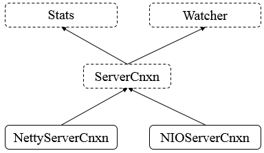

## 网络通信

### 1. 总体框图



说明：

* `Stats`，表示`ServerCnxn`上的统计数据。
* `Watcher`，表示时间处理器。
* `ServerCnxn`，表示服务器连接，表示一个从客户端到服务器的连接。
* `NettyServerCnxn`，基于Netty的连接的具体实现。
* `NIOServerCnxn`，基于NIO的连接的具体实现。

### 2. ServerCnxn

#### 2.1 类的继承关系
```
public abstract class ServerCnxn implements Stats, Watcher {}
```

说明：`ServerCnxn`为抽象类，其继承`Stats`和`Watcher`两个接口，表示客户端到服务端的连接。

#### 2.2 类的内部类

```
// 请求关闭异常类
protected static class CloseRequestException extends IOException {
    private static final long serialVersionUID = -7854505709816442681L;

    public CloseRequestException(String msg) {
        super(msg);
    }
}

// 流结束异常类
protected static class EndOfStreamException extends IOException {
    private static final long serialVersionUID = -8255690282104294178L;

    public EndOfStreamException(String msg) {
        super(msg);
    }

    public String toString() {
        return "EndOfStreamException: " + getMessage();
    }
}
```
说明：`ServerCnxn`包含了两个异常类，用于表示在连接中发生的异常情况。

#### 2.3 类的属性

```
public abstract class ServerCnxn implements Stats, Watcher {
    // This is just an arbitrary object to represent requests issued by (aka owned by) this class
    // 代表由本类提出的请求
    final public static Object me = new Object();
    // 认证信息
    protected ArrayList<Id> authInfo = new ArrayList<Id>();

    /**
     * If the client is of old version, we don't send r-o mode info to it.
     * The reason is that if we would, old C client doesn't read it, which
     * results in TCP RST packet, i.e. "connection reset by peer".
     */
    // 是否为旧的C客户端
    boolean isOldClient = true;
    
    // Zookeeper的Sasl服务器
    protected ZooKeeperSaslServer zooKeeperSaslServer = null;
    
    
    /**
    * CMD命令
    **/
    /*
     * See <a href="{@docRoot}/../../../docs/zookeeperAdmin.html#sc_zkCommands">
     * Zk Admin</a>. this link is for all the commands.
     */
    // CMD命令
    protected final static int confCmd = ByteBuffer.wrap("conf".getBytes()).getInt();

    /*
     * See <a href="{@docRoot}/../../../docs/zookeeperAdmin.html#sc_zkCommands">
     * Zk Admin</a>. this link is for all the commands.
     */
    protected final static int consCmd = ByteBuffer.wrap("cons".getBytes()).getInt();

    /*
     * See <a href="{@docRoot}/../../../docs/zookeeperAdmin.html#sc_zkCommands">
     * Zk Admin</a>. this link is for all the commands.
     */
    protected final static int crstCmd = ByteBuffer.wrap("crst".getBytes()).getInt();

    /*
     * See <a href="{@docRoot}/../../../docs/zookeeperAdmin.html#sc_zkCommands">
     * Zk Admin</a>. this link is for all the commands.
     */
    protected final static int dumpCmd = ByteBuffer.wrap("dump".getBytes()).getInt();

    /*
     * See <a href="{@docRoot}/../../../docs/zookeeperAdmin.html#sc_zkCommands">
     * Zk Admin</a>. this link is for all the commands.
     */
    protected final static int enviCmd = ByteBuffer.wrap("envi".getBytes()).getInt();

    /*
     * See <a href="{@docRoot}/../../../docs/zookeeperAdmin.html#sc_zkCommands">
     * Zk Admin</a>. this link is for all the commands.
     */
    protected final static int getTraceMaskCmd = ByteBuffer.wrap("gtmk".getBytes()).getInt();

    /*
     * See <a href="{@docRoot}/../../../docs/zookeeperAdmin.html#sc_zkCommands">
     * Zk Admin</a>. this link is for all the commands.
     */
    protected final static int ruokCmd = ByteBuffer.wrap("ruok".getBytes()).getInt();
    /*
     * See <a href="{@docRoot}/../../../docs/zookeeperAdmin.html#sc_zkCommands">
     * Zk Admin</a>. this link is for all the commands.
     */
    protected final static int setTraceMaskCmd = ByteBuffer.wrap("stmk".getBytes()).getInt();

    /*
     * See <a href="{@docRoot}/../../../docs/zookeeperAdmin.html#sc_zkCommands">
     * Zk Admin</a>. this link is for all the commands.
     */
    protected final static int srvrCmd = ByteBuffer.wrap("srvr".getBytes()).getInt();

    /*
     * See <a href="{@docRoot}/../../../docs/zookeeperAdmin.html#sc_zkCommands">
     * Zk Admin</a>. this link is for all the commands.
     */
    protected final static int srstCmd = ByteBuffer.wrap("srst".getBytes()).getInt();

    /*
     * See <a href="{@docRoot}/../../../docs/zookeeperAdmin.html#sc_zkCommands">
     * Zk Admin</a>. this link is for all the commands.
     */
    protected final static int statCmd = ByteBuffer.wrap("stat".getBytes()).getInt();

    /*
     * See <a href="{@docRoot}/../../../docs/zookeeperAdmin.html#sc_zkCommands">
     * Zk Admin</a>. this link is for all the commands.
     */
    protected final static int wchcCmd = ByteBuffer.wrap("wchc".getBytes()).getInt();

    /*
     * See <a href="{@docRoot}/../../../docs/zookeeperAdmin.html#sc_zkCommands">
     * Zk Admin</a>. this link is for all the commands.
     */
    protected final static int wchpCmd = ByteBuffer.wrap("wchp".getBytes()).getInt();

    /*
     * See <a href="{@docRoot}/../../../docs/zookeeperAdmin.html#sc_zkCommands">
     * Zk Admin</a>. this link is for all the commands.
     */
    protected final static int wchsCmd = ByteBuffer.wrap("wchs".getBytes()).getInt();

    /*
     * See <a href="{@docRoot}/../../../docs/zookeeperAdmin.html#sc_zkCommands">
     * Zk Admin</a>. this link is for all the commands.
     */
    protected final static int mntrCmd = ByteBuffer.wrap("mntr".getBytes()).getInt();

    /*
     * See <a href="{@docRoot}/../../../docs/zookeeperAdmin.html#sc_zkCommands">
     * Zk Admin</a>. this link is for all the commands.
     */
    protected final static int isroCmd = ByteBuffer.wrap("isro".getBytes()).getInt();

    // 存储CMD的整形值与String的键值对
    protected final static HashMap<Integer, String> cmd2String = new HashMap<Integer, String>();

    // specify all of the commands that are available
    static {
        cmd2String.put(confCmd, "conf");
        cmd2String.put(consCmd, "cons");
        cmd2String.put(crstCmd, "crst");
        cmd2String.put(dumpCmd, "dump");
        cmd2String.put(enviCmd, "envi");
        cmd2String.put(getTraceMaskCmd, "gtmk");
        cmd2String.put(ruokCmd, "ruok");
        cmd2String.put(setTraceMaskCmd, "stmk");
        cmd2String.put(srstCmd, "srst");
        cmd2String.put(srvrCmd, "srvr");
        cmd2String.put(statCmd, "stat");
        cmd2String.put(wchcCmd, "wchc");
        cmd2String.put(wchpCmd, "wchp");
        cmd2String.put(wchsCmd, "wchs");
        cmd2String.put(mntrCmd, "mntr");
        cmd2String.put(isroCmd, "isro");
    }
    
    
    /**
    * 服务器的统计数据
    **/
    // 创建连接的时间
    protected final Date established = new Date();

    // 接受的packet数量
    protected final AtomicLong packetsReceived = new AtomicLong();
    // 发送的packet数量
    protected final AtomicLong packetsSent = new AtomicLong();
    // 最小延迟
    protected long minLatency;
    // 最大延迟
    protected long maxLatency;
    // 最后操作类型
    protected String lastOp;
    // 最后的cxid
    protected long lastCxid;
    // 最后的zxid
    protected long lastZxid;
    // 最后的响应时间
    protected long lastResponseTime;
    // 最后的延迟
    protected long lastLatency;
    // 数量
    protected long count;
    // 总的延迟
    protected long totalLatency;
}
```
说明：可以看到，`ServerCnxn`类维护了很多属性，主要是服务器的统计信息和和命令行信息。

#### 2.4 核心函数分析

##### 2.4.1 抽象方法

```
// 获取会话超时时间
abstract int getSessionTimeout();
    // 关闭
    abstract void close();
    // 发送响应
    public abstract void sendResponse(ReplyHeader h, Record r, String tag) throws IOException;
    /* notify the client the session is closing and close/cleanup socket */
    // 关闭会话
    abstract void sendCloseSession();
    // 处理，Watcher接口中的方法
    public abstract void process(WatchedEvent event);
    // 获取会话id
    abstract long getSessionId();
    // 设置会话id
    abstract void setSessionId(long sessionId);
    // 设置缓冲
    abstract void sendBuffer(ByteBuffer closeConn);
    // 允许接收
    abstract void enableRecv();
    // 不允许接收
    abstract void disableRecv();
    // 设置会话超时时间
    abstract void setSessionTimeout(int sessionTimeout);
    // 获取服务器的统计数据
    protected abstract ServerStats serverStats();
```

说明：以上的方法均为抽象方法，需要具体子类实现，如`process`方法是`Watcher`接口中的方法，在`ServerCnxn`中并未实现，需要具体子类实现。

##### 2.4.2 具体方法

```
/** auth info for the cnxn, returns an unmodifyable list */
// 获取认证信息，返回不可修改的列表
public List<Id> getAuthInfo() {
    return Collections.unmodifiableList(authInfo);
}

// 添加认证信息
public void addAuthInfo(Id id) {
    if (authInfo.contains(id) == false) {
        authInfo.add(id);
    }
}

// 移除认证信息
public boolean removeAuthInfo(Id id) {
    return authInfo.remove(id);
}

// 接收的packet
protected void packetReceived() {
    incrPacketsReceived();
    ServerStats serverStats = serverStats();
    if (serverStats != null) {
        serverStats().incrementPacketsReceived();
    }
}

// 发送的packet
protected void packetSent() {
    incrPacketsSent();
    ServerStats serverStats = serverStats();
    if (serverStats != null) {
        serverStats().incrementPacketsSent();
    }
}


// 重置统计数据
public synchronized void resetStats() {
    packetsReceived.set(0);
    packetsSent.set(0);
    minLatency = Long.MAX_VALUE;
    maxLatency = 0;
    lastOp = "NA";
    lastCxid = -1;
    lastZxid = -1;
    lastResponseTime = 0;
    lastLatency = 0;

    count = 0;
    totalLatency = 0;
}

// 增加接收的packet数量
protected long incrPacketsReceived() {
    return packetsReceived.incrementAndGet();
}

// 增加outstandingRequest数量
protected void incrOutstandingRequests(RequestHeader h) {
}

// 增加发送的packet数量
protected long incrPacketsSent() {
    return packetsSent.incrementAndGet();
}

// 更新响应的统计数据
protected synchronized void updateStatsForResponse(long cxid, long zxid,
        String op, long start, long end)
{
    // don't overwrite with "special" xids - we're interested
    // in the clients last real operation
    if (cxid >= 0) { 
        lastCxid = cxid;
    }
    lastZxid = zxid;
    lastOp = op;
    lastResponseTime = end;
    long elapsed = end - start;
    lastLatency = elapsed;
    if (elapsed < minLatency) {
        minLatency = elapsed;
    }
    if (elapsed > maxLatency) {
        maxLatency = elapsed;
    }
    count++;
    totalLatency += elapsed;
}

public Date getEstablished() {
    return (Date)established.clone();
}

public abstract long getOutstandingRequests();

public long getPacketsReceived() {
    return packetsReceived.longValue();
}

public long getPacketsSent() {
    return packetsSent.longValue();
}

public synchronized long getMinLatency() {
    return minLatency == Long.MAX_VALUE ? 0 : minLatency;
}

public synchronized long getAvgLatency() {
    return count == 0 ? 0 : totalLatency / count;
}

public synchronized long getMaxLatency() {
    return maxLatency;
}

public synchronized String getLastOperation() {
    return lastOp;
}

public synchronized long getLastCxid() {
    return lastCxid;
}

public synchronized long getLastZxid() {
    return lastZxid;
}

public synchronized long getLastResponseTime() {
    return lastResponseTime;
}

public synchronized long getLastLatency() {
    return lastLatency;
}

/**
 * Prints detailed stats information for the connection.
 *
 * @see dumpConnectionInfo(PrintWriter, boolean) for brief stats
 */
@Override
public String toString() {
    StringWriter sw = new StringWriter();
    PrintWriter pwriter = new PrintWriter(sw);
    dumpConnectionInfo(pwriter, false);
    pwriter.flush();
    pwriter.close();
    return sw.toString();
}

public abstract InetSocketAddress getRemoteSocketAddress();
public abstract int getInterestOps();

/**
 * Print information about the connection.
 * @param brief iff true prints brief details, otw full detail
 * @return information about this connection
 */
protected synchronized void
dumpConnectionInfo(PrintWriter pwriter, boolean brief) {
    pwriter.print(" ");
    pwriter.print(getRemoteSocketAddress());
    pwriter.print("[");
    int interestOps = getInterestOps();
    pwriter.print(interestOps == 0 ? "0" : Integer.toHexString(interestOps));
    pwriter.print("](queued=");
    pwriter.print(getOutstandingRequests());
    pwriter.print(",recved=");
    pwriter.print(getPacketsReceived());
    pwriter.print(",sent=");
    pwriter.print(getPacketsSent());

    if (!brief) {
        long sessionId = getSessionId();
        if (sessionId != 0) {
            pwriter.print(",sid=0x");
            pwriter.print(Long.toHexString(sessionId));
            pwriter.print(",lop=");
            pwriter.print(getLastOperation());
            pwriter.print(",est=");
            pwriter.print(getEstablished().getTime());
            pwriter.print(",to=");
            pwriter.print(getSessionTimeout());
            long lastCxid = getLastCxid();
            if (lastCxid >= 0) {
                pwriter.print(",lcxid=0x");
                pwriter.print(Long.toHexString(lastCxid));
            }
            pwriter.print(",lzxid=0x");
            pwriter.print(Long.toHexString(getLastZxid()));
            pwriter.print(",lresp=");
            pwriter.print(getLastResponseTime());
            pwriter.print(",llat=");
            pwriter.print(getLastLatency());
            pwriter.print(",minlat=");
            pwriter.print(getMinLatency());
            pwriter.print(",avglat=");
            pwriter.print(getAvgLatency());
            pwriter.print(",maxlat=");
            pwriter.print(getMaxLatency());
        }
    }
    pwriter.print(")");
}
```

说明：`ServerCnxn`实现了`Stats`接口中的很多方法，其相对简单，不再累赘。

### 3. NIOServerCnxn

#### 3.1 类的继承关系
```
public class NIOServerCnxn extends ServerCnxn {}
```
说明：`NIOServerCnxn`继承了`ServerCnxn`抽象类，使用NIO来处理与客户端之间的通信，使用单线程处理。

#### 3.2 类的内部类

##### 3.2.1 SendBufferWriter类

```
private class SendBufferWriter extends Writer {
    private StringBuffer sb = new StringBuffer();

    /**
     * Check if we are ready to send another chunk.
     * @param force force sending, even if not a full chunk
     */
    // 是否准备好发送另一块
    private void checkFlush(boolean force) {
        if ((force && sb.length() > 0) || sb.length() > 2048) { // 当强制发送并且sb大小大于0，或者sb大小大于2048即发送缓存
            sendBufferSync(ByteBuffer.wrap(sb.toString().getBytes()));
            // clear our internal buffer
            sb.setLength(0);
        }
    }

    @Override
    public void close() throws IOException {
        if (sb == null) return;
        // 关闭之前需要强制性发送缓存
        checkFlush(true);
        sb = null; // clear out the ref to ensure no reuse
    }

    @Override
    public void flush() throws IOException {
        checkFlush(true);
    }

    @Override
    public void write(char[] cbuf, int off, int len) throws IOException {
        sb.append(cbuf, off, len);
        checkFlush(false);
    }
}
```

说明：该类用来将给客户端的响应进行分块，其核心方法是`checkFlush`方法，其源码如下

```
private void checkFlush(boolean force) {
    if ((force && sb.length() > 0) || sb.length() > 2048) { // 当强制发送并且sb大小大于0，或者sb大小大于2048即发送缓存
        sendBufferSync(ByteBuffer.wrap(sb.toString().getBytes()));
        // clear our internal buffer
        sb.setLength(0);
    }
}
```

说明：当需要强制发送时，sb缓冲中只要有内容就会同步发送，或者是当sb的大小超过2048（块）时就需要发送，其会调用`NIOServerCnxn`的`sendBufferSync`方法，该之后会进行分析，然后再清空sb缓冲。

##### 3.2.2 CommandThread类


```
private abstract class CommandThread extends Thread {
    PrintWriter pw;

    CommandThread(PrintWriter pw) {
        this.pw = pw;
    }
    
    public void run() {
        try {
            commandRun();
        } catch (IOException ie) {
            LOG.error("Error in running command ", ie);
        } finally {
            cleanupWriterSocket(pw);
        }
    }
    
    public abstract void commandRun() throws IOException;
}
```

说明：该类用于处理`ServerCnxn`中的定义的命令，其主要逻辑定义在`commandRun`方法中，在子类中各自实现，这是一种典型的工厂方法，每个子类对应着一个命令，每个命令使用单独的线程进行处理。

#### 3.3 类的属性

```
public class NIOServerCnxn extends ServerCnxn {
    // 日志
    static final Logger LOG = LoggerFactory.getLogger(NIOServerCnxn.class);
    // ServerCnxn工厂
    NIOServerCnxnFactory factory;
    // 针对面向流的连接套接字的可选择通道
    final SocketChannel sock;
    // 表示 SelectableChannel 在 Selector 中注册的标记
    private final SelectionKey sk;
    // 初始化标志
    boolean initialized;
    // 分配四个字节缓冲区
    ByteBuffer lenBuffer = ByteBuffer.allocate(4);
    // 赋值incomingBuffer
    ByteBuffer incomingBuffer = lenBuffer;
    // 缓冲队列
    LinkedBlockingQueue<ByteBuffer> outgoingBuffers = new LinkedBlockingQueue<ByteBuffer>();
    // 会话超时时间
    int sessionTimeout;
    // ZooKeeper服务器
    private final ZooKeeperServer zkServer;
    /** The number of requests that have been submitted but not yet responded to. */
    // 已经被提交但还未响应的请求数量
    int outstandingRequests;
    /** This is the id that uniquely identifies the session of a client. Once this session is no longer active, the ephemeral nodes will 
    go away. */
    // 会话ID
    long sessionId;
    // 下个会话ID
    static long nextSessionId = 1;
    int outstandingLimit = 1;
    private static final String ZK_NOT_SERVING = "This ZooKeeper instance is not currently serving requests";
    private final static byte fourBytes[] = new byte[4];
}  
```  

说明：`NIOServerCnxn`维护了服务器与客户端之间的`Socket`通道、用于存储传输内容的缓冲区、会话ID、ZooKeeper服务器等。

#### 3.4 类的构造函数


```
public NIOServerCnxn(ZooKeeperServer zk, SocketChannel sock, SelectionKey sk, NIOServerCnxnFactory factory) throws IOException {
    this.zkServer = zk;
    this.sock = sock;
    this.sk = sk;
    this.factory = factory;
    if (this.factory.login != null) {
      this.zooKeeperSaslServer = new ZooKeeperSaslServer(factory.login);
    }
    if (zk != null) {
      outstandingLimit = zk.getGlobalOutstandingLimit();
    }
    sock.socket().setTcpNoDelay(true);
    /* set socket linger to false, so that socket close does not block */
    // 设置linger为false，以便在socket关闭时不会阻塞
    sock.socket().setSoLinger(false, -1);
    // 获取IP地址
    InetAddress addr = ((InetSocketAddress) sock.socket().getRemoteSocketAddress()).getAddress();
    // 认证信息中添加IP地址
    authInfo.add(new Id("ip", addr.getHostAddress()));
    // 设置感兴趣的操作类型
    sk.interestOps(SelectionKey.OP_READ);
}
```

说明：在构造函数中会对Socket通道进行相应设置，如设置TCP连接无延迟、获取客户端的IP地址并将此信息进行记录，方便后续认证，最后设置SelectionKey感兴趣的操作类型为READ。

#### 3.5 核心函数分析

##### 3.5.1 sendBuffer函数

```
public void sendBuffer(ByteBuffer bb) {
    try {
        if (bb != ServerCnxnFactory.closeConn) { // 不关闭连接
            // We check if write interest here because if it is NOT set, nothing is queued, so we can try to send the buffer right
            // away without waking up the selector
            // 首先检查interestOps中是否存在WRITE操作，如果没有,则表示直接发送缓冲而不必先唤醒selector
            if ((sk.interestOps() & SelectionKey.OP_WRITE) == 0) { // 不为write操作
                try {
                    // 将缓冲写入socket
                    sock.write(bb);
                } catch (IOException e) {
                    // we are just doing best effort right now
                }
            }
            // if there is nothing left to send, we are done
            if (bb.remaining() == 0) { // bb中的内容已经被全部读取
                // 统计发送包信息（调用ServerCnxn方法）
                packetSent();
                return;
            }
        }

        synchronized(this.factory){ // 同步块
            // Causes the first selection operation that has not yet returned to return immediately
            // 让第一个还没返回（阻塞）的selection操作马上返回结果
            sk.selector().wakeup();
            if (LOG.isTraceEnabled()) {
                LOG.trace("Add a buffer to outgoingBuffers, sk " + sk + " is valid: " + sk.isValid());
            }
            // 将缓存添加至队列
            outgoingBuffers.add(bb);
            if (sk.isValid()) { // key是否合法
                // 将写操作添加至感兴趣的集合
                sk.interestOps(sk.interestOps() | SelectionKey.OP_WRITE);
            }
        }   
    } catch(Exception e) {
        LOG.error("Unexpected Exception: ", e);
    }
}
```

说明：该函数将缓冲写入socket中，其大致处理可以分为两部分，首先会判断`ByteBuffer`是否为关闭连接的信号，并且当感兴趣的集合中没有写操作时，其会立刻将缓存写入`socket`，步骤如下

```
if (bb != ServerCnxnFactory.closeConn) { // 不关闭连接
    // We check if write interest here because if it is NOT set, nothing is queued, so we can try to send the buffer right
    // away without waking up the selector
    // 首先检查interestOps中是否存在WRITE操作，如果没有 则表示直接发送缓冲而不必先唤醒selector
    if ((sk.interestOps() & SelectionKey.OP_WRITE) == 0) { // 不为write操作
        try {
            // 将缓冲写入socket
            sock.write(bb);
        } catch (IOException e) {
            // we are just doing best effort right now
        }
    }
    // if there is nothing left to send, we are done
    if (bb.remaining() == 0) { // bb中的内容已经被全部读取
        // 统计发送包信息（调用ServerCnxn方法）
        packetSent();
        return;
    }
}
```
当缓冲区被正常的写入到socket后，会直接返回，然而，当原本就对写操作感兴趣时，其会走如下流程

```
synchronized(this.factory){ // 同步块
    // Causes the first selection operation that has not yet returned to return immediately
    // 让第一个还没返回（阻塞）的selection操作马上返回结果
    sk.selector().wakeup();
    if (LOG.isTraceEnabled()) {
        LOG.trace("Add a buffer to outgoingBuffers, sk " + sk + " is valid: " + sk.isValid());
    }
    // 将缓存添加至队列
    outgoingBuffers.add(bb);
    if (sk.isValid()) { // key是否合法
        // 将写操作添加至感兴趣的集合
        sk.interestOps(sk.interestOps() | SelectionKey.OP_WRITE);
    }
}
```

首先会唤醒上个被阻塞的`selection`操作，然后将缓冲添加至`outgoingBuffers`队列中，后续再进行发送。

##### 3.5.2. doIO函数

```
void doIO(SelectionKey k) throws InterruptedException {
    try {
        if (isSocketOpen() == false) { // socket未开启
            LOG.warn("trying to do i/o on a null socket for session:0x" + Long.toHexString(sessionId));
            return;
        }
        if (k.isReadable()) { // key可读
            // 将内容从socket写入incoming缓冲
            int rc = sock.read(incomingBuffer);
            if (rc < 0) { // 流结束异常，无法从客户端读取数据
                throw new EndOfStreamException(
                        "Unable to read additional data from client sessionid 0x"
                        + Long.toHexString(sessionId)
                        + ", likely client has closed socket");
            }
            if (incomingBuffer.remaining() == 0) { // 缓冲区已经写满
                boolean isPayload;
                // 读取下个请求
                if (incomingBuffer == lenBuffer) { // start of next request
                    // 翻转缓冲区，可读
                    incomingBuffer.flip();
                    // 读取lenBuffer的前四个字节，当读取的是内容长度时则为true，否则为false
                    isPayload = readLength(k);
                    // 清除缓冲
                    incomingBuffer.clear();
                } else { // 不等，因为在readLength中根据Len已经重新分配了incomingBuffer
                    // continuation
                    isPayload = true;
                }
                if (isPayload) { // 不为四个字母，为实际内容    // not the case for 4letterword
                    // 读取内容
                    readPayload();
                }
                else { // 四个字母，为四字母的命令
                    // four letter words take care
                    // need not do anything else
                    return;
                }
            }
        }
        if (k.isWritable()) { // key可写
            // ZooLog.logTraceMessage(LOG,
            // ZooLog.CLIENT_DATA_PACKET_TRACE_MASK
            // "outgoingBuffers.size() = " +
            // outgoingBuffers.size());
            if (outgoingBuffers.size() > 0) {
                // ZooLog.logTraceMessage(LOG,
                // ZooLog.CLIENT_DATA_PACKET_TRACE_MASK,
                // "sk " + k + " is valid: " +
                // k.isValid());

                /*
                 * This is going to reset the buffer position to 0 and the
                 * limit to the size of the buffer, so that we can fill it
                 * with data from the non-direct buffers that we need to
                 * send.
                 */
                // 分配的直接缓冲
                ByteBuffer directBuffer = factory.directBuffer;
                // 清除缓冲
                directBuffer.clear();

                for (ByteBuffer b : outgoingBuffers) { // 遍历
                    if (directBuffer.remaining() < b.remaining()) { // directBuffer的剩余空闲长度小于b的剩余空闲长度
                        /*
                         * When we call put later, if the directBuffer is to
                         * small to hold everything, nothing will be copied,
                         * so we've got to slice the buffer if it's too big.
                         */
                        // 缩小缓冲至directBuffer的大小
                        b = (ByteBuffer) b.slice().limit(
                                directBuffer.remaining());
                    }
                    /*
                     * put() is going to modify the positions of both
                     * buffers, put we don't want to change the position of
                     * the source buffers (we'll do that after the send, if
                     * needed), so we save and reset the position after the
                     * copy
                     */
                    // 记录b的当前position
                    int p = b.position();
                    // 将b写入directBuffer
                    directBuffer.put(b);
                    // 设置回b的原来的position
                    b.position(p);
                    if (directBuffer.remaining() == 0) { // 已经写满
                        break;
                    }
                }
                /* Do the flip: limit becomes position, position gets set to 0. This sets us up for the write. */
                // 翻转缓冲区，可读
                directBuffer.flip();

                // 将directBuffer的内容写入socket
                int sent = sock.write(directBuffer);
                ByteBuffer bb;

                // Remove the buffers that we have sent
                while (outgoingBuffers.size() > 0) { // outgoingBuffers中还存在Buffer
                    // 取队首元素，但并不移出
                    bb = outgoingBuffers.peek();
                    if (bb == ServerCnxnFactory.closeConn) { // 关闭连接，抛出异常
                        throw new CloseRequestException("close requested");
                    }
                    
                    // bb还剩余多少元素没有被发送
                    int left = bb.remaining() - sent;
                    if (left > 0) { // 存在元素未被发送
                        /* We only partially sent this buffer, so we update the position and exit the loop. */
                        // 更新bb的position
                        bb.position(bb.position() + sent);
                        break;
                    }
                    // 发送包，调用ServerCnxn方法
                    packetSent();
                    /* We've sent the whole buffer, so drop the buffer */
                    // 已经发送完buffer的所有内容，移除buffer
                    sent -= bb.remaining();
                    outgoingBuffers.remove();
                }
                // ZooLog.logTraceMessage(LOG,
                // ZooLog.CLIENT_DATA_PACKET_TRACE_MASK, "after send,
                // outgoingBuffers.size() = " + outgoingBuffers.size());
            }

            synchronized(this.factory){ // 同步块
                if (outgoingBuffers.size() == 0) { // outgoingBuffers不存在buffer
                    if (!initialized
                            && (sk.interestOps() & SelectionKey.OP_READ) == 0) { // 未初始化并且无读请求
                        throw new CloseRequestException("responded to info probe");
                    }
                    // 重置感兴趣的集合
                    sk.interestOps(sk.interestOps() & (~SelectionKey.OP_WRITE));
                } else { // 重置感兴趣的集合
                    sk.interestOps(sk.interestOps() | SelectionKey.OP_WRITE);
                }
            }
        }
    } catch (CancelledKeyException e) {
        LOG.warn("Exception causing close of session 0x" + Long.toHexString(sessionId) + " due to " + e);
        if (LOG.isDebugEnabled()) {
            LOG.debug("CancelledKeyException stack trace", e);
        }
        close();
    } catch (CloseRequestException e) {
        // expecting close to log session closure
        close();
    } catch (EndOfStreamException e) {
        LOG.warn("caught end of stream exception",e); // tell user why
        // expecting close to log session closure
        close();
    } catch (IOException e) {
        LOG.warn("Exception causing close of session 0x" + Long.toHexString(sessionId) + " due to " + e);
        if (LOG.isDebugEnabled()) {
            LOG.debug("IOException stack trace", e);
        }
        close();
    }
}
```

说明：该函数主要是进行IO处理，当传入的`SelectionKey`是可读时，其处理流程如下

```
if (k.isReadable()) { // key可读
    // 将内容从socket写入incoming缓冲
    int rc = sock.read(incomingBuffer);
    if (rc < 0) { // 流结束异常，无法从客户端读取数据
        throw new EndOfStreamException("Unable to read additional data from client sessionid 0x" + Long.toHexString(sessionId)
            + ", likely client has closed socket");
    }
    if (incomingBuffer.remaining() == 0) { // 缓冲区已经写满
        boolean isPayload;
        // 读取下个请求
        if (incomingBuffer == lenBuffer) { // start of next request
            // 翻转缓冲区，可读
            incomingBuffer.flip();
            // 读取lenBuffer的前四个字节，当读取的是内容长度时则为true，否则为false
            isPayload = readLength(k);
            // 清除缓冲
            incomingBuffer.clear();
        } else { // 不等，因为在readLength中根据Len已经重新分配了incomingBuffer
            // continuation
            isPayload = true;
        }
        if (isPayload) { // 不为四个字母，为实际内容    // not the case for 4letterword
            // 读取内容
            readPayload();
        }
        else { // 四个字母，为四字母的命令
            // four letter words take care
            // need not do anything else
            return;
        }
    }
}
```

说明：首先从socket中将数据读入incomingBuffer中，再判断incomingBuffer是否与lenBuffer相等，若相等，则表示读取的是一个四个字母的命令，否则表示读取的是具体内容的长度，因为在readLength函数会根据socket中内容的长度重新分配incomingBuffer。其中，readLength函数的源码如下

```
private boolean readLength(SelectionKey k) throws IOException {
    // Read the length, now get the buffer
    // 读取position之后的四个字节
    int len = lenBuffer.getInt();
    if (!initialized && checkFourLetterWord(sk, len)) { // 未初始化并且是四个字母组成的命令
      return false;
    }
    if (len < 0 || len > BinaryInputArchive.maxBuffer) {
      throw new IOException("Len error " + len);
    }
    if (zkServer == null) {
      throw new IOException("ZooKeeperServer not running");
    }
    // 重新分配len长度的缓冲
    incomingBuffer = ByteBuffer.allocate(len);
    return true;
}
```

说明：首先会读取`lenBuffer`缓冲的`position`之后的四个字节，然后判断其是否是四字母的命令或者是长整形（具体内容的长度），之后再根据长度重新分配`incomingBuffer`大小。

同时，在调用完`readLength`后，会知道是否为内容，若为内容，则会调用`readPayload`函数来读取内容，其源码如下

```
private void readPayload() throws IOException, InterruptedException {
    // 表示还未读取完socket中内容
    if (incomingBuffer.remaining() != 0) { // have we read length bytes?
        // 将socket的内容读入缓冲
        int rc = sock.read(incomingBuffer); // sock is non-blocking, so ok
        if (rc < 0) { // 流结束异常，无法从客户端读取数据
            throw new EndOfStreamException("Unable to read additional data from client sessionid 0x" + Long.toHexString(sessionId) + ", likely client has closed socket");
        }
    }

    // 表示已经读取完了Socket中内容
    if (incomingBuffer.remaining() == 0) { // have we read length bytes?
        // 接收到packet
        packetReceived();
        // 翻转缓冲区
        incomingBuffer.flip();
        if (!initialized) { // 未初始化
            // 读取连接请求
            readConnectRequest();
        } else {
            // 读取请求
            readRequest();
        }
        // 清除缓冲
        lenBuffer.clear();
        // 赋值incomingBuffer，即清除incoming缓冲
        incomingBuffer = lenBuffer;
    }
}
```
说明：首先会将`socket`中的实际内容写入`incomingBuffer`中（已经重新分配大小），当读取完成后，则更新接收的包统计信息，之后再根据是否初始化了还确定读取连接请求还是直接请求，最后会清除缓存，并重新让`incomingBuffer`与`lenBuffer`相等，表示该读取过程结束。

而当`doIO`中的`key`为可写时，其处理流程如下

```
if (k.isWritable()) { // key可写
    // ZooLog.logTraceMessage(LOG, ZooLog.CLIENT_DATA_PACKET_TRACE_MASK  "outgoingBuffers.size() = " + outgoingBuffers.size());
    if (outgoingBuffers.size() > 0) {
    // ZooLog.logTraceMessage(LOG, ZooLog.CLIENT_DATA_PACKET_TRACE_MASK, "sk " + k + " is valid: " + k.isValid());

    /* This is going to reset the buffer position to 0 and the
     * limit to the size of the buffer, so that we can fill it
     * with data from the non-direct buffers that we need to
     * send. /
    // 分配的直接缓冲
    ByteBuffer directBuffer = factory.directBuffer;
    // 清除缓冲
    directBuffer.clear();

    for (ByteBuffer b : outgoingBuffers) { // 遍历
        if (directBuffer.remaining() < b.remaining()) { // directBuffer的剩余空闲长度小于b的剩余空闲长度
            /*When we call put later, if the directBuffer is to
             * small to hold everything, nothing will be copied,
             * so we've got to slice the buffer if it's too big.*/
            // 缩小缓冲至directBuffer的大小
            b = (ByteBuffer) b.slice().limit( directBuffer.remaining());
        }
        /*put() is going to modify the positions of both
         * buffers, put we don't want to change the position of
         * the source buffers (we'll do that after the send, if
         * needed), so we save and reset the position after the
         * copy*/
        // 记录b的当前position
        int p = b.position();
        // 将b写入directBuffer
        directBuffer.put(b);
        // 设置回b的原来的position
        b.position(p);
        if (directBuffer.remaining() == 0) { // 已经写满
            break;
        }
    }
    /*Do the flip: limit becomes position, position gets set to
     * 0. This sets us up for the write.*/
    // 翻转缓冲区，可读
    directBuffer.flip();
    // 将directBuffer的内容写入socket
    int sent = sock.write(directBuffer);
    ByteBuffer bb;

    // Remove the buffers that we have sent
    while (outgoingBuffers.size() > 0) { // outgoingBuffers中还存在Buffer
        // 取队首元素，但并不移出
        bb = outgoingBuffers.peek();
        if (bb == ServerCnxnFactory.closeConn) { // 关闭连接，抛出异常
            throw new CloseRequestException("close requested");
        }
        
        // bb还剩余多少元素没有被发送
        int left = bb.remaining() - sent;
        if (left > 0) { // 存在元素未被发送
            /*We only partially sent this buffer, so we update
             * the position and exit the loop.*/
            // 更新bb的position
            bb.position(bb.position() + sent);
            break;
        }
        // 发送包，调用ServerCnxn方法
        packetSent();
        /* We've sent the whole buffer, so drop the buffer */
        // 已经发送完buffer的所有内容，移除buffer
        sent -= bb.remaining();
        outgoingBuffers.remove();
    }
    // ZooLog.logTraceMessage(LOG,
    // ZooLog.CLIENT_DATA_PACKET_TRACE_MASK, "after send,
    // outgoingBuffers.size() = " + outgoingBuffers.size());
}
```

说明：其首先会判断`outgoingBuffers`中是否还有Buffer未发送，然后遍历`Buffer`，为提供IO效率，借助了`directBuffer`（64K大小），之后每次以`directBuffer`的大小(64K)来将缓冲的内容写入`socket`中发送，直至全部发送完成。

### 4. NettyServerCnxn

#### 4.1 类的继承关系　
```
public class NettyServerCnxn extends ServerCnxn {}
```
说明：`NettyServerCnxn`继承了`ServerCnxn`抽象类，使用`Netty`框架来高效处理与客户端之间的通信。

#### 4.2 类的内部类

##### 4.2.1 SendBufferWriter类

```
private class SendBufferWriter extends Writer {
    private StringBuffer sb = new StringBuffer();
    /**
     * Check if we are ready to send another chunk.
     * @param force force sending, even if not a full chunk
     */
    // 是否准备好发送另一块
    private void checkFlush(boolean force) {
        if ((force && sb.length() > 0) || sb.length() > 2048) { // 当强制发送并且sb大小大于0，或者sb大小大于2048即发送缓存
            sendBuffer(ByteBuffer.wrap(sb.toString().getBytes()));
            // clear our internal buffer
            sb.setLength(0);
        }
    }

    @Override
    public void close() throws IOException {
        if (sb == null) return;
        // 关闭之前需要强制性发送缓存
        checkFlush(true);
        sb = null; // clear out the ref to ensure no reuse
    }

    @Override
    public void flush() throws IOException {
        checkFlush(true);
    }

    @Override
    public void write(char[] cbuf, int off, int len) throws IOException {
        sb.append(cbuf, off, len);
        checkFlush(false);
    }
}
```

说明：与`NIOServerCnxn`中相同，该类用来将给客户端的响应进行分块，不再累赘。

##### 4.2.2 ResumeMessageEvent类

```
static class ResumeMessageEvent implements MessageEvent {
    // 通道
    Channel channel;

    // 构造函数
    ResumeMessageEvent(Channel channel) {
        this.channel = channel;
    }
    @Override
    public Object getMessage() {return null;}
    @Override
    public SocketAddress getRemoteAddress() {return null;}
    @Override
    public Channel getChannel() {return channel;}
    @Override
    public ChannelFuture getFuture() {return null;}
};
```

说明：`ResumeMessageEvent`继承`MessageEvent`，其表示消息的传输或接收。

##### 4.2.3 CommandThread类

```
private abstract class CommandThread /*extends Thread*/ {
    PrintWriter pw;

    CommandThread(PrintWriter pw) {
        this.pw = pw;
    }
    
    public void start() {
        run();
    }
    public void run() {
        try {
            commandRun();
        } catch (IOException ie) {
            LOG.error("Error in running command ", ie);
        } finally {
            cleanupWriterSocket(pw);
        }
    }
    public abstract void commandRun() throws IOException;
}
```

说明：其与`NIOServerCnxn`中类似，也是每个子类对应着一个命令，值得注意的是针对每个`CMD`命令，其仅仅使用一个线程来处理。

#### 4.3 类的属性

```
public class NettyServerCnxn extends ServerCnxn {
    // 日志
    Logger LOG = LoggerFactory.getLogger(NettyServerCnxn.class);
    // 通道
    Channel channel;
    // 通道缓存
    ChannelBuffer queuedBuffer;
    // 节流与否
    volatile boolean throttled;
    // Byte缓冲区
    ByteBuffer bb;
    // 四个字节的缓冲区
    ByteBuffer bbLen = ByteBuffer.allocate(4);
    // 会话ID
    long sessionId;
    // 会话超时时间
    int sessionTimeout;
    // 计数
    AtomicLong outstandingCount = new AtomicLong();
    /** The ZooKeeperServer for this connection. May be null if the server
     * is not currently serving requests (for example if the server is not
     * an active quorum participant. */
    // Zookeeper服务器
    private volatile ZooKeeperServer zkServer;
    // NettyServerCnxn工厂
    NettyServerCnxnFactory factory;
    // 初始化与否
    boolean initialized;
    // 四个字节
    private static final byte[] fourBytes = new byte[4];
    private static final String ZK_NOT_SERVING = "This ZooKeeper instance is not currently serving requests";
}
```

说明：`NettyServerCnxn`维护了与客户端之间的通道缓冲、缓冲区及会话的相关属性。

#### 4.4 类的构造函数

```
NettyServerCnxn(Channel channel, ZooKeeperServer zks, NettyServerCnxnFactory factory) {
    // 给属性赋值
    this.channel = channel;
    this.zkServer = zks;
    this.factory = factory;
    if (this.factory.login != null) { // 需要登录信息(用户名和密码登录)
        this.zooKeeperSaslServer = new ZooKeeperSaslServer(factory.login);
    }
}
```

说明：构造函数对`NettyServerCnxn`中的部分重要属性进行了赋值，其中还涉及到是否需要用户登录。

#### 4.5 核心函数分析

##### 4.5.1 receiveMessage函数

```
public void receiveMessage(ChannelBuffer message) {
    try {
        while(message.readable() && !throttled) { // 当writerIndex > readerIndex，并且不节流时，满足条件
            if (bb != null) { // 不为null
                if (LOG.isTraceEnabled()) {
                    LOG.trace("message readable " + message.readableBytes() + " bb len " + bb.remaining() + " " + bb);
                    ByteBuffer dat = bb.duplicate();
                    dat.flip();
                    LOG.trace(Long.toHexString(sessionId) + " bb 0x" + ChannelBuffers.hexDump( ChannelBuffers.copiedBuffer(dat)));
                }

                if (bb.remaining() > message.readableBytes()) { // bb剩余空间大于message中可读字节大小
                    // 确定新的limit
                    int newLimit = bb.position() + message.readableBytes();
                    bb.limit(newLimit);
                }
                // 将message写入bb中
                message.readBytes(bb);
                // 重置bb的limit
                bb.limit(bb.capacity());

                if (LOG.isTraceEnabled()) {
                    LOG.trace("after readBytes message readable " + message.readableBytes() + " bb len " + bb.remaining() + " " + bb);
                    ByteBuffer dat = bb.duplicate();
                    dat.flip();
                    LOG.trace("after readbytes " + Long.toHexString(sessionId) + " bb 0x"  + ChannelBuffers.hexDump(ChannelBuffers.copiedBuffer(dat)));
                }
                if (bb.remaining() == 0) { // 已经读完message，表示内容已经全部接收
                    // 统计接收信息
                    packetReceived();
                    // 翻转，可读
                    bb.flip();

                    ZooKeeperServer zks = this.zkServer;
                    if (zks == null) { // Zookeeper服务器为空
                        throw new IOException("ZK down");
                    }
                    if (initialized) { // 未被初始化
                        // 处理bb中包含的包信息
                        zks.processPacket(this, bb);

                        if (zks.shouldThrottle(outstandingCount.incrementAndGet())) { // 是否已经节流
                            // 不接收数据
                            disableRecvNoWait();
                        }
                    } else { // 已经初始化
                        LOG.debug("got conn req request from " + getRemoteSocketAddress());
                        // 处理连接请求
                        zks.processConnectRequest(this, bb);
                        initialized = true;
                    }
                    bb = null;
                }
            } else { // bb为null
                if (LOG.isTraceEnabled()) {
                    LOG.trace("message readable " + message.readableBytes() + " bblenrem " + bbLen.remaining());
                    // 复制bbLen缓冲
                    ByteBuffer dat = bbLen.duplicate();
                    // 翻转
                    dat.flip();
                    LOG.trace(Long.toHexString(sessionId)  + " bbLen 0x" + ChannelBuffers.hexDump(ChannelBuffers.copiedBuffer(dat)));
                }

                if (message.readableBytes() < bbLen.remaining()) { // bb剩余空间大于message中可读字节大小
                    // 重设bbLen的limit
                    bbLen.limit(bbLen.position() + message.readableBytes());
                }
                // 将message内容写入bbLen中
                message.readBytes(bbLen);
                // 重置bbLen的limit
                bbLen.limit(bbLen.capacity());
                if (bbLen.remaining() == 0) { // 已经读完message，表示内容已经全部接收
                    // 翻转
                    bbLen.flip();

                    if (LOG.isTraceEnabled()) {
                        LOG.trace(Long.toHexString(sessionId) + " bbLen 0x" + ChannelBuffers.hexDump(ChannelBuffers.copiedBuffer(bbLen)));
                    }
                    // 读取position后四个字节
                    int len = bbLen.getInt();
                    if (LOG.isTraceEnabled()) {
                        LOG.trace(Long.toHexString(sessionId) + " bbLen len is " + len);
                    }
                    
                    // 清除缓存
                    bbLen.clear();
                    if (!initialized) { // 未被初始化
                        if (checkFourLetterWord(channel, message, len)) { // 是否是四个字母的命令
                            return;
                        }
                    }
                    if (len < 0 || len > BinaryInputArchive.maxBuffer) {
                        throw new IOException("Len error " + len);
                    }
                    // 根据len重新分配缓冲，以便接收内容
                    bb = ByteBuffer.allocate(len);
                }
            }
        }
    } catch(IOException e) {
        LOG.warn("Closing connection to " + getRemoteSocketAddress(), e);
        close();
    }
}
```
说明：该函数用于接收`ChannelBuffer`中的数据，函数在`while`循环体中，当`writerIndex`大于`readerIndex`(表示`ChannelBuffer`中还有可读内容)且`throttled`为`false`时执行while循环体，该函数大致可以分为两部分，首先是当`bb`不为空时，表示已经准备好读取`ChannelBuffer`中的内容，其流程如下

```
if (bb != null) { // 不为null，表示已经准备好读取message
    if (LOG.isTraceEnabled()) {
        LOG.trace("message readable " + message.readableBytes() + " bb len " + bb.remaining() + " " + bb);
        ByteBuffer dat = bb.duplicate();
        dat.flip();
        LOG.trace(Long.toHexString(sessionId) + " bb 0x" + ChannelBuffers.hexDump(ChannelBuffers.copiedBuffer(dat)));
    }

    if (bb.remaining() > message.readableBytes()) { // bb剩余空间大于message中可读字节大小
        // 确定新的limit
        int newLimit = bb.position() + message.readableBytes();
        bb.limit(newLimit);
    }
    // 将message写入bb中
    message.readBytes(bb);
    // 重置bb的limit
    bb.limit(bb.capacity());

    if (LOG.isTraceEnabled()) {
        LOG.trace("after readBytes message readable " + message.readableBytes() + " bb len " + bb.remaining() + " " + bb);
        ByteBuffer dat = bb.duplicate();
        dat.flip();
        LOG.trace("after readbytes " + Long.toHexString(sessionId) + " bb 0x" + ChannelBuffers.hexDump(ChannelBuffers.copiedBuffer(dat)));
    }
    if (bb.remaining() == 0) { // 已经读完message，表示内容已经全部接收
        // 统计接收信息
        packetReceived();
        // 翻转，可读
        bb.flip();

        ZooKeeperServer zks = this.zkServer;
        if (zks == null) { // Zookeeper服务器为空
            throw new IOException("ZK down");
        }
        if (initialized) { // 未被初始化
            // 处理bb中包含的包信息
            zks.processPacket(this, bb);

            if (zks.shouldThrottle(outstandingCount.incrementAndGet())) { // 是否已经节流
                // 不接收数据
                disableRecvNoWait();
            }
        } else { // 已经初始化
            LOG.debug("got conn req request from " + getRemoteSocketAddress());
            // 处理连接请求
            zks.processConnectRequest(this, bb);
            initialized = true;
        }
        bb = null;
    }
}
```
其中主要的部分是判断`bb`的剩余空间是否大于`message`中的内容，简单而言，就是判断`bb`是否还有足够空间存储`message`内容，然后设置`bb`的`limit`，之后将`message`内容读入`bb`缓冲中，之后再次确定时候已经读完`message`内容，统计接收信息，再根据是否已经初始化来处理包或者是连接请求，其中的请求内容都存储在`bb`中。而当`bb`为空时，其流程如下
```
else { // bb为null
    if (LOG.isTraceEnabled()) {
        LOG.trace("message readable " + message.readableBytes() + " bblenrem " + bbLen.remaining());
        // 复制bbLen缓冲
        ByteBuffer dat = bbLen.duplicate();
        // 翻转
        dat.flip();
        LOG.trace(Long.toHexString(sessionId) + " bbLen 0x" + ChannelBuffers.hexDump(ChannelBuffers.copiedBuffer(dat)));
    }

    if (message.readableBytes() < bbLen.remaining()) { // bb剩余空间大于message中可读字节大小
        // 重设bbLen的limit
        bbLen.limit(bbLen.position() + message.readableBytes());
    }
    // 将message内容写入bbLen中
    message.readBytes(bbLen);
    // 重置bbLen的limit
    bbLen.limit(bbLen.capacity());
    if (bbLen.remaining() == 0) { // 已经读完message，表示内容已经全部接收
        // 翻转
        bbLen.flip();

        if (LOG.isTraceEnabled()) {
            LOG.trace(Long.toHexString(sessionId)  + " bbLen 0x"  + ChannelBuffers.hexDump(ChannelBuffers.copiedBuffer(bbLen)));
        }
        // 读取position后四个字节
        int len = bbLen.getInt();
        if (LOG.isTraceEnabled()) {
            LOG.trace(Long.toHexString(sessionId) + " bbLen len is " + len);
        }
        
        // 清除缓存
        bbLen.clear();
        if (!initialized) { // 未被初始化
            if (checkFourLetterWord(channel, message, len)) { // 是否是四个字母的命令
                return;
            }
        }
        if (len < 0 || len > BinaryInputArchive.maxBuffer) {
            throw new IOException("Len error " + len);
        }
        // 根据len重新分配缓冲，以便接收内容
        bb = ByteBuffer.allocate(len);
    }
}
```

当`bb`为空时，表示还没有给`bb`分配足够的内存空间来读取`message`，首先还是将`message`内容（后续内容的长度）读入`bbLen`中，然后再确定读入的内容代表后续真正内容的长度`len`，然后再根据`len`来为`bb`分配存储空间，方便后续读取真正的内容。

##### 4.5.2 sendResponse函数

```
public void sendResponse(ReplyHeader h, Record r, String tag) throws IOException {
    if (!channel.isOpen()) {
        return;
    }
    ByteArrayOutputStream baos = new ByteArrayOutputStream();
    // Make space for length
    BinaryOutputArchive bos = BinaryOutputArchive.getArchive(baos);
    try {
        // 向baos中写入四个字节(空)
        baos.write(fourBytes);
        // 写入记录
        bos.writeRecord(h, "header");
        if (r != null) {
            // 写入记录
            bos.writeRecord(r, tag);
        }
        // 关闭
        baos.close();
    } catch (IOException e) {
        LOG.error("Error serializing response");
    }

    // 转化为Byte Array
    byte b[] = baos.toByteArray();
    // 将Byte Array封装成ByteBuffer
    ByteBuffer bb = ByteBuffer.wrap(b);
    bb.putInt(b.length - 4).rewind();
    // 发送缓冲
    sendBuffer(bb);
    if (h.getXid() > 0) {
        // zks cannot be null otherwise we would not have gotten here!
        if (!zkServer.shouldThrottle(outstandingCount.decrementAndGet())) {
            enableRecv();
        }
    }
}
```
说明：其首先会将`header`和`record`都写入`baos`，之后再将`baos`转化为`ByteBuffer`，之后在调用`sendBuffer`来发送缓冲，而`sendBuffer`完成的操作是将`ByteBuffer`写入`ChannelBuffer`中。

##### 4.5.3 process函数

```
public void process(WatchedEvent event) {
    // 创建响应头
    ReplyHeader h = new ReplyHeader(-1, -1L, 0);
    if (LOG.isTraceEnabled()) {
      ZooTrace.logTraceMessage(LOG, ZooTrace.EVENT_DELIVERY_TRACE_MASK,"Deliver event " + event + " to 0x" + Long.toHexString(this.sessionId) + " through " + this);
    }

    // Convert WatchedEvent to a type that can be sent over the wire
    WatcherEvent e = event.getWrapper();

    try {
        // 发送响应
        sendResponse(h, e, "notification");
    } catch (IOException e1) {
        if (LOG.isDebugEnabled()) {
            LOG.debug("Problem sending to " + getRemoteSocketAddress(), e1);
        }
        close();
    }
}
```
说明：首先创建`ReplyHeader`，然后再调用`sendResponse`来发送响应，最后调用`close`函数进行后续关闭处理。


