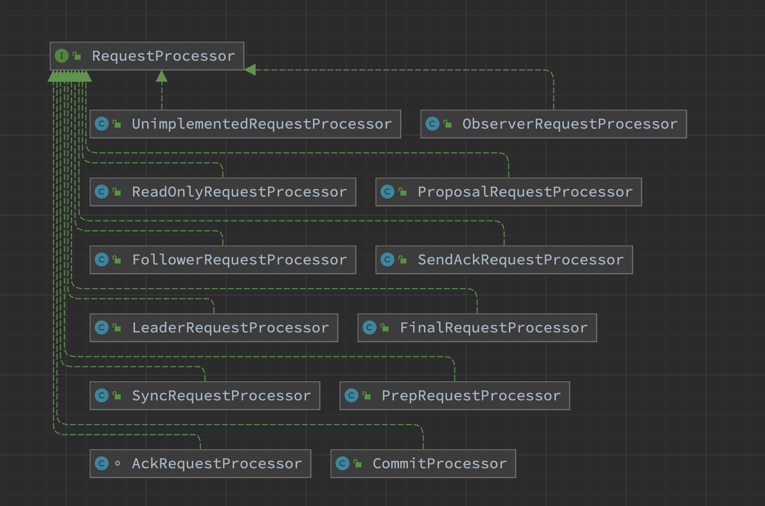

## 请求处理链

对于请求处理链而言，所有请求处理器的父接口为`RequestProcessor`，其框架图如下:



* `AckRequestProcessor`，将前一阶段的请求作为ACK转发给Leader。
* `CommitProcessor`，将到来的请求与本地提交的请求进行匹配，这是因为改变系统状态的本地请求的返回结果是到来的请求。
* `FinalRequestProcessor`，通常是请求处理链的最后一个处理器。
* `FollowerRequestProcessor`，将修改了系统状态的请求转发给Leader。
* `ObserverRequestProcessor`，同`FollowerRequestProcessor`一样，将修改了系统状态的请求转发给Leader。
* `PrepRequestProcessor`，通常是请求处理链的第一个处理器。
* `ProposalRequestProcessor`，将请求转发给`AckRequestProcessor`和`SyncRequestProcessor`。
* `ReadOnlyRequestProcessor`，是`ReadOnlyZooKeeperServer`请求处理链的第一个处理器，将只读请求传递给下个处理器，抛弃改变状态的请求。
* `SendAckRequestProcessor`，发送ACK请求的处理器。
* `SyncRequestProcessor`，发送Sync请求的处理器。
* `ToBeAppliedRequestProcessor`，维护`toBeApplied`列表，下个处理器必须是`FinalRequestProcessor`并且`FinalRequestProcessor`必须同步处理请求。
* `UnimplementedRequestProcessor`，用于管理未知请求。

### 1. RequestProcessor

`RequestProcessor`是所有处理器的父接口，其定义了处理器的处理方法，其源码如下

```
public interface RequestProcessor {
    @SuppressWarnings("serial")
    public static class RequestProcessorException extends Exception {
        public RequestProcessorException(String msg, Throwable t) {
            super(msg, t);
        }
    }
    void processRequest(Request request) throws RequestProcessorException;
    void shutdown();
}
```
说明：`RequestProcessor`源码非常简单，内部类`RequestProcessorException`，用来表示处理过程中的出现的异常，而`processRequest`和`shutdown`方法则是核心方法，是子类必须要实现的方法，处理的主要逻辑在`processRequest`中，通过`processRequest`方法可以将请求传递到下个处理器，通常是单线程的。而`shutdown`表示关闭处理器，其意味着该处理器要关闭和其他处理器的连接。

### 2. PrepRequestProcessor

#### 2.1 类的继承关系　
　
```
public class PrepRequestProcessor extends Thread implements RequestProcessor {}
```

说明：可以看到`PrepRequestProcessor`继承了`Thread`类并实现了`RequestProcessor`接口，表示其可以作为线程使用。

#### 2.2 类的属性

```
public class PrepRequestProcessor extends Thread implements RequestProcessor {
    // 日志记录器
    private static final Logger LOG = LoggerFactory.getLogger(PrepRequestProcessor.class);

    // 是否跳过ACL,需查看系统配置
    static boolean skipACL;
    static {
        skipACL = System.getProperty("zookeeper.skipACL", "no").equals("yes");
        if (skipACL) {
            LOG.info("zookeeper.skipACL==\"yes\", ACL checks will be skipped");
        }
    }

    /**
     * this is only for testing purposes.
     * should never be useed otherwise
     */
    // 仅用作测试使用
    private static  boolean failCreate = false;

    // 已提交请求队列
    LinkedBlockingQueue<Request> submittedRequests = new LinkedBlockingQueue<Request>();

    // 下个处理器
    RequestProcessor nextProcessor;

    // Zookeeper服务器
    ZooKeeperServer zks;
}
```

说明：类的核心属性有`submittedRequests`和`nextProcessor`，前者表示已经提交的请求，而后者表示提交的下个处理器。

#### 2.3 类的构造函数

```
public PrepRequestProcessor(ZooKeeperServer zks, RequestProcessor nextProcessor) {
    // 调用父类Thread构造函数
    super("ProcessThread(sid:" + zks.getServerId()+ " cport:" + zks.getClientPort() + "):");
    // 类属性赋值
    this.nextProcessor = nextProcessor;
    this.zks = zks;
}
```
说明：该构造函数首先会调用父类Thread的构造函数，然后利用构造函数参数给`nextProcessor`和`zks`赋值。

#### 2.4 核心函数分析

##### 2.4.1 run函数

```
public void run() {
    try {
        while (true) { // 无限循环
            // 从队列中取出一个请求
            Request request = submittedRequests.take();
            //
            long traceMask = ZooTrace.CLIENT_REQUEST_TRACE_MASK;
            if (request.type == OpCode.ping) { // 请求类型为PING
                traceMask = ZooTrace.CLIENT_PING_TRACE_MASK;
            }
            if (LOG.isTraceEnabled()) { // 是否可追踪
                ZooTrace.logRequest(LOG, traceMask, 'P', request, "");
            }
            if (Request.requestOfDeath == request) { // 在关闭处理器之后，会添加requestOfDeath，表示关闭后不再处理请求
                break;
            }
            // 调用pRequest函数
            pRequest(request);
        }
    } catch (InterruptedException e) { // 中断异常
        LOG.error("Unexpected interruption", e);
    } catch (RequestProcessorException e) { // 请求处理异常
        if (e.getCause() instanceof XidRolloverException) {
            LOG.info(e.getCause().getMessage());
        }
        LOG.error("Unexpected exception", e);
    } catch (Exception e) { // 其他异常
        LOG.error("Unexpected exception", e);
    }
    LOG.info("PrepRequestProcessor exited loop!");
}
```
说明：run函数是对Thread类run函数的重写，其核心逻辑相对简单，即不断从队列中取出`request`进行处理，其会调用`pRequest`函数，其源码如下

```
protected void pRequest(Request request) throws RequestProcessorException {
    // LOG.info("Prep>>> cxid = " + request.cxid + " type = " +
    // request.type + " id = 0x" + Long.toHexString(request.sessionId));
    // 将请求的hdr和txn设置为null
    request.hdr = null;
    request.txn = null;
    
    try {
        switch (request.type) { // 确定请求类型
            case OpCode.create: // 创建节点请求
            // 新生创建节点请求
            CreateRequest createRequest = new CreateRequest();
            // 处理请求
            pRequest2Txn(request.type, zks.getNextZxid(), request, createRequest, true);
            break;
        case OpCode.delete: // 删除节点请求
            // 新生删除节点请求
            DeleteRequest deleteRequest = new DeleteRequest();               
            // 处理请求
            pRequest2Txn(request.type, zks.getNextZxid(), request, deleteRequest, true);
            break;
        case OpCode.setData: // 设置数据请求
            // 新生设置数据请求
            SetDataRequest setDataRequest = new SetDataRequest();                
            // 处理请求
            pRequest2Txn(request.type, zks.getNextZxid(), request, setDataRequest, true);
            break;
        case OpCode.setACL: // 设置ACL请求
            // 新生设置ACL请求
            SetACLRequest setAclRequest = new SetACLRequest();                
            // 处理请求
            pRequest2Txn(request.type, zks.getNextZxid(), request, setAclRequest, true);
            break;
        case OpCode.check: // 检查版本请求
            // 新生检查版本请求
            CheckVersionRequest checkRequest = new CheckVersionRequest();   
            // 处理请求
            pRequest2Txn(request.type, zks.getNextZxid(), request, checkRequest, true);
            break;
        case OpCode.multi:// 检查版本请求
            // 新生多重请求
            MultiTransactionRecord multiRequest = new MultiTransactionRecord();
            try {
                // 将ByteBuffer转化为Record
                ByteBufferInputStream.byteBuffer2Record(request.request, multiRequest);
            } catch(IOException e) {
               // 出现异常则重新生成Txn头
               request.hdr =  new TxnHeader(request.sessionId, request.cxid, zks.getNextZxid(),
                        zks.getTime(), OpCode.multi);
               throw e;
            }
            List<Txn> txns = new ArrayList<Txn>();
            //Each op in a multi-op must have the same zxid!
            long zxid = zks.getNextZxid();
            KeeperException ke = null;

            //Store off current pending change records in case we need to rollback
            // 存储当前挂起的更改记录，以防我们需要回滚
            HashMap<String, ChangeRecord> pendingChanges = getPendingChanges(multiRequest);

            int index = 0;
            for(Op op: multiRequest) { // 遍历请求
                Record subrequest = op.toRequestRecord() ;

                /* If we've already failed one of the ops, don't bother
                 * trying the rest as we know it's going to fail and it
                 * would be confusing in the logfiles.
                 */
                if (ke != null) { // 发生了异常
                    request.hdr.setType(OpCode.error);
                    request.txn = new ErrorTxn(Code.RUNTIMEINCONSISTENCY.intValue());
                } 
                
                /* Prep the request and convert to a Txn */
                else { // 未发生异常
                    try {
                        // 将Request转化为Txn
                        pRequest2Txn(op.getType(), zxid, request, subrequest, false);
                    } catch (KeeperException e) { // 转化发生异常
                        if (ke == null) {
                            ke = e;
                        }
                        // 设置请求头的类型
                        request.hdr.setType(OpCode.error);
                        // 设置请求的Txn
                        request.txn = new ErrorTxn(e.code().intValue());
                        LOG.info("Got user-level KeeperException when processing "
                                + request.toString() + " aborting remaining multi ops."
                                + " Error Path:" + e.getPath()
                                + " Error:" + e.getMessage());
                        // 设置异常
                        request.setException(e);

                        /* Rollback change records from failed multi-op */
                        // 从多重操作中回滚更改记录
                        rollbackPendingChanges(zxid, pendingChanges);
                    }
                }

                //FIXME: I don't want to have to serialize it here and then
                //       immediately deserialize in next processor. But I'm 
                //       not sure how else to get the txn stored into our list.
                // 序列化
                ByteArrayOutputStream baos = new ByteArrayOutputStream();
                BinaryOutputArchive boa = BinaryOutputArchive.getArchive(baos);
                request.txn.serialize(boa, "request") ;
                ByteBuffer bb = ByteBuffer.wrap(baos.toByteArray());

                txns.add(new Txn(request.hdr.getType(), bb.array()));
                index++;
            }
            
            // 给请求头赋值
            request.hdr = new TxnHeader(request.sessionId, request.cxid, zxid, zks.getTime(), request.type);
            // 设置请求的Txn
            request.txn = new MultiTxn(txns);
            
            break;

        //create/close session don't require request record
        case OpCode.createSession: // 创建会话请求
        case OpCode.closeSession: // 关闭会话请求
            pRequest2Txn(request.type, zks.getNextZxid(), request, null, true);
            break;

        //All the rest don't need to create a Txn - just verify session
        // 所有以下请求只需验证会话即可
        case OpCode.sync: 
        case OpCode.exists:
        case OpCode.getData:
        case OpCode.getACL:
        case OpCode.getChildren:
        case OpCode.getChildren2:
        case OpCode.ping:
        case OpCode.setWatches: 
            zks.sessionTracker.checkSession(request.sessionId,
                    request.getOwner());
            break;
        }
    } catch (KeeperException e) { // 发生KeeperException异常
        if (request.hdr != null) {
            request.hdr.setType(OpCode.error);
            request.txn = new ErrorTxn(e.code().intValue());
        }
        LOG.info("Got user-level KeeperException when processing "
                + request.toString()
                + " Error Path:" + e.getPath()
                + " Error:" + e.getMessage());
        request.setException(e);
    } catch (Exception e) { // 其他异常
        // log at error level as we are returning a marshalling
        // error to the user
        LOG.error("Failed to process " + request, e);

        StringBuilder sb = new StringBuilder();
        ByteBuffer bb = request.request;
        if(bb != null){
            bb.rewind();
            while (bb.hasRemaining()) {
                sb.append(Integer.toHexString(bb.get() & 0xff));
            }
        } else {
            sb.append("request buffer is null");
        }

        LOG.error("Dumping request buffer: 0x" + sb.toString());
        if (request.hdr != null) {
            request.hdr.setType(OpCode.error);
            request.txn = new ErrorTxn(Code.MARSHALLINGERROR.intValue());
        }
    }
    // 给请求的zxid赋值
    request.zxid = zks.getZxid();
    // 传递给下个处理器进行处理
    nextProcessor.processRequest(request);
}
```

说明：pRequest会确定请求类型，并根据请求类型不同生成不同的请求对象，然后调用`pRequest2Txn`函数，其源码如下

```
protected void pRequest2Txn(int type, long zxid, Request request, Record record, boolean deserialize)
        throws KeeperException, IOException, RequestProcessorException {
    // 新生事务头
    request.hdr = new TxnHeader(request.sessionId, request.cxid, zxid, zks.getTime(), type);

    switch (type) { // 确定类型
        case OpCode.create: // 创建节点操作
            // 检查会话，检查会话持有者是否为该owner
            zks.sessionTracker.checkSession(request.sessionId, request.getOwner());
            // 向下转化
            CreateRequest createRequest = (CreateRequest)record;   
            if(deserialize) // 反序列化，将ByteBuffer转化为Record
                ByteBufferInputStream.byteBuffer2Record(request.request, createRequest);
            // 获取节点路径
            String path = createRequest.getPath();
            // 索引最后一个'/'
            int lastSlash = path.lastIndexOf('/');
            if (lastSlash == -1 || path.indexOf('\0') != -1 || failCreate) { // 判断最后一个'/'是否合法
                LOG.info("Invalid path " + path + " with session 0x" + Long.toHexString(request.sessionId));
                throw new KeeperException.BadArgumentsException(path);
            }
            // 移除重复的ACL项
            List<ACL> listACL = removeDuplicates(createRequest.getAcl());
            if (!fixupACL(request.authInfo, listACL)) { // 确保ACL列表不为空
                throw new KeeperException.InvalidACLException(path);
            }
            // 提取节点的父节点路径
            String parentPath = path.substring(0, lastSlash);
            // 获取父节点的Record
            ChangeRecord parentRecord = getRecordForPath(parentPath);
            // 检查ACL列表
            checkACL(zks, parentRecord.acl, ZooDefs.Perms.CREATE, request.authInfo);
            // 获取父节点的Record的子节点版本号
            int parentCVersion = parentRecord.stat.getCversion();
            // 获取创建模式
            CreateMode createMode =
                CreateMode.fromFlag(createRequest.getFlags());
            if (createMode.isSequential()) { // 顺序模式
                // 在路径后添加一串数字
                path = path + String.format(Locale.ENGLISH, "%010d", parentCVersion);
            }
            try {
                // 验证路径
                PathUtils.validatePath(path);
            } catch(IllegalArgumentException ie) {
                LOG.info("Invalid path " + path + " with session 0x" + Long.toHexString(request.sessionId));
                throw new KeeperException.BadArgumentsException(path);
            }
            try {
                if (getRecordForPath(path) != null) {
                    throw new KeeperException.NodeExistsException(path);
                }
            } catch (KeeperException.NoNodeException e) {
                // ignore this one
            }
            // 父节点是否为临时节点
            boolean ephemeralParent = parentRecord.stat.getEphemeralOwner() != 0;
            if (ephemeralParent) { // 父节点为临时节点
                throw new KeeperException.NoChildrenForEphemeralsException(path);
            }
            // 新的子节点版本号
            int newCversion = parentRecord.stat.getCversion()+1;
            // 新生事务
            request.txn = new CreateTxn(path, createRequest.getData(),
                    listACL,
                    createMode.isEphemeral(), newCversion);
            // 
            StatPersisted s = new StatPersisted();
            if (createMode.isEphemeral()) { // 创建节点为临时节点
                s.setEphemeralOwner(request.sessionId);
            }
            // 拷贝
            parentRecord = parentRecord.duplicate(request.hdr.getZxid());
            // 子节点数量加1
            parentRecord.childCount++;
            // 设置新的子节点版本号
            parentRecord.stat.setCversion(newCversion);
            // 将parentRecord添加至outstandingChanges和outstandingChangesForPath中
            addChangeRecord(parentRecord);
            // 将新生成的ChangeRecord(包含了StatPersisted信息)添加至outstandingChanges和outstandingChangesForPath中
            addChangeRecord(new ChangeRecord(request.hdr.getZxid(), path, s, 0, listACL));
            break;
        case OpCode.delete: // 删除节点请求
            // 检查会话，检查会话持有者是否为该owner
            zks.sessionTracker.checkSession(request.sessionId, request.getOwner());
            // 向下转化为DeleteRequest
            DeleteRequest deleteRequest = (DeleteRequest)record;
            if(deserialize) // 反序列化，将ByteBuffer转化为Record
                ByteBufferInputStream.byteBuffer2Record(request.request, deleteRequest);
            // 获取节点路径
            path = deleteRequest.getPath();
            // 索引最后一个'/'
            lastSlash = path.lastIndexOf('/');
            if (lastSlash == -1 || path.indexOf('\0') != -1
                    || zks.getZKDatabase().isSpecialPath(path)) {
                throw new KeeperException.BadArgumentsException(path);
            }
            // 提取节点的父节点路径
            parentPath = path.substring(0, lastSlash);
            // 获取父节点的Record
            parentRecord = getRecordForPath(parentPath);
            // 获取节点的Record
            ChangeRecord nodeRecord = getRecordForPath(path);
            // 检查ACL列表
            checkACL(zks, parentRecord.acl, ZooDefs.Perms.DELETE,
                    request.authInfo);
            // 获取版本
            int version = deleteRequest.getVersion();
            if (version != -1 && nodeRecord.stat.getVersion() != version) {
                throw new KeeperException.BadVersionException(path);
            }
            if (nodeRecord.childCount > 0) { // 该结点有子节点，抛出异常
                throw new KeeperException.NotEmptyException(path);
            }
            // 新生删除事务
            request.txn = new DeleteTxn(path);
            // 拷贝父节点Record
            parentRecord = parentRecord.duplicate(request.hdr.getZxid());
            // 父节点的孩子节点数目减1
            parentRecord.childCount--;
            // // 将parentRecord添加至outstandingChanges和outstandingChangesForPath中
            addChangeRecord(parentRecord);
            // 将新生成的ChangeRecord(包含了StatPersisted信息)添加至outstandingChanges和outstandingChangesForPath中
            addChangeRecord(new ChangeRecord(request.hdr.getZxid(), path,
                    null, -1, null));
            break;
        case OpCode.setData: // 设置数据请求
            // 检查会话，检查会话持有者是否为该owner
            zks.sessionTracker.checkSession(request.sessionId, request.getOwner());
            // 向下转化
            SetDataRequest setDataRequest = (SetDataRequest)record;
            if(deserialize) // 反序列化，将ByteBuffer转化为Record
                ByteBufferInputStream.byteBuffer2Record(request.request, setDataRequest);
            // 获取节点路径
            path = setDataRequest.getPath();
            // 获取节点的Record
            nodeRecord = getRecordForPath(path);
            // 检查ACL列表
            checkACL(zks, nodeRecord.acl, ZooDefs.Perms.WRITE,
                    request.authInfo);
            // 获取请求的版本号
            version = setDataRequest.getVersion();
            // 节点当前版本号
            int currentVersion = nodeRecord.stat.getVersion();
            if (version != -1 && version != currentVersion) {
                throw new KeeperException.BadVersionException(path);
            }
            // 新生版本号
            version = currentVersion + 1;
            // 新生设置数据事务
            request.txn = new SetDataTxn(path, setDataRequest.getData(), version);
            // 拷贝
            nodeRecord = nodeRecord.duplicate(request.hdr.getZxid());
            // 设置版本号
            nodeRecord.stat.setVersion(version);
            // 将nodeRecord添加至outstandingChanges和outstandingChangesForPath中
            addChangeRecord(nodeRecord);
            break;
        case OpCode.setACL: // 设置ACL请求
            // 检查会话，检查会话持有者是否为该owner
            zks.sessionTracker.checkSession(request.sessionId, request.getOwner());
            // 向下转化
            SetACLRequest setAclRequest = (SetACLRequest)record;
            if(deserialize) // 反序列化，将ByteBuffer转化为Record
                ByteBufferInputStream.byteBuffer2Record(request.request, setAclRequest);
            // 获取节点路径
            path = setAclRequest.getPath();
            // 移除重复的ACL项
            listACL = removeDuplicates(setAclRequest.getAcl());
            if (!fixupACL(request.authInfo, listACL)) { // 确保ACL列表不为空
                throw new KeeperException.InvalidACLException(path);
            }
            // 获取节点的Record
            nodeRecord = getRecordForPath(path);
            // 检查ACL列表
            checkACL(zks, nodeRecord.acl, ZooDefs.Perms.ADMIN,
                    request.authInfo);
            // 获取版本号
            version = setAclRequest.getVersion();
            // 当前版本号
            currentVersion = nodeRecord.stat.getAversion();
            if (version != -1 && version != currentVersion) { // 验证版本号
                throw new KeeperException.BadVersionException(path);
            }
            // 新生版本号
            version = currentVersion + 1;
            // 设置请求事务
            request.txn = new SetACLTxn(path, listACL, version);
            // 拷贝
            nodeRecord = nodeRecord.duplicate(request.hdr.getZxid());
            // 设置ACL版本号
            nodeRecord.stat.setAversion(version);
            // 将nodeRecord添加至outstandingChanges和outstandingChangesForPath中
            addChangeRecord(nodeRecord);
            break;
        case OpCode.createSession: // 创建会话请求
            // 将request缓冲区rewind
            request.request.rewind();
            // 获取缓冲区大小
            int to = request.request.getInt();
            // 创建会话事务
            request.txn = new CreateSessionTxn(to);
            // 再次将request缓冲区rewind
            request.request.rewind();
            // 添加session
            zks.sessionTracker.addSession(request.sessionId, to);
            // 设置会话的owner
            zks.setOwner(request.sessionId, request.getOwner());
            break;
        case OpCode.closeSession: // 关闭会话请求
            // We don't want to do this check since the session expiration thread
            // queues up this operation without being the session owner.
            // this request is the last of the session so it should be ok
            //zks.sessionTracker.checkSession(request.sessionId, request.getOwner());
            // 获取会话所有的临时节点
            HashSet<String> es = zks.getZKDatabase()
                    .getEphemerals(request.sessionId);
            synchronized (zks.outstandingChanges) {
                for (ChangeRecord c : zks.outstandingChanges) { // 遍历outstandingChanges队列的所有ChangeRecord
                    if (c.stat == null) { // 若其stat为null
                        // Doing a delete
                        // 则从es中移除其路径
                        es.remove(c.path);
                    } else if (c.stat.getEphemeralOwner() == request.sessionId) { // 若临时节点属于该会话
                        // 则将其路径添加至es中
                        es.add(c.path);
                    }
                }
                for (String path2Delete : es) { // 遍历es
                    // 新生ChangeRecord，并将其添加至outstandingChanges和outstandingChangesForPath中
                    addChangeRecord(new ChangeRecord(request.hdr.getZxid(),
                            path2Delete, null, 0, null));
                }
                
                // 关闭会话
                zks.sessionTracker.setSessionClosing(request.sessionId);
            }

            LOG.info("Processed session termination for sessionid: 0x"
                    + Long.toHexString(request.sessionId));
            break;
        case OpCode.check: // 检查请求
            // 检查会话，检查会话持有者是否为该owner
            zks.sessionTracker.checkSession(request.sessionId, request.getOwner());
            // 向下转化
            CheckVersionRequest checkVersionRequest = (CheckVersionRequest)record;
            if(deserialize) // 反序列化，将ByteBuffer转化为Record
                ByteBufferInputStream.byteBuffer2Record(request.request, checkVersionRequest);
            // 获取节点路径
            path = checkVersionRequest.getPath();
            // 获取节点的Record
            nodeRecord = getRecordForPath(path);
            // 检查ACL列表
            checkACL(zks, nodeRecord.acl, ZooDefs.Perms.READ, request.authInfo);
            // 获取版本号
            version = checkVersionRequest.getVersion();
            // 当前版本号
            currentVersion = nodeRecord.stat.getVersion();
            if (version != -1 && version != currentVersion) { // 验证版本号
                throw new KeeperException.BadVersionException(path);
            }
            // 新生版本号
            version = currentVersion + 1;
            // 新生请求的事务
            request.txn = new CheckVersionTxn(path, version);
            break;
    }
}
```

说明：`pRequest2Txn`会根据不同的请求类型进行不同的验证，如对创建节点而言，其会进行会话验证，ACL列表验证，节点路径验证及判断创建节点的类型（顺序节点、临时节点等）而进行不同操作，同时还会使父节点的子节点数目加1，之后会再调用`addChangeRecord`函数将`ChangeRecord`添加至`ZooKeeperServer`的`outstandingChanges`和`outstandingChangesForPath`中。

在`pRequest`函数中，如果请求类型是多重操作，那么会调用`getPendingChanges`函数，其会获取挂起的更改，其源码如下

```
HashMap<String, ChangeRecord> getPendingChanges(MultiTransactionRecord multiRequest) {
    HashMap<String, ChangeRecord> pendingChangeRecords = new HashMap<String, ChangeRecord>();

    for(Op op: multiRequest) { // 
        String path = op.getPath();

        try {
            // 获取path对应的ChangeRecord
            ChangeRecord cr = getRecordForPath(path);
            if (cr != null) { 
                pendingChangeRecords.put(path, cr);
            }
            /*
             * ZOOKEEPER-1624 - We need to store for parent's ChangeRecord
             * of the parent node of a request. So that if this is a
             * sequential node creation request, rollbackPendingChanges()
             * can restore previous parent's ChangeRecord correctly.
             *
             * Otherwise, sequential node name generation will be incorrect
             * for a subsequent request.
             */
            int lastSlash = path.lastIndexOf('/');
            if (lastSlash == -1 || path.indexOf('\0') != -1) {
                continue;
            }
            // 提取节点的父节点路径
            String parentPath = path.substring(0, lastSlash);
            // 获取父节点的Record
            ChangeRecord parentCr = getRecordForPath(parentPath);
            if (parentCr != null) {
                pendingChangeRecords.put(parentPath, parentCr);
            }
        } catch (KeeperException.NoNodeException e) {
            // ignore this one
        }
    }
    
    return pendingChangeRecords;
}
```
说明：可以看到在函数中，会遍历多重操作，针对每个操作，通过其路径获取对应的Record，然后添加至`pendingChangeRecords`，然后对其父节点进行相应操作，之后返回，其中会调用`getRecordForPath`函数，其源码如下

```
ChangeRecord getRecordForPath(String path) throws KeeperException.NoNodeException {
    ChangeRecord lastChange = null;
    synchronized (zks.outstandingChanges) { // 同步块
        // 先从outstandingChangesForPath队列中获取
        lastChange = zks.outstandingChangesForPath.get(path);
        /*
        for (int i = 0; i < zks.outstandingChanges.size(); i++) {
            ChangeRecord c = zks.outstandingChanges.get(i);
            if (c.path.equals(path)) {
                lastChange = c;
            }
        }
        */
        if (lastChange == null) { // 若在outstandingChangesForPath中未获取到，则从数据库中获取
            DataNode n = zks.getZKDatabase().getNode(path);
            if (n != null) { // 节点存在
                Long acl;
                Set<String> children;
                synchronized(n) {
                    acl = n.acl;
                    children = n.getChildren();
                }
                // 新生ChangeRecord
                lastChange = new ChangeRecord(-1, path, n.stat,
                children != null ? children.size() : 0,
                zks.getZKDatabase().convertLong(acl));
            }
        }
    }
    if (lastChange == null || lastChange.stat == null) { // 抛出异常
        throw new KeeperException.NoNodeException(path);
    }
    return lastChange;
}
```
说明：其表示根据节点路径获取节点的`Record`，其首先会从`outstandingChangesForPath`中获取路径对应的Record，若未获取成功，则从`Zookeeper`数据库中获取，若还未存在，则抛出异常。

##### 2.4.2 processResult函数
```
public void processRequest(Request request) {
    // request.addRQRec(">prep="+zks.outstandingChanges.size());
    // 将请求添加至队列中
    submittedRequests.add(request);
}
```
说明：该函数是对父接口函数的实现，其主要作用是将请求添加至`submittedRequests`队列进行后续处理（run函数中）。

### 3. SyncRequestProcessor

#### 3.1 类的继承关系

```
public class SyncRequestProcessor extends Thread implements RequestProcessor {}
```
说明：与`PrepRequestProcessor`一样，`SyncRequestProcessor`也继承了`Thread`类并实现了`RequestProcessor`接口，表示其可以作为线程使用。

#### 3.2 类的属性

```
public class SyncRequestProcessor extends Thread implements RequestProcessor {
    // 日志
    private static final Logger LOG = LoggerFactory.getLogger(SyncRequestProcessor.class);
    // Zookeeper服务器
    private final ZooKeeperServer zks;
    // 请求队列
    private final LinkedBlockingQueue<Request> queuedRequests = new LinkedBlockingQueue<Request>();
    // 下个处理器
    private final RequestProcessor nextProcessor;
    // 快照处理线程
    private Thread snapInProcess = null;
    // 是否在运行中
    volatile private boolean running;

    /**
     * Transactions that have been written and are waiting to be flushed to
     * disk. Basically this is the list of SyncItems whose callbacks will be
     * invoked after flush returns successfully.
     */
    // 等待被刷新到磁盘的请求队列
    private final LinkedList<Request> toFlush = new LinkedList<Request>();
    
    // 随机数生成器
    private final Random r = new Random(System.nanoTime());
    /**
     * The number of log entries to log before starting a snapshot
     */
    // 快照个数
    private static int snapCount = ZooKeeperServer.getSnapCount();
    
    /**
     * The number of log entries before rolling the log, number
     * is chosen randomly
     */
    // 日志滚动之前记录的日志号，编号是随机选择的
    private static int randRoll;

    // 结束请求标识
    private final Request requestOfDeath = Request.requestOfDeath;
}
```
说明：其中，`SyncRequestProcessor`维护了`ZooKeeperServer`实例，其用于获取`ZooKeeper`的数据库和其他信息；维护了一个处理请求的队列，其用于存放请求；维护了一个处理快照的线程，用于处理快照；维护了一个`running`标识，标识`SyncRequestProcessor`是否在运行；同时还维护了一个等待被刷新到磁盘的请求队列。

#### 3.3 类的构造函数

```
public SyncRequestProcessor(ZooKeeperServer zks, RequestProcessor nextProcessor) {
    // 调用父类构造函数
    super("SyncThread:" + zks.getServerId());
    // 给字段赋值
    this.zks = zks;
    this.nextProcessor = nextProcessor;
    running = true;
}
```

说明：构造函数首先会调用Thread类的构造函数，然后根据构造函数参数给类的属性赋值，其中会确定下个处理器，并会设置该处理器正在运行的标识。

#### 3.4 类的核心函数分析

##### 3.4.1 run函数

```
public void run() {
    try {
        // 写日志数量初始化为0
        int logCount = 0;

        // we do this in an attempt to ensure that not all of the servers
        // in the ensemble take a snapshot at the same time
        // 确保所有的服务器在同一时间不是使用的同一个快照
        setRandRoll(r.nextInt(snapCount/2));
        while (true) { // 
            // 初始请求为null
            Request si = null;
            if (toFlush.isEmpty()) { // 没有需要刷新到磁盘的请求
                // 从请求队列中取出一个请求，若队列为空会阻塞
                si = queuedRequests.take();
            } else { // 队列不为空，即有需要刷新到磁盘的请求
                // 从请求队列中取出一个请求，若队列为空，则返回空，不会阻塞
                si = queuedRequests.poll();
                if (si == null) { // 取出的请求为空
                    // 刷新到磁盘
                    flush(toFlush);
                    // 跳过后面的处理
                    continue;
                }
            }
            if (si == requestOfDeath) { // 在关闭处理器之后，会添加requestOfDeath，表示关闭后不再处理请求
                break;
            }
            if (si != null) { // 请求不为空
                // track the number of records written to the log
                if (zks.getZKDatabase().append(si)) { // 将请求添加至日志文件，只有事务性请求才会返回true
                    // 写入一条日志，logCount加1
                    logCount++;
                    if (logCount > (snapCount / 2 + randRoll)) { // 满足roll the log的条件
                        randRoll = r.nextInt(snapCount/2);
                        // roll the log
                        zks.getZKDatabase().rollLog();
                        // take a snapshot
                        if (snapInProcess != null && snapInProcess.isAlive()) { // 正在进行快照
                            LOG.warn("Too busy to snap, skipping");
                        } else { // 未被处理
                            snapInProcess = new Thread("Snapshot Thread") { // 创建线程来处理快照
                                    public void run() {
                                        try {
                                            // 进行快照
                                            zks.takeSnapshot();
                                        } catch(Exception e) {
                                            LOG.warn("Unexpected exception", e);
                                        }
                                    }
                                };
                            // 开始处理
                            snapInProcess.start();
                        }
                        // 重置为0
                        logCount = 0;
                    }
                } else if (toFlush.isEmpty()) { // 等待被刷新到磁盘的请求队列为空
                    // optimization for read heavy workloads
                    // iff this is a read, and there are no pending
                    // flushes (writes), then just pass this to the next
                    // processor
                    // 查看此时toFlush是否为空，如果为空，说明近段时间读多写少，直接响应
                    if (nextProcessor != null) { // 下个处理器不为空
                        // 下个处理器开始处理请求
                        nextProcessor.processRequest(si);
                        if (nextProcessor instanceof Flushable) { // 处理器是Flushable的
                            // 刷新到磁盘
                            ((Flushable)nextProcessor).flush();
                        }
                    }
                    // 跳过后续处理
                    continue;
                }
                // 将请求添加至被刷新至磁盘队列
                toFlush.add(si);
                if (toFlush.size() > 1000) { // 队列大小大于1000，直接刷新到磁盘
                    flush(toFlush);
                }
            }
        }
    } catch (Throwable t) { // 出现异常
        LOG.error("Severe unrecoverable error, exiting", t);
        // 设置运行标识为false，表示该处理器不再运行
        running = false;
        // 退出程序
        System.exit(11);
    }
    LOG.info("SyncRequestProcessor exited!");
}
```
说明：该函数是整个处理器的核心，其逻辑大致如下

* 1.设置`randRoll`大小，确保所有的服务器在同一时间不是使用的同一个快照。
* 2.判断`toFlush`队列是否为空，若是，则表示没有需要刷新到磁盘的请求，进入**3**，若否，进入**4**。
* 3.从`queuedRequests`中取出一个请求，进入**6**。
* 4.从`queuedRequests`中取出一个请求，判断该请求是否为`null`，若是，则进入**5**，若否，则进入**6**。
* 5.调用`flush`函数，将`toFlush`中的请求刷新到磁盘，跳过之后的处理部分。
* 6.判断请求是否是结束请求（在调用`shutdown`之后，会在队列中添加一个`requestOfDeath`）。若是，则退出，否则，进入**7**。
* 7.判断请求是否为`null`，若否，则进入**8**，否则进入**2**。
* 8.若写入日志成功，返回`true`（表示为事务性请求），进入**9**，否则进入**18**。
* 9.`logCount`加1，并判断是否大于了阈值，若是，则进入**10**，否则进入**18**。
* 10.调用`rollLog`函数翻转日志文件。
* 11.判断`snapInProcess`是否为空并且是否存活，若是，则输出日志，否则，进入**12**。
* 12.创建`snapInProcess`线程并启动。
* 13.重置`logCount`为0。
* 14.判断`toFlush`队列是否为空，若是，进入**15**。
* 15.判断`nextProcessor`是否为空，若否，则使用`nextProcessor`处理请求，否则进入**16**。
* 16.判断`nextProcessor`是否是`Flushable`的，若是，则调用`flush`函数刷新请求至磁盘，否则进入**17**
* 17.跳过之后的处理步骤。
* 18.将请求添加至`toFlush`队列。
* 19.若`toFlush`队列大小大于1000，则刷新至磁盘，进入**2**。

其中会调用`flush`函数，其源码如下

```
// 刷新到磁盘
private void flush(LinkedList<Request> toFlush) throws IOException, RequestProcessorException {
    if (toFlush.isEmpty()) // 队列为空，返回
        return;

    // 提交至ZK数据库
    zks.getZKDatabase().commit();
    while (!toFlush.isEmpty()) { // 队列不为空
        // 从队列移除请求
        Request i = toFlush.remove();
        if (nextProcessor != null) { // 下个处理器不为空
            // 下个处理器开始处理请求
            nextProcessor.processRequest(i);
        }
    }
    if (nextProcessor != null && nextProcessor instanceof Flushable) { // 下个处理器不为空并且是Flushable的
        // 刷新到磁盘
        ((Flushable)nextProcessor).flush();
    }
}
```
说明：该函数主要用于将`toFlush`队列中的请求刷新到磁盘中。

##### 3.4.2 shutdown函数

```
public void shutdown() {
    LOG.info("Shutting down");
    // 添加结束请求请求至队列
    queuedRequests.add(requestOfDeath);
    try {
        if(running){ // 还在运行
            // 等待该线程终止
            this.join();
        }
        if (!toFlush.isEmpty()) { // 队列不为空
            // 刷新到磁盘
            flush(toFlush);
        }
    } catch(InterruptedException e) {
        LOG.warn("Interrupted while wating for " + this + " to finish");
    } catch (IOException e) {
        LOG.warn("Got IO exception during shutdown");
    } catch (RequestProcessorException e) {
        LOG.warn("Got request processor exception during shutdown");
    }
    if (nextProcessor != null) {
        nextProcessor.shutdown();
    }
}
```
说明：该函数用于关闭`SyncRequestProcessor`处理器，其首先会在`queuedRequests`队列中添加一个结束请求，然后再判断`SyncRequestProcessor`是否还在运行，若是，则会等待其结束；之后判断`toFlush`队列是否为空，若不为空，则刷新到磁盘中。

### 4. FinalRequestProcessor

#### 4.1 类的继承关系
```
public class FinalRequestProcessor implements RequestProcessor {}
```
说明：`FinalRequestProcessor`只实现了`RequestProcessor`接口，其需要实现`processRequest`方法和`shutdown`方法。

#### 4.2 类的属性
```
public class FinalRequestProcessor implements RequestProcessor {
    private static final Logger LOG = LoggerFactory.getLogger(FinalRequestProcessor.class);

    // ZooKeeper服务器
    ZooKeeperServer zks;
}
```
说明：其核心属性为`zks`，表示`Zookeeper`服务器，可以通过`zks`访问到`Zookeeper`内存数据库。

#### 4.3 类的构造函数

```
public FinalRequestProcessor(ZooKeeperServer zks) {
    this.zks = zks;
}
```

#### 4.4 核心函数分析

##### 4.4.1 processRequest

```
public void processRequest(Request request) {
    if (LOG.isDebugEnabled()) {
        LOG.debug("Processing request:: " + request);
    }
    // request.addRQRec(">final");
    long traceMask = ZooTrace.CLIENT_REQUEST_TRACE_MASK;
    if (request.type == OpCode.ping) { // 请求类型为PING
        traceMask = ZooTrace.SERVER_PING_TRACE_MASK;
    }
    if (LOG.isTraceEnabled()) {
        ZooTrace.logRequest(LOG, traceMask, 'E', request, "");
    }
    ProcessTxnResult rc = null;
    synchronized (zks.outstandingChanges) { // 同步块
        // outstandingChanges不为空且首个元素的zxid小于请求的zxid
        while (!zks.outstandingChanges.isEmpty() && zks.outstandingChanges.get(0).zxid <= request.zxid) {  
            // 移除首个元素
            ChangeRecord cr = zks.outstandingChanges.remove(0);
            if (cr.zxid < request.zxid) { // 若Record的zxid小于请求的zxid
                LOG.warn("Zxid outstanding " + cr.zxid + " is less than current " + request.zxid);
            }
            if (zks.outstandingChangesForPath.get(cr.path) == cr) { // 根据路径得到Record并判断是否为cr
                // 移除cr的路径对应的记录
                zks.outstandingChangesForPath.remove(cr.path);
            }
        }
        if (request.hdr != null) { // 请求头不为空
            // 获取请求头
           TxnHeader hdr = request.hdr;
           // 获取请求事务
           Record txn = request.txn;
            // 处理事务
           rc = zks.processTxn(hdr, txn);
        }
        // do not add non quorum packets to the queue.
        if (Request.isQuorum(request.type)) { // 只将quorum包（事务性请求）添加进队列
            zks.getZKDatabase().addCommittedProposal(request);
        }
    }

    if (request.hdr != null && request.hdr.getType() == OpCode.closeSession) { // 请求头不为空并且请求类型为关闭会话
        ServerCnxnFactory scxn = zks.getServerCnxnFactory();
        // this might be possible since
        // we might just be playing diffs from the leader
        if (scxn != null && request.cnxn == null) { // 
            // calling this if we have the cnxn results in the client's
            // close session response being lost - we've already closed
            // the session/socket here before we can send the closeSession
            // in the switch block below
            // 关闭会话
            scxn.closeSession(request.sessionId);
            return;
        }
    }

    if (request.cnxn == null) { // 请求的cnxn为空，直接返回 
        return;
    }
    ServerCnxn cnxn = request.cnxn;

    String lastOp = "NA";
    zks.decInProcess();
    Code err = Code.OK;
    Record rsp = null;
    boolean closeSession = false;
    try {
        if (request.hdr != null && request.hdr.getType() == OpCode.error) {
            throw KeeperException.create(KeeperException.Code.get(((ErrorTxn) request.txn).getErr()));
        }

        KeeperException ke = request.getException();
        if (ke != null && request.type != OpCode.multi) {
            throw ke;
        }

        if (LOG.isDebugEnabled()) {
            LOG.debug("{}",request);
        }
        switch (request.type) {
        case OpCode.ping: { // PING请求
            // 更新延迟
            zks.serverStats().updateLatency(request.createTime);

            lastOp = "PING";
            // 更新响应的状态
            cnxn.updateStatsForResponse(request.cxid, request.zxid, lastOp, request.createTime, System.currentTimeMillis());
            // 设置响应
            cnxn.sendResponse(new ReplyHeader(-2, zks.getZKDatabase().getDataTreeLastProcessedZxid(), 0), null, "response");
            return;
        }
        case OpCode.createSession: { // 创建会话请求
            // 更新延迟
            zks.serverStats().updateLatency(request.createTime);
            
            lastOp = "SESS";
            // 更新响应的状态
            cnxn.updateStatsForResponse(request.cxid, request.zxid, lastOp,
                    request.createTime, System.currentTimeMillis());
            // 结束会话初始化
            zks.finishSessionInit(request.cnxn, true);
            return;
        }
        case OpCode.multi: { // 多重操作
            
            lastOp = "MULT";
            rsp = new MultiResponse() ;

            for (ProcessTxnResult subTxnResult : rc.multiResult) { // 遍历多重操作结果

                OpResult subResult ;

                switch (subTxnResult.type) { // 确定每个操作类型
                    case OpCode.check: // 检查
                        subResult = new CheckResult();
                        break;
                    case OpCode.create: // 创建
                        subResult = new CreateResult(subTxnResult.path);
                        break;
                    case OpCode.delete: // 删除
                        subResult = new DeleteResult();
                        break;
                    case OpCode.setData: // 设置数据
                        subResult = new SetDataResult(subTxnResult.stat);
                        break;
                    case OpCode.error: // 错误
                        subResult = new ErrorResult(subTxnResult.err) ;
                        break;
                    default: 
                        throw new IOException("Invalid type of op");
                }
                // 添加至响应结果集中
                ((MultiResponse)rsp).add(subResult);
            }

            break;
        }
        case OpCode.create: { // 创建
            lastOp = "CREA";
            // 创建响应
            rsp = new CreateResponse(rc.path);
            err = Code.get(rc.err);
            break;
        }
        case OpCode.delete: { // 删除
            lastOp = "DELE";
            err = Code.get(rc.err);
            break;
        }
        case OpCode.setData: { // 设置数据
            lastOp = "SETD";
            rsp = new SetDataResponse(rc.stat);
            err = Code.get(rc.err);
            break;
        }
        case OpCode.setACL: { // 设置ACL
            lastOp = "SETA";
            rsp = new SetACLResponse(rc.stat);
            err = Code.get(rc.err);
            break;
        }
        case OpCode.closeSession: { // 关闭会话
            lastOp = "CLOS";
            closeSession = true;
            err = Code.get(rc.err);
            break;
        }
        case OpCode.sync: { // 同步
            lastOp = "SYNC";
            SyncRequest syncRequest = new SyncRequest();
            ByteBufferInputStream.byteBuffer2Record(request.request, syncRequest);
            rsp = new SyncResponse(syncRequest.getPath());
            break;
        }
        case OpCode.check: { // 检查
            lastOp = "CHEC";
            rsp = new SetDataResponse(rc.stat);
            err = Code.get(rc.err);
            break;
        }
        case OpCode.exists: { // 存在性判断
            lastOp = "EXIS";
            // TODO we need to figure out the security requirement for this!
            ExistsRequest existsRequest = new ExistsRequest();
            // 将byteBuffer转化为Record
            ByteBufferInputStream.byteBuffer2Record(request.request, existsRequest);
            String path = existsRequest.getPath();
            if (path.indexOf('\0') != -1) {
                throw new KeeperException.BadArgumentsException();
            }
            Stat stat = zks.getZKDatabase().statNode(path, existsRequest .getWatch() ? cnxn : null);
            rsp = new ExistsResponse(stat);
            break;
        }
        case OpCode.getData: { // 获取数据
            lastOp = "GETD";
            GetDataRequest getDataRequest = new GetDataRequest();
            ByteBufferInputStream.byteBuffer2Record(request.request, getDataRequest);
            DataNode n = zks.getZKDatabase().getNode(getDataRequest.getPath());
            if (n == null) {
                throw new KeeperException.NoNodeException();
            }
            Long aclL;
            synchronized(n) {
                aclL = n.acl;
            }
            PrepRequestProcessor.checkACL(zks, zks.getZKDatabase().convertLong(aclL), ZooDefs.Perms.READ, request.authInfo);
            Stat stat = new Stat();
            byte b[] = zks.getZKDatabase().getData(getDataRequest.getPath(), stat, getDataRequest.getWatch() ? cnxn : null);
            rsp = new GetDataResponse(b, stat);
            break;
        }
        case OpCode.setWatches: { // 设置watch
            lastOp = "SETW";
            SetWatches setWatches = new SetWatches();
            // XXX We really should NOT need this!!!!
            request.request.rewind();
            ByteBufferInputStream.byteBuffer2Record(request.request, setWatches);
            long relativeZxid = setWatches.getRelativeZxid();
            zks.getZKDatabase().setWatches(relativeZxid, 
                    setWatches.getDataWatches(), 
                    setWatches.getExistWatches(),
                    setWatches.getChildWatches(), cnxn);
            break;
        }
        case OpCode.getACL: { // 获取ACL
            lastOp = "GETA";
            GetACLRequest getACLRequest = new GetACLRequest();
            ByteBufferInputStream.byteBuffer2Record(request.request, getACLRequest);
            Stat stat = new Stat();
            List<ACL> acl = zks.getZKDatabase().getACL(getACLRequest.getPath(), stat);
            rsp = new GetACLResponse(acl, stat);
            break;
        }
        case OpCode.getChildren: { // 获取子节点
            lastOp = "GETC";
            GetChildrenRequest getChildrenRequest = new GetChildrenRequest();
            ByteBufferInputStream.byteBuffer2Record(request.request, getChildrenRequest);
            DataNode n = zks.getZKDatabase().getNode(getChildrenRequest.getPath());
            if (n == null) {
                throw new KeeperException.NoNodeException();
            }
            Long aclG;
            synchronized(n) {
                aclG = n.acl;
                
            }
            PrepRequestProcessor.checkACL(zks, zks.getZKDatabase().convertLong(aclG),  ZooDefs.Perms.READ, request.authInfo);
            List<String> children = zks.getZKDatabase().getChildren(getChildrenRequest.getPath(), null, getChildrenRequest.getWatch() ? cnxn : null);
            rsp = new GetChildrenResponse(children);
            break;
        }
        case OpCode.getChildren2: {
            lastOp = "GETC";
            GetChildren2Request getChildren2Request = new GetChildren2Request();
            ByteBufferInputStream.byteBuffer2Record(request.request, getChildren2Request);
            Stat stat = new Stat();
            DataNode n = zks.getZKDatabase().getNode(getChildren2Request.getPath());
            if (n == null) {
                throw new KeeperException.NoNodeException();
            }
            Long aclG;
            synchronized(n) {
                aclG = n.acl;
            }
            PrepRequestProcessor.checkACL(zks, zks.getZKDatabase().convertLong(aclG), ZooDefs.Perms.READ, request.authInfo);
            List<String> children = zks.getZKDatabase().getChildren( getChildren2Request.getPath(), stat, getChildren2Request.getWatch() ? cnxn : null);
            rsp = new GetChildren2Response(children, stat);
            break;
        }
        }
    } catch (SessionMovedException e) {
        // session moved is a connection level error, we need to tear
        // down the connection otw ZOOKEEPER-710 might happen
        // ie client on slow follower starts to renew session, fails
        // before this completes, then tries the fast follower (leader)
        // and is successful, however the initial renew is then 
        // successfully fwd/processed by the leader and as a result
        // the client and leader disagree on where the client is most
        // recently attached (and therefore invalid SESSION MOVED generated)
        cnxn.sendCloseSession();
        return;
    } catch (KeeperException e) {
        err = e.code();
    } catch (Exception e) {
        // log at error level as we are returning a marshalling
        // error to the user
        LOG.error("Failed to process " + request, e);
        StringBuilder sb = new StringBuilder();
        ByteBuffer bb = request.request;
        bb.rewind();
        while (bb.hasRemaining()) {
            sb.append(Integer.toHexString(bb.get() & 0xff));
        }
        LOG.error("Dumping request buffer: 0x" + sb.toString());
        err = Code.MARSHALLINGERROR;
    }

    long lastZxid = zks.getZKDatabase().getDataTreeLastProcessedZxid();
    ReplyHeader hdr = new ReplyHeader(request.cxid, lastZxid, err.intValue());

    zks.serverStats().updateLatency(request.createTime);
    cnxn.updateStatsForResponse(request.cxid, lastZxid, lastOp, request.createTime, System.currentTimeMillis());

    try {
        cnxn.sendResponse(hdr, rsp, "response");
        if (closeSession) {
            cnxn.sendCloseSession();
        }
    } catch (IOException e) {
        LOG.error("FIXMSG",e);
    }
}

```

说明：对于·函数，进行分段分析

```
if (LOG.isDebugEnabled()) {
    LOG.debug("Processing request:: " + request);
}
// request.addRQRec(">final");
long traceMask = ZooTrace.CLIENT_REQUEST_TRACE_MASK;
if (request.type == OpCode.ping) { // 请求类型为PING
    traceMask = ZooTrace.SERVER_PING_TRACE_MASK;
}
if (LOG.isTraceEnabled()) {
    ZooTrace.logRequest(LOG, traceMask, 'E', request, "");
}
```

说明：可以看到其主要作用是判断是否为`PING`请求，同时会根据LOG的设置确定是否进行日志记录，接着下面代码

```
synchronized (zks.outstandingChanges) { // 同步块
    while (!zks.outstandingChanges.isEmpty()
        && zks.outstandingChanges.get(0).zxid <= request.zxid) { // outstandingChanges不为空且首个元素的zxid小于等于请求的zxid
        // 移除首个元素
        ChangeRecord cr = zks.outstandingChanges.remove(0);
        if (cr.zxid < request.zxid) { // 若Record的zxid小于请求的zxid
            LOG.warn("Zxid outstanding " + cr.zxid + " is less than current " + request.zxid);
        }
        if (zks.outstandingChangesForPath.get(cr.path) == cr) { // 根据路径得到Record并判断是否为cr
            // 移除cr的路径对应的记录
            zks.outstandingChangesForPath.remove(cr.path);
        }
    }
    if (request.hdr != null) { // 请求头不为空
        // 获取请求头
        TxnHeader hdr = request.hdr;
        // 获取请求事务
        Record txn = request.txn;
        // 处理事务
        rc = zks.processTxn(hdr, txn);
    }
    // do not add non quorum packets to the queue.
    if (Request.isQuorum(request.type)) { // 只将quorum包（事务性请求）添加进队列
        zks.getZKDatabase().addCommittedProposal(request);
    }
}
```
说明：同步块处理，当`outstandingChanges`不为空且其首元素的`zxid`小于等于请求的`zxid`时，就会一直从`outstandingChanges`中取出首元素，并且对`outstandingChangesForPath`做相应的操作，若请求头不为空，则处理请求。若为事务性请求，则提交到`ZooKeeper`内存数据库中。对于`processTxn`函数而言，其最终会调用`DataTree`的`processTxn`，即内存数据库结构的`DataTree`的处理事务函数，而判断是否为事务性请求则是通过调用`isQuorum`函数，会改变服务器状态的（事务性）请求就是`Quorum`。之后调用`addCommittedProposal`函数将请求添加至`ZKDatabase`的`committedLog`结构中，方便`follower`快速同步。

接下来会根据请求的类型进行相应的操作，如对于PING请求而言，其处理如下

```
case OpCode.ping: { // PING请求
    // 更新延迟
    zks.serverStats().updateLatency(request.createTime);

    lastOp = "PING";
    // 更新响应的状态
    cnxn.updateStatsForResponse(request.cxid, request.zxid, lastOp, request.createTime, System.currentTimeMillis());
    // 设置响应
    cnxn.sendResponse(new ReplyHeader(-2, zks.getZKDatabase().getDataTreeLastProcessedZxid(), 0), null, "response");
    return;
}
```
说明：其首先会根据请求的创建时间来更新`Zookeeper`服务器的延迟，`updateLatency`函数中会记录最大延迟、最小延迟、总的延迟和延迟次数。然后更新响应中的状态，如请求创建到响应该请求总共花费的时间、最后的操作类型等。然后设置响应后返回。而对于创建会话请求而言，其处理如下

```
case OpCode.createSession: { // 创建会话请求
    // 更新延迟
    zks.serverStats().updateLatency(request.createTime);

    lastOp = "SESS";
    // 更新响应的状态
    cnxn.updateStatsForResponse(request.cxid, request.zxid, lastOp, request.createTime, System.currentTimeMillis());
    // 结束会话初始化
    zks.finishSessionInit(request.cnxn, true);
    return;
}
```
说明：其首先还是会根据请求的创建时间来更新`Zookeeper`服务器的延迟，然后设置最后的操作类型，然后更新响应的状态，之后调用`finishSessionInit`函数表示结束会话的初始化。其他请求与此类似，之后会根据其他请求再次更新服务器的延迟，设置响应的状态等，最后使用`sendResponse`函数将响应发送给请求方，其处理流程如下

```
// 获取最后处理的zxid
long lastZxid = zks.getZKDatabase().getDataTreeLastProcessedZxid();
// 响应头
ReplyHeader hdr = new ReplyHeader(request.cxid, lastZxid, err.intValue());
// 更新服务器延迟
zks.serverStats().updateLatency(request.createTime);
// 更新状态
cnxn.updateStatsForResponse(request.cxid, lastZxid, lastOp,
request.createTime, System.currentTimeMillis());

try {
    // 返回响应
    cnxn.sendResponse(hdr, rsp, "response");
    if (closeSession) {
        // 关闭会话
        cnxn.sendCloseSession();
    }
} catch (IOException e) {
    LOG.error("FIXMSG",e);
}
```
