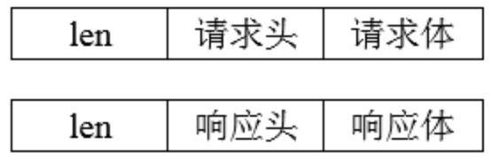
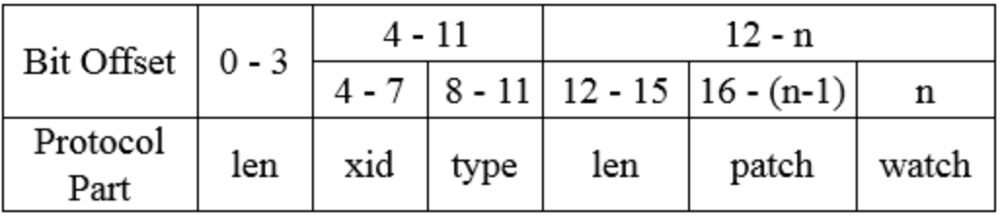
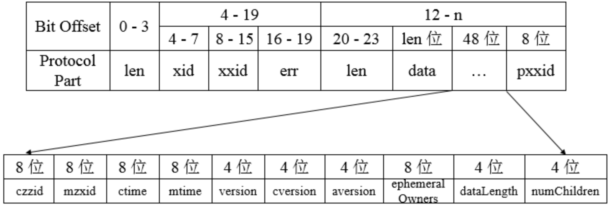
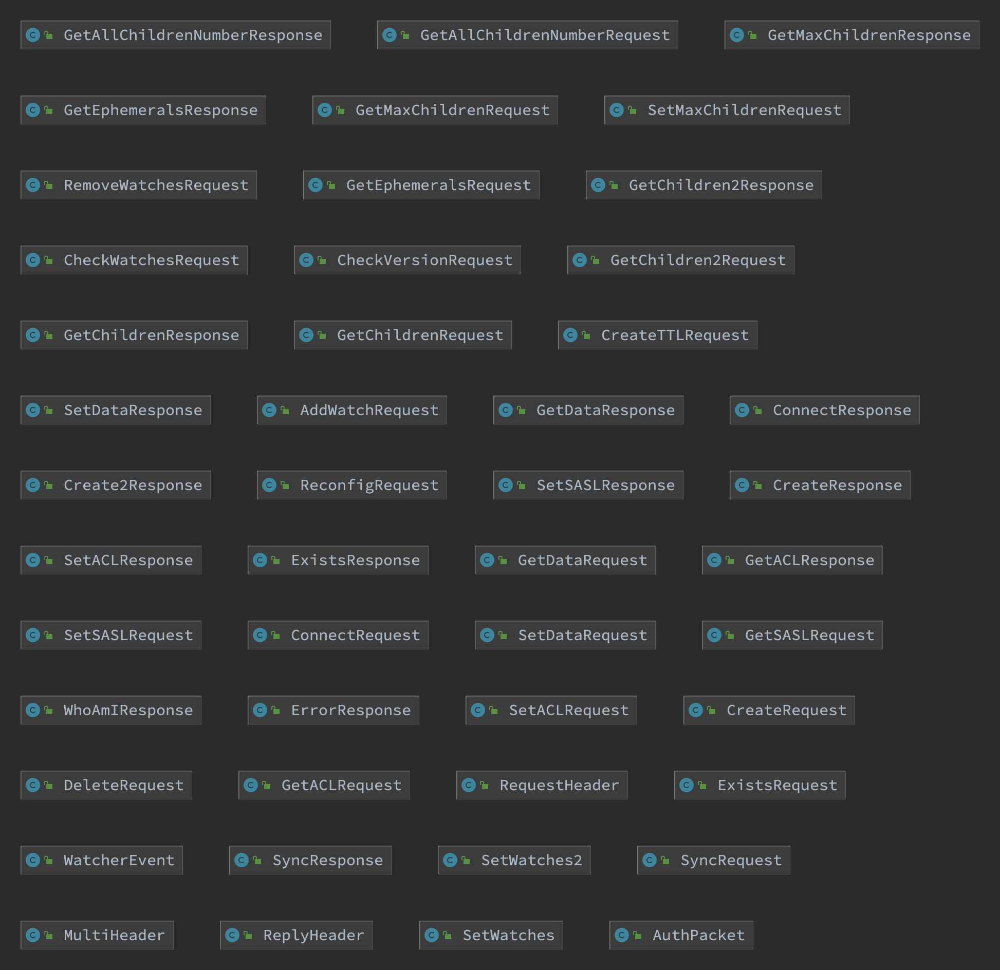

# Jute序列化以及通信协议详解

## Jute序列化工具

### 1. Jute概述
Zookeeper的客户端与服务端之间会进行一系列的网络通信来实现数据传输，Zookeeper使用Jute组件来完成数据的序列化和反序列化操作，其用于Zookeeper进行网络数据传输和本地磁盘数据存储的序列化和反序列化工作。

实体类要使用Jute进行序列化和反序列化步骤：

* 1.需要实现`Record`接口的`serialize`和`deserialize`方法；
* 2.构建一个序列化器`BinaryOutputArchive`；
* 3.序列化:调用实体类的`serialize`方法，将对象序列化到指定的tag中去，比如这里将对象序列化到`header`中；
* 4.反序列化:调用实体类的`deserialize`方法，从指定的tag中反序列化出数据内容。

### 2. Record接口
Zookeeper中所需要进行网络传输或是本地磁盘存储的类型定义，都实现了该接口，是Jute序列化的核心。`Record`定义了两个基本的方法，分别是`serialize`和`deserialize`，分别用于序列化和反序列化。其中`archive`是底层真正的序列化器和反序列化器，并且每个`archive`中可以包含对多个对象的序列化和反序列化，因此两个接口中都标记了参数`tag`，用于序列化器和反序列化器标识对象自己的标记。

```java
public interface Record {
    /**
     * 用于序列化
     * @param archive 底层真正的序列化器, 每个archive中可以包含对多个对象的序列化
     * @param tag 用于序列化器标识对象自己的标记。
     * @throws IOException
     */
    void serialize(OutputArchive archive, String tag) throws IOException;

    /**
     * 用于序列化和反序列化。
     * @param archive 底层真正的反序列化器, 并且每个archive中可以包含对多个对象的反序列化
     * @param tag 用于反序列化器标识对象自己的标记
     * @throws IOException
     */
    void deserialize(InputArchive archive, String tag) throws IOException;
}
```

### 3. OutputArchive和InputArchive

`OutputArchive`和`InputArchive`分别是Jute底层的序列化器和反序列化器定义。有`BinaryOutputArchive`/`BinaryInputArchive`、`CsvOutputArchive`/`CsvInputArchive`和`XmlOutputArchive`/`XmlInputArchive`三种实现，无论哪种实现都是基于`OutputStream`和`InputStream`进行操作。

`BinaryOutputArchive`对数据对象的序列化和反序列化，主要用于进行网络传输和本地磁盘的存储，是Zookeeper底层最主要的序列化方式。`CsvOutputArchive`对数据的序列化，更多的是方便数据的可视化展示，因此被用在`toString`方法中。`XmlOutputArchive`则是为了将数据对象以`xml`格式保存和还原，但目前在Zookeeper中基本没使用到。

```java
public interface OutputArchive {
    void writeByte(byte b, String tag) throws IOException;
    void writeBool(boolean b, String tag) throws IOException;
    void writeInt(int i, String tag) throws IOException;
    void writeLong(long l, String tag) throws IOException;
    void writeFloat(float f, String tag) throws IOException;
    void writeDouble(double d, String tag) throws IOException;
    void writeString(String s, String tag) throws IOException;
    void writeBuffer(byte[] buf, String tag) throws IOException;
    void writeRecord(Record r, String tag) throws IOException;
    void startRecord(Record r, String tag) throws IOException;
    void endRecord(Record r, String tag) throws IOException;
    void startVector(List<?> v, String tag) throws IOException;
    void endVector(List<?> v, String tag) throws IOException;
    void startMap(TreeMap<?, ?> v, String tag) throws IOException;
    void endMap(TreeMap<?, ?> v, String tag) throws IOException;
}
public interface InputArchive {
    byte readByte(String tag) throws IOException;
    boolean readBool(String tag) throws IOException;
    int readInt(String tag) throws IOException;
    long readLong(String tag) throws IOException;
    float readFloat(String tag) throws IOException;
    double readDouble(String tag) throws IOException;
    String readString(String tag) throws IOException;
    byte[] readBuffer(String tag) throws IOException;
    void readRecord(Record r, String tag) throws IOException;
    void startRecord(String tag) throws IOException;
    void endRecord(String tag) throws IOException;
    Index startVector(String tag) throws IOException;
    void endVector(String tag) throws IOException;
    Index startMap(String tag) throws IOException;
    void endMap(String tag) throws IOException;
}
```

> 注意：最新版本中，只保留了`BinaryOutputArchive`/`BinaryInputArchive`的实现

### 4. 测试示例

首先我们构建一个实体类，实现`Record`接口的`serialize`和`deserialize`方法：

```java
public class MockReHeader implements Record {
    private long sessionId;
    private String type;
    public MockReHeader() {}

    public MockReHeader(long sessionId, String type) {
        this.sessionId = sessionId;
        this.type = type;
    }

    public void setSessionId(long sessionId) {
        this.sessionId = sessionId;
    }

    public void setType(String type) {
        this.type = type;
    }

    public long getSessionId() {
        return sessionId;
    }

    public String getType() {
        return type;
    }

    public void serialize(OutputArchive outputArchive, String tag) throws java.io.IOException {
        outputArchive.startRecord(this, tag);
        outputArchive.writeLong(sessionId, "sessionId");
        outputArchive.writeString(type, "type");
        outputArchive.endRecord(this, tag);
    }

    public void deserialize(InputArchive inputArchive, String tag) throws java.io.IOException {
        inputArchive.startRecord(tag);
        this.sessionId = inputArchive.readLong("sessionId");
        this.type = inputArchive.readString("type");
        inputArchive.endRecord(tag);
    }

    @Override
    public String toString() {
        return "sessionId = " + sessionId + ", type = " + type;
    }

    public static void main(String[] args) throws IOException {
        ByteArrayOutputStream byteArrayOutputStream = new ByteArrayOutputStream();
        BinaryOutputArchive binaryOutputArchive = BinaryOutputArchive.getArchive(byteArrayOutputStream);
        new MockReHeader(0x12345, "ping").serialize(binaryOutputArchive, "header");
        ByteBuffer byteBuffer = ByteBuffer.wrap(byteArrayOutputStream.toByteArray());

        ByteBufferInputStream byteBufferInputStream = new ByteBufferInputStream(byteBuffer);
        BinaryInputArchive binaryInputArchive = BinaryInputArchive.getArchive(byteBufferInputStream);

        MockReHeader mockReHeader = new MockReHeader();
        System.out.println(mockReHeader);
        mockReHeader.deserialize(binaryInputArchive, "header");
        System.out.println(mockReHeader);
        byteBufferInputStream.close();
        byteArrayOutputStream.close();
    }
}
```

### 5. zookeeper.jute

在Zookeeper的`src`文件夹下有zookeeper.jute文件，这个文件定义了所有的实体类的所属包名、类名及类的所有成员变量和类型，该文件会在源代码编译时，Jute会使用不同的代码生成器为这些类定义生成实际编程语言的类文件，如java语言生成的类文件保存在`src/java/generated`目录下，每个类都会实现`Record`接口。

## ZooKeeper通信协议

基于TCP/IP协议，Zookeeper实现了自己的通信协议来完成客户端与服务端、服务端与服务端之间的网络通信，对于请求，主要包含请求头和请求体，对于响应，主要包含响应头和响应体。

　　　　　　　　　　　　　　　　　　　　

### 1. 请求协议

对于请求协议而言，如下为获取节点数据请求的完整协议定义：



```
class RequestHeader {
    int xid;
    int type;
}
```

从zookeeper.jute中可知`RequestHeader`包含了`xid`和`type`，`xid`用于记录客户端请求发起的先后序号，用来确保单个客户端请求的响应顺序，`type`代表请求的操作类型，如创建节点（`OpCode.create`）、删除节点（`OpCode.delete`）、获取节点数据（`OpCode.getData`）。

协议的请求主体内容部分，包含了请求的所有操作内容，不同的请求类型请求体不同。对于会话创建而言，其请求体如下：

```
class ConnectRequest {
    int protocolVersion;
    long lastZxidSeen;
    int timeOut;
    long sessionId;
    buffer passwd;
}
```

Zookeeper客户端和服务器在创建会话时，会发送`ConnectRequest`请求，该请求包含协议版本号`protocolVersion`、最近一次接收到服务器`ZXID lastZxidSeen`、会话超时时间`timeOut`、会话标识`sessionId`和会话密码`passwd`。

对于获取节点数据而言，其请求体如下：
```
class GetDataRequest {
    ustring path;
    boolean watch;
}
```

Zookeeper客户端在向服务器发送节点数据请求时，会发送`GetDataRequest`请求，该请求包含了数据节点路径`path`、是否注册`Watcher`的标识`watch`。

对于更新节点数据而言，其请求体如下：

```
class SetDataRequest {
    ustring path;
    buffer data;
    int version;
}
```

Zookeeper客户端在向服务器发送更新节点数据请求时，会发送`SetDataRequest`请求，该请求包含了数据节点路径`path`、数据内容`data`、节点数据的期望版本号`version`。

针对不同的请求类型，Zookeeper都会定义不同的请求体，可以在zookeeper.jute中查看，所有的请求都会按照此文件的描述进行序列化/反序列化。

### 2. 响应协议

对于响应协议而言，如下为获取节点数据响应的完整协议定义：

　　　　　　　　　

响应头中包含了每个响应最基本的信息，包括`xid`、`zxid`和`err`：

```
class ReplyHeader {
    int xid;
    long zxid;
    int err;
}
```

`xid`与请求头中的`xid`一致，`zxid`表示Zookeeper服务器上当前最新的事务ID，`err`则是一个错误码，表示当请求处理过程出现异常情况时，就会在错误码中标识出来，常见的包括处理成功（`Code.OK`）、节点不存在（`Code.NONODE`）、没有权限（`Code.NOAUTH`）。

协议的响应主体内容部分，包含了响应的所有数据，不同的响应类型请求体不同。对于会话创建而言，其响应体如下：

```
class ConnectResponse {
    int protocolVersion;
    int timeOut;
    long sessionId;
    buffer passwd;
}
```

针对客户端的会话创建请求，服务端会返回客户端一个`ConnectResponse`响应，该响应体包含了版本号`protocolVersion`、会话的超时时间`timeOut`、会话标识`sessionId`和会话密码`passwd`。

对于获取节点数据而言，其响应体如下：

```
class GetDataResponse {
    buffer data;
    org.apache.zookeeper.data.Stat stat;
}
```

针对客户端的获取节点数据请求，服务端会返回客户端一个`GetDataResponse`响应，该响应体包含了数据节点内容`data`、节点状态`stat`。

对于更新节点数据而言，其响应体如下：

```
class SetDataResponse {
    org.apache.zookeeper.data.Stat stat;
}
```

针对客户端的更新节点数据请求，服务端会返回客户端一个`SetDataResponse`响应，该响应体包含了最新的节点状态`stat`。

针对不同的响应类型，Zookeeper都会定义不同的响应体，也可以在zookeeper.jute中查看。

