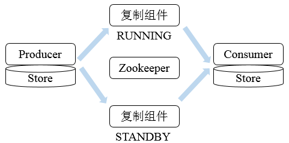

## Zookeeper使用--命令行

### 1. Zookeeper部署

Zookeeper的部署相对来说还是比较简单，读者可以在网上找到相应的教程，[点这里](http://coolxing.iteye.com/blog/1871009)，笔者不再累赘。

Zookeeper有三种运行形式：集群模式、单机模式、伪集群模式。

以下实验都是在单机模式下进行。

### 2. 服务端

bin目录下常用的脚本解释

* **zkCleanup**: 清理Zookeeper历史数据，包括食物日志文件和快照数据文件
* **zkCli**: Zookeeper的一个简易客户端
* **zkEnv**: 设置Zookeeper的环境变量
* **zkServer**: Zookeeper服务器的启动、停止、和重启脚本

#### 2.1 运行服务

进入bin目录，使用`zkServer.sh start`启动服务


使用jps命令查看，存在`QuorumPeerMain`进程，表示Zookeeper已经启动


#### 2.2 停止服务

在bin目录下，使用`zkServer.sh stop`停止服务


　　
使用jps命令查看，QuorumPeerMain进程已不存在，表示Zookeeper已经关闭


### 3. 客户端

#### 3.1 打开客户端

在服务端开启的情况下，运行客户端，使用如下命令：`./zkCli.sh`


连接服务端成功，若连接不同的主机，可使用如下命令：`./zkCli.sh -server ip:port`

可以使用帮助命令help来查看客户端的操作


#### 3.2 创建节点

使用`create`命令，可以创建一个Zookeeper节点， 如
```
create [-s] [-e] path data acl
```
其中，`-s`或`-e`分别指定节点特性，顺序或临时节点，若不指定，则表示持久节点；`acl`用来进行权限控制。


**创建顺序节点**

使用`create -s /zk-test 123`命令创建`zk-test`顺序节点


　　
可以看到创建的`zk-test`节点后面添加了一串数字以示区别。

**创建临时节点**

使用`create -e /zk-temp 123`命令创建`zk-temp`临时节点


临时节点在客户端会话结束后，就会自动删除，下面使用`quit`命令退出客户端


再次使用客户端连接服务端，并使用`ls /`命令查看根目录下的节点


可以看到根目录下已经不存在`zk-temp`临时节点了。

**创建永久节点**

使用`create /zk-permanent 123`命令创建`zk-permanent`永久节点


　　
可以看到永久节点不同于顺序节点，不会自动在后面添加一串数字。

#### 3.3 读取节点

与读取相关的命令有`ls`命令和`get`命令，`ls`命令可以列出Zookeeper指定节点下的所有子节点，只能查看指定节点下的第一级的所有子节点；get命令可以获取Zookeeper指定节点的数据内容和属性信息。其用法分别如下
```
ls path [watch]
get path [watch]
ls2 path [watch]
```
若获取根节点下面的所有子节点，使用`ls /`命令即可


若想获取根节点数据内容和属性信息，使用`get /` 命令即可


也可以使用`ls2 /` 命令查看


可以看到其子节点数量为8。

若想获取`/zk-permanent`的数据内容和属性，可使用如下命令：`get /zk-permanent`


可以看到其数据内容为123，还有其他的属性，之后会详细介绍。

#### 3.4 更新节点

使用`set`命令，可以更新指定节点的数据内容，用法如下
```
set path data [version]
```
其中，`data`就是要更新的新内容，`version`表示数据版本，如将`/zk-permanent`节点的数据更新为456，可以使用如下命令：`set /zk-permanent 456`


现在`dataVersion`已经变为1了，表示进行了更新。

#### 3.5 删除节点

使用`delete`命令可以删除Zookeeper上的指定节点，用法如下
```
delete path [version]
```
其中version也是表示数据版本，使用`delete /zk-permanent`命令即可删除`/zk-permanent`节点


可以看到，已经成功删除/zk-permanent节点。值得注意的是，若删除节点存在子节点，那么无法删除该节点，必须先删除子节点，再删除父节点。

## Zookeeper应用场景

### 1. 典型应用场景

Zookeeper是一个高可用的分布式数据管理和协调框架，并且能够很好的保证分布式环境中数据的一致性。在越来越多的分布式系统（Hadoop、HBase、Kafka）中，Zookeeper都作为核心组件使用。

#### 1.1 数据发布/订阅

数据发布/订阅系统，即配置中心。需要发布者将数据发布到Zookeeper的节点上，供订阅者进行数据订阅，进而达到动态获取数据的目的，实现配置信息的集中式管理和数据的动态更新。发布/订阅一般有两种设计模式：推模式和拉模式，服务端主动将数据更新发送给所有订阅的客户端称为推模式；客户端主动请求获取最新数据称为拉模式，Zookeeper采用了推拉相结合的模式，客户端向服务端注册自己需要关注的节点，一旦该节点数据发生变更，那么服务端就会向相应的客户端推送Watcher事件通知，客户端接收到此通知后，主动到服务端获取最新的数据。

若将配置信息存放到Zookeeper上进行集中管理，在通常情况下，应用在启动时会主动到Zookeeper服务端上进行一次配置信息的获取，同时，在指定节点上注册一个Watcher监听，这样在配置信息发生变更，服务端都会实时通知所有订阅的客户端，从而达到实时获取最新配置的目的。

#### 1.2 负载均衡

负载均衡是一种相当常见的计算机网络技术，用来对多个计算机、网络连接、CPU、磁盘驱动或其他资源进行分配负载，以达到优化资源使用、最大化吞吐率、最小化响应时间和避免过载的目的。

使用Zookeeper实现动态DNS服务

* **域名配置**，首先在Zookeeper上创建一个节点来进行域名配置，如`DDNS/app1/server.app1.company1.com`。
* **域名解析**，应用首先从域名节点中获取IP地址和端口的配置，进行自行解析。同时，应用程序还会在域名节点上注册一个数据变更Watcher监听，以便及时收到域名变更的通知。
* **域名变更**，若发生IP或端口号变更，此时需要进行域名变更操作，此时，只需要对指定的域名节点进行更新操作，Zookeeper就会向订阅的客户端发送这个事件通知，客户端之后就再次进行域名配置的获取。

#### 1.3 命名服务

命名服务是分步实现系统中较为常见的一类场景，分布式系统中，被命名的实体通常可以是集群中的机器、提供的服务地址或远程对象等，通过命名服务，客户端可以根据指定名字来获取资源的实体、服务地址和提供者的信息。Zookeeper也可帮助应用系统通过资源引用的方式来实现对资源的定位和使用，广义上的命名服务的资源定位都不是真正意义上的实体资源，在分布式环境中，上层应用仅仅需要一个全局唯一的名字。Zookeeper可以实现一套分布式全局唯一ID的分配机制。


通过调用Zookeeper节点创建的API接口就可以创建一个顺序节点，并且在API返回值中会返回这个节点的完整名字，利用此特性，可以生成全局ID，其步骤如下

1. 客户端根据任务类型，在指定类型的任务下通过调用接口创建一个顺序节点，如"job-"。
2. 创建完成后，会返回一个完整的节点名，如"job-00000001"。
3. 客户端拼接type类型和返回值后，就可以作为全局唯一ID了，如"type2-job-00000001"。


#### 1.4 分布式协调/通知

Zookeeper中特有的Watcher注册于异步通知机制，能够很好地实现分布式环境下不同机器，甚至不同系统之间的协调与通知，从而实现对数据变更的实时处理。通常的做法是不同的客户端都对Zookeeper上的同一个数据节点进行Watcher注册，监听数据节点的变化（包括节点本身和子节点），若数据节点发生变化，那么所有订阅的客户端都能够接收到相应的Watcher通知，并作出相应处理。

MySQL数据复制总线是一个实时的数据复制框架，用于在不同的MySQL数据库实例之间进行异步数据复制和数据变化通知，整个系统由MySQL数据库集群、消息队列系统、任务管理监控平台、Zookeeper集群等组件共同构成的一个包含生产者、复制管道、数据消费等部分的数据总线系统。



Zookeeper主要负责进行分布式协调工作，在具体的实现上，根据功能将数据复制组件划分为三个模块：Core（实现数据复制核心逻辑，将数据复制封装成管道，并抽象出生产者和消费者概念）、Server（启动和停止复制任务）、Monitor（监控任务的运行状态，若数据复制期间发生异常或出现故障则进行告警）


每个模块作为独立的进程运行在服务端，运行时的数据和配置信息均保存在Zookeeper上。


* 任务创建，`Core`进程启动时，首先向`/mysql_replicator/tasks`节点注册任务，如创建一个子节点`/mysql_replicator/tasks/copy_hot/item`，若注册过程中发现该子节点已经存在，说明已经有其他Task机器注册了该任务，因此其自身不需要再创建该节点。
* 任务热备份，为了应对任务故障或者复制任务所在主机故障，复制组件采用"热备份"的容灾方式，即将同一个复制任务部署在不同的主机上，主备任务机通过Zookeeper互相检测运行监控状况。无论在第一步是否创建了任务节点，每台机器都需要在`/mysql_replicator/tasks/copy_hot_item/instrances`节点上将自己的主机名注册上去，节点类型为临时顺序节点，在完成子节点创建后，每天任务机器都可以获取到自己创建的节点名及所有子节点列表，然后通过对比判断自己是否是所有子节点中序号最小的，若是，则将自己运行状态设置为`RUNNING`，其他机器设置为`STANDBY`，这种策略称为小序号优先策略。
* 热备切换，完成运行状态的标示后，其中标记为`RUNNING`的客户端机器进行正常的数据复制，而标记为`STANDBY`的机器则进入待命状态，一旦`RUNNING`机器出现故障，那么所有标记为`STANDBY`的机器再次按照小序号优先策略来选出`RUNNING`机器运行（`STANDY`机器需要在`/mysql_replicator/tasks/copy_hot_item/instances`节点上注册一个子节点列表变更监听，`RUNNING`机器宕机与`Zookeeper`断开连接后，对应的节点也会消失，于是所有客户端收到通知，进行新一轮选举）。
* 记录执行状态，`RUNNING`机器需要将运行时的上下文状态保留给`STANDBY`机器。
* 控制台协调，`Server`的主要工作就是进行任务控制，通过`Zookeeper`来对不同任务进行控制和协调，`Server`会将每个复制任务对应生产者的元数据及消费者的相关信息以配置的形式写入任务节点`/mysql_replicator/tasks/copy_hot_item`中去，以便该任务的所有任务机器都能够共享复制任务的配置。

在上述热备份方案中，针对一个任务，都会至少分配两台任务机器来进行热备份（`RUNNING`和`STANDBY`、即主备机器），若需要MySQL实例需要进行数据复制，那么需要消耗太多机器。此时，需要使用冷备份方案，其对所有任务进行分组。


`Core`进程被配置了所属组`（Group）`，即若一个`Core`进程被标记了`group1`，那么在`Core`进程启动后，会到对应的`Zookeeper group1`节点下面获取所有的`Task`列表，假如找到任务"`copy_hot_item`"之后，就会遍历这个`Task`列表的`instances`节点，但凡还没有子节点，则创建一个临时的顺序节点如`/mysql_replicator/task-groups/group1/copy_hot_item/instances/[Hostname]-1`，当然，在这个过程中，其他`Core`进程也会在这个`instances`节点下创建类似的子节点，按照"小序号优先"策略确定`RUNNING`，不同的是，其他`Core`进程会自动删除自己创建的子节点，然后遍历下一个`Task`节点，这样的过程称为冷备份扫描，这样，所有的`Core`进程在扫描周期内不断地对相应的`Group`下来的`Task`进行冷备份。

在绝大多数分布式系统中，系统机器间的通信无外乎心跳检测、工作进度汇报和系统调度。

* **心跳检测**，不同机器间需要检测到彼此是否在正常运行，可以使用Zookeeper实现机器间的心跳检测，基于其临时节点特性（临时节点的生存周期是客户端会话，客户端若当即后，其临时节点自然不再存在），可以让不同机器都在Zookeeper的一个指定节点下创建临时子节点，不同的机器之间可以根据这个临时子节点来判断对应的客户端机器是否存活。通过Zookeeper可以大大减少系统耦合。
* **工作进度汇报**，通常任务被分发到不同机器后，需要实时地将自己的任务执行进度汇报给分发系统，可以在Zookeeper上选择一个节点，每个任务客户端都在这个节点下面创建临时子节点，这样不仅可以判断机器是否存活，同时各个机器可以将自己的任务执行进度写到该临时节点中去，以便中心系统能够实时获取任务的执行进度。
* **系统调度**，Zookeeper能够实现如下系统调度模式：分布式系统由控制台和一些客户端系统两部分构成，控制台的职责就是需要将一些指令信息发送给所有的客户端，以控制他们进行相应的业务逻辑，后台管理人员在控制台上做一些操作，实际上就是修改Zookeeper上某些节点的数据，Zookeeper可以把数据变更以时间通知的形式发送给订阅客户端。

#### 1.5 集群管理

Zookeeper的两大特性：

* 客户端如果对Zookeeper的数据节点注册Watcher监听，那么当该数据及诶单内容或是其子节点列表发生变更时，Zookeeper服务器就会向订阅的客户端发送变更通知。
* 对在Zookeeper上创建的临时节点，一旦客户端与服务器之间的会话失效，那么临时节点也会被自动删除。

利用其两大特性，可以实现集群机器存活监控系统，若监控系统在`/clusterServers`节点上注册一个`Watcher`监听，那么但凡进行动态添加机器的操作，就会在`/clusterServers`节点下创建一个临时节点：`/clusterServers/[Hostname]`，这样，监控系统就能够实时监测机器的变动情况。下面通过分布式日志收集系统的典型应用来学习Zookeeper如何实现集群管理。

分布式日志收集系统的核心工作就是收集分布在不同机器上的系统日志，在典型的日志系统架构设计中，整个日志系统会把所有需要收集的日志机器分为多个组别，每个组别对应一个收集器，这个收集器其实就是一个后台机器，用于收集日志，对于大规模的分布式日志收集系统场景，通常需要解决两个问题：

* 变化的日志源机器
* 变化的收集器机器

无论是日志源机器还是收集器机器的变更，最终都可以归结为如何快速、合理、动态地为每个收集器分配对应的日志源机器。使用Zookeeper的场景步骤如下

* **注册收集器机器**，在Zookeeper上创建一个节点作为收集器的根节点，例如`/logs/collector`的收集器节点，每个收集器机器启动时都会在收集器节点下创建自己的节点，如`/logs/collector/[Hostname]`
  

* **任务分发**，所有收集器机器都创建完对应节点后，系统根据收集器节点下子节点的个数，将所有日志源机器分成对应的若干组，然后将分组后的机器列表分别写到这些收集器机器创建的子节点，如`/logs/collector/host1`上去。这样，收集器机器就能够根据自己对应的收集器节点上获取日志源机器列表，进而开始进行日志收集工作。
* **状态汇报**，完成任务分发后，机器随时会宕机，所以需要有一个收集器的状态汇报机制，每个收集器机器上创建完节点后，还需要再对应子节点上创建一个状态子节点，如`/logs/collector/host/status`，每个收集器机器都需要定期向该结点写入自己的状态信息，这可看做是心跳检测机制，通常收集器机器都会写入日志收集状态信息，日志系统通过判断状态子节点最后的更新时间来确定收集器机器是否存活。
* **动态分配**，若收集器机器宕机，则需要动态进行收集任务的分配，收集系统运行过程中关注`/logs/collector`节点下所有子节点的变更，一旦有机器停止汇报或有新机器加入，就开始进行任务的重新分配，此时通常由两种做法：
    * 全局动态分配，当收集器机器宕机或有新的机器加入，系统根据新的收集器机器列表，立即对所有的日志源机器重新进行一次分组，然后将其分配给剩下的收集器机器。
    * 局部动态分配，每个收集器机器在汇报自己日志收集状态的同时，也会把自己的负载汇报上去，如果一个机器宕机了，那么日志系统就会把之前分配给这个机器的任务重新分配到那些负载较低的机器，同样，如果有新机器加入，会从那些负载高的机器上转移一部分任务给新机器。

上述步骤已经完整的说明了整个日志收集系统的工作流程，其中有两点注意事项。

* 节点类型，在`/logs/collector`节点下创建临时节点可以很好的判断机器是否存活，但是，若机器挂了，其节点会被删除，记录在节点上的日志源机器列表也被清除，所以需要选择持久节点来标识每一台机器，同时在节点下分别创建`/logs/collector/[Hostname]/status`节点来表征每一个收集器机器的状态，这样，既能实现对所有机器的监控，同时机器挂掉后，依然能够将分配任务还原。
* 日志系统节点监听，若采用`Watcher`机制，那么通知的消息量的网络开销非常大，需要采用日志系统主动轮询收集器节点的策略，这样可以节省网络流量，但是存在一定的延时。

#### 1.6 Master选举

在分布式系统中，Master往往用来协调集群中其他系统单元，具有对分布式系统状态变更的决定权，如在读写分离的应用场景中，客户端的写请求往往是由Master来处理，或者其常常处理一些复杂的逻辑并将处理结果同步给其他系统单元。利用Zookeeper的强一致性，能够很好地保证在分布式高并发情况下节点的创建一定能够保证全局唯一性，即Zookeeper将会保证客户端无法重复创建一个已经存在的数据节点。

首先创建`/master_election/2016-11-12`节点，客户端集群每天会定时往该节点下创建临时节点，如`/master_election/2016-11-12/binding`，这个过程中，只有一个客户端能够成功创建，此时其变成master，其他节点都会在节点`/master_election/2016-11-12`上注册一个子节点变更的Watcher，用于监控当前的Master机器是否存活，一旦发现当前Master挂了，其余客户端将会重新进行Master选举。

#### 1.7 分布式锁

分布式锁用于控制分布式系统之间同步访问共享资源的一种方式，可以保证不同系统访问一个或一组资源时的一致性，主要分为排它锁和共享锁。

排它锁又称为写锁或独占锁，若事务T1对数据对象O1加上了排它锁，那么在整个加锁期间，只允许事务T1对O1进行读取和更新操作，其他任何事务都不能再对这个数据对象进行任何类型的操作，直到T1释放了排它锁。

* 获取锁，在需要获取排它锁时，所有客户端通过调用接口，在`/exclusive_lock`节点下创建临时子节点`/exclusive_lock/lock`。Zookeeper可以保证只有一个客户端能够创建成功，没有成功的客户端需要注册`/exclusive_lock`节点监听。
* 释放锁，当获取锁的客户端宕机或者正常完成业务逻辑都会导致临时节点的删除，此时，所有在`/exclusive_lock`节点上注册监听的客户端都会收到通知，可以重新发起分布式锁获取。

共享锁又称为读锁，若事务T1对数据对象O1加上共享锁，那么当前事务只能对O1进行读取操作，其他事务也只能对这个数据对象加共享锁，直到该数据对象上的所有共享锁都被释放。

* 获取锁，在需要获取共享锁时，所有客户端都会到`/shared_lock`下面创建一个临时顺序节点，如果是读请求，那么就创建例如`/shared_lock/host1-R-00000001`的节点，如果是写请求，那么就创建例如`/shared_lock/host2-W-00000002`的节点。
* 判断读写顺序，不同事务可以同时对一个数据对象进行读写操作，而更新操作必须在当前没有任何事务进行读写情况下进行，通过Zookeeper来确定分布式读写顺序，大致分为四步。

  * 1.创建完节点后，获取`/shared_lock`节点下所有子节点，并对该节点变更注册监听。
  * 2.确定自己的节点序号在所有子节点中的顺序。
  * 3.对于读请求：若没有比自己序号小的子节点或所有比自己序号小的子节点都是读请求，那么表明自己已经成功获取到共享锁，同时开始执行读取逻辑，若有写请求，则需要等待。对于写请求：若自己不是序号最小的子节点，那么需要等待。
  * 4.接收到Watcher通知后，重复步骤1。
* 释放锁，其释放锁的流程与独占锁一致。

上述共享锁的实现方案，可以满足一般分布式集群竞争锁的需求，但是如果机器规模扩大会出现一些问题，下面着重分析判断读写顺序的步骤3。


针对如上图所示的情况进行分析

* 1.host1首先进行读操作，完成后将节点`/shared_lock/host1-R-00000001`删除。
* 2.余下4台机器均收到这个节点移除的通知，然后重新从`/shared_lock`节点上获取一份新的子节点列表。
* 3.每台机器判断自己的读写顺序，其中host2检测到自己序号最小，于是进行写操作，余下的机器则继续等待。
* 4.继续...

可以看到，host1客户端在移除自己的共享锁后，Zookeeper发送了子节点更变Watcher通知给所有机器，然而除了给host2产生影响外，对其他机器没有任何作用。大量的Watcher通知和子节点列表获取两个操作会重复运行，这样会造成系能鞥影响和网络开销，更为严重的是，如果同一时间有多个节点对应的客户端完成事务或事务中断引起节点小时，Zookeeper服务器就会在短时间内向其他所有客户端发送大量的事件通知，这就是所谓的羊群效应。

可以有如下改动来避免羊群效应。

1. 客户端调用create接口常见类似于`/shared_lock/[Hostname]-请求类型-序号的临时顺序节点`。
2. 客户端调用getChildren接口获取所有已经创建的子节点列表（不注册任何Watcher）。
3. 如果无法获取共享锁，就调用exist接口来对比自己小的节点注册Watcher。对于读请求：向比自己序号小的最后一个写请求节点注册Watcher监听。对于写请求：向比自己序号小的最后一个节点注册Watcher监听。
4. 等待Watcher通知，继续进入步骤2。

此方案改动主要在于：每个锁竞争者，只需要关注`/shared_lock`节点下序号比自己小的那个节点是否存在即可。

#### 1.8 分布式队列

分布式队列可以简单分为先入先出队列模型和等待队列元素聚集后统一安排处理执行的Barrier模型。

* **FIFO先入先出**，先进入队列的请求操作先完成后，才会开始处理后面的请求。FIFO队列就类似于全写的共享模型，所有客户端都会到`/queue_fifo`这个节点下创建一个临时节点，如`/queue_fifo/host1-00000001`。

  

  创建完节点后，按照如下步骤执行。

  1. 通过调用`getChildren`接口来获取`/queue_fifo`节点的所有子节点，即获取队列中所有的元素。
  2. 确定自己的节点序号在所有子节点中的顺序。
  3. 如果自己的序号不是最小，那么需要等待，同时向比自己序号小的最后一个节点注册Watcher监听。
  4. 接收到Watcher通知后，重复步骤1。

* **Barrier分布式屏障**，最终的合并计算需要基于很多并行计算的子结果来进行，开始时，`/queue_barrier`节点已经默认存在，并且将结点数据内容赋值为数字n来代表Barrier值，之后，所有客户端都会到`/queue_barrier`节点下创建一个临时节点，例如`/queue_barrier/host1`。

  

  创建完节点后，按照如下步骤执行。

  1. 通过调用getData接口获取`/queue_barrier`节点的数据内容，如10。
  2. 通过调用getChildren接口获取`/queue_barrier`节点下的所有子节点，同时注册对子节点变更的Watcher监听。
  3. 统计子节点的个数。
  4. 如果子节点个数还不足10个，那么需要等待。
  5. 接受到Wacher通知后，重复步骤3。

## Zookeeper在大型分布式系统中的应用

### 1. Hadoop

Hadoop的核心是HDFS（Hadoop Distributed File System）和MapReduce，分别提供了对海量数据的存储和计算能力，后来，Hadoop又引入了全新MapReduce框架YARN（Yet Another Resource Negotiator）。在Hadoop中，Zookeeper主要用于实现HA（High Availability），这部分逻辑主要集中在Hadoop Common的HA模块中，HDFS的NameNode与YARN的ResourceManager都是基于此HA模块来实现自己的HA功能，YARN又使用了Zookeeper来存储应用的运行状态。

#### 1.1 YARN

YARN是一种新的 Hadoop 资源管理器，它是一个通用资源管理系统，可为上层应用提供统一的资源管理和调度，它的引入为集群在利用率、资源统一管理和数据共享等方面带来了巨大好处。其可以支持MapReduce模型，同时也支持Tez、Spark、Storm、Impala、Open MPI等。


YARN主要由`ResourceManager（RM）`、`NodeManager（NM）`、`ApplicationManager（AM）`、`Container`四部分构成。其中，ResourceManager为全局资源管理器，负责整个系统的资源管理和分配。由YARN体系架构可以看到ResourceManager的单点问题，ResourceManager的工作状况直接决定了整个YARN架构是否可以正常运转。

#### 1.2 ResourceManager HA

为了解决ResourceManager的单点问题，YARN设计了一套Active/Standby模式的ResourceManager HA架构。


由上图可知，在运行期间，会有多个ResourceManager并存，并且其中只有一个ResourceManager处于Active状态，另外一些（允许一个或者多个）则处于Standby状态，当Active节点无法正常工作时，其余处于Standby状态的节点则会通过竞争选举产生新的Active节点。

#### 1.3 主备切换

ResourceManager使用基于Zookeeper实现的`ActiveStandbyElector`组件来确定`ResourceManager`的状态。具体步骤如下

1. 创建锁节点。在Zookeeper上会有一个类似于`/yarn-leader-election/pseudo-yarn-rm-cluster`的锁节点，所有的ResourceManager在启动时，都会去竞争写一个Lock子节点（`/yarn-leader-election/pseudo-yarn-rm-cluster/ActiveStandbyElectorLock`），子节点类型为临时节点，利用Zookeeper的特性，创建成功的那个ResourceManager切换为Active状态，其余的为Standby状态。
2. 注册Watcher监听。所有Standby状态的ResourceManager都会向`/yarn-leader-election/pseudo-yarn-rm-cluster/ActiveStandbyElectorLock`节点注册一个节点变更监听，利用临时节点的特性，能够快速感知到Active状态的ResourceManager的运行情况。
3. 主备切换。当Active的ResourceManager无法正常工作时，其创建的Lock节点也会被删除，此时，其余各个Standby的ResourceManager都会收到通知，然后重复步骤1。

#### 1.4 隔离（Fencing）

在分布式环境中，经常会出现诸如单机假死（机器由于网络闪断或是其自身由于负载过高，常见的有GC占用时间过长或CPU负载过高，而无法正常地对外进行及时响应）情况。假设RM集群由RM1和RM2两台机器构成，某一时刻，RM1发生了假死，此时，Zookeeper认为RM1挂了，然后进行主备切换，RM2会成为Active状态，但是在随后，RM1恢复了正常，其依然认为自己还处于Active状态，这就是分布式脑裂现象，即存在多个处于Active状态的RM工作，可以使用隔离来解决此类问题。

**YARN引入了Fencing机制，借助Zookeeper的数据节点的ACL权限控制机制来实现不同RM之间的隔离**。在上述主备切换时，多个RM之间通过竞争创建锁节点来实现主备状态的确定，此时，只需要在创建节点时携带Zookeeper的ACL信息，目的是为了独占该节点，以防止其他RM对该节点进行更新。

还是上述案例，若RM1出现假死，Zookeeper会移除其创建的节点，此时RM2会创建相应的锁节点并切换至Active状态，RM1恢复之后，会试图去更新Zookeeper相关数据，但是此时其没有权限更新Zookeeper的相关节点数据，因为节点不是由其创建的，于是就自动切换至Standby状态，这样就避免了脑裂现象的出现。

#### 1.5 ResourceManager状态存储

在ResourceManager中，RMStateStore可以存储一些RM的内部状态信息，包括Application以及Attempts信息、Delegation Token及Version Information等，值得注意的是，RMStateStore的绝大多数状态信息都是不需要持久化存储的（如资源使用情况），因为其很容易从上下文信息中重构，，在存储方案设计中，提供了三种可能的实现。

1. 基于内存实现，一般用于日常开发测试。
2. 基于文件系统实现，如HDFS。
3. 基于Zookeeper实现。

由于存储的信息不是特别大，Hadoop官方建议基于Zookeeper来实现状态信息的存储，在Zookeeper中，ResourceManager的状态信息都被存储在`/rmstore`这个根节点下，其数据结构如下。


在RMAppRoot节点下存储的是与各个Application相关的信息，RMDTSecretManagerRoot存储的是与安全相关的Token信息。每个Active状态的ResourceManager在初始化节点都会从Zookeeper上读取到这些信息，并根据这些状态信息继续后续的处理。

### 2. HBase

HBase（Hadoop Database）是一个基于Hadoop的文件系统设计的面向海量数据的高可靠、高性能、面向列、可伸缩的分布式存储系统，其针对数据写入具有强一致性，索引列也实现了强一致性，其采用了Zookeeper服务来完成对整个系统的分布式协调工作，其架构如下


HBase架构中，Zookeeper是串联起HBase集群与Client的关键所在，Zookeeper在HBase中的系统容错、RootRegion管理、Region状态管理、分布式SplitLog任务管理、Replication管理都扮演重要角色。

#### 2.1 系统容错

在HBase启动时，每个RegionServer服务器都会到Zookeeper的`/hbase/rs`节点下创建一个信息节点，例如`/hbase/rs/[Hostname]`，同时，HMaster会对这个节点进行监听，当某个RegionServer挂掉时，Zookeeper会因为在一段时间内无法接收其心跳信息（Session失效），而删除掉该RegionServer服务器对应的节点，与此同时，HMaster则会接收到Zookeeper的NodeDelete通知，从而感知到某个节点断开，并立即开始容错工作，HMaster会将该RegionServer所处理的数据分片（Region）重新路由到其他节点上，并记录到Meta信息中供客户端查询。

#### 2.2 系统容错RootRegion管理

数据存储的位置信息是记录在元数据分片上的，即在RootRegion上，每次客户端发起新的请求，就会查询RootRegion来确定数据的位置，而RootRegion自身的位置则记录在Zookeeper上（默认情况下在`/hbase/root-region-server`节点中）。当RootRegion发生变化时，如Region手工移动、Balance或者是RootRegion所在服务器发生了故障，就能通过Zookeeper来感知到这一变化并做出一系列相应的容灾措施，从而保障客户端总能够拿到正确的RootRegion信息。

#### 2.3 Region状态管理

Region是HBase中数据的物理切片，每个Region记录了全局数据的一小部分，并且不同的Region之间的数据是相互不重复的。但对于一个分布式系统来说，Region是会发生变更的，原因可能是系统故障、负载均衡、配置修改、Region分裂合并等，一旦Region发生变动，它必然经历离线和重新在线的过程。在离线期间，数据是不能被访问的，并且Region的状态变化必须让全局知晓，否则可能会出现某些事务性的异常，而对于HBase集群而言，Region的数量可能会多达10万级别，因此这样规模的Region状态管理只有依靠Zookeeper才能做到。

#### 2.4 分布式SplitLog任务管理

当某台RegionServer服务器挂掉后，由于总有一部分新写入的数据还没有持久化到HFile中（在内存中），因此在迁移该RegionServer的服务时，应该从HLog中恢复这部分还在内存中的数据，此时HMaster需要遍历该RegionServer服务器的HLog（SplitLog），并按照Region切分成小块移动到新的地址，并进行数据的Replay。由于单个RegionServer的日志量相对庞大（可能存在上千个Region，上GB的日志），而用户往往希望系统能够快速完成日志的恢复工作，因此，需要将处理HLog的任务分配给多台RegionServer服务器共同处理，而这又需要一个持久化组件来辅助HMaster完成任务的分配，当前做法如下，HMaster会在Zookeeper上创建一个splitlog节点（默认为`/hbase/splitlog`节点），将"哪个RegionServer处理哪个Region"的信息以列表的形式存放在该节点上，然后由各个RegionServer服务器自行到该节点上去领取任务并在任务执行成功或失败后再更新该节点的信息以通知HMaster继续后续步骤，Zookeeper起到了相互通知和信息持久化的角色。

#### 2.5 Replication管理

Replication是实现HBase中主备集群间的实时同步的重要模块，与传统关系型数据库不同的是，HBase的Replication是多对多的，且每个节点随时都有可能挂掉，因此其会复杂得多。HBase也借助了Zookeeper来完成Replication功能，做法是在Zookeeper上记录一个replication节点（默认是`/hbase/replication`节点），然后把不同的RegionServer服务器对应的HLog文件名称记录到相应的节点上，HMaster集群会将新增的数据推送给Slave集群，并同时将推送信息记录到Zookeeper上（称为断点记录），然后重复上述步骤，当服务器挂掉时，由于Zookeeper上已经保存了断点信息，因此只要有HMaster能够根据这些信息来协同用来推送HLog数据的主节点服务器就可以进行继续复制操作。

### 3. Kafka

kafka是一个吞吐量极高的分布式消息系统，其整体设计是典型的发布与订阅系统模式，在Kafka集群中，没有中心主节点概念，所有服务器都是对等的，因此，可以在不做任何配置更改的情况下实现服务器的添加与删除，同样，消息的生产者和消费者也能够随意重启和机器的上下线。


**生产者（Producer）**：消息产生的源头，负责生成消息并发送到Kafka服务器。

**消费者（Consumer）**：消息的使用方，负责消费Kafka服务器上的消息。

**主题（Topic）**：由用户定义并配置在Kafka服务端，用于建立生产者和消费者之间的订阅关系，生产者发送消息到指定Topic下，消费者从这个Topic中消费消息。

**消息分区（Partition）**：一个Topic下会分为多个分区，如"kafka-test"这个Topic可以分为10个分区，分别由两台服务器提供，那么通常可以配置让每台服务器提供5个分区，假设服务器ID为0和1，那么分区为0-0、0-1、0-2、0-3、0-4和1-0、 1-1、1-2、1-3、1-4。消息分区机制和分区的数量与消费者的负载均衡机制有很大的关系。

**服务器（Broker）**：用于存储信息，在消息中间件中通常被称为Broker。

**消费者分组（Group）**：归组同类消费者，多个消费者可以共同消费一个Topic下的消息，每个消费者消费其中的部分消息，这些消费者组成了消费者分组，拥有同一个分组名称，通常也被称为消费者集群。

**偏移量（Offset）**：消息存储在Kafka的Broker上，消费者拉取消息数据的过程中需要知道消息在文件中的偏移量。

#### 3.1 Broker注册

Broker是分布式部署并且相互之间相互独立，但是需要有一个注册系统能够将整个集群中的Broker管理起来，此时就使用到了Zookeeper。在Zookeeper上会有一个专门用来进行Broker服务器列表记录的节点`/brokers/ids`。每个Broker在启动时，都会到Zookeeper上进行注册，即到`/brokers/ids`下创建属于自己的节点，如`/brokers/ids/[0...N]`。Kafka使用了全局唯一的数字来指代每个Broker服务器，不同的Broker必须使用不同的Broker ID进行注册，创建完节点后，每个Broker就会将自己的IP地址和端口信息记录到该节点中去。其中，Broker创建的节点类型是临时节点，一旦Broker宕机，则对应的临时节点也会被自动删除。

#### 3.2 Topic注册

在Kafka中，同一个Topic的消息会被分成多个分区并将其分布在多个Broker上，这些分区信息及与Broker的对应关系也都是由Zookeeper在维护，由专门的节点来记录，如`/borkers/topics`。Kafka中每个Topic都会以`/brokers/topics/[topic]`的形式被记录，如`/brokers/topics/login`和`/brokers/topics/search`等。Broker服务器启动后，会到对应Topic节点（`/brokers/topics`）上注册自己的Broker ID并写入针对该Topic的分区总数，如`/brokers/topics/login/3->2`，这个节点表示Broker ID为3的一个Broker服务器，对于"login"这个Topic的消息，提供了2个分区进行消息存储，同样，这个分区节点也是临时节点。

#### 3.3 生产者负载均衡

由于同一个Topic消息会被分区并将其分布在多个Broker上，因此，生产者需要将消息合理地发送到这些分布式的Broker上，那么如何实现生产者的负载均衡，Kafka支持传统的四层负载均衡，也支持Zookeeper方式实现负载均衡。

* **四层负载均衡**，根据生产者的IP地址和端口来为其确定一个相关联的Broker。通常，一个生产者只会对应单个Broker，然后该生产者产生的消息都发往该Broker。这种方式逻辑简单，每个生产者不需要同其他系统建立额外的TCP连接，只需要和Broker维护单个TCP连接即可。但是，其无法做到真正的负载均衡，因为实际系统中的每个生产者产生的消息量及每个Broker的消息存储量都是不一样的，如果有些生产者产生的消息远多于其他生产者的话，那么会导致不同的Broker接收到的消息总数差异巨大，同时，生产者也无法实时感知到Broker的新增和删除。
* **使用Zookeeper进行负载均衡**，由于每个Broker启动时，都会完成Broker注册过程，生产者会通过该节点的变化来动态地感知到Broker服务器列表的变更，这样就可以实现动态的负载均衡机制。

#### 3.4 消费者负载均衡

与生产者类似，Kafka中的消费者同样需要进行负载均衡来实现多个消费者合理地从对应的Broker服务器上接收消息，每个消费者分组包含若干消费者，每条消息都只会发送给分组中的一个消费者，不同的消费者分组消费自己特定的Topic下面的消息，互不干扰。

#### 3.5 消费分区与消费者的关系

对于每个消费者分组，Kafka都会为其分配一个全局唯一的Group ID，同一个消费者分组内部的所有消费者共享该ID。同时，Kafka为每个消费者分配一个Consumer ID，通常采用"Hostname:UUID"形式表示。在Kafka中，规定了每个消息分区有且只能同时有一个消费者进行消费，因此，需要在Zookeeper上记录消息分区与消费者之间的关系，每个消费者一旦确定了对一个消息分区的消费权力，需要将其Consumer ID 写入到对应消息分区的临时节点上，例如`/consumers/[group_id]/owners/[topic]/[broker_id-partition_id]`，其中，`[broker_id-partition_id]`就是一个消息分区的标识，节点内容就是该消费分区上消息消费者的Consumer ID。

#### 3.6 消息消费进度Offset记录

在消费者对指定消息分区进行消息消费的过程中，需要定时地将分区消息的消费进度Offset记录到Zookeeper上，以便在该消费者进行重启或者其他消费者重新接管该消息分区的消息消费后，能够从之前的进度开始继续进行消息消费。Offset在Zookeeper中由一个专门节点进行记录，其节点路径为`/consumers/[group_id]/offsets/[topic]/[broker_id-partition_id]`，节点内容就是Offset的值。

#### 3.7 消费者注册

消费者服务器在初始化启动时加入消费者分组的步骤如下

* 1.注册到消费者分组。每个消费者服务器启动时，都会到Zookeeper的指定节点下创建一个属于自己的消费者节点，例如`/consumers/[group_id]/ids/[consumer_id]`，完成节点创建后，消费者就会将自己订阅的Topic信息写入该临时节点。
* 2.对消费者分组中的消费者的变化注册监听。每个消费者都需要关注所属消费者分组中其他消费者服务器的变化情况，即对`/consumers/[group_id]/ids`节点注册子节点变化的Watcher监听，一旦发现消费者新增或减少，就触发消费者的负载均衡。
* 3.对Broker服务器变化注册监听。消费者需要对`/broker/ids/[0-N]`中的节点进行监听，如果发现Broker服务器列表发生变化，那么就根据具体情况来决定是否需要进行消费者负载均衡。
* 4.进行消费者负载均衡。为了让同一个Topic下不同分区的消息尽量均衡地被多个消费者消费而进行消费者与消息分区分配的过程，通常，对于一个消费者分组，如果组内的消费者服务器发生变更或Broker服务器发生变更，会发出消费者负载均衡。

#### 3.8 负载均衡

Kafka借助Zookeeper上记录的Broker和消费者信息，采用消费者均衡算法进行负载均衡，其具体步骤如下。假设一个消息分组的每个消费者记为C1，C2，Ci，...，Cn。那么对于消费者Ci，其对应的消息分区分配策略如下：

1. 设置Pr为指定Topic所有的消息分区。
2. 设置Cg为统一消费者分组中的所有消费者。
3. 对Pr进行排序，使分布在同一个Broker服务器上的分区尽量靠在一起。
4. 对Cg进行排序。
5. 设置i为Ci在Cg中的位置索引，同时设置N = size (Pr) / size (Cg)。
6. 将编号为i * N ~ (i + 1) * N - 1的消息分区分配给Ci。
7. 重新更新Zookeeper上消息分区与消费者Ci的关系。