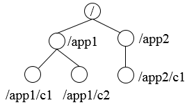
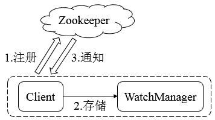

# Zookeeper的系统模型

## 1 数据模型

ZooKeeper的数据模型，在结构上和标准文件系统的非常相似，拥有一个层次的命名空间，都是采用树形层次结构，ZooKeeper树中的每个节点被称为—`Znode`。和文件系统的目录树一样，ZooKeeper树中的每个节点可以拥有子节点。

但也有不同之处：

1. `Znode`兼具文件和目录两种特点。既像文件一样维护着数据、元信息、ACL、 时间戳等数据结构，又像目录一样可以作为路径标识的一部分，并可以具有子`Znode`。用户对`Znode`具有增、删、改、查等操作（权限允许的情况下）。
2. `Znode`具有原子性操作，读操作将获取与节点相关的所有数据，写操作也将替换掉节点的所有数据。另外，每一个节点都拥有自己的ACL(访问控制列表)，这个列表规定了用户的权限，即限定了特定用户对目标节点可以执行的操作。
3. `Znode`存储数据大小有限制。ZooKeeper虽然可以关联一些数据，但并没有被设计为常规的数据库或者大数据存储，相反的是，它用来管理调度数据， 比如分布式应用中的配置文件信息、状态信息、汇集位置等等。这些数据的共同特性就是它们都是很小的数据，通常以KB为大小单位。ZooKeeper的服务器和客户端都被设计为严格检查并限制每个Znode的数据大小至多**1M**，常规使用中应该远小于此值。
4. `Znode`通过路径引用，如同Unix中的文件路径。**路径必须是绝对的**，因此他们必须由斜杠字符来开头。除此以外，**他们必须是唯一的**，也就是说每一个路径只有一个表示，因此这些路径不能改变。在ZooKeeper中，路径由Unicode字符串组成，并且有一些限制。字符串`"/zookeeper"`用以保存管理信息，比如关键配额信息。

Zookeeper的数据节点称为ZNode，ZNode是Zookeeper中数据的最小单元，每个ZNode都可以保存数据，同时还可以挂载子节点，因此构成了一个层次化的命名空间，称为树。

在Zookeeper中，事务是指能够改变Zookeeper服务器状态的操作，一般包括节点创建与删除，数据节点内容更新和客户端会话创建与失效，对于每个事务请求，Zookeeper都会为其分配一个全局唯一的事务ID，用ZXID表示，通常是64位的数字，每个ZXID对应一次更新操作，从这些ZXID中可以间接地识别出Zookeeper处理这些更新操作请求的全局顺序。

## 2 节点特性

在Zookeeper中，每个数据节点都是由生命周期的，类型不同则会不同的生命周期，节点类型可以分为**持久节点（PERSISTENT）**、**临时节点（EPHEMERAL）**、**顺序节点（SEQUENTIAL）**三大类，可以通过组合生成如下四种类型节点

1. **持久节点（PERSISTENT）**。节点创建后便一直存在于Zookeeper服务器上，直到有删除操作来主动清楚该节点。
2. **持久顺序节点（PERSISTENT_SEQUENTIAL）**。相比持久节点，其新增了顺序特性，每个父节点都会为它的第一级子节点维护一份顺序，用于记录每个子节点创建的先后顺序。在创建节点时，会自动添加一个数字后缀，作为新的节点名，该数字后缀的上限是整形的最大值。
3. **临时节点（EPEMERAL）**。临时节点的生命周期与客户端会话绑定，客户端失效，节点会被自动清理。同时，Zookeeper规定不能基于临时节点来创建子节点，即临时节点只能作为叶子节点。
4. **临时顺序节点（EPEMERAL_SEQUENTIAL）**。在临时节点的基础添加了顺序特性。

每个节点除了存储数据外，还存储了节点本身的一些状态信息，可通过`get`命令获取。

## 3 版本--保证分布式数据原子性操作

每个数据节点都具有三种类型的版本信息，对数据节点的任何更新操作都会引起版本号的变化。

* **version**-- 当前数据节点数据内容的版本号
* **cversion**-- 当前数据子节点的版本号
* **aversion**-- 当前数据节点ACL变更版本号

上述各版本号都是表示修改次数，如version为1表示对数据节点的内容变更了一次。即使前后两次变更并没有改变数据内容，version的值仍然会改变。version可以用于写入验证，类似于CAS。

## 4 Watcher--数据变更通知

Zookeeper使用Watcher机制实现分布式数据的发布/订阅功能。

Zookeeper的Watcher机制主要包括**客户端线程**、**客户端WatcherManager**、**Zookeeper服务器**三部分。客户端在向Zookeeper服务器注册的同时，会将Watcher对象存储在客户端的WatcherManager当中。当Zookeeper服务器触发Watcher事件后，会向客户端发送通知，客户端线程从WatcherManager中取出对应的Watcher对象来执行回调逻辑。

## 5 ACL--保障数据的安全

Zookeeper内部存储了分布式系统运行时状态的元数据，这些元数据会直接影响基于Zookeeper进行构造的分布式系统的运行状态，如何保障系统中数据的安全，从而避免因误操作而带来的数据随意变更而导致的数据库异常十分重要，Zookeeper提供了一套完善的ACL权限控制机制来保障数据的安全。

我们可以从三个方面来理解ACL机制：**权限模式（Scheme）**、**授权对象（ID）**、**权限（Permission）**，通常使用`"scheme:id:permission"`来标识一个有效的ACL信息。

权限模式用来确定权限验证过程中使用的检验策略，有如下四种模式：

1. **IP**，通过IP地址粒度来进行权限控制，如"ip:192.168.0.110"表示权限控制针对该IP地址，同时IP模式可以支持按照网段方式进行配置，如"ip:192.168.0.1/24"表示针对192.168.0.*这个网段进行权限控制。
2. **Digest**，使用"username:password"形式的权限标识来进行权限配置，便于区分不同应用来进行权限控制。**Zookeeper会对其进行SHA-1加密和BASE64编码**。
3. **World**，最为开放的权限控制模式，数据节点的访问权限对所有用户开放。
4. **Super**，超级用户，是一种特殊的Digest模式，超级用户可以对任意Zookeeper上的数据节点进行任何操作。

授权对象是指权限赋予的用户或一个指定实体，如IP地址或机器等。不同的权限模式通常有不同的授权对象。

权限是指通过权限检查可以被允许执行的操作，Zookeeper对所有数据的操作权限分为**CREATE（节点创建权限）**、**DELETE（节点删除权限）**、**READ（节点读取权限）**、**WRITE（节点更新权限）**、**ADMIN（节点管理权限）**。