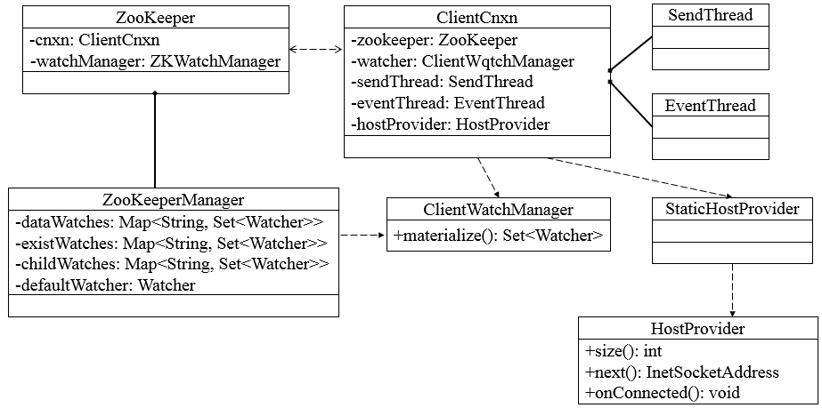
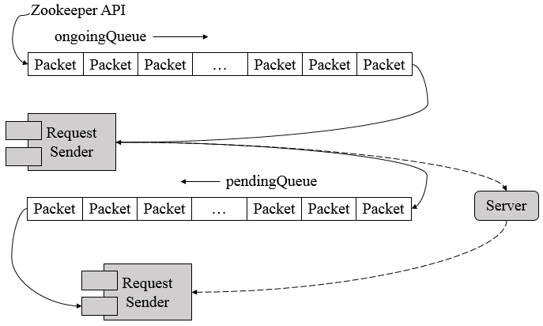
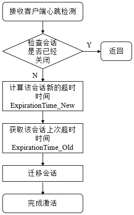
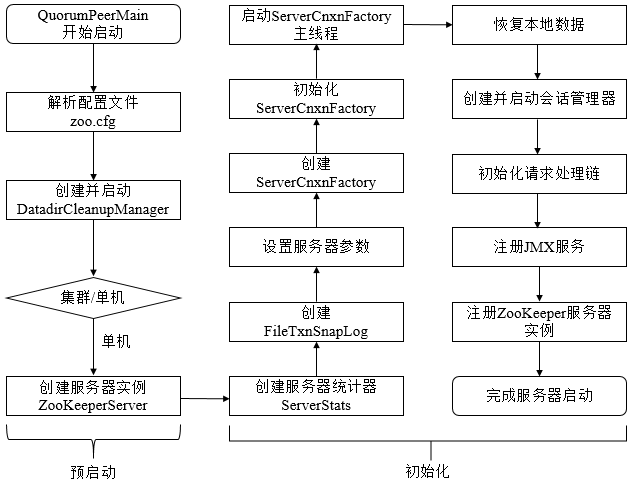
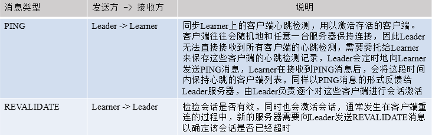

## Zookeeper客户端

### 1. 客户端

#### 1.1 客户端组成

Zookeeper客户端主要由如下核心部件构成。

1. **Zookeeper实例**，客户端入口。
2. **ClientWatchManager**， 客户端Watcher管理器。
3. **HostProvider**，客户端地址列表管理器。
4. **ClientCnxn**，客户端核心线程，内部包含了`SendThread`和`EventThread`两个线程: 
   1. `SendThread`为I/O线程，主要负责Zookeeper客户端和服务器之间的网络I/O通信；
   2. `EventThread`为事件线程，主要负责对服务端事件进行处理。



Zookeeper客户端初始化与启动环节，就是Zookeeper对象的实例化过程。客户端在初始化和启动过程中大体可以分为如下3个步骤

1. 设置默认Watcher
2. 设置Zookeeper服务器地址列表
3. 创建ClientCnxn。

若在Zookeeper构造方法中传入Watcher对象时，那么Zookeeper就会将该Watcher对象保存在`ZKWatcherManager`的`defaultWatcher`中，并作为整个客户端会话期间的默认Watcher。

#### 1.2 会话的创建

下图表示了客户端与服务端会话建立的整个过程，包括初始化阶段（第一阶段）、会话创建阶段（第二阶段）、响应处理阶段（第三阶段）三个阶段。


#### 1.3 服务器地址列表

在实例化Zookeeper时，用户传入Zookeeper服务器地址列表，如`192.168.0.1:2181,192.168.0.2:2181,192.168.0.3:2181`，此时，Zookeeper客户端在连接服务器的过程中，是如何从这个服务器列表中选择服务器的呢？Zookeeper收到服务器地址列表后，会解析出`chrootPath`和保存服务器地址列表。

1. **Chroot**，每个客户端可以设置自己的命名空间，若客户端设置了Chroot，此时，该客户端对服务器的任何操作都将被限制在自己的命名空间下，如设置Choot为`/app/X`，那么该客户端的所有节点路径都是以`/app/X`为根节点。
2. 地址列表管理，Zookeeper使用`StaticHostProvider`打散服务器地址（shuffle），并将服务器地址形成一个环形循环队列，然后再依次取出服务器地址。

#### 1.4 网络I/O

`ClientCnxn`是Zookeeper客户端中负责维护客户端与服务端之间的网络连接并进行一系列网络通信的核心工作类，`Packet`是ClientCnxn内部定义的一个堆协议层的封装，用作Zookeeper中请求和响应的载体。`Packet`包含了**请求头（requestHeader）**、**响应头（replyHeader）**、**请求体（request）**、**响应体（response）**、**节点路径（clientPath/serverPath）**、**注册的Watcher(watchRegistration)** 等信息，然而，并非Packet中所有的属性都在客户端与服务端之间进行网络传输，只会将`requestHeader`、`request`、`readOnly`三个属性序列化，并生成可用于底层网络传输的`ByteBuffer`，其他属性都保存在客户端的上下文中，不会进行与服务端之间的网络传输。

`ClientCnxn`维护着`outgoingQueue`（客户端的请求发送队列）和`pendingQueue`（服务端响应的等待队列），`outgoingQueue`专门用于存储那些需要发送到服务端的Packet集合，`pendingQueue`用于存储那些已经从客户端发送到服务端的，但是需要等待服务端响应的Packet集合。

在正常情况下，会从`outgoingQueue`中取出一个可发送的Packet对象，同时生成一个客户端请求序号XID并将其设置到Packet请求头中去，然后序列化后再发送，请求发送完毕后，会立即将该Packet保存到`pendingQueue`中，以便等待服务端响应返回后进行相应的处理。



客户端获取到来自服务端的完整响应数据后，根据不同的客户端请求类型，会进行不同的处理。

1. 若检测到此时客户端尚未进行初始化，那么说明当前客户端与服务端之间正在进行会话创建，直接将接收的`ByteBuffer`序列化成`ConnectResponse`对象。
2. 若当前客户端已经处于正常会话周期，并且接收到服务端响应是一个事件，那么将接收的`ByteBuffer`序列化成`WatcherEvent`对象，并将该事件放入待处理队列中。
3. 若是一个常规请求（Create、GetData、Exist等），那么从pendingQueue队列中取出一个Packet来进行相应处理。首先会检验响应中的XID来确保请求处理的顺序性，然后再将接收到的ByteBuffer序列化成Response对象。

**`SendThread`是客户端`ClientCnxn`内部的一个核心I/O调度线程**，用于管理客户端与服务端之间的所有网络I/O操作，在Zookeeper客户端实际运行中，SendThread的作用如下：

1. 维护了客户端与服务端之间的会话生命周期（通过一定周期频率内向服务端发送PING包检测心跳），如果会话周期内客户端与服务端出现TCP连接断开，那么就会自动且透明地完成重连操作。
2. 管理了客户端所有的请求发送和响应接收操作，其将上层客户端API操作转换成相应的请求协议并发送到服务端，并完成对同步调用的返回和异步调用的回调。
3. 将来自服务端的事件传递给`EventThread`去处理。

**`EventThread`是客户端`ClientCnxn`内部的一个事件处理线程**，负责客户端的事件处理，并触发客户端注册的Watcher监听。EventThread中的`watingEvents`队列用于临时存放那些需要被触发的Object，包括客户端注册的Watcher和异步接口中注册的回调器`AsyncCallback`。同时，`EventThread`会不断地从`watingEvents`中取出`Object`，识别具体类型（`Watcher`或`AsyncCallback`），并分别调用`process`和`processResult`接口方法来实现对事件的触发和回调。

### 2. 总结

Zookeeper客户端总共涉及到：

* Zookeeper
* ZookeeperManager
* ClientCnXn
* SendThread
* EventThread
* StaticHostProvider
* HostProvider
* ClientWatchManager
* Watcher
* Packet
* AsyncCallback

## Zookeeper会话

### 1. 会话

客户端与服务端之间任何交互操作都与会话息息相关，如临时节点的生命周期、客户端请求的顺序执行、Watcher通知机制等。**Zookeeper的连接与会话就是客户端通过实例化Zookeeper对象来实现客户端与服务端创建并保持TCP连接的过程**.

#### 1.1 会话状态

在Zookeeper客户端与服务端成功完成连接创建后，就创建了一个会话，Zookeeper会话在整个运行期间的生命周期中，会在不同的会话状态中之间进行切换，这些状态可以分为`CONNECTING`、`CONNECTED`、`RECONNECTING`、`RECONNECTED`、`CLOSE`等。

一旦客户端开始创建Zookeeper对象，那么客户端状态就会变成`CONNECTING`状态，同时客户端开始尝试连接服务端，连接成功后，客户端状态变为`CONNECTED`，通常情况下，由于断网或其他原因，客户端与服务端之间会出现断开情况，一旦碰到这种情况，Zookeeper客户端会自动进行重连服务，同时客户端状态再次变成`CONNCTING`，直到重新连上服务端后，状态又变为`CONNECTED`，在通常情况下，客户端的状态总是介于`CONNECTING`和`CONNECTED`之间。但是，如果出现诸如会话超时、权限检查或是客户端主动退出程序等情况，客户端的状态就会直接变更为`CLOSE`状态。


#### 1.2 会话创建

Session是Zookeeper中的会话实体，代表了一个客户端会话，其包含了如下四个属性

1. **sessionID**。会话ID，唯一标识一个会话，每次客户端创建新的会话时，Zookeeper都会为其分配一个全局唯一的sessionID。
2. **TimeOut**。会话超时时间，客户端在构造Zookeeper实例时，会配置sessionTimeout参数用于指定会话的超时时间，Zookeeper客户端向服务端发送这个超时时间后，服务端会根据自己的超时时间限制最终确定会话的超时时间。
3. **TickTime**。下次会话超时时间点，为了便于Zookeeper对会话实行"分桶策略"管理，同时为了高效低耗地实现会话的超时检查与清理，Zookeeper会为每个会话标记一个下次会话超时时间点，其值大致等于当前时间加上TimeOut。
4. **isClosing**。标记一个会话是否已经被关闭，当服务端检测到会话已经超时失效时，会将该会话的isClosing标记为"已关闭"，这样就能确保不再处理来自该会话的心情求了。

Zookeeper为了保证请求会话的全局唯一性，在`SessionTracker`初始化时，调用`initializeNextSession`方法生成一个`sessionID`，之后在Zookeeper运行过程中，会在该sessionID的基础上为每个会话进行分配，初始化算法如下

```
public static long initializeNextSession(long id) {
    long nextSid = 0;
    // 无符号右移8位使为了避免左移24后，再右移8位出现负数而无法通过高8位确定sid值
    nextSid = (System.currentTimeMillis() << 24) >>> 8;
    nextSid = nextSid | (id << 56);
    return nextSid;
}
```

其中的id表示配置在myid文件中的值，通常是一个整数，如1、2、3。该算法的高8位确定了所在机器，后56位使用当前时间的毫秒表示进行随机。SessionTracker是Zookeeper服务端的会话管理器，负责会话的创建、管理和清理等工作。

#### 1.3 会话管理

Zookeeper的会话管理主要是通过`SessionTracker`来负责，其采用了分桶策略（将类似的会话放在同一区块中进行管理）进行管理，以便Zookeeper对会话进行不同区块的隔离处理以及同一区块的统一处理。


Zookeeper将所有的会话都分配在不同的区块一种，分配的原则是每个会话的下次超时时间点（ExpirationTime）。ExpirationTime指该会话最近一次可能超时的时间点。同时，Zookeeper Leader服务器在运行过程中会定时地进行会话超时检查，时间间隔是`ExpirationInterval`，默认为`tickTime`的值，ExpirationTime的计算时间如下
```
ExpirationTime = ((CurrentTime + SessionTimeOut) / ExpirationInterval + 1) * ExpirationInterval
```

会了保持客户端会话的有效性，客户端会在会话超时时间过期范围内向服务端发送PING请求来保持会话的有效性（心跳检测）。同时，服务端需要不断地接收来自客户端的心跳检测，并且需要重新激活对应的客户端会话，这个重新激活过程称为`TouchSession`。会话激活不仅能够使服务端检测到对应客户端的存货性，同时也能让客户端自己保持连接状态，其流程如下



如上图所示，整个流程分为四步

1. **检查该会话是否已经被关闭**。若已经被关闭，则直接返回即可。
2. **计算该会话新的超时时间`ExpirationTime_New`**。使用上面提到的公式计算下一次超时时间点。
3. **获取该会话上次超时时间`ExpirationTime_Old`**。计算该值是为了定位其所在的区块。
3. **迁移会话**。将该会话从老的区块中取出，放入`ExpirationTime_New`对应的新区块中。


在上面会话激活过程中，只要客户端发送心跳检测，服务端就会进行一次会话激活，心跳检测由客户端主动发起，以PING请求形式向服务端发送，在Zookeeper的实际设计中，只要客户端有请求发送到服务端，那么就会触发一次会话激活，以下两种情况都会触发会话激活。

1. 客户端向服务端发送请求，包括读写请求，就会触发会话激活。
2. 客户端发现在`sessionTimeout/3`时间内尚未和服务端进行任何通信，那么就会主动发起`PING`请求，服务端收到该请求后，就会触发会话激活。

对于会话的超时检查而言，Zookeeper使用`SessionTracker`来负责，`SessionTracker`使用单独的线程（超时检查线程）专门进行会话超时检查，即逐个一次地对会话桶中剩下的会话进行清理。如果一个会话被激活，那么Zookeeper就会将其从上一个会话桶迁移到下一个会话桶中，如`ExpirationTime 1`的`session n`迁移到`ExpirationTime n`中，此时`ExpirationTime 1`中留下的所有会话都是尚未被激活的，超时检查线程就定时检查这个会话桶中所有剩下的未被迁移的会话，超时检查线程只需要在这些指定时间点`（ExpirationTime 1、ExpirationTime 2...）`上进行检查即可，这样提高了检查的效率，性能也非常好。

#### 1.4 会话清理

当`SessionTracker`的会话超时线程检查出已经过期的会话后，就开始进行会话清理工作，大致可以分为如下七步。

1. **标记会话状态为已关闭**。由于会话清理过程需要一段时间，为了保证在此期间不再处理来自该客户端的请求，SessionTracker会首先将该会话的isClosing标记为true，这样在会话清理期间接收到该客户端的心情求也无法继续处理了。
2. **发起会话关闭请求**。为了使对该会话的关闭操作在整个服务端集群都生效，Zookeeper使用了提交会话关闭请求的方式，并立即交付给PreRequestProcessor进行处理。
3. **收集需要清理的临时节点**。一旦某个会话失效后，那么和该会话相关的临时节点都需要被清理，因此，在清理之前，首先需要将服务器上所有和该会话相关的临时节点都整理出来。Zookeeper在内存数据库中会为每个会话都单独保存了一份由该会话维护的所有临时节点集合，在Zookeeper处理会话关闭请求之前，若正好有以下两类请求到达了服务端并正在处理中。
    * 节点删除请求，删除的目标节点正好是上述临时节点中的一个。
    * 临时节点创建请求，创建的目标节点正好是上述临时节点中的一个。

    对于第一类请求，需要将所有请求对应的数据节点路径从当前临时节点列表中移出，以避免重复删除，对于第二类请求，需要将所有这些请求对应的数据节点路径添加到当前临时节点列表中，以删除这些即将被创建但是尚未保存到内存数据库中的临时节点。

4. **添加节点删除事务变更**。完成该会话相关的临时节点收集后，Zookeeper会逐个将这些临时节点转换成"节点删除"请求，并放入事务变更队列outstandingChanges中。
5. **删除临时节点**。`FinalRequestProcessor`会触发内存数据库，删除该会话对应的所有临时节点。
6. **移除会话**。完成节点删除后，需要将会话从`SessionTracker`中删除。
7. **关闭NIOServerCnxn**。最后，从`NIOServerCnxnFactory`找到该会话对应的`NIOServerCnxn`，将其关闭。

#### 1.5 重连

当客户端与服务端之间的网络连接断开时，Zookeeper客户端会自动进行反复的重连，直到最终成功连接上Zookeeper集群中的一台机器。此时，再次连接上服务端的客户端有可能处于以下两种状态之一

1. **CONNECTED**。如果在会话超时时间内重新连接上集群中一台服务器 。
2. **EXPIRED**。如果在会话超时时间以外重新连接上，那么服务端其实已经对该会话进行了会话清理操作，此时会话被视为非法会话。

在客户端与服务端之间维持的是一个长连接，在sessionTimeout时间内，服务端会不断地检测该客户端是否还处于正常连接，服务端会将客户端的每次操作视为一次有效的心跳检测来反复地进行会话激活。因此，在正常情况下，客户端会话时一直有效的。然而，当客户端与服务端之间的连接断开后，用户在客户端可能主要看到两类异常：**CONNECTION_LOSS**（连接断开）**和SESSION_EXPIRED**（会话过期）。

1. **CONNECTION_LOSS**。此时，客户端会自动从地址列表中重新逐个选取新的地址并尝试进行重新连接，直到最终成功连接上服务器。若客户端在setData时出现了CONNECTION_LOSS现象，此时客户端会收到`None-Disconnected`通知，同时会抛出异常。应用程序需要捕捉异常并且等待Zookeeper客户端自动完成重连，一旦重连成功，那么客户端会收到None-SyncConnected通知，之后就可以重试setData操作。
2. **SESSION_EXPIRED**。客户端与服务端断开连接后，重连时间耗时太长，超过了会话超时时间限制后没有成功连上服务器，服务器会进行会话清理，此时，客户端不知道会话已经失效，状态还是`DISCONNECTED`，如果客户端重新连上了服务器，此时状态为`SESSION_EXPIRED`，用于需要重新实例化Zookeeper对象，并且看应用的复杂情况，重新恢复临时数据。
3. **SESSION_MOVED**。客户端会话从一台服务器转移到另一台服务器，即客户端与服务端S1断开连接后，重连上了服务端S2，此时会话就从S1转移到了S2。当多个客户端使用相同的`sessionId/sessionPasswd`创建会话时，会收到SessionMovedException异常。因为一旦有第二个客户端连接上了服务端，就被认为是会话转移了。

### 2. 总结

Zookeeper会话涉及到：

* Zookeeper.States
* SessionTracker
* SessionTracker.Session
* NIOServerCnxn

## Zookeeper服务端启动

### 1. 服务端

服务端整体架构如下


Zookeeper服务器的启动，大致可以分为以下五个步骤

1. 配置文件解析。
2. 初始化数据管理器。
3. 初始化网络I/O管理器。
4. 数据恢复。
5. 对外服务。

#### 1.1 单机版服务器启动

单机版服务器的启动其流程图如下



上图的过程可以分为预启动和初始化过程。

1. 预启动
   * 1.统一由`QuorumPeerMain`作为启动类。无论单机或集群，在`zkServer.cmd`和`zkServer.sh`中都配置了`QuorumPeerMain`作为启动入口类。
   * 2.解析配置文件`zoo.cfg`。`zoo.cfg`配置运行时的基本参数，如`tickTime`、`dataDir`、`clientPort`等参数。
   * 3.创建并启动历史文件清理器`DatadirCleanupManager`。对事务日志和快照数据文件进行定时清理。
   * 4.判断当前是集群模式还是单机模式启动。若是单机模式，则委托给`ZooKeeperServerMain`进行启动。
   * 5.再次进行配置文件`zoo.cfg`的解析。
   * 6.创建服务器实例`ZooKeeperServer`。Zookeeper服务器首先会进行服务器实例的创建，然后对该服务器实例进行初始化，包括连接器、内存数据库、请求处理器等组件的初始化。

2. 初始化
   * 1.创建服务器统计器`ServerStats`。`ServerStats`是Zookeeper服务器运行时的统计器。
   * 2.创建Zookeeper数据管理器`FileTxnSnapLog`。`FileTxnSnapLog`是Zookeeper上层服务器和底层数据存储之间的对接层，提供了一系列操作数据文件的接口，如事务日志文件和快照数据文件。Zookeeper根据`zoo.cfg`文件中解析出的快照数据目录`dataDir`和事务日志目录`dataLogDir`来创建`FileTxnSnapLog`。
   * 3.设置服务器`tickTime`和会话超时时间限制。
   * 4.创建`ServerCnxnFactory`。通过配置系统属性`zookeper.serverCnxnFactory`来指定使用Zookeeper自己实现的NIO还是使用Netty框架作为Zookeeper服务端网络连接工厂。
   * 5.初始化`ServerCnxnFactory`。Zookeeper会初始化Thread作为`ServerCnxnFactory`的主线程，然后再初始化NIO服务器。
   * 6.启动`ServerCnxnFactory`主线程。进入Thread的run方法，此时服务端还不能处理客户端请求。
   * 7.恢复本地数据。启动时，需要从本地快照数据文件和事务日志文件进行数据恢复。
   * 8.创建并启动会话管理器。Zookeeper会创建会话管理器`SessionTracker`进行会话管理。
   * 9.初始化Zookeeper的请求处理链。Zookeeper请求处理方式为责任链模式的实现。会有多个请求处理器依次处理一个客户端请求，在服务器启动时，会将这些请求处理器串联成一个请求处理链。
   * 10.注册JMX服务。Zookeeper会将服务器运行时的一些信息以JMX的方式暴露给外部。
   * 11.注册Zookeeper服务器实例。将Zookeeper服务器实例注册给`ServerCnxnFactory`，之后Zookeeper就可以对外提供服务。

至此，单机版的Zookeeper服务器启动完毕。

#### 1.2 集群服务器启动

单机和集群服务器的启动在很多地方是一致的，其流程图如下


上图的过程可以分为**预启动**、**初始化**、**Leader选举**、**Leader与Follower启动期交互过程**、**Leader与Follower启动**等过程。

1. 预启动
   * 1.统一由`QuorumPeerMain`作为启动类。
   * 2.解析配置文件`zoo.cfg`。
   * 3.创建并启动历史文件清理器`DatadirCleanupFactory`。
   * 4.判断当前是集群模式还是单机模式的启动。在集群模式中，在`zoo.cfg`文件中配置了多个服务器地址，可以选择集群启动。

2. 初始化
   * 1.创建`ServerCnxnFactory`。
   * 2.初始化`ServerCnxnFactory`。
   * 3.创建Zookeeper数据管理器`FileTxnSnapLog`。
   * 4.创建`QuorumPeer`实例。`Quorum`是集群模式下特有的对象，是Zookeeper服务器实例（ZooKeeperServer）的托管者，`QuorumPeer`代表了集群中的一台机器，在运行期间，`QuorumPeer`会不断检测当前服务器实例的运行状态，同时根据情况发起Leader选举。
   * 5.创建内存数据库`ZKDatabase`。`ZKDatabase`负责管理ZooKeeper的所有会话记录以及`DataTree`和事务日志的存储。
   * 6.初始化`QuorumPeer`。将核心组件如`FileTxnSnapLog`、`ServerCnxnFactory`、`ZKDatabase`注册到`QuorumPeer`中，同时配置`QuorumPeer`的参数，如服务器列表地址、Leader选举算法和会话超时时间限制等。
   * 7.恢复本地数据。
   * 8.启动`ServerCnxnFactory`主线程。

3. Leader选举
   * 1.初始化Leader选举。集群模式特有，Zookeeper首先会根据自身的服务器ID（SID）、最新的ZXID（lastLoggedZxid）和当前的服务器epoch（currentEpoch）来生成一个初始化投票，在初始化过程中，每个服务器都会给自己投票。然后，根据`zoo.cfg`的配置，创建相应Leader选举算法实现，Zookeeper提供了三种默认算法（`LeaderElection`、`AuthFastLeaderElection`、`FastLeaderElection`），可通过`zoo.cfg`中的`electionAlg`属性来指定，但现只支持`FastLeaderElection`选举算法。在初始化阶段，Zookeeper会创建Leader选举所需的网络I/O层`QuorumCnxManager`，同时启动对Leader选举端口的监听，等待集群中其他服务器创建连接。
   * 2.注册JMX服务。
   * 3.检测当前服务器状态。运行期间，`QuorumPeer`会不断检测当前服务器状态。在正常情况下，Zookeeper服务器的状态在`LOOKING`、`LEADING`、`FOLLOWING/OBSERVING`之间进行切换。在启动阶段，`QuorumPeer`的初始状态是`LOOKING`，因此开始进行Leader选举。
   * 4.Leader选举。通过投票确定Leader，其余机器称为Follower和Observer。具体算法在后面会给出。

4. Leader和Follower启动期交互过程
   * 1.创建Leader服务器和Follower服务器。完成Leader选举后，每个服务器会根据自己服务器的角色创建相应的服务器实例，并进入各自角色的主流程。
   * 2.Leader服务器启动Follower接收器`LearnerCnxAcceptor`。运行期间，Leader服务器需要和所有其余的服务器（统称为Learner）保持连接以确集群的机器存活情况，`LearnerCnxAcceptor`负责接收所有非Leader服务器的连接请求。
   * 3.Leader服务器开始和Leader建立连接。所有Learner会找到Leader服务器，并与其建立连接。
   * 4.Leader服务器创建`LearnerHandler`。Leader接收到来自其他机器连接创建请求后，会创建一个`LearnerHandler`实例，每个`LearnerHandler`实例都对应一个Leader与Learner服务器之间的连接，其负责Leader和Learner服务器之间几乎所有的消息通信和数据同步。
   * 5.向Leader注册。Learner完成和Leader的连接后，会向Leader进行注册，即将Learner服务器的基本信息（`LearnerInfo`），包括SID和ZXID，发送给Leader服务器。
   * 6.Leader解析Learner信息，计算新的epoch。Leader接收到Learner服务器基本信息后，会解析出该Learner的SID和ZXID，然后根据ZXID解析出对应的epoch_of_learner，并和当前Leader服务器的epoch_of_leader进行比较，如果该Learner的epoch_of_learner更大，则更新Leader的`epoch_of_leader = epoch_of_learner + 1`。然后LearnHandler进行等待，直到过半Learner已经向Leader进行了注册，同时更新了`epoch_of_leader`后，Leader就可以确定当前集群的epoch了。
   * 7.发送Leader状态。计算出新的epoch后，Leader会将该信息以一个LEADERINFO消息的形式发送给Learner，并等待Learner的响应。
   * 8.Learner发送ACK消息。Learner接收到LEADERINFO后，会解析出epoch和ZXID，然后向Leader反馈一个ACKEPOCH响应。
   * 9.数据同步。Leader收到Learner的ACKEPOCH后，即可进行数据同步。
   * 10.启动Leader和Learner服务器。当有过半Learner已经完成了数据同步，那么Leader和Learner服务器实例就可以启动了。

5. Leader和Follower启动
   * 1.创建启动会话管理器。
   * 2.初始化Zookeeper请求处理链，集群模式的每个处理器也会在启动阶段串联请求处理链。
   * 3.注册JMX服务。

至此，集群版的Zookeeper服务器启动完毕。

### 2. 总结

单机版

* QuorumPeerMain
* DatadirCleanupManager
* ZooKeeperServer
* ServerCnxnFactory
* FileTxnSnapLog
* ServerStats

集群版

* QuorumPeerMain
* DatadirCleanupManager
* ServerCnxnFactory
* FileTxnSnapLog
* QuorumPeer
* ZKDatabase
* Leader
* Follower

## Zookeeper的Leader选举

### 1. Leader选举

#### 1.1 Leader选举概述

Leader选举是保证分布式数据一致性的关键所在。当Zookeeper集群中的一台服务器出现以下两种情况之一时，需要进入Leader选举。

* 服务器初始化启动。
* 服务器运行期间无法和Leader保持连接。

下面就两种情况进行分析讲解。

**1. 服务器启动时期的Leader选举**

若进行Leader选举，则至少需要两台机器，这里选取3台机器组成的服务器集群为例。在集群初始化阶段，当有一台服务器`Server1`启动时，其单独无法进行和完成Leader选举，当第二台服务器`Server2`启动时，此时两台机器可以相互通信，每台机器都试图找到Leader，于是进入Leader选举过程。选举过程如下

* 1.**每个`Server`发出一个投票**。由于是初始情况，`Server1`和`Server2`都会将自己作为Leader服务器来进行投票，每次投票会包含所推举的服务器的`myid`和`ZXID`，使用`(myid, ZXID)`来表示，此时`Server1`的投票为`(1, 0)`，`Server2`的投票为`(2, 0)`，然后各自将这个投票发给集群中其他机器。
* 2.**接受来自各个服务器的投票**。集群的每个服务器收到投票后，首先判断该投票的有效性，如检查是否是本轮投票、是否来自`LOOKING`状态的服务器。
* 3.**处理投票**。针对每一个投票，服务器都需要将别人的投票和自己的投票进行PK，PK规则如下
  * 1.**优先检查`ZXID`**。`ZXID`比较大的服务器优先作为Leader。
  * 2.**如果ZXID相同，那么就比较myid**。`myid`较大的服务器作为Leader服务器。

  对于`Server1`而言，它的投票是`(1, 0)`，接收`Server2`的投票为`(2, 0)`，首先会比较两者的`ZXID`，均为`0`，再比较`myid`，此时`Server2`的`myid`最大，于是更新自己的投票为`(2, 0)`，然后重新投票，对于`Server2`而言，其无须更新自己的投票，只是再次向集群中所有机器发出上一次投票信息即可。

* 4.**统计投票**。每次投票后，服务器都会统计投票信息，判断是否已经有过半机器接受到相同的投票信息，对于`Server1`、`Server2`而言，都统计出集群中已经有两台机器接受了`(2, 0)`的投票信息，此时便认为已经选出了Leader。
* 5.**改变服务器状态**。一旦确定了Leader，每个服务器就会更新自己的状态，如果是Follower，那么就变更为`FOLLOWING`，如果是Leader，就变更为`LEADING`。

**2. 服务器运行时期的Leader选举**

在Zookeeper运行期间，Leader与非Leader服务器各司其职，即便当有非Leader服务器宕机或新加入，此时也不会影响Leader，但是一旦Leader服务器挂了，那么整个集群将暂停对外服务，进入新一轮Leader选举，其过程和启动时期的Leader选举过程基本一致。假设正在运行的有`Server1`、`Server2`、`Server3`三台服务器，当前Leader是`Server2`，若某一时刻Leader挂了，此时便开始Leader选举。选举过程如下

* 1.**变更状态**。Leader挂后，余下的非Observer服务器都会讲自己的服务器状态变更为`LOOKING`，然后开始进入Leader选举过程。
* 2.**每个Server会发出一个投票**。在运行期间，每个服务器上的`ZXID`可能不同，此时假定`Server1`的`ZXID`为`123`，`Server3`的`ZXID`为`122`；在第一轮投票中，`Server1`和`Server3`都会投自己，产生投票`(1, 123)`，`(3, 122)`，然后各自将投票发送给集群中所有机器。
* 3.**接收来自各个服务器的投票**。与启动时过程相同。
* 4.**处理投票**。与启动时过程相同，此时，Server1将会成为Leader。
* 5.**统计投票**。与启动时过程相同。
* 6.**改变服务器的状态**。与启动时过程相同。

#### 1.2 Leader选举算法分析

在3.4.0后的Zookeeper的版本只保留了TCP版本的`FastLeaderElection`选举算法。当一台机器进入Leader选举时，当前集群可能会处于以下两种状态

* 集群中已经存在Leader。
* 集群中不存在Leader。

对于集群中已经存在Leader而言，此种情况一般都是某台机器启动得较晚，在其启动之前，集群已经在正常工作，对这种情况，该机器试图去选举Leader时，会被告知当前服务器的Leader信息，对于该机器而言，仅仅需要和Leader机器建立起连接，并进行状态同步即可。

而在集群中不存在Leader情况下则会相对复杂，其步骤如下

* 1.**第一次投票**。无论哪种导致进行Leader选举，集群的所有机器都处于试图选举出一个Leader的状态，即`LOOKING`状态，`LOOKING`机器会向所有其他机器发送消息，该消息称为投票。投票中包含了`SID`（服务器的唯一标识）和`ZXID`（事务ID），`(SID, ZXID)`形式来标识一次投票信息。假定Zookeeper由5台机器组成，`SID`分别为`1`、`2`、`3`、`4`、`5`，`ZXID`分别为`9`、`9`、`9`、`8`、`8`，并且此时`SID`为`2`的机器是Leader机器，某一时刻，`1`、`2`所在机器出现故障，因此集群开始进行Leader选举。在第一次投票时，每台机器都会将自己作为投票对象，于是`SID`为`3`、`4`、`5`的机器投票情况分别为`(3, 9)`，`(4, 8)`， `(5, 8)`。
* 2.**变更投票**。每台机器发出投票后，也会收到其他机器的投票，每台机器会根据一定规则来处理收到的其他机器的投票，并以此来决定是否需要变更自己的投票，这个规则也是整个Leader选举算法的核心所在，其中术语描述如下
  * **vote_sid**：接收到的投票中所推举Leader服务器的SID。
  * **vote_zxid**：接收到的投票中所推举Leader服务器的ZXID。
  * **self_sid**：当前服务器自己的SID。
  * **self_zxid**：当前服务器自己的ZXID。

  **每次对收到的投票的处理，都是对`(vote_sid, vote_zxid)`和(`self_sid, self_zxid)`对比的过程。**

  * 规则一：如果`vote_zxid`大于`self_zxid`，就认可当前收到的投票，并再次将该投票发送出去。
  * 规则二：如果`vote_zxid`小于`self_zxid`，那么坚持自己的投票，不做任何变更。
  * 规则三：如果`vote_zxid`等于`self_zxid`，那么就对比两者的SID，如果`vote_sid`大于`self_sid`，那么就认可当前收到的投票，并再次将该投票发送出去。
  * 规则四：如果`vote_zxid`等于`self_zxid`，并且`vote_sid`小于`self_sid`，那么坚持自己的投票，不做任何变更。

  结合上面规则，给出下面的集群变更过程。

  

* **确定Leader**。经过第二轮投票后，集群中的每台机器都会再次接收到其他机器的投票，然后开始统计投票，如果一台机器收到了超过半数的相同投票，那么这个投票对应的SID机器即为Leader。此时Server3将成为Leader。

  由上面规则可知，**通常那台服务器上的数据越新（ZXID会越大），其成为Leader的可能性越大，也就越能够保证数据的恢复。如果ZXID相同，则SID越大机会越大**。

#### 1.3 Leader选举实现细节

##### 1.3.1 服务器状态

服务器具有四种状态，分别是`LOOKING`、`FOLLOWING`、`LEADING`、`OBSERVING`。

* `LOOKING`：寻找Leader状态。当服务器处于该状态时，它会认为当前集群中没有Leader，因此需要进入Leader选举状态。
* `FOLLOWING`：跟随者状态。表明当前服务器角色是Follower。
* `LEADING`：领导者状态。表明当前服务器角色是Leader。
* `OBSERVING`：观察者状态。表明当前服务器角色是Observer。

##### 1.3.2 投票数据结构

每个投票中包含了两个最基本的信息，所推举服务器的`SID`和`ZXID`，**投票（Vote）**在Zookeeper中包含字段如下

* `id`：被推举的Leader的SID。
* `zxid`：被推举的Leader事务ID。
* `electionEpoch`：逻辑时钟，用来判断多个投票是否在同一轮选举周期中，该值在服务端是一个自增序列，每次进入新一轮的投票后，都会对该值进行加1操作。
* `peerEpoch`：被推举的Leader的epoch。
* `state`：当前服务器的状态。

##### 1.3.3 QuorumCnxManager：网络I/O

每台服务器在启动的过程中，会启动一个`QuorumPeerManager`，负责各台服务器之间的底层Leader选举过程中的网络通信。

* 1.**消息队列**。
  
  `QuorumCnxManager`内部维护了一系列的队列，用来保存接收到的、待发送的消息以及消息的发送器，除接收队列以外，其他队列都按照`SID`分组形成队列集合，如一个集群中除了自身还有3台机器，那么就会为这3台机器分别创建一个发送队列，互不干扰。
  * **recvQueue**：消息接收队列，用于存放那些从其他服务器接收到的消息。
  * **queueSendMap**：消息发送队列，用于保存那些待发送的消息，按照SID进行分组。
  * **senderWorkerMap**：发送器集合，每个`SenderWorker`消息发送器，都对应一台远程Zookeeper服务器，负责消息的发送，也按照SID进行分组。
  * **lastMessageSent**：最近发送过的消息，为每个SID保留最近发送过的一个消息。
* 2.**建立连接**。

  为了能够相互投票，Zookeeper集群中的所有机器都需要两两建立起网络连接。`QuorumCnxManager`在启动时会创建一个`ServerSocket`来监听Leader选举的通信端口(默认为3888)。开启监听后，Zookeeper能够不断地接收到来自其他服务器的创建连接请求，在接收到其他服务器的TCP连接请求时，会进行处理。为了避免两台机器之间重复地创建TCP连接，Zookeeper只允许SID大的服务器主动和其他机器建立连接，否则断开连接。在接收到创建连接请求后，服务器通过对比自己和远程服务器的SID值来判断是否接收连接请求，如果当前服务器发现自己的SID更大，那么会断开当前连接，然后自己主动和远程服务器建立连接。一旦连接建立，就会根据远程服务器的SID来创建相应的消息发送器`SendWorker`和消息接收器`RecvWorker`，并启动。

* 3.**消息接收与发送**。
  * **消息接收**：由消息接收器`RecvWorker`负责，由于Zookeeper为每个远程服务器都分配一个单独的`RecvWorker`，因此，每个`RecvWorker`只需要不断地从这个TCP连接中读取消息，并将其保存到`recvQueue`队列中。
  * **消息发送**：由于Zookeeper为每个远程服务器都分配一个单独的`SendWorker`，因此，每个`SendWorker`只需要不断地从对应的消息发送队列中获取出一个消息发送即可，同时将这个消息放入`lastMessageSent`中。在`SendWorker`中，一旦Zookeeper发现针对当前服务器的消息发送队列为空，那么此时需要从`lastMessageSent`中取出一个最近发送过的消息来进行再次发送，这是为了解决接收方在消息接收前或者接收到消息后服务器挂了，导致消息尚未被正确处理。同时，Zookeeper能够保证接收方在处理消息时，会对重复消息进行正确的处理。

##### 1.3.4 FastLeaderElection：选举算法核心

* **外部投票**：特指其他服务器发来的投票。
* **内部投票**：服务器自身当前的投票。
* **选举轮次**：Zookeeper服务器Leader选举的轮次，即`logicalclock`。
* **PK**：对内部投票和外部投票进行对比来确定是否需要变更内部投票。

###### 选票管理

* **sendqueue**：选票发送队列，用于保存待发送的选票。
* **recvqueue**：选票接收队列，用于保存接收到的外部投票。
* **WorkerReceiver**：选票接收器。其会不断地从`QuorumCnxManager`中获取其他服务器发来的选举消息，并将其转换成一个选票，然后保存到`recvqueue`中，在选票接收过程中，如果发现该外部选票的选举轮次小于当前服务器的，那么忽略该外部投票，同时立即发送自己的内部投票。
* **WorkerSender**：选票发送器，不断地从`sendqueue`中获取待发送的选票，并将其传递到底层`QuorumCnxManager`中。

###### 算法核心


上图展示了FastLeaderElection模块是如何与底层网络I/O进行交互的。Leader选举的基本流程如下

1. **自增选举轮次**。Zookeeper规定所有有效的投票都必须在同一轮次中，在开始新一轮投票时，会首先对`logicalclock`进行自增操作。
2. **初始化选票**。在开始进行新一轮投票之前，每个服务器都会初始化自身的选票，并且在初始化阶段，每台服务器都会将自己推举为Leader。
3. **发送初始化选票**。完成选票的初始化后，服务器就会发起第一次投票。Zookeeper会将刚刚初始化好的选票放入`sendqueue`中，由发送器`WorkerSender`负责发送出去。
4. **接收外部投票**。每台服务器会不断地从`recvqueue`队列中获取外部选票。如果服务器发现无法获取到任何外部投票，那么就会立即确认自己是否和集群中其他服务器保持着有效的连接，如果没有连接，则马上建立连接，如果已经建立了连接，则再次发送自己当前的内部投票。
5. **判断选举轮次**。在发送完初始化选票之后，接着开始处理外部投票。在处理外部投票时，会根据选举轮次来进行不同的处理。
    * **外部投票的选举轮次大于内部投票**。若服务器自身的选举轮次落后于该外部投票对应服务器的选举轮次，那么就会立即更新自己的选举轮次(`logicalclock`)，并且清空所有已经收到的投票，然后使用初始化的投票来进行PK以确定是否变更内部投票。最终再将内部投票发送出去。
    * **外部投票的选举轮次小于内部投票**。若服务器接收的外选票的选举轮次落后于自身的选举轮次，那么Zookeeper就会直接忽略该外部投票，不做任何处理，并返回步骤4。
    * **外部投票的选举轮次等于内部投票**。此时可以开始进行选票PK。
6. **选票PK**。在进行选票PK时，符合任意一个条件就需要变更投票。
   * 若外部投票中推举的Leader服务器的选举轮次大于内部投票，那么需要变更投票。
   * 若选举轮次一致，那么就对比两者的`ZXID`，若外部投票的`ZXID`大，那么需要变更投票。
   * 若两者的`ZXID`一致，那么就对比两者的SID，若外部投票的SID大，那么就需要变更投票。
7. **变更投票**。经过PK后，若确定了外部投票优于内部投票，那么就变更投票，即使用外部投票的选票信息来覆盖内部投票，变更完成后，再次将这个变更后的内部投票发送出去。
8. **选票归档**。无论是否变更了投票，都会将刚刚收到的那份外部投票放入选票集合`recvset`中进行归档。`recvset`用于记录当前服务器在本轮次的Leader选举中收到的所有外部投票（按照服务队的SID区别，如`{(1, vote1), (2, vote2)...}`）。
9. **统计投票**。完成选票归档后，就可以开始统计投票，统计投票是为了统计集群中是否已经有过半的服务器认可了当前的内部投票，如果确定已经有过半服务器认可了该投票，则终止投票。否则返回步骤4。
10. **更新服务器状态**。若已经确定可以终止投票，那么就开始更新服务器状态，服务器首选判断当前被过半服务器认可的投票所对应的Leader服务器是否是自己，若是自己，则将自己的服务器状态更新为`LEADING`，若不是，则根据具体情况来确定自己是`FOLLOWING`或是`OBSERVING`。

以上10个步骤就是FastLeaderElection的核心，其中步骤4-9会经过几轮循环，直到有Leader选举产生。

### 2. 总结

* Vote
* ServerState/ZabState/SyncMode
* FastLeaderElection
* FastLeaderElection.WorkerReceiver
* FastLeaderElection.WorkerSender
* QuorumPeerManager
* QuorumCnxManager


## Zookeeper的服务器角色

### 1. 服务器角色

#### 1.1 Leader

Leader服务器是Zookeeper集群工作的核心，其主要工作如下

* 事务请求的唯一调度和处理者，保证集群事务处理的顺序性。
* 集群内部各服务器的调度者。

##### 1.1.1 请求处理链

使用责任链来处理每个客户端的请求时Zookeeper的特色，Leader服务器的请求处理链如下


* **PrepRequestProcessor**。请求预处理器。在Zookeeper中，那些会改变服务器状态的请求称为事务请求（创建节点、更新数据、删除节点、创建会话等），`PrepRequestProcessor`能够识别出当前客户端请求是否是事务请求。对于事务请求，`PrepRequestProcessor`处理器会对其进行一系列预处理，如创建请求事务头、事务体、会话检查、ACL检查和版本检查等。
* **ProposalRequestProcessor**。事务投票处理器。Leader服务器事务处理流程的发起者，对于非事务性请求，`ProposalRequestProcessor`会直接将请求转发到`CommitProcessor`处理器，不再做任何处理，而对于事务性请求，处理将请求转发到`CommitProcessor`外，还会根据请求类型创建对应的`Proposal`提议，并发送给所有的Follower服务器来发起一次集群内的事务投票。同时，`ProposalRequestProcessor`还会将事务请求交付给`SyncRequestProcessor`进行事务日志的记录。
* **SyncRequestProcessor**。事务日志记录处理器。用来将事务请求记录到事务日志文件中，同时会触发Zookeeper进行数据快照。
* **AckRequestProcessor**。负责在`SyncRequestProcessor`完成事务日志记录后，向Proposal的投票收集器发送ACK反馈，以通知投票收集器当前服务器已经完成了对该Proposal的事务日志记录。
* **CommitProcessor**。事务提交处理器。对于非事务请求，该处理器会直接将其交付给下一级处理器处理；对于事务请求，其会等待集群内针对Proposal的投票直到该Proposal可被提交，利用`CommitProcessor`，每个服务器都可以很好地控制对事务请求的顺序处理。
* **ToBeCommitProcessor**。该处理器有一个`toBeApplied`队列，用来存储那些已经被`CommitProcessor`处理过的可被提交的`Proposal`。其会将这些请求交付给`FinalRequestProcessor`处理器处理，待其处理完后，再将其从`toBeApplied`队列中移除。
* **FinalRequestProcessor**。用来进行客户端请求返回之前的操作，包括创建客户端请求的响应，针对事务请求，该处理还会负责将事务应用到内存数据库中去。

##### 1.1.2 LearnerHandler

为了保证整个集群内部的实时通信，同时为了确保可以控制所有的Follower/Observer服务器，Leader服务器会与每个Follower/Observer服务器建立一个TCP长连接。同时也会为每个Follower/Observer服务器创建一个名为`LearnerHandler`的实体。`LearnerHandler`是Learner服务器的管理者，主要负责Follower/Observer服务器和Leader服务器之间的一系列网络通信，包括数据同步、请求转发和Proposal提议的投票等。Leader服务器中保存了所有Follower/Observer对应的`LearnerHandler`。

#### 1.2 Follower

Follower是Zookeeper集群的跟随者，其主要工作如下

* 处理客户端非事务性请求（读取数据），转发事务请求给Leader服务器。
* 参与事务请求Proposal的投票。
* 参与Leader选举投票。

Follower也采用了责任链模式组装的请求处理链来处理每一个客户端请求，由于不需要对事务请求的投票处理，因此Follower的请求处理链会相对简单，其处理链如下


* **FollowerRequestProcessor**。其用作识别当前请求是否是事务请求，若是，那么Follower就会将该请求转发给Leader服务器，Leader服务器是在接收到这个事务请求后，就会将其提交到请求处理链，按照正常事务请求进行处理。
* **SendAckRequestProcessor**。其承担了事务日志记录反馈的角色，在完成事务日志记录后，会向Leader服务器发送ACK消息以表明自身完成了事务日志的记录工作。

#### 1.3 Observer

Observer充当观察者角色，观察Zookeeper集群的最新状态变化并将这些状态同步过来，其对于非事务请求可以进行独立处理，对于事务请求，则会转发给Leader服务器进行处理。Observer不会参与任何形式的投票，包括事务请求Proposal的投票和Leader选举投票。其处理链如下


#### 1.4 集群间消息通信

Zookeeper的消息类型大体分为**数据同步型**、**服务器初始化型**、**请求处理型**和**会话管理型**。

* **数据同步型**。指在Learner和Leader服务器进行数据同步时，网络通信所用到的消息，通常有`DIFF`、`TRUNC`、`SNAP`、`UPTODATE`。

  

* **服务器初始化型**。指在整个集群或是某些新机器初始化时，Leader和Learner之间相互通信所使用的消息类型，常见的有`OBSERVERINFO`、`FOLLOWERINFO`、`LEADERINFO`、`ACKEPOCH`和`NEWLEADER`五种。

  

* **请求处理型**。指在进行清理时，Leader和Learner服务器之间互相通信所使用的消息，常见的有`REQUEST`、`PROPOSAL`、`ACK`、`COMMIT`、`INFORM`和`SYNC`六种。

  

* **会话管理型**。指Zookeeper在进行会话管理时和Learner服务器之间互相通信所使用的消息，常见的有`PING`和`REVALIDATE`两种。

  


## Zookeeper请求处理

### 1. 会话创建请求

Zookeeper服务端对于会话创建的处理，大体可以分为请求接收、会话创建、预处理、事务处理、事务应用和会话响应六大环节，其大体流程如


#### 1.1 请求接收

* 1.**I/O层接收来自客户端的请求**。`NIOServerCnxn`维护每一个客户端连接，客户端与服务器端的所有通信都是由`NIOServerCnxn`负责，其负责统一接收来自客户端的所有请求，并将请求内容从底层网络I/O中完整地读取出来。
* 2.**判断是否是客户端会话创建请求**。每个会话对应一个`NIOServerCnxn`实体，对于每个请求，Zookeeper都会检查当前`NIOServerCnxn`实体是否已经被初始化，如果尚未被初始化，那么就可以确定该客户端一定是会话创建请求。
* 3.**反序列化`ConnectRequest`请求**。一旦确定客户端请求是否是会话创建请求，那么服务端就可以对其进行反序列化，并生成一个`ConnectRequest`载体。
* 4.**判断是否是ReadOnly客户端**。如果当前Zookeeper服务器是以ReadOnly模式启动，那么所有来自非ReadOnly型客户端的请求将无法被处理。因此，服务端需要先检查是否是ReadOnly客户端，并以此来决定是否接受该会话创建请求。
* 5.**检查客户端ZXID**。正常情况下，在一个Zookeeper集群中，服务端的ZXID必定大于客户端的ZXID，因此若发现客户端的ZXID大于服务端ZXID，那么服务端不接受该客户端的会话创建请求。
* 6.**协商sessionTimeout**。在客户端向服务器发送超时时间后，服务器会根据自己的超时时间限制最终确定该会话超时时间，这个过程就是sessionTimeout协商过程。
* 7.**判断是否需要重新激活创建会话**。服务端根据客户端请求中是否包含sessionID来判断该客户端是否需要重新创建会话，若客户单请求中包含sessionID，那么就认为该客户端正在进行会话重连，这种情况下，服务端只需要重新打开这个会话，否则需要重新创建。

#### 1.2 会话创建

* 1.**为客户端生成sessionID**。在为客户端创建会话之前，服务端首先会为每个客户端分配一个sessionID，服务端为客户端分配的sessionID是全局唯一的。
* 2.**注册会话**。向`SessionTracker`中注册会话，`SessionTracker`中维护了sessionsWithTimeout和sessionsById，在会话创建初期，会将客户端会话的相关信息保存到这两个数据结构中。
* 3.**激活会话**。激活会话涉及Zookeeper会话管理的分桶策略，其核心是为会话安排一个区块，以便会话清理程序能够快速高效地进行会话清理。
* 4.**生成会话密码**。服务端在创建一个客户端会话时，会同时为客户端生成一个会话密码，连同sessionID一同发给客户端，作为会话在集群中不同机器间转移的凭证。

#### 1.3 预处理

* 1.**将请求交给`PrepRequestProcessor`处理器处理**。在提交给第一个请求处理器之前，Zookeeper会根据该请求所属的会话，进行一次激活会话操作，以确保当前会话处于激活状态，完成会话激活后，则提交请求至处理器。
* 2.**创建请求事务头**。对于事务请求，Zookeeper会为其创建请求事务头，服务端后续的请求处理器都是基于该请求头来识别当前请求是否是事务请求，请求事务头包含了一个事务请求最基本的一些信息，包括sessionID、ZXID（事务请求对应的事务ZXID）、CXID（客户端的操作序列）和请求类型（如create、delete、setData、createSession等）等。
* 3.**创建请求事务体**。由于此时是会话创建请求，其事务体是`CreateSessionTxn`。
* 4.**注册于激活会话**。处理由非Leader服务器转发过来的会话创建请求。

#### 1.4 事务处理

将请求交给`ProposalRequestProcessor`处理器。与提议相关的处理器，从`ProposalRequestProcessor`开始，请求的处理将会进入三个子处理流程，分别是**Sync流程**、**Proposal流程**、**Commit流程**。


**Sync流程**

使用`SyncRequestProcessor`处理器记录事务日志，针对每个事务请求，都会通过事务日志的形式将其记录，完成日志记录后，每个Follower都会向Leader发送ACK消息，表明自身完成了事务日志的记录，以便Leader统计每个事务请求的投票情况。

**Proposal流程**

每个事务请求都需要集群中过半机器投票认可才能被真正应用到内存数据库中，这个投票与统计过程就是Proposal流程。

* **发起投票**。若当前请求是事务请求，Leader会发起一轮事务投票，在发起事务投票之前，会检查当前服务端的ZXID是否可用。
* **生成提议`Proposal`**。若ZXID可用，Zookeeper会将已创建的请求头和事务体以及ZXID和请求本身序列化到Proposal对象中，此Proposal对象就是一个提议。
* **广播提议**。Leader以ZXID作为标识，将该提议放入投票箱outstandingProposals中，同时将该提议广播给所有Follower。
* **收集投票**。Follower接收到Leader提议后，进入Sync流程进行日志记录，记录完成后，发送ACK消息至Leader服务器，Leader根据这些ACK消息来统计每个提议的投票情况，当一个提议获得半数以上投票时，就认为该提议通过，进入Commit阶段。
* **将请求放入toBeApplied队列中**。
* **广播Commit消息**。Leader向Follower和Observer发送COMMIT消息。向Observer发送INFORM消息，向Leader发送ZXID。

**Commit流程**

* **将请求交付`CommitProcessor`**。`CommitProcessor`收到请求后，将其放入queuedRequests队列中。
* **处理queuedRequest队列请求**。CommitProcessor中单独的线程处理queuedRequests队列中的请求。
* **标记nextPending**。若从queuedRequests中取出的是事务请求，则需要在集群中进行投票处理，同时将nextPending标记位当前请求。
* **等待Proposal投票**。在进行Commit流程的同时，Leader会生成Proposal并广播给所有Follower服务器，此时，Commit流程等待，直到投票结束。
* **投票通过**。若提议获得过半机器认可，则进入请求提交阶段，该请求会被放入commitedRequests队列中，同时唤醒Commit流程。
* **提交请求**。若commitedRequests队列中存在可以提交的请求，那么Commit流程则开始提交请求，将请求放入toProcess队列中，然后交付下一个请求处理器：`FinalRequestProcessor`。

#### 1.5 事务应用

* 1.**交付给`FinalRequestProcessor`处理器**。`FinalRequestProcessor`处理器检查outstandingChanges队列中请求的有效性，若发现这些请求已经落后于当前正在处理的请求，那么直接从outstandingChanges队列中移除。
* 2.**事务应用**。之前的请求处理仅仅将事务请求记录到了事务日志中，而内存数据库中的状态尚未改变，因此，需要将事务变更应用到内存数据库。
* 3.**将事务请求放入队列commitProposal**。完成事务应用后，则将该请求放入commitProposal队列中，commitProposal用来保存最近被提交的事务请求，以便集群间机器进行数据的快速同步。

#### 1.6 会话响应

* 1.**统计处理**。Zookeeper计算请求在服务端处理所花费的时间，统计客户端连接的基本信息，如lastZxid(最新的ZXID)、lastOp(最后一次和服务端的操作)、lastLatency(最后一次请求处理所花费的时间)等。
* 2.**创建响应`ConnectResponse`**。会话创建成功后的响应，包含了当前客户端和服务端之间的通信协议版本号、会话超时时间、sessionID和会话密码。
* 3.**序列化`ConnectResponse`**。
* 4.**I/O层发送响应给客户端**。

### 2 SetData请求

服务端对于`SetData`请求大致可以分为四步: **预处理**、**事务处理**、**事务应用**、**请求响应**。

#### 2.1 预处理

* I/O层接收来自客户端的请求。
* 判断是否是客户端"会话创建"请求。对于`SetData`请求，按照正常事务请求进行处理。
* 将请求交给`PrepRequestProcessor`处理器进行处理。
* 创建请求事务头。
* 会话检查。检查该会话是否有效。
* 反序列化请求，并创建ChangeRecord记录。反序列化并生成特定的SetDataRequest请求，请求中包含了数据节点路径path、更新的内容data和期望的数据节点版本version。同时根据请求对应的path，Zookeeper生成一个ChangeRecord记录，并放入outstandingChanges队列中。
* ACL检查。检查客户端是否具有数据更新的权限。
* 数据版本检查。通过version属性来实现乐观锁机制的写入校验。
* 创建请求事务体SetDataTxn。
* 保存事务操作到outstandingChanges队列中。

#### 2.2 事务处理

对于事务请求，服务端都会发起事务处理流程。所有事务请求都是由ProposalRequestProcessor处理器处理，通过Sync、Proposal、Commit三个子流程相互协作完成。

#### 2.3 事务应用

* 交付给`FinalRequestProcessor`处理器。
* 事务应用。将请求事务头和事务体直接交给内存数据库ZKDatabase进行事务应用，同时返回`ProcessTxnResult`对象，包含了数据节点内容更新后的stat。
* 将事务请求放入commitProposal队列。

#### 2.4 请求响应

* 创建响应体`SetDataResponse`。其包含了当前数据节点的最新状态stat。
* 创建响应头。包含当前响应对应的事务ZXID和请求处理是否成功的标识。
* 序列化响应。
* I/O层发送响应给客户端。

### 3 GetData请求

服务端对于GetData请求的处理，大致分为三步: **预处理**、**非事务处理**、**请求响应**。

#### 3.1 预处理

* I/O层接收来自客户端的请求。
* 判断是否是客户端"会话创建"请求。
* 将请求交给`PrepRequestProcessor`处理器进行处理。
* 会话检查。

#### 3.2 非事务处理

* 反序列化`GetDataRequest`请求。
* 获取数据节点。
* ACL检查。
* 获取数据内容和stat，注册`Watcher`。

#### 3.3 请求响应

* 创建响应体`GetDataResponse`。响应体包含当前数据节点的内容和状态stat。
* 创建响应头。
* 统计处理。
* 序列化响应。
* I/O层发送响应给客户端。

## Zookeeper数据与存储

### 1 内存数据

Zookeeper的数据模型是树结构，在内存数据库中，存储了整棵树的内容，包括所有的节点路径、节点数据、ACL信息，Zookeeper会定时将这个数据存储到磁盘上。

#### 1.1 DataTree

`DataTree`是内存数据存储的核心，是一个树结构，代表了内存中一份完整的数据。DataTree不包含任何与网络、客户端连接及请求处理相关的业务逻辑，是一个独立的组件。

#### 1.2 DataNode

`DataNode`是数据存储的最小单元，其内部除了保存了结点的数据内容、ACL列表、节点状态之外，还记录了父节点的引用和子节点列表两个属性，其也提供了对子节点列表进行操作的接口。

#### 1.3 ZKDatabase

Zookeeper的内存数据库，管理Zookeeper的所有会话、DataTree存储和事务日志。`ZKDatabase`会定时向磁盘dump快照数据，同时在Zookeeper启动时，会通过磁盘的事务日志和快照文件恢复成一个完整的内存数据库。

### 2 事务日志

#### 2.1 文件存储

在配置Zookeeper集群时需要配置`dataDir`目录，其用来存储事务日志文件。也可以为事务日志单独分配一个文件存储目录:`dataLogDir`。若配置`dataLogDir`为`/home/admin/zkData/zk_log`，那么Zookeeper在运行过程中会在该目录下建立一个名字为`version-2`的子目录，该目录确定了当前Zookeeper使用的事务日志格式版本号，当下次某个Zookeeper版本对事务日志格式进行变更时，此目录也会变更，即在`version-2`子目录下会生成一系列文件大小一致(64MB)的文件。

#### 2.2 日志格式

在配置好日志文件目录，启动Zookeeper后，完成如下操作

* 创建`/test_log`节点，初始值为`v1`。
* 更新`/test_log`节点的数据为`v2`。
* 创建`/test_log/c`节点，初始值为`v1`。
* 删除`/test_log/c`节点。

经过四步操作后，会在`/log/version-2/`目录下生成一个日志文件，笔者下是`log.cec`。

将Zookeeper下的`zookeeper-3.4.6.jar`和`slf4j-api-1.6.1.jar`复制到`/log/version-2`目录下，使用如下命令打开`log.cec`文件。
```
java -classpath ./zookeeper-3.4.6.jar:./slf4j-api-1.6.1.jar org.apache.zookeeper.server.LogFormatter log.cec
```


* `ZooKeeper Transactional Log File with dbid 0 txnlog format version 2` 。是文件头信息，主要是事务日志的DBID和日志格式版本号。
* `...session 0x159...0xcec createSession 30000`。表示客户端会话创建操作。
* `...session 0x159...0xced create '/test_log,...` 。表示创建/test_log节点，数据内容为#7631(v1)。
* `...session 0x159...0xcee setData ‘/test_log,...`。表示设置了/test_log节点数据，内容为#7632(v2)。
* `...session 0x159...0xcef create ’/test_log/c,...`。表示创建节点/test_log/c。
* `...session 0x159...0xcf0 delete '/test_log/c`。表示删除节点/test_log/c。

#### 2.3 日志写入

`FileTxnLog`负责维护事务日志对外的接口，包括事务日志的写入和读取等。Zookeeper的事务日志写入过程大体可以分为如下6个步骤。

* 1.**确定是否有事务日志可写**。当Zookeeper服务器启动完成需要进行第一次事务日志的写入，或是上一次事务日志写满时，都会处于与事务日志文件断开的状态，即Zookeeper服务器没有和任意一个日志文件相关联。因此在进行事务日志写入前，Zookeeper首先会判断FileTxnLog组件是否已经关联上一个可写的事务日志文件。若没有，则会使用该事务操作关联的ZXID作为后缀创建一个事务日志文件，同时构建事务日志的文件头信息，并立即写入这个事务日志文件中去，同时将该文件的文件流放入streamToFlush集合，该集合用来记录当前需要强制进行数据落盘的文件流。
* 2.**确定事务日志文件是否需要扩容(预分配)**。Zookeeper会采用磁盘空间预分配策略。当检测到当前事务日志文件剩余空间不足4096字节时，就会开始进行文件空间扩容，即在现有文件大小上，将文件增加65536KB(64MB)，然后使用"0"填充被扩容的文件空间。
* 3.**事务序列化**。对事务头和事务体的序列化，其中事务体又可分为会话创建事务、节点创建事务、节点删除事务、节点数据更新事务等。
* 4.**生成Checksum**。为保证日志文件的完整性和数据的准确性，Zookeeper在将事务日志写入文件前，会计算生成Checksum。
* 5.**写入事务日志文件流**。将序列化后的事务头、事务体和Checksum写入文件流中，此时并为写入到磁盘上。
* 6.**事务日志刷入磁盘**。由于步骤5中的缓存原因，无法实时地写入磁盘文件中，因此需要将缓存数据强制刷入磁盘。

#### 2.4 日志截断

在Zookeeper运行过程中，可能出现非Leader记录的事务ID比Leader上大，这是非法运行状态。此时，需要保证所有机器必须与该Leader的数据保持同步，即Leader会发送TRUNC命令给该机器，要求进行日志截断，Learner收到该命令后，就会删除所有包含或大于该事务ID的事务日志文件。

### 3 snapshot-数据快照

数据快照是Zookeeper数据存储中非常核心的运行机制，数据快照用来记录Zookeeper服务器上某一时刻的全量内存数据内容，并将其写入指定的磁盘文件中。

#### 3.1 文件存储

与事务文件类似，Zookeeper快照文件也可以指定特定磁盘目录，通过`dataDir`属性来配置。若指定`dataDir`为`/home/admin/zkData/zk_data`，则在运行过程中会在该目录下创建`version-2`的目录，该目录确定了当前Zookeeper使用的快照数据格式版本号。在Zookeeper运行时，会生成一系列文件。

#### 3.2 数据快照

`FileSnap`负责维护快照数据对外的接口，包括快照数据的写入和读取等，将内存数据库写入快照数据文件其实是一个序列化过程。针对客户端的每一次事务操作，Zookeeper都会将他们记录到事务日志中，同时也会将数据变更应用到内存数据库中，Zookeeper在进行若干次事务日志记录后，将内存数据库的全量数据Dump到本地文件中，这就是数据快照。其步骤如下

* 1.**确定是否需要进行数据快照**。每进行一次事务日志记录之后，Zookeeper都会检测当前是否需要进行数据快照，考虑到数据快照对于Zookeeper机器的影响，需要尽量避免Zookeeper集群中的所有机器在同一时刻进行数据快照。采用过半随机策略进行数据快照操作。
* 2.**切换事务日志文件**。表示当前的事务日志已经写满，需要重新创建一个新的事务日志。
* 3.**创建数据快照异步线程**。创建单独的异步线程来进行数据快照以避免影响Zookeeper主流程。
* 4.**获取全量数据和会话信息**。从ZKDatabase中获取到DataTree和会话信息。
* 5.**生成快照数据文件名**。Zookeeper根据当前已经提交的最大ZXID来生成数据快照文件名。
* 5.**数据序列化**。首先序列化文件头信息，然后再对会话信息和DataTree分别进行序列化，同时生成一个Checksum，一并写入快照数据文件中去。

### 4 初始化

在Zookeeper服务器启动期间，首先会进行数据初始化工作，用于将存储在磁盘上的数据文件加载到Zookeeper服务器内存中。

#### 4.1 初始化流程

Zookeeper的初始化过程如下图所示


数据的初始化工作是从磁盘上加载数据的过程，主要包括了从快照文件中加载快照数据和根据实物日志进行数据修正两个过程。

* 1.**初始化`FileTxnSnapLog`**。`FileTxnSnapLog`是Zookeeper事务日志和快照数据访问层，用于衔接上层业务和底层数据存储，底层数据包含了事务日志和快照数据两部分。`FileTxnSnapLog`中对应`FileTxnLog`和`FileSnap`。
* 2.**初始化`ZKDatabase`**。首先构建`DataTree`，同时将`FileTxnSnapLog`交付`ZKDatabase`，以便内存数据库能够对事务日志和快照数据进行访问。在`ZKDatabase`初始化时，`DataTree`也会进行相应的初始化工作，如创建一些默认结点，如`/`、`/zookeeper`、`/zookeeper/quota`三个节点。
* 3.**创建`PlayBackListener`**。其主要用来接收事务应用过程中的回调，在Zookeeper数据恢复后期，会有事务修正过程，此过程会回调`PlayBackListener`来进行对应的数据修正。
* 4.**处理快照文件**。此时可以从磁盘中恢复数据了，首先从快照文件开始加载。
* 5.**获取最新的100个快照文件**。更新时间最晚的快照文件包含了最新的全量数据。
* 6.**解析快照文件**。逐个解析快照文件，此时需要进行反序列化，生成`DataTree`和`sessionsWithTimeouts`，同时还会校验`Checksum`及快照文件的正确性。对于100个快找文件，如果正确性校验通过时，通常只会解析最新的那个快照文件。只有最新快照文件不可用时，才会逐个进行解析，直至100个快照文件全部解析完。若将100个快照文件解析完后还是无法成功恢复一个完整的`DataTree`和`sessionWithTimeouts`，此时服务器启动失败。
* 7.**获取最新的ZXID**。此时根据快照文件的文件名即可解析出最新的ZXID：`zxid_for_snap`。该ZXID代表了Zookeeper开始进行数据快照的时刻。
* 8.**处理事务日志**。此时服务器内存中已经有了一份近似全量的数据，现在开始通过事务日志来更新增量数据。
* 9.**获取所有`zxid_for_snap`之后提交的事务**。此时，已经可以获取快照数据的最新ZXID。只需要从事务日志中获取所有ZXID比步骤7得到的ZXID大的事务操作。
* 10.**事务应用**。获取大于`zxid_for_snap`的事务后，将其逐个应用到之前基于快照数据文件恢复出来的`DataTree`和`sessionsWithTimeouts`。每当有一个事务被应用到内存数据库中后，Zookeeper同时会回调`PlayBackListener`，将这事务操作记录转换成`Proposal`，并保存到`ZKDatabase`的`committedLog`中，以便`Follower`进行快速同步。
* 11.**获取最新的ZXID**。待所有的事务都被完整地应用到内存数据库中后，也就基本上完成了数据的初始化过程，此时再次获取ZXID，用来标识上次服务器正常运行时提交的最大事务ID。
* 12.**校验epoch**。`epoch`标识了当前Leader周期，集群机器相互通信时，会带上这个`epoch`以确保彼此在同一个Leader周期中。完成数据加载后，Zookeeper会从步骤11中确定ZXID中解析出事务处理的Leader周期：`epochOfZxid`。同时也会从磁盘的`currentEpoch`和`acceptedEpoch`文件中读取上次记录的最新的epoch值，进行校验。

### 5 数据同步

整个集群完成`Leader`选举后，`Learner`会向`Leader`进行注册，当`Learner`向`Leader`完成注册后，就进入数据同步环节，同步过程就是`Leader`将那些没有在`Learner`服务器上提交过的事务请求同步给`Learner`服务器，大体过程如下


* 1.**获取Learner状态**。在注册Learner的最后阶段，Learner服务器会发送给Leader服务器一个`ACKEPOCH`数据包，Leader会从这个数据包中解析出该Learner的`currentEpoch`和`lastZxid`。
* 2.**数据同步初始化**。首先从Zookeeper内存数据库中提取出事务请求对应的提议缓存队列proposals，同时完成peerLastZxid(该Learner最后处理的ZXID)、minCommittedLog(Leader提议缓存队列commitedLog中最小的ZXID)、maxCommittedLog(Leader提议缓存队列commitedLog中的最大ZXID)三个ZXID值的初始化。

对于集群数据同步而言，通常分为四类: **直接差异化同步(DIFF同步)**、**先回滚再差异化同步(TRUNC+DIFF同步)**、**仅回滚同步(TRUNC同步)**、**全量同步(SNAP同步)**，在初始化阶段，Leader会优先以全量同步方式来同步数据。同时，会根据Leader和Learner之间的数据差异情况来决定最终的数据同步方式。

* **直接差异化同步(DIFF同步，`peerLastZxid`介于`minCommittedLog`和`maxCommittedLog`之间)**。Leader首先向这个Learner发送一个DIFF指令，用于通知Learner进入差异化数据同步阶段，Leader即将把一些`Proposal`同步给自己，针对每个`Proposal`，Leader都会通过发送`PROPOSAL`内容数据包和`COMMIT`指令数据包来完成，
* **先回滚再差异化同步(TRUNC+DIFF同步，Leader已经将事务记录到本地事务日志中，但是没有成功发起Proposal流程)**。当Leader发现某个Learner包含了一条自己没有的事务记录，那么就需要该Learner进行事务回滚，回滚到Leader服务器上存在的，同时也是最接近于peerLastZxid的ZXID。
* **仅回滚同步(TRUNC同步，`peerLastZxid`大于`maxCommittedLog`)**。Leader要求Learner回滚到ZXID值为`maxCommittedLog`对应的事务操作。
* **全量同步(SNAP同步，`peerLastZxid`小于`minCommittedLog`或`peerLastZxid`不等于`lastProcessedZxid`)**。Leader无法直接使用提议缓存队列和Learner进行同步，因此只能进行全量同步。Leader将本机的全量内存数据同步给Learner。Leader首先向Learner发送一个SNAP指令，通知Learner即将进行全量同步，随后，Leader会从内存数据库中获取到全量的数据节点和会话超时时间记录器，将他们序列化后传输给Learner。Learner接收到该全量数据后，会对其反序列化后载入到内存数据库中。
