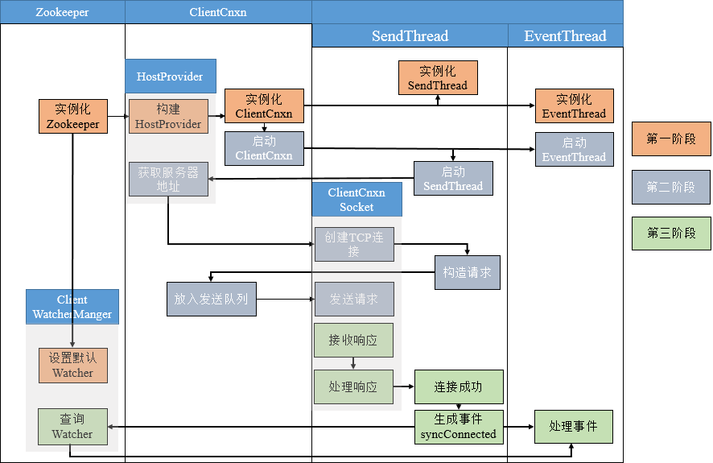
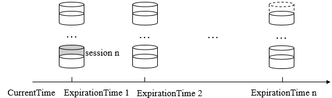
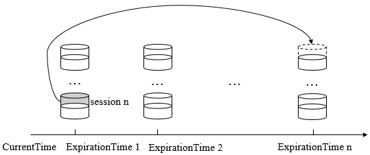
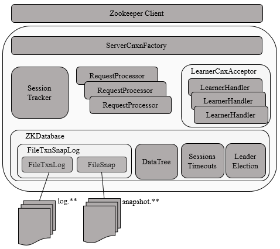
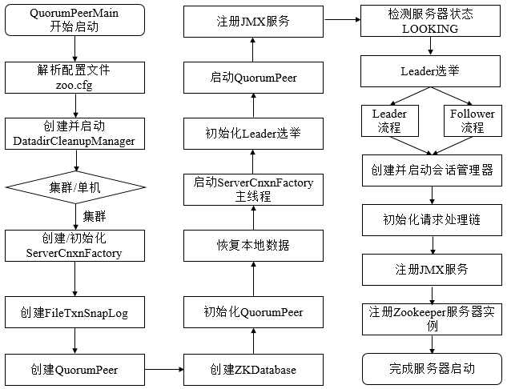

## Zookeeper客户端

### 1. 客户端

#### 1.1 客户端组成

Zookeeper客户端主要由如下核心部件构成。

1. **Zookeeper实例**，客户端入口。
2. **ClientWatchManager**， 客户端Watcher管理器。
3. **HostProvider**，客户端地址列表管理器。
4. **ClientCnxn**，客户端核心线程，内部包含了`SendThread`和`EventThread`两个线程: 
   1. `SendThread`为I/O线程，主要负责Zookeeper客户端和服务器之间的网络I/O通信；
   2. `EventThread`为事件线程，主要负责对服务端事件进行处理。


Zookeeper客户端初始化与启动环节，就是Zookeeper对象的实例化过程。客户端在初始化和启动过程中大体可以分为如下3个步骤

1. 设置默认Watcher
2. 设置Zookeeper服务器地址列表
3. 创建ClientCnxn。

若在Zookeeper构造方法中传入Watcher对象时，那么Zookeeper就会将该Watcher对象保存在`ZKWatcherManager`的`defaultWatcher`中，并作为整个客户端会话期间的默认Watcher。

#### 1.2 会话的创建

下图表示了客户端与服务端会话建立的整个过程，包括初始化阶段（第一阶段）、会话创建阶段（第二阶段）、响应处理阶段（第三阶段）三个阶段。



#### 1.3 服务器地址列表

在实例化Zookeeper时，用户传入Zookeeper服务器地址列表，如`192.168.0.1:2181,192.168.0.2:2181,192.168.0.3:2181`，此时，Zookeeper客户端在连接服务器的过程中，是如何从这个服务器列表中选择服务器的呢？Zookeeper收到服务器地址列表后，会解析出`chrootPath`和保存服务器地址列表。

1. **Chroot**，每个客户端可以设置自己的命名空间，若客户端设置了Chroot，此时，该客户端对服务器的任何操作都将被限制在自己的命名空间下，如设置Choot为`/app/X`，那么该客户端的所有节点路径都是以`/app/X`为根节点。
2. 地址列表管理，Zookeeper使用`StaticHostProvider`打散服务器地址（shuffle），并将服务器地址形成一个环形循环队列，然后再依次取出服务器地址。

#### 1.4 网络I/O

`ClientCnxn`是Zookeeper客户端中负责维护客户端与服务端之间的网络连接并进行一系列网络通信的核心工作类，`Packet`是ClientCnxn内部定义的一个堆协议层的封装，用作Zookeeper中请求和响应的载体。`Packet`包含了**请求头（requestHeader）**、**响应头（replyHeader）**、**请求体（request）**、**响应体（response）**、**节点路径（clientPath/serverPath）**、**注册的Watcher(watchRegistration)** 等信息，然而，并非Packet中所有的属性都在客户端与服务端之间进行网络传输，只会将`requestHeader`、`request`、`readOnly`三个属性序列化，并生成可用于底层网络传输的`ByteBuffer`，其他属性都保存在客户端的上下文中，不会进行与服务端之间的网络传输。

`ClientCnxn`维护着`outgoingQueue`（客户端的请求发送队列）和`pendingQueue`（服务端响应的等待队列），`outgoingQueue`专门用于存储那些需要发送到服务端的Packet集合，`pendingQueue`用于存储那些已经从客户端发送到服务端的，但是需要等待服务端响应的Packet集合。

在正常情况下，会从`outgoingQueue`中取出一个可发送的Packet对象，同时生成一个客户端请求序号XID并将其设置到Packet请求头中去，然后序列化后再发送，请求发送完毕后，会立即将该Packet保存到`pendingQueue`中，以便等待服务端响应返回后进行相应的处理。


客户端获取到来自服务端的完整响应数据后，根据不同的客户端请求类型，会进行不同的处理。

1. 若检测到此时客户端尚未进行初始化，那么说明当前客户端与服务端之间正在进行会话创建，直接将接收的`ByteBuffer`序列化成`ConnectResponse`对象。
2. 若当前客户端已经处于正常会话周期，并且接收到服务端响应是一个事件，那么将接收的`ByteBuffer`序列化成`WatcherEvent`对象，并将该事件放入待处理队列中。
3. 若是一个常规请求（Create、GetData、Exist等），那么从pendingQueue队列中取出一个Packet来进行相应处理。首先会检验响应中的XID来确保请求处理的顺序性，然后再将接收到的ByteBuffer序列化成Response对象。

**`SendThread`是客户端`ClientCnxn`内部的一个核心I/O调度线程**，用于管理客户端与服务端之间的所有网络I/O操作，在Zookeeper客户端实际运行中，SendThread的作用如下：

1. 维护了客户端与服务端之间的会话生命周期（通过一定周期频率内向服务端发送PING包检测心跳），如果会话周期内客户端与服务端出现TCP连接断开，那么就会自动且透明地完成重连操作。
2. 管理了客户端所有的请求发送和响应接收操作，其将上层客户端API操作转换成相应的请求协议并发送到服务端，并完成对同步调用的返回和异步调用的回调。
3. 将来自服务端的事件传递给`EventThread`去处理。

**`EventThread`是客户端`ClientCnxn`内部的一个事件处理线程**，负责客户端的事件处理，并触发客户端注册的Watcher监听。EventThread中的`watingEvents`队列用于临时存放那些需要被触发的Object，包括客户端注册的Watcher和异步接口中注册的回调器`AsyncCallback`。同时，`EventThread`会不断地从`watingEvents`中取出`Object`，识别具体类型（`Watcher`或`AsyncCallback`），并分别调用`process`和`processResult`接口方法来实现对事件的触发和回调。

### 2. 总结

Zookeeper客户端总共涉及到：

* Zookeeper
* ZookeeperManager
* ClientCnXn
* SendThread
* EventThread
* StaticHostProvider
* HostProvider
* ClientWatchManager
* Watcher
* Packet
* AsyncCallback

## Zookeeper会话

### 1. 会话

客户端与服务端之间任何交互操作都与会话息息相关，如临时节点的生命周期、客户端请求的顺序执行、Watcher通知机制等。**Zookeeper的连接与会话就是客户端通过实例化Zookeeper对象来实现客户端与服务端创建并保持TCP连接的过程**.

#### 1.1 会话状态

在Zookeeper客户端与服务端成功完成连接创建后，就创建了一个会话，Zookeeper会话在整个运行期间的生命周期中，会在不同的会话状态中之间进行切换，这些状态可以分为`CONNECTING`、`CONNECTED`、`RECONNECTING`、`RECONNECTED`、`CLOSE`等。

一旦客户端开始创建Zookeeper对象，那么客户端状态就会变成`CONNECTING`状态，同时客户端开始尝试连接服务端，连接成功后，客户端状态变为`CONNECTED`，通常情况下，由于断网或其他原因，客户端与服务端之间会出现断开情况，一旦碰到这种情况，Zookeeper客户端会自动进行重连服务，同时客户端状态再次变成`CONNCTING`，直到重新连上服务端后，状态又变为`CONNECTED`，在通常情况下，客户端的状态总是介于`CONNECTING`和`CONNECTED`之间。但是，如果出现诸如会话超时、权限检查或是客户端主动退出程序等情况，客户端的状态就会直接变更为`CLOSE`状态。


#### 1.2 会话创建

Session是Zookeeper中的会话实体，代表了一个客户端会话，其包含了如下四个属性

1. **sessionID**。会话ID，唯一标识一个会话，每次客户端创建新的会话时，Zookeeper都会为其分配一个全局唯一的sessionID。
2. **TimeOut**。会话超时时间，客户端在构造Zookeeper实例时，会配置sessionTimeout参数用于指定会话的超时时间，Zookeeper客户端向服务端发送这个超时时间后，服务端会根据自己的超时时间限制最终确定会话的超时时间。
3. **TickTime**。下次会话超时时间点，为了便于Zookeeper对会话实行"分桶策略"管理，同时为了高效低耗地实现会话的超时检查与清理，Zookeeper会为每个会话标记一个下次会话超时时间点，其值大致等于当前时间加上TimeOut。
4. **isClosing**。标记一个会话是否已经被关闭，当服务端检测到会话已经超时失效时，会将该会话的isClosing标记为"已关闭"，这样就能确保不再处理来自该会话的心情求了。

Zookeeper为了保证请求会话的全局唯一性，在`SessionTracker`初始化时，调用`initializeNextSession`方法生成一个`sessionID`，之后在Zookeeper运行过程中，会在该sessionID的基础上为每个会话进行分配，初始化算法如下

```
public static long initializeNextSession(long id) {
    long nextSid = 0;
    // 无符号右移8位使为了避免左移24后，再右移8位出现负数而无法通过高8位确定sid值
    nextSid = (System.currentTimeMillis() << 24) >>> 8;
    nextSid = nextSid | (id << 56);
    return nextSid;
}
```

其中的id表示配置在myid文件中的值，通常是一个整数，如1、2、3。该算法的高8位确定了所在机器，后56位使用当前时间的毫秒表示进行随机。SessionTracker是Zookeeper服务端的会话管理器，负责会话的创建、管理和清理等工作。

#### 1.3 会话管理

Zookeeper的会话管理主要是通过`SessionTracker`来负责，其采用了分桶策略（将类似的会话放在同一区块中进行管理）进行管理，以便Zookeeper对会话进行不同区块的隔离处理以及同一区块的统一处理。



Zookeeper将所有的会话都分配在不同的区块一种，分配的原则是每个会话的下次超时时间点（ExpirationTime）。ExpirationTime指该会话最近一次可能超时的时间点。同时，Zookeeper Leader服务器在运行过程中会定时地进行会话超时检查，时间间隔是`ExpirationInterval`，默认为`tickTime`的值，ExpirationTime的计算时间如下
```
ExpirationTime = ((CurrentTime + SessionTimeOut) / ExpirationInterval + 1) * ExpirationInterval
```

会了保持客户端会话的有效性，客户端会在会话超时时间过期范围内向服务端发送PING请求来保持会话的有效性（心跳检测）。同时，服务端需要不断地接收来自客户端的心跳检测，并且需要重新激活对应的客户端会话，这个重新激活过程称为`TouchSession`。会话激活不仅能够使服务端检测到对应客户端的存货性，同时也能让客户端自己保持连接状态，其流程如下


如上图所示，整个流程分为四步

1. **检查该会话是否已经被关闭**。若已经被关闭，则直接返回即可。
2. **计算该会话新的超时时间`ExpirationTime_New`**。使用上面提到的公式计算下一次超时时间点。
3. **获取该会话上次超时时间`ExpirationTime_Old`**。计算该值是为了定位其所在的区块。
3. **迁移会话**。将该会话从老的区块中取出，放入`ExpirationTime_New`对应的新区块中。



在上面会话激活过程中，只要客户端发送心跳检测，服务端就会进行一次会话激活，心跳检测由客户端主动发起，以PING请求形式向服务端发送，在Zookeeper的实际设计中，只要客户端有请求发送到服务端，那么就会触发一次会话激活，以下两种情况都会触发会话激活。

1. 客户端向服务端发送请求，包括读写请求，就会触发会话激活。
2. 客户端发现在`sessionTimeout/3`时间内尚未和服务端进行任何通信，那么就会主动发起`PING`请求，服务端收到该请求后，就会触发会话激活。

对于会话的超时检查而言，Zookeeper使用`SessionTracker`来负责，`SessionTracker`使用单独的线程（超时检查线程）专门进行会话超时检查，即逐个一次地对会话桶中剩下的会话进行清理。如果一个会话被激活，那么Zookeeper就会将其从上一个会话桶迁移到下一个会话桶中，如`ExpirationTime 1`的`session n`迁移到`ExpirationTime n`中，此时`ExpirationTime 1`中留下的所有会话都是尚未被激活的，超时检查线程就定时检查这个会话桶中所有剩下的未被迁移的会话，超时检查线程只需要在这些指定时间点`（ExpirationTime 1、ExpirationTime 2...）`上进行检查即可，这样提高了检查的效率，性能也非常好。

#### 1.4 会话清理

当`SessionTracker`的会话超时线程检查出已经过期的会话后，就开始进行会话清理工作，大致可以分为如下七步。

1. **标记会话状态为已关闭**。由于会话清理过程需要一段时间，为了保证在此期间不再处理来自该客户端的请求，SessionTracker会首先将该会话的isClosing标记为true，这样在会话清理期间接收到该客户端的心情求也无法继续处理了。
2. **发起会话关闭请求**。为了使对该会话的关闭操作在整个服务端集群都生效，Zookeeper使用了提交会话关闭请求的方式，并立即交付给PreRequestProcessor进行处理。
3. **收集需要清理的临时节点**。一旦某个会话失效后，那么和该会话相关的临时节点都需要被清理，因此，在清理之前，首先需要将服务器上所有和该会话相关的临时节点都整理出来。Zookeeper在内存数据库中会为每个会话都单独保存了一份由该会话维护的所有临时节点集合，在Zookeeper处理会话关闭请求之前，若正好有以下两类请求到达了服务端并正在处理中。
    * 节点删除请求，删除的目标节点正好是上述临时节点中的一个。
    * 临时节点创建请求，创建的目标节点正好是上述临时节点中的一个。

    对于第一类请求，需要将所有请求对应的数据节点路径从当前临时节点列表中移出，以避免重复删除，对于第二类请求，需要将所有这些请求对应的数据节点路径添加到当前临时节点列表中，以删除这些即将被创建但是尚未保存到内存数据库中的临时节点。

4. **添加节点删除事务变更**。完成该会话相关的临时节点收集后，Zookeeper会逐个将这些临时节点转换成"节点删除"请求，并放入事务变更队列outstandingChanges中。
5. **删除临时节点**。`FinalRequestProcessor`会触发内存数据库，删除该会话对应的所有临时节点。
6. **移除会话**。完成节点删除后，需要将会话从`SessionTracker`中删除。
7. **关闭NIOServerCnxn**。最后，从`NIOServerCnxnFactory`找到该会话对应的`NIOServerCnxn`，将其关闭。

#### 1.5 重连

当客户端与服务端之间的网络连接断开时，Zookeeper客户端会自动进行反复的重连，直到最终成功连接上Zookeeper集群中的一台机器。此时，再次连接上服务端的客户端有可能处于以下两种状态之一

1. **CONNECTED**。如果在会话超时时间内重新连接上集群中一台服务器 。
2. **EXPIRED**。如果在会话超时时间以外重新连接上，那么服务端其实已经对该会话进行了会话清理操作，此时会话被视为非法会话。

在客户端与服务端之间维持的是一个长连接，在sessionTimeout时间内，服务端会不断地检测该客户端是否还处于正常连接，服务端会将客户端的每次操作视为一次有效的心跳检测来反复地进行会话激活。因此，在正常情况下，客户端会话时一直有效的。然而，当客户端与服务端之间的连接断开后，用户在客户端可能主要看到两类异常：**CONNECTION_LOSS**（连接断开）**和SESSION_EXPIRED**（会话过期）。

1. **CONNECTION_LOSS**。此时，客户端会自动从地址列表中重新逐个选取新的地址并尝试进行重新连接，直到最终成功连接上服务器。若客户端在setData时出现了CONNECTION_LOSS现象，此时客户端会收到`None-Disconnected`通知，同时会抛出异常。应用程序需要捕捉异常并且等待Zookeeper客户端自动完成重连，一旦重连成功，那么客户端会收到None-SyncConnected通知，之后就可以重试setData操作。
2. **SESSION_EXPIRED**。客户端与服务端断开连接后，重连时间耗时太长，超过了会话超时时间限制后没有成功连上服务器，服务器会进行会话清理，此时，客户端不知道会话已经失效，状态还是`DISCONNECTED`，如果客户端重新连上了服务器，此时状态为`SESSION_EXPIRED`，用于需要重新实例化Zookeeper对象，并且看应用的复杂情况，重新恢复临时数据。
3. **SESSION_MOVED**。客户端会话从一台服务器转移到另一台服务器，即客户端与服务端S1断开连接后，重连上了服务端S2，此时会话就从S1转移到了S2。当多个客户端使用相同的`sessionId/sessionPasswd`创建会话时，会收到SessionMovedException异常。因为一旦有第二个客户端连接上了服务端，就被认为是会话转移了。

### 2. 总结

Zookeeper会话涉及到：

* Zookeeper.States
* SessionTracker
* SessionTracker.Session
* NIOServerCnxn

## Zookeeper服务端启动

### 1. 服务端

服务端整体架构如下



Zookeeper服务器的启动，大致可以分为以下五个步骤

1. 配置文件解析。
2. 初始化数据管理器。
3. 初始化网络I/O管理器。
4. 数据恢复。
5. 对外服务。

#### 1.1 单机版服务器启动

单机版服务器的启动其流程图如下


上图的过程可以分为预启动和初始化过程。

1. 预启动
   * 1.统一由`QuorumPeerMain`作为启动类。无论单机或集群，在`zkServer.cmd`和`zkServer.sh`中都配置了`QuorumPeerMain`作为启动入口类。
   * 2.解析配置文件`zoo.cfg`。`zoo.cfg`配置运行时的基本参数，如`tickTime`、`dataDir`、`clientPort`等参数。
   * 3.创建并启动历史文件清理器`DatadirCleanupManager`。对事务日志和快照数据文件进行定时清理。
   * 4.判断当前是集群模式还是单机模式启动。若是单机模式，则委托给`ZooKeeperServerMain`进行启动。
   * 5.再次进行配置文件`zoo.cfg`的解析。
   * 6.创建服务器实例`ZooKeeperServer`。Zookeeper服务器首先会进行服务器实例的创建，然后对该服务器实例进行初始化，包括连接器、内存数据库、请求处理器等组件的初始化。

2. 初始化
   * 1.创建服务器统计器`ServerStats`。`ServerStats`是Zookeeper服务器运行时的统计器。
   * 2.创建Zookeeper数据管理器`FileTxnSnapLog`。`FileTxnSnapLog`是Zookeeper上层服务器和底层数据存储之间的对接层，提供了一系列操作数据文件的接口，如事务日志文件和快照数据文件。Zookeeper根据`zoo.cfg`文件中解析出的快照数据目录`dataDir`和事务日志目录`dataLogDir`来创建`FileTxnSnapLog`。
   * 3.设置服务器`tickTime`和会话超时时间限制。
   * 4.创建`ServerCnxnFactory`。通过配置系统属性`zookeper.serverCnxnFactory`来指定使用Zookeeper自己实现的NIO还是使用Netty框架作为Zookeeper服务端网络连接工厂。
   * 5.初始化`ServerCnxnFactory`。Zookeeper会初始化Thread作为`ServerCnxnFactory`的主线程，然后再初始化NIO服务器。
   * 6.启动`ServerCnxnFactory`主线程。进入Thread的run方法，此时服务端还不能处理客户端请求。
   * 7.恢复本地数据。启动时，需要从本地快照数据文件和事务日志文件进行数据恢复。
   * 8.创建并启动会话管理器。Zookeeper会创建会话管理器`SessionTracker`进行会话管理。
   * 9.初始化Zookeeper的请求处理链。Zookeeper请求处理方式为责任链模式的实现。会有多个请求处理器依次处理一个客户端请求，在服务器启动时，会将这些请求处理器串联成一个请求处理链。
   * 10.注册JMX服务。Zookeeper会将服务器运行时的一些信息以JMX的方式暴露给外部。
   * 11.注册Zookeeper服务器实例。将Zookeeper服务器实例注册给`ServerCnxnFactory`，之后Zookeeper就可以对外提供服务。

至此，单机版的Zookeeper服务器启动完毕。

#### 1.2 集群服务器启动

单机和集群服务器的启动在很多地方是一致的，其流程图如下



上图的过程可以分为**预启动**、**初始化**、**Leader选举**、**Leader与Follower启动期交互过程**、**Leader与Follower启动**等过程。

1. 预启动
   * 1.统一由`QuorumPeerMain`作为启动类。
   * 2.解析配置文件`zoo.cfg`。
   * 3.创建并启动历史文件清理器`DatadirCleanupFactory`。
   * 4.判断当前是集群模式还是单机模式的启动。在集群模式中，在`zoo.cfg`文件中配置了多个服务器地址，可以选择集群启动。

2. 初始化
   * 1.创建`ServerCnxnFactory`。
   * 2.初始化`ServerCnxnFactory`。
   * 3.创建Zookeeper数据管理器`FileTxnSnapLog`。
   * 4.创建`QuorumPeer`实例。`Quorum`是集群模式下特有的对象，是Zookeeper服务器实例（ZooKeeperServer）的托管者，`QuorumPeer`代表了集群中的一台机器，在运行期间，`QuorumPeer`会不断检测当前服务器实例的运行状态，同时根据情况发起Leader选举。
   * 5.创建内存数据库`ZKDatabase`。`ZKDatabase`负责管理ZooKeeper的所有会话记录以及`DataTree`和事务日志的存储。
   * 6.初始化`QuorumPeer`。将核心组件如`FileTxnSnapLog`、`ServerCnxnFactory`、`ZKDatabase`注册到`QuorumPeer`中，同时配置`QuorumPeer`的参数，如服务器列表地址、Leader选举算法和会话超时时间限制等。
   * 7.恢复本地数据。
   * 8.启动`ServerCnxnFactory`主线程。

3. Leader选举
   * 1.初始化Leader选举。集群模式特有，Zookeeper首先会根据自身的服务器ID（SID）、最新的ZXID（lastLoggedZxid）和当前的服务器epoch（currentEpoch）来生成一个初始化投票，在初始化过程中，每个服务器都会给自己投票。然后，根据`zoo.cfg`的配置，创建相应Leader选举算法实现，Zookeeper提供了三种默认算法（`LeaderElection`、`AuthFastLeaderElection`、`FastLeaderElection`），可通过`zoo.cfg`中的`electionAlg`属性来指定，但现只支持`FastLeaderElection`选举算法。在初始化阶段，Zookeeper会创建Leader选举所需的网络I/O层`QuorumCnxManager`，同时启动对Leader选举端口的监听，等待集群中其他服务器创建连接。
   * 2.注册JMX服务。
   * 3.检测当前服务器状态。运行期间，`QuorumPeer`会不断检测当前服务器状态。在正常情况下，Zookeeper服务器的状态在`LOOKING`、`LEADING`、`FOLLOWING/OBSERVING`之间进行切换。在启动阶段，`QuorumPeer`的初始状态是`LOOKING`，因此开始进行Leader选举。
   * 4.Leader选举。通过投票确定Leader，其余机器称为Follower和Observer。具体算法在后面会给出。

4. Leader和Follower启动期交互过程
   * 1.创建Leader服务器和Follower服务器。完成Leader选举后，每个服务器会根据自己服务器的角色创建相应的服务器实例，并进入各自角色的主流程。
   * 2.Leader服务器启动Follower接收器`LearnerCnxAcceptor`。运行期间，Leader服务器需要和所有其余的服务器（统称为Learner）保持连接以确集群的机器存活情况，`LearnerCnxAcceptor`负责接收所有非Leader服务器的连接请求。
   * 3.Leader服务器开始和Leader建立连接。所有Learner会找到Leader服务器，并与其建立连接。
   * 4.Leader服务器创建`LearnerHandler`。Leader接收到来自其他机器连接创建请求后，会创建一个`LearnerHandler`实例，每个`LearnerHandler`实例都对应一个Leader与Learner服务器之间的连接，其负责Leader和Learner服务器之间几乎所有的消息通信和数据同步。
   * 5.向Leader注册。Learner完成和Leader的连接后，会向Leader进行注册，即将Learner服务器的基本信息（`LearnerInfo`），包括SID和ZXID，发送给Leader服务器。
   * 6.Leader解析Learner信息，计算新的epoch。Leader接收到Learner服务器基本信息后，会解析出该Learner的SID和ZXID，然后根据ZXID解析出对应的epoch_of_learner，并和当前Leader服务器的epoch_of_leader进行比较，如果该Learner的epoch_of_learner更大，则更新Leader的`epoch_of_leader = epoch_of_learner + 1`。然后LearnHandler进行等待，直到过半Learner已经向Leader进行了注册，同时更新了`epoch_of_leader`后，Leader就可以确定当前集群的epoch了。
   * 7.发送Leader状态。计算出新的epoch后，Leader会将该信息以一个LEADERINFO消息的形式发送给Learner，并等待Learner的响应。
   * 8.Learner发送ACK消息。Learner接收到LEADERINFO后，会解析出epoch和ZXID，然后向Leader反馈一个ACKEPOCH响应。
   * 9.数据同步。Leader收到Learner的ACKEPOCH后，即可进行数据同步。
   * 10.启动Leader和Learner服务器。当有过半Learner已经完成了数据同步，那么Leader和Learner服务器实例就可以启动了。

5. Leader和Follower启动
   * 1.创建启动会话管理器。
   * 2.初始化Zookeeper请求处理链，集群模式的每个处理器也会在启动阶段串联请求处理链。
   * 3.注册JMX服务。

至此，集群版的Zookeeper服务器启动完毕。

### 2. 总结

单机版

* QuorumPeerMain
* DatadirCleanupManager
* ZooKeeperServer
* ServerCnxnFactory
* FileTxnSnapLog
* ServerStats

集群版

* QuorumPeerMain
* DatadirCleanupManager
* ServerCnxnFactory
* FileTxnSnapLog
* QuorumPeer
* ZKDatabase
* Leader
* Follower
