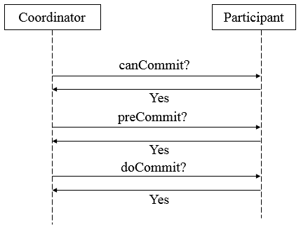
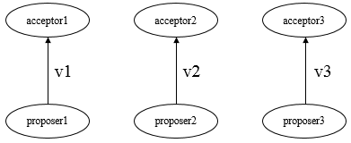
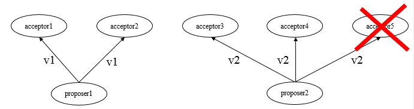
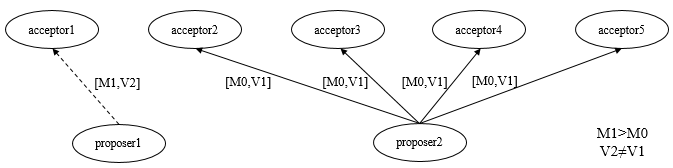
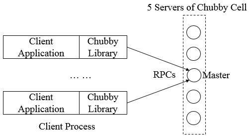
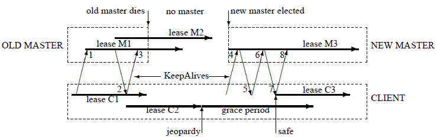
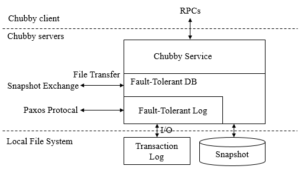
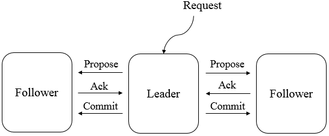
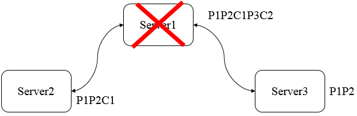

## 分布式架构

### 1. 前言

在大数据系统中，分布式系统已经成为一个无法避免的组件，如zookeeper已经成为了工业届的标准。所以对于大数据的研究，也必须要研究分布式系统的特点。

### 2. 集中式系统

由一台或多台计算机组成的中心节点，数据集中存储在这个中心节点中，并且整个系统的所有业务单元都集中部署在这个中心节点上，系统的所有功能均由其集中处理。其部署简单，不用考虑多个节点间的分布式协作问题。

### 3. 分布式系统

分布式系统是一个由硬件或软件组件分布在不同的网络计算机上，彼此之间仅仅通过消息传递进行通信和协调的系统。其拥有如下特点

* **分布性**: 分布式系统中的多台计算机都会在空间中随意分布，同时，机器的分布情况也会随时变动。
* **对等性**: 分布式系统中的计算机没有主/从之分，既没有控制整个系统的主机，也没有被控制的从机，组成分布式系统的所有计算机节点都是对等的，副本指的是分布式系统对数据和服务提供的一种冗余方式，为了对外提供高可用的服务，我们往往会对数据和服务进行副本处理。数据副本是指在不同的节点上持久化同一份数据，当某一个节点上存储的数据丢失时，可以从副本上读取到该数据，这是解决分布式系统数据丢失问题最为有效的手段。服务副本是只多个节点提供同样的服务，每个节点都有能力接受来自外部的请求并进行相应的处理。
* **并发性**: 同一分布式系统中的多个节点，可能会并发地操作一些共享资源，诸如数据库或分布式存储等，如何高效地协调分布式并发操作也成为了分布式系统架构与设计中最大的挑战之一。
* **缺乏全局时钟**: 典型的分布式系统由一系列在空间上随意分布的多个进程组成，具有明显的分布性，这些进程之间通过交换消息来进行互相通信，因此，在分布式系统中，很难定义两个时间究竟谁先谁后，原因就是因为分布式系统缺乏一个全局的时钟序列控制。
* **故障总是会发生**: 组成分布式系统的所有计算机，都有可能发生任何形式的故障，任何在设计阶段考虑到的异常情况，一定会在系统实际运行中发生。

### 4. 分布式环境的问题

* **通信异常**: 从集中式到分布式，必然引入了网络因素，而由于网络本身的不可靠性，因此就引入了额外的问题。分布式系统各节点之间的网络通信能够正常进行，其延时也会远大于单机操作，在消息的收发过程中，消息丢失和消息延迟变得十分普遍。
* **网络分区**: 当网络发生异常情况时，导致分布式系统中部分节点之间的网络延时不断增大，最终导致组成分布式胸的所有节点中，只有部分节点之间能够正常通信，而另一些节点则不能，这种现象称之为网络分区，当网络分区出现时，分布式系统会出现局部小集群，在极端情况下，这些局部小集群会独立完成原本需要整个分布式系统才能完成的功能，包括对数据的事务处理，这就对分布式一致性提出了非常大的挑战。
* **三态**: 由于网络可能会出现各种各样的问题，因此分布式系统的每一次请求与响应，存在特有的三态概念：**成功**、**失败**、**超时**。当网络在异常情况下，可能会出现超时现象，通常由以下两种情况：
  * 1.由于网络原因，该请求并没有被成功地发送到接收方，而是在发送过程就发生了消息丢失现象。
  * 2.该请求成功的被接收方接受后，并进行了处理，但是在将响应反馈给发送方时，发生了消息丢失现象。
* **节点故障**:节点故障是指组成分布式系统的服务器节点出现宕机或僵死现象，每个节点都有可能出现故障，并且每天都在发生。

### 5. 从ACID到CAP/BASE

#### 5.1 ACID

事务是由一系列对系统中数据进行访问与更新的操作所组成的一个程序执行单元，狭义上的食物特指数据库事务。一方面，当多个应用程序并发访问数据库时，食物可以在这些应用程序之间提供一个隔离方法，以防止彼此的操作相互干扰，另一方面，食物为数据库操作序列提供了一个从失败中恢复到正常状态的方法，同时提供了数据库即使在宜昌状态下仍能保持数据一致性的方法。**事务具有原子性（Atomicity）、一致性（Consistency）、隔离性（Isolation）、持久性（Durability），简称ACID**。

* **原子性**: 指事务必须是一个原子的操作序列单元，事务中包含的各项操作在一次执行过程中，只允许出现以下两种状态之一，全部成功执行，全部不执行。任何一项操作失败都将导致整个事务失败，同时其他已经被执行的操作都将被撤销并回滚，只有所有操作全部成功，整个事务才算是成功完成。
* **一致性**: 指事务的执行不能破坏数据库数据的完整性和一致性，一个事务在执行之前和执行之后，数据库都必须处于一致性状态，即事务执行的结果必须是使数据库从一个一致性状态转变到另一个一致性状态，因此当数据库只包含成功事务提交的结果时，就能说数据库处于一致性状态，而如果数据库系统在运行过程中发生故障，有些事务尚未完成就被迫中断，这些未完成的事务对数据库所做的修改有一部分已写入物理数据库，这时数据库就处于一种不正确的状态，或者说是不一致的状态。
* **隔离性**: 指在并发环境中，并发的事务是相互隔离的，一个事务的执行不能被其他事务干扰，即不同的事务并发操作相同的数据时，每个事务都有各自完整的数据空间，即一个事务内部的操作及使用的数据对其他并发事务是隔离的，并发执行的各个事务之间不能相互干扰。
* **持久性**: 指一个事务一旦提交，他对数据库中对应数据的状态变更就应该是永久的，即一旦某个事务成功结束，那么它对数据库所做的更新就必须被永久的保存下来，即使发生系统崩溃或者宕机故障，只要数据库能够重新启动，那么一定能够将其恢复到事务成功结束时的状态。

#### 5.2 分布式事务

分布式事务是指事务的参与者、支持事务的服务器、资源服务器以及事务管理器分别位于分布式系统的不同节点上，通常一个分布式事务中会涉及对多个数据源或业务系统的操作。一个分布式事务可以看做是由多个分布式的操作序列组成，通常可以把这一系列分布式的操作序列称为子事务。由于在分布式事务中，各个子事务的执行是分布式的，因此要实现一种能够保证ACID特性的分布式事务处理系统就显得格外复杂。

#### 5.3 CAP

CAP理论告诉我们，一个分布式系统不可能同时满足一致性、可用性、分区容错性这三个基本需求，最多只能同时满足其中的两个。

* **一致性**: 指数据在多个副本之间是否能够保持一致的特性，在一致性的需求下，当一个系统在数据一致的状态下执行更新操作后，应该保证系统的数据仍然处于一致状态。对于一个将数据副本分布在不同分布式节点上的系统来来说，如果对第一个结点的数据进行了更新操作并且成功后，却没有使得第二个节点上的数据得到相应的更新，于是在对第二个结点的数据进行读取操作时，获取的仍然是老数据（脏数据），这就是典型的分布式数据不一致的情况，在分布式系统中，如果能够做到针对一个数据项的更新操作执行成功后，所有的用户都可以读取到期最新的值，那么这样的系统就被认为具有强一致性。
* **可用性**: 指系统提供的服务必须一直处于可用的状态，对于用户的每一操作请求总是能够在有限的时间内返回结果。
* **分区容错性**: 分布式系统在遇到任何网络分区故障时，仍然需要能够保证对外提供满足一致性和可用性的服务，除非是整个网络环境都发生了故障。

#### 5.4 BASE

BASE是基本可用（Basically Available）、Soft state（弱状态）、Eventually consistent（最终一致性）三个短语的简写。

* **基本可用**: 指分布式系统在出现不可预知故障时，允许损失部分可用性，如响应时间上的损失或功能上的损失。
* **弱状态**: 也称为软状态，指允许系统中的二数据存在中间状态，并认为该中间状态的存在不会影响系统的整体可用性，即允许系统在不同节点的数据副本之间进行数据同步的过程存在延时。
* **最终一致性**: 指系统中所有的数据副本，在经过一段时回见的同步后，最终能够达到一个一致的状态，因此最终一致性的本质是需要系统保证数据能够达到一致，而不需要实时保证系统数据的强一致性。

## 一致性协议

### 1. 前言

继续前面的学习，这篇我们来学习在分布式系统中最重要的一块，一致性协议，其中就包括了大名鼎鼎的Paxos算法。

### 2. 2PC与3PC

在分布式系统中，每一个机器节点虽然能够明确知道自己在进行事务操作过程中的结果是成功或是失败，但是却无法直接获取到其他分布式节点的操作结果，因此，当一个事务操作需要跨越多个分布式节点的时候，为了保持事务处理的ACID的特性，需要引入协调者的组件来统一调度所有分布式节点的执行逻辑，而被调度的节点则被称为参与者，协调者负责调度参与者的行为并最终决定这些参与者是否要把事务真正进行提交，基于这个思想，衍生出了二阶段提交和三阶段提交两种协议。

#### 2.1 2PC

2PC为`Two-Phase Commit`的简写，为二阶段提交协议将事务的提交过程分成了两个阶段来进行处理，并执行如下流程：

* 阶段一：提交事务请求
  * 1.事务询问，协调者向所有的参与者发送事务内容，询问是否可以执行事务提交操作，并开始等待各参与者的响应。
  * 2.执行事务，各参与者节点执行事务操作（已经执行），并将Undo和Redo信息记入事务日志中。
  * 3.各参与者向协调者反馈事务询问的响应，如果参与者成功执行了事务操作，那么就反馈给协调者Yes响应，表示事务可以执行；如果参与者没有成功执行事务，那么就反馈给协调者No响应，表示事务不可以执行。
  
  第一阶段近似于是协调者组织各参与者对一次事务操作的投票表态的过程，因此二阶段提交协议的阶段一也被称为投票阶段。

* 阶段二：执行事务提交

    协调者会根据各参与者的反馈情况来决定最终是否可以进行事务提交操作，正常情况包含如下两种可能：

  * 1.执行事务提交，假如协调者从所有的参与者获得的反馈都是Yes响应，那么就会执行事务提交。
    * 发送提交请求，协调者向所有参与者节点发出Commit请求。
    * 事务提交，参与者接收到Commit请求后，会正式执行事务提交操作，并在完成提交之后释放在整个事务执行期间占用的事务资源。
    * 反馈事务提交结果，参与者在完成事务提交之后，向协调者发送Ack消息。
    * 完成事务，协调者接收到所有参与者反馈的Ack消息后，完成事务。

  * 2.中断事务，假如任意一个参与者向协调者反馈了No响应，或者在等待超时之后，协调者尚无法接收到参与者的反馈响应，就会中断事务。
    * 发送回滚请求，协调者向所有参与者节点发出Rollback请求。
    * 事务回滚，参与者接收到Rollback请求后，会利用其在阶段一中记录的Undo信息来执行事务回滚，并在完成回滚之后释放在整个事务执行期间占用的资源。
    * 反馈事务回滚结果，参与者在完成事务回滚后，向协调者发送Ack消息。
    * 中断事务，协调者接收所有参与者反馈的Ack消息后，完成事务中断。

二阶段提交协议的优点：原理简单，实现方便。缺点：同步阻塞，单点问题，数据不一致，太过保守。

* 同步阻塞：在二阶段提交的执行过程中，所有参与该事务操作的逻辑都处于阻塞状态，即当参与者占有公共资源时，其他节点访问公共资源不得不处于阻塞状态。
* 单点问题：若协调器出现问题，那么整个二阶段提交流程将无法运转，若协调者是在阶段二中出现问题时，那么其他参与者将会一直处于锁定事务资源的状态中，而无法继续完成事务操作。
* 数据不一致：在二阶段的阶段二，执行事务提交的时候，当协调者向所有的参与者发送Commit请求之后，发生了局部网络异常或者是协调者在尚未发送完Commit请求之前自身发生了崩溃，导致最终只有部分参与者收到了Commit请求，于是会出现数据不一致的现象。
* 太过保守：在进行事务提交询问的过程中，参与者出现故障而导致协调者始终无法获取到所有参与者的响应信息的话，此时协调者只能依靠自身的超时机制来判断是否需要中断事务，这样的策略过于保守，即没有完善的容错机制，任意一个结点的失败都会导致整个事务的失败。

#### 2.2 3PC

三阶段提交，将二阶段提交协议的提交事务请求过程分为`CanCommit`、`PreCommit`、`doCommit`三个阶段组成的事务处理协议。




* 阶段一：canCommit

  * 1.事务询问，协调者向所有的参与者发送一个包含事务内容的canCommit请求，询问是否可以执行事务提交操作，并开始等待各参与者的响应。
  * 2.各参与者向协调者反馈事务询问的响应，参与者在接收到来自协调者的canCommit请求后，正常情况下，如果自身认为可以顺利执行事务，则反馈Yes响应，并进入预备状态，否则反馈No响应。

* 阶段二：preCommit

    该阶段会根据反馈情况决定是否可以进行事务preCommit操作，正常情况下，包含如下两种可能：

    执行事务预提交，假如所有参与反馈的都是Yes，那么就会执行事务预提交。
    * 发送预提交请求，协调者向所有参与者节点发出preCommit请求，并进入prepared阶段。
    * 事务预提交，参与者接收到preCommit请求后，会执行事务操作，并将Undo和Redo信息记录到事务日志中。
    * 各参与者向协调者反馈事务执行的响应，若参与者成功执行了事务操作，那么反馈Ack，同时等待最终的指令：提交（commit）或终止（abort）。

    中断事务，若任一参与反馈了No响应，或者在等待超时后，协调者尚无法接收到所有参与者反馈，则中断事务。
    * 发送中断请求，协调者向所有参与者发出abort请求。
    * 中断事务，无论是收到来自协调者的abort请求或者等待协调者请求过程中超时，参与者都会中断事务。

* 阶段三：doCommit

    该阶段会进行真正的事务提交，也会存在如下情况。
  * 1.执行提交
    * 发送提交请求，进入这一阶段，若协调者处于正常工作状态，并且他接收到了来自所有参与者的Ack响应，那么他将从预提交状态转化为提交状态，并向所有的参与者发送doCommit请求。
    * 事务提交，参与者接收到doCommit请求后，会正式执行事务提交操作，并在完成提交之后释放整个事务执行过程中占用的事务资源。
    * 反馈事务提交结果，参与者在完成事务提交后，向协调者发送Ack响应。
    * 完成事务，协调者接收到所有参与者反馈的Ack消息后，完成事务。

  * 2.中断事务
    * 发送中断请求，协调者向所有的参与者节点发送abort请求。
    * 事务回滚，参与者收到abort请求后，会根据记录的Undo信息来执行事务回滚，并在完成回滚之后释放整个事务执行期间占用的资源。
    * 反馈事务回滚结果，参与者在完成事务回滚后，向协调者发送Ack消息。
    * 中断事务，协调者接收到所有参与者反馈的Ack消息后，中断事务。

    三阶段提交协议降低了参与者的阻塞范围，能够在发生单点故障后继续达成一致。但是其可能还是会发生数据不一致问题。

### 3. Paxos算法

Paxos算法是一种基于消息传递且具有高度容错特性的一致性算法，其需要解决的问题就是如何在一个可能发生异常的分布式系统中，快速且正确地在集群内部对某个数据的值达成一致，并且保证不论发生以上任何异常，都不会破坏整个系统的一致性。

和2PC类似，Paxos先把节点分成两类，发起提议(proposal)的一方为proposer，参与决议的一方为acceptor。

在没有失败和消息丢失的情况下，假如只有一个提议被提出的情况，如何确定一个提议，做到如下就可以保证

**P1:一个acceptor必须接受它收到的第一个提议。**

P1会引入一个问题，若果多个提议被不同的proposer同时提出，这可能会导致虽然每个acceptor都批准了它收到的第一个提议，但是没有一个提议是由多数acceptor都接受的，因此无法确定一个提议。



上图无法确定一个提议。即使只有两个提议被提出，如果每个提议都被差不多一半的acceptor批准了，此时也可能无法确定哪个提议，如下图所示



如上图所示，若acceptor5出现故障，则无法确定哪个提议。

在P1的基础上，增加如下条件：

* 1.proposer发起的每项提议分别用一个ID标识，提议的组成因此变为(ID, value)
* 2.若确定一个提议，需要由半数以上的acceptor接受，当某个提议被半数以上的acceptor接受后，我们就认为该提议就被确定了。

我们约定后面发起的提议的ID比前面提议的ID大，并假设可以有多项提议被确定，为做到确定并只确定一个值acceptor要做到以下这点：

**P2：如果一项值为v的提议被确定，那么后续只确定值为v的提议。**

由于一项提议被确定(chosen)前必须先被多数派acceptor接受(accepted)，为实现P2，实质上acceptor需要做到：

**P2a：如果一项值为v的提议被确定，那么acceptor后续只接受值为v的提议。**



如上图所示，在acceptor1没有收到任何提议的情况下，其他4个acceptor已经批准了来自proposer2的提议`[M0,V1]`，而此时，proposer1产生了一个具有其他value值的，编号更高的提议`[M1,V2]`，并发送给了acceptor1，根据P1，就需要接受该提议，但是这与P2a矛盾，因此如果要同时满足P1和P2a，需要进入如下强化

**P2b：如果一项值为v的提议被确定，那么proposer后续只发起值为v的提议。**

P2b约束的是提议被确定(chosen)后proposer的行为，我们更关心提议被确定前proposer应该怎么做。

**P2c：对于提议(n,v)，acceptor的多数派S中，如果存在acceptor最近一次(即ID值最大)接受的提议的值为v'，那么要求v = v'；否则v可为任意值。**

#### 3.1 proposer生成提议

在proposer产生一个编号为`Mn`的提议时，必须要知道当前某一个将要或已经被半数以上acceptor接受的编号小于`Mn`但为最大编号的提议，并且，proposer会要求所有的acceptor都不要再接受任何编号小于`Mn`的提议，这也就是如下提议生成算法。

* 1.proposer选择一个新的提议编号为`Mn`，然后向某个acceptor集合的成员发送请求，要求该集合中的acceptor做出如下回应。
    * 向proposer承诺，保证不再接受任何编号小于`Mn`的提议。
    * 如果acceptor已经接受过任何提议，那么其就向proposer反馈当前该acceptor已经接受的编号小于`Mn`但为最大编号的那个提议的值。

    我们将请求称为编号Mn的提议的Prepare请求。

* 2.如果proposer收到了来自半数以上的acceptor的响应结果，那么它就可以产生编号为`Mn`、Value值为`Vn`的提议，这里的`Vn`是所有响应中编号最大的提议Value的值，当然，如果半数以上的acceptor都没有接受过任何提议，即响应中不包含任何提议，那么此时`Vn`值就可以由proposer任意选择。

    在确定了proposer的提议后，proposer就会将该提议再次发送给某个acceptor集合，并期望获得它们的接受，此请求称为accept请求，此时接受accept请求的acceptor集合不一定是之前响应prepare请求的acceptor集合。

#### 3.2 acceptor接受提议

一个acceptor可能会收到来自proposer的两种请求，分别是prepare请求和accept请求，对这两类请求作出响应的条件分别如下

* prepare请求：acceptor可以在任何时候响应一个prepare请求。
* accept请求：在不违背accept现有承诺的前提下，可以任意响应accept请求。

因此，对acceptor逻辑处理的约束条件，大体可以定义如下：

**P1a：一个acceptor只要尚未响应过任何编号大于Mn的prepare请求，那么它就可以接受这个编号为Mn的提议。**

#### 3.3 算法描述

* 阶段一：
    * proposer选择一个提议编号`Mn`，然后向acceptor的某个超过半数的子集成员发送编号为`Mn`的prepare请求。
    * 如果一个acceptor收到编号为`Mn`的prepare请求，且编号`Mn`大于该acceptor已经响应的所有prepare请求的编号，那么它就会将它已经接受过的最大编号的提议作为响应反馈给proposer，同时该acceptor承诺不会再接受任何编号小于`Mn`的提议。

* 阶段二：
    * 如果proposer收到来自半数以上的acceptor对于其发出的编号为`Mn`的prepare请求响应，那么它就会发送一个针对`[Mn,Vn]`提议的accept请求给acceptor，注意，Vn的值就是收到的响应中编号最大的提议的值，如果响应中不包含任何提议，那么它就是任意值。
    * 如果acceptor收到这个针对`[Mn,Vn]`提议的accept请求，只要该accept尚未对编号大于`Mn`的prepare请求作出响应，它就可以接受这个提议。

#### 3.4 提议的获取

使learner获取提议，有如下方案

* 一旦acceptor接受了一个提议，就将该提议发送给所有的learner，通信开销很大。
* 让所有的acceptor将它们对提议的接受情况，统一发送给一个特定的learner（主learner），当该learner被通知一个提议已经被确定时，它就负责通知其他的learner。主learner可能会出现单点故障。
* 将主learner范围扩大至一个特定的learner集合，该集合中的每个learner都可以在一个提议被选定后通知所有其他的learner，集合learner越多，越可靠，但是通信开销越大。

#### 3.5 选取主proposer保证算法的活性

假设存在如下的极端情况，有两个proposer依次提出了一系列编号递增的提议，但是最终都无法被确定，具体流程如下：

proposer1提出了编号为M1的提议，然后完成了上述的第一阶段，与此同时，proposer2提出了编号为M2的提议，同样完成了第一阶段，于是acceptor承诺不再接受编号小于M2的提议，因此，当proposer1进入阶段二时，其发出的accept请求会被acceptor忽略，于是proposer1又进入第一阶段并提出了编号为M3的提议，这导致proposer2的accept请求被忽略，一次类推，提议的确定过程将陷入死循环。

为了保证Paxos算法的活性，就必须选择一个主proposer，并规定只有主proposer才能提出提议。

## Chubby与Paxos

### 1 前言

在上一篇理解了Paxos算法的理论基础后，接下来看看Paxos算法在工程中的应用。

### 2. Chubby

Chubby是一个面向松耦合分布式系统的锁服务，GFS（Google File System）和Big Table等大型系统都是用它来解决分布式协作、元数据存储和Master选举等一些列与分布式锁服务相关的问题。Chubby的底层一致性实现就是以Paxos算法为基础，Chubby提供了粗粒度的分布式锁服务，开发人员直接调用Chubby的锁服务接口即可实现分布式系统中多个进程之间粗粒度的同控制，从而保证分布式数据的一致性。

#### 2.1 设计目标

Chubby被设计成为一个需要访问中心化的分布式锁服务。

* 对上层应用程序的侵入性更小，使用一个分布式锁服务的接口方式对上层应用程序的侵入性更小，应用程序只需调用相应的接口即可使用分布式一致性特性，并且更易于保持系统已有的程序结构和网络通信模式。
* 便于提供数据的发布与订阅，在Chubby进行Master选举时，需要使用一种广播结果的机制来向所有客户端公布当前Master服务器，这意味着Chubby应该允许其客户端在服务器上进行少量数据的存储和读取（存储主Master地址等信息），也就是对小文件的读写操作。数据的发布与订阅功能和锁服务在分布式一致性特性上是相通的。
* 开发人员对基于锁的接口更为熟悉，Chubby提供了一套近乎和单机锁机制一直的分布式锁服务接口。
* 更便捷地构建更可靠的服务，Chubby中通常使用5台服务器来组成一个集群单元（Cell），根据Quorum机制（在一个由若干个机器组成的集群中，在一个数据项值的选定过程中，要求集群中过半的机器达成一致），只要整个集群中有3台服务器是正常运行的，那么整个集群就可以对外提供正常的服务。
* 提供一个完整的、独立的分布式锁服务，Chubby对于上层应用程序的侵入性特别低，对于Master选举同时将Master信息等级并广播的场景，应用程序只需要向Chubby请求一个锁，并且在获得锁之后向相应的锁文件写入Master信息即可，其余的客户端就可以通过读取这个锁文件来获取Master信息。
* 提供粗粒度的锁服务，Chubby针对的应用场景是客户端获得锁之后会进行长时间持有（数小时或数天），而非用于短暂获取锁的场景。当锁服务短暂失效时（服务器宕机），Chubby需要保持所有锁的持有状态，以避免持有锁的客户端出现问题。而细粒度锁通常设计为为锁服务一旦失效就释放所有锁，因为其持有时间很短，所以其放弃锁带来的代价较小。
* 高可用、高可靠，对于一个由5太机器组成的集群而言，只要保证3台正常运行的机器，整个集群对外服务就能保持可用，另外，由于Chubby支持通过小文件读写服务的方式来进行Master选举结果的发布与订阅，因此在Chubby的实际应用中，必须能够支撑成百上千个Chubby客户端对同一个文件进行监控和读取。
* 提供时间通知机制，Chubby客户端需要实时地感知到Master的变化情况，这可以通过让你客户端反复轮询来实现，但是在客户端规模不断增大的情况下，客户端主动轮询的实时性效果并不理想，且对服务器性能和网络带宽压力都非常大，因此，Chubby需要有能力将服务端的数据变化情况以时间的形式通知到所有订阅的客户端。

#### 2.2 技术架构

Chubby的整个系统结构主要由服务端和客户端两部分组成，客户端通过RPC调用和服务端进行通信，如下图所示。



一个典型的Chubby集群（Chubby Cell），通常由5台服务器组成，这些副本服务器采用Paxos协议，通过投票的方式来选举产生一个获得过半投票的服务器作为Master，一旦成为Master，Chubby就会保证在一段时间内不会再有其他服务器成为Master，这段时期称为Master租期（Master Lease），在运行过程中，Master服务器会通过不断续租的方式来延长Master租期，而如果Master服务器出现故障，那么余下的服务器会进行新一轮的Master选举，最终产生新的Master服务器，开始新的Master租期。

集群中的每个服务器都维护着一份服务端数据库的副本，但在实际运行过程中，**只有Master服务器才能对数据库进行写操作，而其他服务器都是使用Paxos协议从Master服务器上同步数据库数据的更新**。

Chubby客户端通过向记录有Chubby服务端机器列表的DNS来请求获取所有的Chubby服务器列表，然后逐一发起请求询问该服务器是否是Master，在这个询问过程中，那些非Master的服务器，则会将当前Master所在的服务器标志反馈给客户端，这样客户端就能很快速的定位到Master服务器了。

只要该Master服务器正常运行，那么客户端就会将所有的请求都发送到该Master服务器上，针对写请求，Master会采用一致性协议将其广播给集群中所有的副本服务器，并且在过半的服务器接受了该写请求后，再响应给客户端正确的应答，而对于读请求，则不需要在集群内部进行广播处理，直接由Master服务器单独处理即可。

若该Master服务器发生故障，那么集群中的其他服务器会在Master租期到期后，重新开启新的一轮Master选举，通常一次Master选举大概花费几秒钟的时间，而如果其他副本服务器崩溃，那么整个集群继续工作，该崩溃的服务器会在恢复之后自动加入到Chubby集群中去，新加入的服务器首先需要同步Chubby最新的数据库数据，完成数据库同步之后，新的服务器就可以加入到正常的Paxos运作流程中与其他服务器副本一起协同工作。若崩溃后几小时后仍无法恢复工作，那么需要加入新的机器，同时更新DNS列表（新IP代替旧IP），Master服务器会周期性地轮询DNS列表，因此会很快感知服务器地址的变更，然后Master就会将集群数据库中的地址列表做相应的变更，集群内部的其他副本服务器通过复制方式就可以获取到最新的服务器地址列表了。

#### 2.3 目录与文件

Chubby对外提供了一套与Unix文件系统非常相近但是更简单的访问接口。Chubby的数据结构可以看作是一个由文件和目录组成的树，其中每一个节点都可以表示为一个使用斜杠分割的字符串，典型的节点路径表示如下：
```
/ls/foo/wombat/pouch
```
其中，`ls`是所有Chubby节点所共有的前缀，代表着锁服务，是Lock Service的缩写；`foo`则指定了Chubby集群的名字，从DNS可以查询到由一个或多个服务器组成该Chubby集群；剩余部分的路径`/wombat/pouch`则是一个真正包含业务含义的节点名字，由Chubby服务器内部解析并定位到数据节点。

Chubby的命名空间，包括文件和目录，我们称之为节点（Nodes，我们以数据节点来泛指Chubby的文件或目录）。在同一个Chubby集群数据库中，每一个节点都是全局唯一的。和Unix系统一样，每个目录都可以包含一系列的子文件和子目录列表，而每个文件中则会包含文件内容。Chubby没有符号链接和硬连接的概念。

Chubby上的每个数据节点都分为持久节点和临时节点两大类，其中持久节点需要显式地调用接口API来进行删除，而临时节点则会在其对应的客户端会话失效后被自动删除。也就是说，临时节点的生命周期和客户端会话绑定，如果该临时节点对应的文件没有被任何客户端打开的话，那么它就会被删除掉。因此，临时节点通常可以用来进行客户端会话有效性的判断依据。

Chubby的每个数据节点都包含了少量的元数据信息，其中包括用于权限控制的访问控制列表（ACL）信息，同时每个节点的元数据还包括4个单调递增的64位标号：

* **实例标号**，用于标识创建该数据节点的顺序，节点的创建顺序不同，其实例编号也不相同，可以通过实例编号来识别两个名字相同的数据节点是否是同一个数据节点，因为创建时间晚的数据节点，其实例编号必定大于任意先前创建的同名节点。
* **文件内容编号**（针对文件），用于标识文件内容的变化情况，该编号会在文件内容被写入时增加。
* **锁编号**，用于标识节点锁状态的变更情况，该编号会在节点锁从自由状态转化到被持有状态时增加。
* **ACL编号**，用于标识节点的ACL信息变更情况，该编号会在节点的ACL配置信息被写入时增加。

#### 2.4 锁和锁序列器

分布式环境中锁机制十分复杂，消息的延迟或是乱序都有可能引起锁的失效，如客户端C1获得互斥锁L后发出请求R，但请求R迟迟没有到达服务端（网络延迟或消息重发等），这时应用程序会认为该客户端进程已经失败，于是为另一个客户端C2分配锁L，然后在发送请求R，并成功应用到了服务器上。然而，之前的请求R经过一波三折后也到达了服务器端，此时，它可能不受任何锁控制的情况下被服务端处理，而覆盖了客户端C2的操作，也是导致了数据不一致问题。

在Chubby中，任意一个数据节点均可被当做一个读写锁来使用：一种是单个客户端排他（写）模式持有这个锁，另一种则是任意数目的客户端以共享（读）模式持有这个锁，Chubby放弃了严格的强制锁，客户端可以在没有获取任何锁的情况下访问Chubby的文件。

Chubby采用了**锁延迟**和**锁序列器**两种策略来解决上述由于消息延迟和重排序引起的分布式锁问题，对于锁延迟而言，如果一个客户端以正常的方式主动释放了一个锁，那么Chubby服务端将会允许其他客户端能够立即获取到该锁；如果锁是以异常情况被释放的话，那么Chubby服务器会为该锁保留一定的时间，这称之为锁延迟，这段时间内，其他客户端无法获取该锁，其可以很好的防止一些客户端由于网络闪断的原因而与服务器暂时断开的场景。对于锁序列器而言，其需要Chubby的上层应用配合在代码中加入相应的修改逻辑，任何时候，锁的持有者都可以向Chubby请求一个锁序列器，其包括锁的名字、锁模式（排他或共享）、锁序号，当客户端应用程序在进行一些需要锁机制保护的操作时，可以将该锁序列器一并发送给服务端，服务端收到该请求后，会首先检测该序列器是否有效，以及检查客户端是否处于恰当的锁模式，如果没有通过检查，那么服务端就会拒绝该客户端的请求。

#### 2.5 事件通知机制

为了避免大量客户端轮询Chubby服务端状态所带来的压力，Chubby提供了事件通知机制，客户端可以向服务端注册事件通知，当触发这些事件时，服务端就会向客户端发送对应的时间通知，消息通知都是通过异步的方式发送给客户端的。常见的事件如下

* 文件内容变更 
* 节点删除 
* 子节点新增、删除
* Master服务器转移

#### 2.6 缓存

其是为了减少客户端与服务端之间的频繁的读请求对服务端的压力设计的，会在客户端对文件内容和元数据信息进行缓存，虽然缓存提高了系统的整体性能，但是其也带来了一定复杂性，如如何保证缓存的一致性。其通过租期机制来保证缓存的一致性。

缓存的生命周期和Master租期机制紧密相关，Master会维护每个客户端的数据缓存情况，并通过向客户端发送过期信息的方式来保证客户端数据的一致性，在此机制下，Chubby能够保证客户端要么能够从缓存中访问到一致的数据，要么访问出错，而一定不会访问到不一致的数据。具体的讲，每个客户端的缓存都有一个租期，一旦该租期到期，客户端就需要向服务端续订租期以继续维持缓存的有效性，当文件数据或元数据被修改时，Chubby服务端首先会阻塞该修改操作，然后由Master向所有可能缓存了该数据的客户端发送缓存过期信号，使其缓存失效，等到Master在接收到所有相关客户端针对该过期信号的应答（客户端明确要求更新缓存或客户端允许缓存租期过期）后，再进行之前的修改操作。

#### 2.7 会话

Chubby客户端和服务端之间通过创建一个TCP连接来进行所有的网络通信操作，这称之为会话，会话存在生命周期，存在超时时间，在超时时间内，客户端和服务端之间可以通过心跳检测来保持会话的活性，以使会话周期得到延续，这个过程称为KeepAlive（会话激活），如果能够成功地通过KeepAlive过程将Chubby会话一直延续下去，那么客户端创建的句柄、锁、缓存数据等将仍然有效。

#### 2.8 KeepAlive请求

Master服务端在收到客户端的KeepAlive请求时，首先会将该请求阻塞住，并等到该客户端的当前会话租期即将过期时，才为其续租该客户端的会话租期，之后再向客户端响应这个KeepAlive请求，并同时将最新的会话租期超时时间反馈给客户端，在正常情况下，每个客户端总是会有一个KeepAlive请求阻塞在Master服务器上。

#### 2.9 会话超时

客户端也会维持一个和Master端近似相同（由于KeepAlive响应在网络传输过程中会花费一定的时间、Master服务端和客户端存在时钟不一致的现象）的会话租期。客户端在运行过程中，按照本地的会话租期超时时间，检测到其会话租期已经过期却尚未收到Master的KeepAlive响应，此时，它将无法确定Master服务端是否已经中止了当前会话，这个时候客户端处于危险状态，此时，客户端会清空其本地缓存并将其标记为不可用，同时客户端还会等待一个被称作宽限期的时间周期，默认为45秒，若在宽限期到期前，客户端与服务端之间成功地进行了KeepAlive，那么客户端就会再次开启本地缓存，否则，客户端就会认为当前会话已经过期了，从而终止本次会话。

在客户端进入危险状态时，客户端会通过一个“jeopardy”事件来通知上层应用程序，如果恢复正常，客户端同样会以一个“safe”事件来通知应用程序可以继续正常运行，但如果客户端最终没能从危险状态中恢复过来，那么客户端会以一个“expired”事件来通知应用程序当前Chubby会话已经超时。

#### 2.10 Master故障恢复

Master服务端会运行着会话租期计时器，用来管理所有的会话的生命周期，如果Master在运行过程中出现故障，那么该计时器就会停止，直到新的Master选举产生后，计时器才会继续计时，即从旧的Master崩溃到新的Master选举产生所花费的时间将不计入会话超时的计算中，这就等价于延长了客户端的会话租期，如果Master在短时间内就选举产生了，那么客户端就可以在本地会话租期过期前与其创建连接，而如果Master的选举花费了较长的时间，就会导致客户端只能清空本地的缓存而进入宽限期进行等待，由于宽限期的存在，使得会话能够很好地在服务端Master转化的过程中得到维持，整个Master的故障恢复过程中服务端和客户端的交互情况如下



如上图所示，一开始在旧的Master服务器上维持了一个会话租期lease M1，在客户端上维持对应的lease C1，同时客户端的KeepAlive请求1一直被Master服务器阻塞着。一段时间后，Master向客户端反馈了KeepAlive响应2，同时开始了新的会话租期lease M2，而客户端在接收到该KeepAlive响应后，立即发送了新的KeepAlive请求3，并同时也开始了新的会话租期lease C2。至此，客户端和服务端的交互都是正常的，随后，Master发生了故障，从而无法反馈客户端的KeepAlive请求3，在此过程中，客户端检测到会话租期lease C2已经过期，它会清空本地缓存并进入宽限期，这段时间内，客户端无法确定Master上的会话周期是否也已经过期，因此它不会销毁它的本地会话，而是将所有应用程序对它的API调用都阻塞住，以避免出现数据不一致的现象。同时，在客户端宽限期开始时，客户端会向上层应用程序发送一个“jeopardy”事件，一段时间后，服务器开始选举产生新的Master，并为该客户端初始化了新的会话租期lease M3，当客户端向新的Master发送KeepAlive请求4时，Master检测到该客户端的Master周期号已经过期，因此会在KeepAlive响应5中拒绝这个客户端请求，并将最新的Master周期号发送给客户端，之后，客户端会携带上最新的Master周期号，再次发送KeepAlive请求6给Master，最终，整个客户端和服务端之间的会话就会再次回复正常。

在Master转化的这段时间内，只要客户端的宽限足够长，那么客户端应用程序就可以在没有任何察觉的情况下，实现Chubby的故障恢复，但如果客户端的宽限期设置得比较短，那么Chubby客户端就会丢弃当前会话，并将这个异常情况通知给上层应用程序。

一旦客户端与新的Master建立上连接之后，客户端和Master之间会通过互相配合来实现对故障的平滑恢复，新的Master会设法将上一个Master服务器的内存状态构建出来，同时，由于本地数据库记录了每个客户端的会话信息，以及持有的锁和临时文件等信息，因此Chubby会通过读取本地磁盘上的数据来恢复一部分状态。一个新的Master服务器选举之后，会进行如下处理。

* 确定Master周期。Master周期用来唯一标识一个Chubby集群的Master统治轮次，以便区分不同的Master，只要发生Master重新选举，就一定会产生新的Master周期，即使选举前后Master是同一台机器。
* 新的Master能够对客户端的Master寻址请求进行响应，但是不会立即开始处理客户端会话相关的请求操作。
* Master根据本地数据库中存储的会话和锁信息来构建服务器的内存状态。
* 至此，Master已经能够处理客户端的KeepAlive请求，但仍然无法处理其他会话相关的操作。
* Master会发送一个Master故障切换事件给每一个会话，客户端接收到这个事件后，会清空它的本地缓存，并警告上层应用程序可能已经丢失了别的事件，之后再向Master反馈应答。
* 此时，Master会一直等待客户端的应答，直到每一个会话都应答了这个切换事件。
* Master接收了所有客户端的应答之后，就能够开始处理所有的请求操作。
* 若客户端使用了一个故障切换之间创建的句柄，Master会重新为其创建这个句柄的内存对象，并执行调用，如果该句柄在之前的Master周期中就已经被关闭了，那么它就不能在这个Master周期内再次被重建了，这一机制就确保了由于网络原因使得Master接收到那些延迟或重发的网络数据包也不会错误的重建一个已经关闭的句柄。

### 3. Paxos协议实现

Chubby服务端的基本架构大致分为三层

* 最底层是容错日志系统（Fault-Tolerant Log），通过Paxos算法能够保证集群所有机器上的日志完全一致，同时具备较好的容错性。
* 日志层之上是Key-Value类型的容错数据库（Fault-Tolerant DB），其通过下层的日志来保证一致性和容错性。
* 存储层之上的就是Chubby对外提供的分布式锁服务和小文件存储服务。



Paxos算法用于保证集群内各个副本节点的日志能够保持一致，Chubby事务日志（Transaction Log）中的每一个Value对应Paxos算法中的一个Instance（对应Proposer），由于Chubby需要对外提供不断的服务，因此事务日志会无限增长，于是在整个Chubby运行过程中，会存在多个Paxos Instance，同时，Chubby会为每个Paxos Instance都按序分配一个全局唯一的Instance编号，并将其顺序写入到事务日志中去。

在多Paxos Instance的模式下，为了提升算法执行的性能，就必须选举出一个副本作为Paxos算法的主节点，以避免因为每一个Paxos Instance都提出提议而陷入多个Paxos Round并存的情况，同时，Paxos会保证在Master重启或出现故障而进行切换的时候，允许出现短暂的多个Master共存却不影响副本之间的一致性。

在Paxos中，每一个Paxos Instance都需要进行一轮或多轮的Prepare->Promise->Propose->Accept这样完整的二阶段请求过程来完成对一个提议值的选定，为了保证正确性的前提下尽可能地提高算法运行性能，可以让多个Instance共用一套序号分配机制，并将Prepare->Promise合并为一个阶段。具体做法如下：

* 1.当某个副本节点通过选举成为Master后，就会使用新分配的编号N来广播一个Prepare消息，该Prepare消息会被所有未达成一致的Instance和目前还未开始的Instance共用。
* 2.当Acceptor接收到Prepare消息后，必须对多个Instance同时做出回应，这通常可以通过将反馈信息封装在一个数据包中来实现，假设最多允许K个Instance同时进行提议值的选定，那么：
    * 当前之多存在K个未达成一致的Instance，将这些未决的Instance各自最后接受的提议值封装进一个数据包，并作为Promise消息返回。
    * 同时，判断N是否大于当前Acceptor的highestPromisedNum值（当前已经接受的最大的提议编号值），如果大于，那么就标记这些未决Instance和所有未来的Instance的highestPromisedNum的值为N，这样，这些未决Instance和所有未来Instance都不能再接受任何编号小于N的提议。
* 3.Master对所有未决Instance和所有未来Instance分别执行Propose->Accept阶段的处理，如果Master能够一直稳定运行的话，那么在接下来的算法运行过程中，就不再需要进行Prepare->Promise处理了。但是，一旦Master发现Acceptor返回了一个Reject消息，说明集群中存在另一个Master并且试图使用更大的提议编号发送了Prepare消息，此时，当前Master就需要重新分配新的提议编号并再次进行Prepare->Promise阶段的处理。

利用上述改进的Paxos算法，在Master稳定运行的情况下，只需要使用同一个编号来依次执行每一个Instance的Promise->Accept阶段处理。

在集群的某台机器在宕机重启后，为了恢复机器的状态，最简单的办法就是将已记录的所有日志重新执行一遍，但是如果机器上的日志已经很多，则耗时长，因此需要定期对状态机数据做一个数据快照并将其存入磁盘，然后就可以将数据快照点之前的事务日志清除。

在恢复过程中，会出现磁盘未损坏和损坏两种情况，若未损坏，则通过磁盘上保存的数据库快照和事务日志就可以恢复到之前的某个时间点的状态，之后再向集群中其他正常运行的副本节点索取宕机后缺失的部分数据变更记录即可；若磁盘损坏，就笑从其他副本节点索取全部的状态数据。

## Zookeeper与Paxos

### 1. 前言

在学习了Paxos在Chubby中的应用后，接下来学习Paxos在开源软件Zookeeper中的应用。

### 2. Zookeeper

Zookeeper是一个开源的分布式协调服务，其设计目标是将那些复杂的且容易出错的分布式一致性服务封装起来，构成一个高效可靠的原语集，并以一些列简单的接口提供给用户使用。其是一个典型的分布式数据一致性的解决方案，分布式应用程序可以基于它实现诸如数据发布/发布、负载均衡、命名服务、分布式协调/通知、集群管理、Master选举、分布式锁和分布式队列等功能。其可以保证如下分布式一致性特性。

* **顺序一致性**，从同一个客户端发起的事务请求，最终将会严格地按照其发起顺序被应用到Zookeeper中去。
* **原子性**，所有事务请求的处理结果在整个集群中所有机器上的应用情况是一致的，即整个集群要么都成功应用了某个事务，要么都没有应用。
* **单一视图**，无论客户端连接的是哪个Zookeeper服务器，其看到的服务端数据模型都是一致的。
* **可靠性**，一旦服务端成功地应用了一个事务，并完成对客户端的响应，那么该事务所引起的服务端状态变更将会一直被保留，除非有另一个事务对其进行了变更。
* **实时性**，Zookeeper保证在一定的时间段内，客户端最终一定能够从服务端上读取到最新的数据状态。

#### 2.1 设计目标

Zookeeper致力于提供一个高性能、高可用、且具有严格的顺序访问控制能力（主要是写操作的严格顺序性）的分布式协调服务，其具有如下的设计目标。

* **简单的数据模型**，Zookeeper使得分布式程序能够通过一个共享的树形结构的名字空间来进行相互协调，即Zookeeper服务器内存中的数据模型由一系列被称为ZNode的数据节点组成，Zookeeper将全量的数据存储在内存中，以此来提高服务器吞吐、减少延迟的目的。
* **可构建集群**，一个Zookeeper集群通常由一组机器构成，组成Zookeeper集群的而每台机器都会在内存中维护当前服务器状态，并且每台机器之间都相互通信。
* **顺序访问**，对于来自客户端的每个更新请求，Zookeeper都会分配一个全局唯一的递增编号，这个编号反映了所有事务操作的先后顺序。
* **高性能**，Zookeeper将全量数据存储在内存中，并直接服务于客户端的所有非事务请求，因此它尤其适用于以读操作为主的应用场景。

#### 2.2 基本概念

* 集群角色，最典型的集群就是Master/Slave模式（主备模式），此情况下把所有能够处理写操作的机器称为Master机器，把所有通过异步复制方式获取最新数据，并提供读服务的机器为Slave机器。Zookeeper引入了Leader、Follower、Observer三种角色，Zookeeper集群中的所有机器通过Leaser选举过程来选定一台被称为Leader的机器，Leader服务器为客户端提供写服务，Follower和Observer提供读服务，但是Observer不参与Leader选举过程，不参与写操作的过半写成功策略，Observer可以在不影响写性能的情况下提升集群的性能。
* 会话，指客户端会话，一个客户端连接是指客户端和服务端之间的一个TCP长连接，Zookeeper对外的服务端口默认为2181，客户端启动的时候，首先会与服务器建立一个TCP连接，从第一次连接建立开始，客户端会话的生命周期也开始了，通过这个连接，客户端能够心跳检测与服务器保持有效的会话，也能够向Zookeeper服务器发送请求并接受响应，同时还能够通过该连接接受来自服务器的Watch事件通知。
* 数据节点，第一类指构成集群的机器，称为机器节点，第二类是指数据模型中的数据单元，称为数据节点-Znode，Zookeeper将所有数据存储在内存中，数据模型是一棵树，由斜杠/进行分割的路径，就是一个ZNode，如/foo/path1，每个ZNode都会保存自己的数据内存，同时还会保存一些列属性信息。ZNode分为持久节点和临时节点两类，持久节点是指一旦这个ZNode被创建了，除非主动进行ZNode的移除操作，否则这个ZNode将一直保存在Zookeeper上，而临时节点的生命周期和客户端会话绑定，一旦客户端会话失效，那么这个客户端创建的所有临时节点都会被移除。另外，Zookeeper还允许用户为每个节点添加一个特殊的属性：SEQUENTIAL。一旦节点被标记上这个属性，那么在这个节点被创建的时候，Zookeeper会自动在其节点后面追加一个整形数字，其是由父节点维护的自增数字。
* 版本，对于每个ZNode，Zookeeper都会为其维护一个叫作Stat的数据结构，Stat记录了这个ZNode的三个数据版本，分别是version（当前ZNode的版本）、cversion（当前ZNode子节点的版本）、aversion（当前ZNode的ACL版本）。
* Watcher，Zookeeper允许用户在指定节点上注册一些Watcher，并且在一些特定事件触发的时候，Zookeeper服务端会将事件通知到感兴趣的客户端。
* ACL，Zookeeper采用ACL（Access Control Lists）策略来进行权限控制，其定义了如下五种权限：
  * CREATE：创建子节点的权限。
  * READ：获取节点数据和子节点列表的权限。
  * WRITE：更新节点数据的权限。
  * DELETE：删除子节点的权限。
  * ADMIN：设置节点ACL的权限。

#### 2.3 ZAB协议

Zookeeper使用了Zookeeper Atomic Broadcast（ZAB，Zookeeper原子消息广播协议）的协议作为其数据一致性的核心算法。ZAB协议是为Zookeeper专门设计的一种**支持崩溃恢复的原子广播协议**。

Zookeeper依赖ZAB协议来实现分布式数据的一致性，基于该协议，Zookeeper实现了一种主备模式的系统架构来保持集群中各副本之间的数据的一致性，即其使用一个单一的主进程来接收并处理客户端的所有事务请求，并采用ZAB的原子广播协议，将服务器数据的状态变更以事务Proposal的形式广播到所有的副本进程中，ZAB协议的主备模型架构保证了同一时刻集群中只能够有一个主进程来广播服务器的状态变更，因此能够很好地处理客户端大量的并发请求。

ZAB协议的核心是定义了对于那些会改变Zookeeper服务器数据状态的事务请求的处理方式，即：所有事务请求必须由一个全局唯一的服务器来协调处理，这样的服务器被称为Leader服务器，余下的服务器则称为Follower服务器，Leader服务器负责将一个客户端事务请求转化成一个事务Proposal（提议），并将该Proposal分发给集群中所有的Follower服务器，之后Leader服务器需要等待所有Follower服务器的反馈，一旦超过半数的Follower服务器进行了正确的反馈后，那么Leader就会再次向所有的Follower服务器分发Commit消息，要求其将前一个Proposal进行提交。

ZAB一些包括两种基本的模式：**崩溃恢复**和**消息广播**。

* 当整个服务框架启动过程中或Leader服务器出现网络中断、崩溃退出与重启等异常情况时，ZAB协议就会进入恢复模式并选举产生新的Leader服务器。当选举产生了新的Leader服务器，同时集群中已经有过半的机器与该Leader服务器完成了状态同步之后，ZAB协议就会退出恢复模式，状态同步时指数据同步，用来保证集群在过半的机器能够和Leader服务器的数据状态保持一致。
* 当集群中已经有过半的Follower服务器完成了和Leader服务器的状态同步，那么整个服务框架就可以进入消息广播模式，当一台同样遵守ZAB协议的服务器启动后加入到集群中，如果此时集群中已经存在一个Leader服务器在负责进行消息广播，那么加入的服务器就会自觉地进入数据恢复模式：找到Leader所在的服务器，并与其进行数据同步，然后一起参与到消息广播流程中去。Zookeeper只允许唯一的一个Leader服务器来进行事务请求的处理，Leader服务器在接收到客户端的事务请求后，会生成对应的事务提议并发起一轮广播协议，而如果集群中的其他机器收到客户端的事务请求后，那么这些非Leader服务器会首先将这个事务请求转发给Leader服务器。
* 当Leader服务器出现崩溃或者机器重启、集群中已经不存在过半的服务器与Leader服务器保持正常通信时，那么在重新开始新的一轮的原子广播事务操作之前，所有进程首先会使用崩溃恢复协议来使彼此到达一致状态，于是整个ZAB流程就会从消息广播模式进入到崩溃恢复模式。一个机器要成为新的Leader，必须获得过半机器的支持，同时由于每个机器都有可能会崩溃，因此，ZAB协议运行过程中，前后会出现多个Leader，并且每台机器也有可能会多次成为Leader，进入崩溃恢复模式后，只要集群中存在过半的服务器能够彼此进行正常通信，那么就可以产生一个新的Leader并再次进入消息广播模式。如一个由三台机器组成的ZAB服务，通常由一个Leader、2个Follower服务器组成，某一个时刻，加入其中一个Follower挂了，整个ZAB集群是不会中断服务的。

##### 2.3.1 消息广播

**消息广播**，ZAB协议的消息广播过程使用原子广播协议，类似于一个二阶段提交过程，针对客户端的事务请求，Leader服务器会为其生成对应的事务Proposal，并将其发送给集群中其余所有的机器，然后再分别收集各自的选票，最后进行事务提交。



在ZAB的二阶段提交过程中，移除了中断逻辑，所有的Follower服务器要么正常反馈Leader提出的事务Proposal，要么就抛弃Leader服务器，同时，ZAB协议将二阶段提交中的中断逻辑移除意味着我们可以在过半的Follower服务器已经反馈Ack之后就开始提交事务Proposal，而不需要等待集群中所有的Follower服务器都反馈响应，但是，在这种简化的二阶段提交模型下，无法处理Leader服务器崩溃退出而带来的数据不一致问题，因此ZAB采用了崩溃恢复模式来解决此问题，另外，整个消息广播协议是基于具有FIFO特性的TCP协议来进行网络通信的，因此能够很容易保证消息广播过程中消息接受与发送的顺序性。再整个消息广播过程中，Leader服务器会为每个事务请求生成对应的Proposal来进行广播，并且在广播事务Proposal之前，Leader服务器会首先为这个事务Proposal分配一个全局单调递增的唯一ID，称之为事务ID（ZXID），由于ZAB协议需要保证每个消息严格的因果关系，因此必须将每个事务Proposal按照其ZXID的先后顺序来进行排序和处理。

##### 2.3.2 崩溃恢复

**崩溃恢复**，在Leader服务器出现崩溃，或者由于网络原因导致Leader服务器失去了与过半Follower的联系，那么就会进入崩溃恢复模式，在ZAB协议中，为了保证程序的正确运行，整个恢复过程结束后需要选举出一个新的Leader服务器，因此，ZAB协议需要一个高效且可靠的Leader选举算法，从而保证能够快速地选举出新的Leader，同时，Leader选举算法不仅仅需要让Leader自身知道已经被选举为Leader，同时还需要让集群中的所有其他机器也能够快速地感知到选举产生的新的Leader服务器。

##### 2.3.3 基本特性

**基本特性**，ZAB协议规定了如果一个事务Proposal在一台机器上被处理成功，那么应该在所有的机器上都被处理成功，哪怕机器出现故障崩溃。ZAB协议需要确保那些已经在Leader服务器上提交的事务最终被所有服务器都提交，假设一个事务在Leader服务器上被提交了，并且已经得到了过半Follower服务器的Ack反馈，但是在它Commit消息发送给所有Follower机器之前，Leader服务挂了。如下图所示



在集群正常运行过程中的某一个时刻，Server1是Leader服务器，其先后广播了P1、P2、C1、P3、C2（C2是Commit Of Proposal2的缩写），其中，当Leader服务器发出C2后就立即崩溃退出了，针对这种情况，ZAB协议就需要确保事务Proposal2最终能够在所有的服务器上都被提交成功，否则将出现不一致。

ZAB协议需要确保丢弃那些只在Leader服务器上被提出的事务。如果在崩溃恢复过程中出现一个需要被丢弃的提议，那么在崩溃恢复结束后需要跳过该事务Proposal，如下图所示

假设初始的Leader服务器Server1在提出一个事务Proposal3之后就崩溃退出了，从而导致集群中的其他服务器都没有收到这个事务Proposal，于是，当Server1恢复过来再次加入到集群中的时候，ZAB协议需要确保丢弃Proposal3这个事务。

在上述的崩溃恢复过程中需要处理的特殊情况，就决定了ZAB协议必须设计这样的Leader选举算法：能够确保提交已经被Leader提交的事务的Proposal，同时丢弃已经被跳过的事务Proposal。如果让Leader选举算法能够保证新选举出来的Leader服务器拥有集群中所有机器最高编号（ZXID最大）的事务Proposal，那么就可以保证这个新选举出来的Leader一定具有所有已经提交的提议，更为重要的是如果让具有最高编号事务的Proposal机器称为Leader，就可以省去Leader服务器查询Proposal的提交和丢弃工作这一步骤了。

##### 2.3.4 数据同步

**数据同步**，完成Leader选举后，在正式开始工作前，Leader服务器首先会确认日志中的所有Proposal是否都已经被集群中的过半机器提交了，即是否完成了数据同步。Leader服务器需要确所有的Follower服务器都能够接收到每一条事务Proposal，并且能够正确地将所有已经提交了的事务Proposal应用到内存数据库中。Leader服务器会为每个Follower服务器维护一个队列，并将那些没有被各Follower服务器同步的事务以Proposal消息的形式逐个发送给Follower服务器，并在每一个Proposal消息后面紧接着再发送一个Commit消息，以表示该事务已经被提交，等到Follower服务器将所有其尚未同步的事务Proposal都从Leader服务器上同步过来并成功应用到本地数据库后，Leader服务器就会将该Follower服务器加入到真正的可用Follower列表并开始之后的其他流程。

下面分析ZAB协议如何处理需要丢弃的事务Proposal的，ZXID是一个64位的数字，其中32位可以看做是一个简单的单调递增的计数器，针对客户端的每一个事务请求，Leader服务器在产生一个新的事务Proposal时，都会对该计数器进行加1操作，而高32位则代表了Leader周期epoch的编号，每当选举产生一个新的Leader时，就会从这个Leader上取出其本地日志中最大事务Proposal的ZXID，并解析出epoch值，然后加1，之后以该编号作为新的epoch，低32位则置为0来开始生成新的ZXID，ZAB协议通过epoch号来区分Leader周期变化的策略，能够有效地避免不同的Leader服务器错误地使用不同的ZXID编号提出不一样的事务Proposal的异常情况。**当一个包含了上一个Leader周期中尚未提交过的事务Proposal的服务器启动时，其肯定无法成为Leader，因为当前集群中一定包含了一个Quorum（过半）集合，该集合中的机器一定包含了更高epoch的事务的Proposal，因此这台机器的事务Proposal并非最高，也就无法成为Leader。**

#### 2.4 ZAB协议原理

ZAB主要包括消息广播和崩溃恢复两个过程，进一步可以分为三个阶段，分别是**发现（Discovery）**、**同步（Synchronization）**、**广播（Broadcast）**阶段。ZAB的每一个分布式进程会循环执行这三个阶段，称为主进程周期。

* **发现**，选举产生PL(prospective leader)，PL收集Follower epoch(cepoch)，根据Follower的反馈，PL产生newepoch(每次选举产生新Leader的同时产生新epoch)。
* **同步**，PL补齐相比Follower多数派缺失的状态、之后各Follower再补齐相比PL缺失的状态，PL和Follower完成状态同步后PL变为正式Leader(established leader)。
* **广播**，Leader处理客户端的写操作，并将状态变更广播至Follower，Follower多数派通过之后Leader发起将状态变更落地(deliver/commit)。

在正常运行过程中，ZAB协议会一直运行于阶段三来反复进行消息广播流程，如果出现崩溃或其他原因导致Leader缺失，那么此时ZAB协议会再次进入发现阶段，选举新的Leader。

##### 2.4.1 运行分析

每个进程都有可能处于如下三种状态之一

* **LOOKING**：Leader选举阶段。
* **FOLLOWING**：Follower服务器和Leader服务器保持同步状态。
* **LEADING**：Leader服务器作为主进程领导状态。

所有进程初始状态都是LOOKING状态，此时不存在Leader，此时，进程会试图选举出一个新的Leader，之后，如果进程发现已经选举出新的Leader了，那么它就会切换到FOLLOWING状态，并开始和Leader保持同步，处于FOLLOWING状态的进程称为Follower，LEADING状态的进程称为Leader，当Leader崩溃或放弃领导地位时，其余的Follower进程就会转换到LOOKING状态开始新一轮的Leader选举。

一个Follower只能和一个Leader保持同步，Leader进程和所有与所有的Follower进程之间都通过心跳检测机制来感知彼此的情况。若Leader能够在超时时间内正常收到心跳检测，那么Follower就会一直与该Leader保持连接，而如果在指定时间内Leader无法从过半的Follower进程那里接收到心跳检测，或者TCP连接断开，那么Leader会放弃当前周期的领导，比你转换到LOOKING状态，其他的Follower也会选择放弃这个Leader，同时转换到LOOKING状态，之后会进行新一轮的Leader选举，并在选举产生新的Leader之后开始新的一轮主进程周期。

#### 2.5 ZAB与Paxos的联系和区别

联系：

* 都存在一个类似于Leader进程的角色，由其负责协调多个Follower进程的运行。
* Leader进程都会等待超过半数的Follower做出正确的反馈后，才会将一个提议进行提交。
* 在ZAB协议中，每个Proposal中都包含了一个epoch值，用来代表当前的Leader周期，在Paxos算法中，同样存在这样的一个标识，名字为Ballot。

区别：

* Paxos算法中，新选举产生的主进程会进行两个阶段的工作，第一阶段称为读阶段，新的主进程和其他进程通信来收集主进程提出的提议，并将它们提交。第二阶段称为写阶段，当前主进程开始提出自己的提议。
* ZAB协议在Paxos基础上添加了同步阶段，此时，新的Leader会确保存在过半的Follower已经提交了之前的Leader周期中的所有事务Proposal。
* ZAB协议主要用于构建一个高可用的分布式数据主备系统，而Paxos算法则用于构建一个分布式的一致性状态机系统。